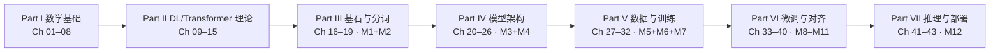
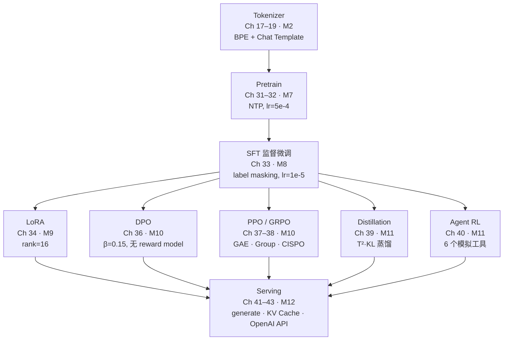

# 第 0 章 关于本书

欢迎你打开《从零训练大语言模型》。

这是一本写给「会写 Python、却被论文里的公式劝退过」的开发者的书。它的目标只有一个：带你亲手训练、微调并部署一个大语言模型——并且让你读懂实现里的每一行代码、跑通从 Tokenizer 到 Agent RL 的完整流程。

在正式进入正文之前，请允许我用一章的篇幅说明四件事：这本书为什么存在、它是为谁写的、你应该怎么读它，以及它最终会带你走到哪里。

## 0.1 为什么写这本书

近两年，大语言模型（Large Language Model, LLM）从研究实验室走进了每一个开发者的工具箱。市面上不缺关于 GPT、Claude、Qwen 的科普读物，也不缺满是公式推导的学术论文，更不缺「调一下 transformers 的 API 就能跑起来」的速成教程。

但中间地带长期是空白的：

- 想从「会用 API」走到「能讲清楚 Attention 到底算了什么」的人，没有清晰的阶梯；
- 读得懂 PyTorch 官方教程，却看不懂一个真实 LLM 训练仓库（repo）全貌的人，缺一张地图；
- 想自己跑一次预训练（pretrain）、亲手做一次 RLHF 对齐，却不知道从哪里下手的人，找不到一个能跑通的最小例子。

本书就是为填上这块空白而写的。它的写作起点不是某篇论文或某本书，而是一个真实存在、可运行、可复现的开源教学项目——[**zllm**](../../README.md)。

zllm 是一个 **step-by-step 测试驱动开发（TDD, Test-Driven Development）** 的教学项目，同时具备完整的真实训练能力。它没有用「黑盒」的方式调用高层框架，而是把一个对齐 Qwen3 / minimind-3 架构（GQA 分组注意力、RoPE 旋转位置编码、SwiGLU 前馈网络、MoE 混合专家、Weight Tying 权重共享）的 ~64M 参数迷你模型，拆成了 **12 个里程碑、300 个开发步骤、428 个测试**，代码总量约 3142 行。

这本书是 zllm 的**教学叙事版**。代码仓库负责「能跑、能测、能复现」，而本书负责「讲清楚为什么这么写、背后的数学和工程直觉是什么、它和真实工业级 LLM 的差距在哪里」。两者配合，你既能看到一个生产级 LLM 训练管线长什么样，也能听懂每一步背后的来龙去脉。

换句话说，zllm 是骨架，本书是血肉。

## 0.2 这本书给谁看

本书的目标读者画像很具体：

- **Python 开发者**。你写过脚本、调过库、读过一些源码，至少对面向对象和基本的类型注解不陌生。本书不解释 `for` 循环和 `class`，但会耐心解释 PyTorch 张量（tensor）的形状变化。
- **机器学习（ML）基础薄弱**。你大概知道「梯度下降」「损失函数」这些词，但没法独立推导反向传播（backpropagation）。本书会用三章数学基础加两章深度学习理论帮你把地基重新打好。
- **想亲手炼一个 LLM 的人**。你不满足于「我用过 GPT 的 API」，而是想知道：Tokenizer 是怎么把中文切成 token 的？预训练的 loss 曲线应该长什么样？LoRA 的低秩矩阵为什么能省显存？DPO 凭什么不需要 reward model？
- **研究生与算法工程师**。如果你正在做 NLP、推荐系统或相关方向，希望系统建立「数学 → 深度学习 → Transformer → 预训练 → 对齐 → 推理部署」的完整知识闭环，本书可以作为一张从零起步的全景图。

本书**不适合**这几类读者：

- 完全没写过代码的纯理论读者——本书所有概念都会落到代码，你需要能读懂 Python；
- 只想「今天就把 GPT 接进我的产品」的纯应用开发者——本书关注的是底层原理与训练流程，而非应用集成；
- 期待千亿参数训练经验的资深研究员——本书的模型只有 ~64M 参数，重点是把整个流程走通、读懂、能复现，而非追求 SOTA 指标。

如果你的坐标落在这三类读者中的某一类，请把本书当作一本「懂了之后再读一遍会更爽」的读物，而不是一本速查手册。

## 0.3 前置要求

本书的门槛是有意识的——既要保证「能跟上」，也要保证「读完后真的能上手」。下表列出你需要准备的东西。

### 软硬件环境

| 项目 | 最低要求 | 说明 |
|------|---------|------|
| Python | 3.14+ | 使用最新语言特性（PEP 695 类型参数语法等） |
| PyTorch | 2.7+ | CUDA 版本，需支持 Flash Attention |
| Transformers | 4.52+ | 复用其 `PretrainedConfig` / `PreTrainedModel` |
| tokenizers | 0.21+ | 生产级 BPE trainer 底层依赖 |
| datasets | 3.6+ | 数据加载 |
| FastAPI | 0.115+ | 部署 OpenAI 兼容 API |
| pytest | 8.4+ | 运行 zllm 的 428 个测试 |
| **GPU（CUDA）** | **必需** | zllm 默认 `device='cuda'`，纯 CPU 无法跑完训练流程 |

如果你手头没有 GPU，建议先租一台带 NVIDIA 显卡的云实例（哪怕 24GB 显存的消费级卡也足够跑本书的 ~64M 模型）。本书的「快速验证」用例能在单卡上几分钟内跑完一轮训练。

### 知识储备

- **能熟练读 Python**：理解函数、类、装饰器、类型注解、上下文管理器；
- **会一点命令行**：`pip install`、`pytest`、`python -m zllm.training.pretrain` 这类命令不会卡住你；
- **懂基本机器学习名词**：听说过梯度下降、损失函数、过拟合就足够了；
- **不怕数学**：你不需要是数学专业——本书 Part I 会从向量、矩阵开始讲——但需要愿意动笔。

### 心理准备

本书遵循 **TDD** 写法：每一步都是「先写测试、再写实现、最后重构」。读实战篇章节时，你会经常看到一段测试先于实现出现。这是有意的：测试是「规格说明（specification）」的最佳载体。如果你以前没见过这种风格，刚开始可能不适应，但三五章之后你会爱上它——因为每一行实现都有人为它写过一条断言（assertion）。

## 0.4 如何阅读（理论篇 vs 实战篇 / 快速路径）

本书共 7 个 Part + 附录，章节天然分成两类，请用不同的姿势对待它们。

### 理论篇（Part I–II）—— 可以跳读、可以反复回读

Part I（数学基础，Ch 01–08）和 Part II（深度学习与 Transformer 理论，Ch 09–15）是「打地基」的章节。它们**不直接对应任何代码里程碑**，目的是让你在进入 zllm 源码之前，对背后的数学和理论有一个自洽的认知。

阅读建议：

- 如果你数学功底不错，可以快速浏览、跳过已经熟悉的章节，遇到正文里的代码引用再回查；
- 如果你是边学边补，建议拿一支笔，把每章末尾的「关键公式」抄一遍；
- 这两 Part 的内容是「回查型」的——你会在读后续实战章节时反复回到这里，例如读到 RoPE 时回查 Ch 07 的复数与链式法则、读到 GQA 时回查 Ch 13 的多头注意力。

### 实战篇（Part III–VII）—— 必须动手

Part III（分词）到 Part VII（部署）的每一章都对应 zllm 的一个具体里程碑（M1–M12）。这些章节的真正价值在「动手」：

- 把 zllm 仓库 clone 下来，跟着章节顺序读源码；
- 跑通每章引用的测试命令（如 `pytest tests/m03_model_components/ -v`）；
- 试着改一两个参数（比如把 `hidden_size` 从 768 改成 384），观察测试是否还能通过、loss 曲线有什么变化。

**不要只读不练。** 这本书的核心承诺是「读懂每一行实现代码，跑通全流程」，而后者只有你自己动手才能兑现。

### 全书阅读路径图

不同背景的读者可以走不同的最短路径。下面的图把全书的知识依赖关系画出来，你可以根据自己的情况剪裁。

三条推荐路径：

- **完整路径（推荐）**：从 Ch 01 一路读到 Ch 43，配合 zllm 仓库跑完全部 12 个里程碑。预计需要 2–3 个月，每周约 8–10 小时。
- **快速入门路径**：如果你已有数学和深度学习基础，跳过 Part I–II，直接从 Part III 开始。先读 Ch 16–19（分词）和 Ch 20–26（模型架构），跑通 M1–M4；然后跳到 Part VII（Ch 41–43）让模型推理起来，建立「能跑」的成就感；最后回头补 Part V–VI（训练与对齐）。
- **主题速查路径**：只关心某一阶段的读者，可以直接定位到对应章节。例如想做 LoRA 微调，直接翻 Ch 34，按需回查 Ch 09（神经网络基础）和 Ch 33（SFT）。

无论走哪条路径，都建议**先读 Ch 00（本章）和 Ch 16（项目初始化）**——前者帮你建立全局观，后者帮你把 zllm 仓库跑起来。

## 0.5 全书路线图

本书的内容组织完全对应 zllm 的 12 个里程碑（M1–M12），形成一条从分词到部署的完整训练管线。下图是这条管线的全景：

这条管线对应着真实工业级 LLM 训练的标准流程，只是规模缩小到了能在单卡上跑完的程度。下表把本书 7 个 Part 与 zllm 的里程碑一一对应：

| Part | 主题 | 章节 | 里程碑 | 你会学到 |
|------|------|------|--------|---------|
| 0 | 序言 | Ch 00 | — | 本书定位与阅读方法 |
| I | 数学基础 | Ch 01–08 | — | 线性代数、概率统计、信息论、优化、自动微分 |
| II | 深度学习与 Transformer 理论 | Ch 09–15 | — | 神经网络、反向传播、注意力、Transformer 全景 |
| III | 基石与分词 | Ch 16–19 | M1 + M2 | 项目骨架、ZLLMConfig、BPE 算法、Chat Template |
| IV | 模型架构 | Ch 20–26 | M3 + M4 | RMSNorm、RoPE、GQA、SwiGLU、MoE、Backbone、CausalLM |
| V | 数据与训练 | Ch 27–32 | M5 + M6 + M7 | Dataset、collate、AMP、梯度累积、预训练 NTP |
| VI | 微调与对齐 | Ch 33–40 | M8–M11 | SFT、LoRA、DPO、PPO、GRPO、蒸馏、Agent RL |
| VII | 推理与部署 | Ch 41–43 | M12 | 解码算法、KV Cache、OpenAI 兼容 API |

几个贯穿全书的关键设计决策，提前剧透给你：

- **架构对齐 Qwen3 / minimind-3**：GQA（4 KV 头 / 8 Query 头）、RoPE（基频 1,000,000）、SwiGLU（π 缩放中间层）、MoE（Top-1 路由）、Weight Tying。读完 Part IV，你将拥有一个与真实工业模型「同构」的迷你版本。
- **默认 ~64M 参数**：`hidden_size=768`、`num_hidden_layers=8`、`vocab_size=6400`。这个尺寸足够展示所有 LLM 训练现象（loss 下降、过拟合、对齐效果），又能在单卡上几分钟跑完一轮。
- **TDD 全程贯穿**：每个里程碑都以测试开始、以测试结束。你会看到 428 条测试如何把一个 LLM 训练系统「钉」在正确的位置上。

读完全书，你应该能够：独立读懂任意一个主流 LLM 训练仓库的核心代码、自己设计一次预训练或微调实验、并知道每一行代码背后的数学和工程权衡。

## 0.6 勘误与配套资源

### 配套资源

本书的所有内容都建立在三个公开资源之上，请把它们当作「附录的延伸」随时查阅：

- **项目主仓库 README**：[`README.md`](../../README.md)（仓库根目录）。它包含 zllm 的全部 API 用法、5 行推理示例、12 里程碑导航表、关键设计决策表、依赖环境表。读实战篇时遇到「这个函数到底怎么用」的问题，第一站就是这里。
- **里程碑教学文档**：[`docs/steps/`](../../docs/steps/)。每个里程碑对应一份开发过程中的教学笔记，例如 [`docs/steps/026-tokenizer-overview.md`](../../docs/steps/026-tokenizer-overview.md)（M2 Tokenizer）、[`docs/steps/051-model-components-1.md`](../../docs/steps/051-model-components-1.md)（M3 模型组件 I）、[`docs/steps/236-alignment.md`](../../docs/steps/236-alignment.md)（M10 对齐训练）。这些笔记是「原始素材」，本书是把它们重写、补全、串成叙事后的版本。
- **测试套件**：[`tests/`](../../tests/)。本书的每一个代码断言都能在测试里找到对应。遇到「这个行为真的成立吗」的疑问时，`pytest tests/mXX_yyy/ -v` 是最权威的回答。`tests/conftest.py` 提供了 `small_config`（dim=64，用于快速测试）和 `default_config`（dim=768）两个 fixture，本书示例大多基于后者。

此外还有两份内部文档供深度读者参考：

- [`docs/plan.md`](../../docs/plan.md) — zllm 的 300 步实施计划，可以看到每个里程碑是怎么被拆解成 TDD 步骤的；
- [`docs/design.md`](../../docs/design.md) — 设计文档，记录关键架构选型的理由。

### 进度跟踪

本书的写作进度在两个地方同步：

- [`docs/book/README.md`](../README.md) — 43 章 + 4 个附录的进度看板（☐ 未写 / ✅ 已完成）；
- [`docs/book/SUMMARY.md`](../SUMMARY.md) — 全书章节导航索引，每章完成后补上文件链接。

### 勘误与反馈

作者水平有限，书中难免有错——公式笔误、代码与最新 zllm 实现脱节、概念表述不准确，都有可能出现。如果你发现任何问题：

1. 优先对照对应的 zllm 源码与测试，那是最权威的「事实来源（source of truth）」；
2. 欢迎在仓库的 issue 区提报勘误，建议附上「章节号 + 原文 + 修正建议 + 出处依据」；
3. 高质量的 PR（Pull Request）会被合并并署名致谢。

本书采用「滚动更新」的写作方式：随着 zllm 仓库的迭代（例如 PyTorch 升级、新对齐算法加入），章节内容会同步修订。每章的 front-matter 中标注了 `status: draft`，意味着当前为初稿；当某章经过完整校对后会升级为 `reviewed`，最终定为 `stable`。

---

读完这一章，你已经知道这本书要带你去哪、需要带什么装备、以及该走哪条路。下一章（Ch 01《线性代数：向量与矩阵》）我们就从最基础的向量开始，一步步把地基打好。

或者，如果你已经等不及想看代码——直接翻到 Ch 16《项目初始化与开发环境》，把 zllm 跑起来，再回头补理论也完全来得及。

无论如何，**祝你训练愉快。**
