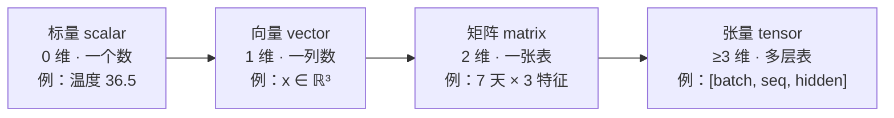

# 第 1 章 线性代数：向量与矩阵

如果你只能从整本数学书里带走一件武器去打深度学习的怪，那一定是**线性代数（linear algebra）**。

这并不是夸张。打开任何一个 LLM 训练仓库，你看到的第一行张量运算 $x @ W$ 就是矩阵乘法；你读到的第一个注意力公式 $QK^T$ 本质是一连串点积；你调的每一个超参数， 例如： `hidden_size=768` 都在说「每个 token 是一个 768 维向量」。线性代数是 LLM 的母语。

本章是 Part I 数学基础的第一章，目标是用最少的篇幅、最直观的方式，把后面所有章节都会反复用到的几个概念彻底讲透：**向量、矩阵、张量、点积、矩阵乘法、范数、夹角与余弦相似度**。我们不追求严谨完备（那是教材的工作），只追求「读完之后，你在脑子里能画出每个运算的几何图像」。

## 1.1 学习目标

读完本章，你应该能够：

- 用一句话说清楚**标量、向量、矩阵、张量**的区别，并能用维度递增的图把它们串起来；
- 默写出**点积**和**矩阵乘法**的求和公式，并理解它们的几何含义（投影 / 线性变换）；
- 说出 $\mathbf{x}\cdot\mathbf{y}=0$ 在几何上意味着什么，并能用余弦相似度判断两个向量的「方向接近程度」；
- 写出 $L_1$、$L_2$、$L_\infty$ 三种范数的定义，并知道它们各自适合衡量什么；
- 把这些概念和本书的实战内容挂钩：明白为什么「注意力 = 一堆点积」「嵌入 = 一个高维向量」「归一化 = 除以范数」。

本章**不**涉及特征值分解、奇异值分解（SVD）等进阶内容——它们留到 Ch 02《线性代数：分解与几何》。本章只搭好「运算」这层地基。

## 1.2 直觉与动机

### 一个朴素的起点：数据到底长什么样

假设你要描述今天的天气，你会列出几个数字：气温 $36.5$、湿度 $120$、风力 $8$（这里数字只为示意，不必较真单位）。这三个数字按顺序排在一起，就构成了一个**向量（vector）**：

$$
\mathbf{x} = \begin{pmatrix} 36.5 \\ 120 \\ 8 \end{pmatrix}, \qquad \mathbf{x} \in \mathbb{R}^3
$$

向量最自然的几何解释是一支**箭头**：它有**长度**（这组数字整体有多「大」）和**方向**（这组数字之间的比例关系）。一句话概括——

> **向量 = 有方向、有长度的箭头。**

为什么要强调「方向」？因为在 LLM 里，决定两个词「像不像」的，往往不是向量的绝对大小，而是它们的方向。后面我们会看到，余弦相似度（cosine similarity）就是专门用来度量方向的工具。

### 从单个向量到一摞向量：矩阵与张量

如果你不只记录今天，而是记录一周 7 天的天气，就有 7 个 3 维向量。把它们横向排好、摞成一张表，就得到一个**矩阵（matrix）**：3 列（3 个特征）× 7 行（7 天）。

再把「每周」扩展成「每年 52 周」，你就得到了一个三维的**张量（tensor）**：形状（shape）是 `[52, 7, 3]`。张量其实就是「向量/矩阵概念往更高维度的自然推广」——在 PyTorch 里，所有的数据、权重都以张量的形式存在。

下面这张概念图把「维度递增」的过程画了出来，请把它记在脑子里，它会贯穿全书：



这张图背后藏着一句 PyTorch 黑话，值得现在就记住：**标量是 0 维张量，向量是 1 维张量，矩阵是 2 维张量**。所谓「张量」不过是统一的容器，它的「维数（ndim）」就是轴（axis）的个数。

### 为什么 LLM 离不开这些

在进入严格定义之前，先用一张表剧透一下这些概念在本书后面会出现在哪里，让你知道「现在学的东西到底有什么用」：

| 概念 | 在 LLM 中的角色 | 本书首次出现 |
|------|----------------|-------------|
| 向量 $\mathbb{R}^d$ | 每个 token 的嵌入表示 | Ch 16 |
| 矩阵乘法 | 线性投影、`x @ W`、`QK^T` | Ch 12、Ch 20 |
| 点积 | 注意力分数、相似度 | Ch 12 |
| 范数 | RMSNorm、归一化、梯度裁剪 | Ch 20、Ch 06 |
| 余弦相似度 | 语义检索、词向量类比 | Ch 16 |

带着这张表，我们正式开始。

## 1.3 数学定义

### 向量

**向量**是排成一列的 $n$ 个实数。记作

$$
\mathbf{x} = \begin{pmatrix} x_1 \\ x_2 \\ \vdots \\ x_n \end{pmatrix} \in \mathbb{R}^n
$$

其中 $n$ 叫向量的**维数（dimension）**。本书默认向量为**列向量（column vector）**；行向量记作 $\mathbf{x}^\top = (x_1, x_2, \ldots, x_n)$。

向量的两种基本运算：

- **加法**（逐元素）：$(\mathbf{x}+\mathbf{y})_i = x_i + y_i$；
- **标量乘法**：$(c\,\mathbf{x})_i = c \cdot x_i$。

这两种运算共同满足「线性」性质，这正是「线性代数」名字的由来。

### 点积（dot product）

两个**同维**向量 $\mathbf{x}, \mathbf{y} \in \mathbb{R}^n$ 的**点积**（也叫内积，inner product）定义为逐元素相乘再求和：

$$
\mathbf{x} \cdot \mathbf{y} \;=\; \mathbf{x}^\top \mathbf{y} \;=\; \sum_{i=1}^{n} x_i\, y_i
$$

结果是一个**标量**（单个数）。注意 $\mathbf{x}^\top \mathbf{y}$ 这个写法——把 $\mathbf{x}$ 转置成行向量、再与列向量 $\mathbf{y}$ 做矩阵乘法，得到的恰好就是点积。这一点至关重要：**点积是矩阵乘法的一个特例**，后面 Ch 12 的 $QK^T$ 本质上就是「批量点积」。

### 矩阵与矩阵乘法

**矩阵**是排成 $m$ 行 $n$ 列的数表，记作 $A \in \mathbb{R}^{m \times n}$，第 $i$ 行第 $j$ 列的元素写作 $A_{ij}$ 或 $a_{ij}$。

设 $A \in \mathbb{R}^{m \times p}$、$B \in \mathbb{R}^{p \times n}$（注意：$A$ 的列数必须等于 $B$ 的行数），它们的乘积 $C = AB \in \mathbb{R}^{m \times n}$ 定义为：

$$
(AB)_{ij} \;=\; \sum_{k=1}^{p} A_{ik}\, B_{kj}
$$

请仔细看这个公式的下标：**$A$ 的行 $\times$ $B$ 的列**，逐位相乘再相加。一句话口诀——

> **矩阵乘法 = 「取 $A$ 的一行、取 $B$ 的一列、做点积」填进结果矩阵的对应位置。**

这也解释了为什么内层维度 $p$ 必须匹配：因为那正是做点积时求和的下标范围。

### 范数（norm）

向量的**范数**度量它的「长度」或「大小」。最常用的是 $L_p$ 范数族：

$$
\|\mathbf{x}\|_p \;=\; \left( \sum_{i=1}^{n} |x_i|^p \right)^{1/p}, \qquad p \geq 1
$$

三个特例在 LLM 里反复出现：

$$
\|\mathbf{x}\|_1 = \sum_{i=1}^{n} |x_i|, \qquad
\|\mathbf{x}\|_2 = \sqrt{\sum_{i=1}^{n} x_i^2}, \qquad
\|\mathbf{x}\|_\infty = \max_{i} |x_i|
$$

- $L_2$ 范数是「日常意义的长度」——欧氏距离；
- $L_1$ 范数是「曼哈顿距离」，对离群值不敏感、常诱导稀疏；
- $L_\infty$ 范数只看绝对值最大的那个分量。

PyTorch 里 `x.norm(p)` 直接给出 $L_p$ 范数；RMSNorm（Ch 20）用到的「均方根」其实就和 $L_2$ 范数只差一个常数因子。

### 向量夹角与余弦相似度

有了点积和 $L_2$ 范数，就能定义两个非零向量之间的夹角 $\theta \in [0, \pi]$：

$$
\cos\theta \;=\; \frac{\mathbf{x} \cdot \mathbf{y}}{\|\mathbf{x}\|_2\, \|\mathbf{y}\|_2}
$$

把 $\cos\theta$ 本身当作相似度指标，就是**余弦相似度（cosine similarity）**：它落在 $[-1, 1]$ 区间，越接近 $1$ 表示两向量方向越一致、越接近 $-1$ 表示方向越相反、为 $0$ 表示正交（毫不相关）。它只看方向、不看长度，因此在比较词义时比直接用点积更稳健——这也是语义检索和「词向量类比」（如「国王 − 男人 + 女人 ≈ 女王」）的理论基础。

## 1.4 推导与几何

光有定义还不够，我们必须把它们和几何图像挂钩。这一节是全章最关键的部分：**能在脑子里画图，才算真懂了线性代数。**

### 点积 = 投影长度

先回顾余弦定理。对两个向量 $\mathbf{x}, \mathbf{y}$，它们差向量的长度满足：

$$
\|\mathbf{x} - \mathbf{y}\|^2 = \|\mathbf{x}\|^2 + \|\mathbf{y}\|^2 - 2\,\|\mathbf{x}\|\,\|\mathbf{y}\|\cos\theta
$$

另一方面，直接展开左边（逐元素）：

$$
\|\mathbf{x} - \mathbf{y}\|^2 = \sum_i (x_i - y_i)^2 = \|\mathbf{x}\|^2 + \|\mathbf{y}\|^2 - 2 \sum_i x_i y_i
$$

比较两式，立刻得到点积的几何形式：

$$
\boxed{\;\mathbf{x} \cdot \mathbf{y} \;=\; \|\mathbf{x}\|\,\|\mathbf{y}\|\cos\theta\;}
$$

这个等式有三层含义，请逐条品味：

1. **点积 = 一个向量的长度 × 另一个向量在它方向上的投影长度**。把 $\|\mathbf{y}\|\cos\theta$ 看作 $\mathbf{y}$ 在 $\mathbf{x}$ 上的投影，点积就成了「$\mathbf{x}$ 的长度 × $\mathbf{y}$ 的投影」。
2. **正交 ⟺ 点积为零**。当 $\theta = 90°$ 时 $\cos\theta = 0$，于是 $\mathbf{x}\cdot\mathbf{y}=0$。几何上「垂直」，代数上「点积为零」，两者是同一件事——这是后面理解「无关」「解耦」的根基。
3. **柯西–施瓦茨不等式**。因为 $|\cos\theta| \leq 1$，所以

$$
|\mathbf{x}\cdot\mathbf{y}| \;\leq\; \|\mathbf{x}\|\,\|\mathbf{y}\|
$$

等号当且仅当两向量共线（同向或反向）时成立。由此立刻得到：**两个单位向量（长度为 1）的点积取值范围是 $[-1, 1]$**——这正是余弦相似度的值域。

下面这张示意图把「投影」和「夹角」的关系画出来（为清晰起见画在 2 维平面）：

```
                    y  (终点)
                   /|
                  / |
               ↗ /  ) θ
              /  /  |
            ↗  /    |
          /    |  proj = ‖y‖·cosθ
   ──────┐ /   |     ← y 在 x 方向上的投影
       x ├─────┘
          ←────  x 方向 ────→

   关系：x · y = ‖x‖·(‖y‖·cosθ) = ‖x‖·(投影长度)
```

一个直观的推论：当 $\mathbf{y}$ 与 $\mathbf{x}$ 同向（$\theta=0$）时点积最大、为 $\|\mathbf{x}\|\|\mathbf{y}\|$；反向（$\theta=\pi$）时最小、为 $-\|\mathbf{x}\|\|\mathbf{y}\|$。**点积天然就是「方向一致性」的度量**——这正是注意力机制用它来衡量「词与词有多相关」的原因（Ch 12）。

### 矩阵乘法 = 线性变换

把 $\mathbf{x} \in \mathbb{R}^n$ 乘上一个矩阵 $A \in \mathbb{R}^{m \times n}$，得到 $A\mathbf{x} \in \mathbb{R}^m$。这个过程可以理解成：**矩阵 $A$ 把向量 $\mathbf{x}$ 从 $\mathbb{R}^n$ 「搬运并变形」到 $\mathbb{R}^m$**。这种「搬运并变形」就叫**线性变换（linear transformation）**。

为什么叫「线性」？因为矩阵乘法同时满足

$$
A(\mathbf{x} + \mathbf{y}) = A\mathbf{x} + A\mathbf{y}, \qquad A(c\,\mathbf{x}) = c\,A\mathbf{x}
$$

——加法和标量乘法在变换前后都保持。这意味着：**只要弄清楚矩阵把「基向量」变到了哪里，就能推出它把任何向量变到哪里。**

最直观的两个例子是**旋转**和**缩放**。在 2 维平面上，逆时针旋转角 $\alpha$ 的矩阵是

$$
R(\alpha) = \begin{pmatrix} \cos\alpha & -\sin\alpha \\ \sin\alpha & \cos\alpha \end{pmatrix}
$$

它把任何向量原地旋转 $\alpha$、长度不变（正交矩阵的标志）；而 $\begin{pmatrix} 2 & 0 \\ 0 & 2 \end{pmatrix}$ 则把整个平面均匀放大 2 倍。LLM 里每一层做的 `x @ W`，本质上就是「把语义向量旋转、拉伸到另一组坐标轴上」，**权重矩阵 $W$ 编码的就是这次变换的几何规则**。

```
   变换前                          变换后 (旋转 + 缩放)
      y                              y
      ↑      ●  x                    ↑            ●  A·x
      |     /                        |          ↗
      |   /                          |       ↗
      | /                            │    ↗
      ○──────────→ x 方向            ○──────────→
     原点                            原点

   矩阵 A 同时改变了向量的方向（旋转）和长度（缩放）。
```

### 逐步演算：手算一次矩阵乘法

理解了几何，我们再回到代数，亲手算一个 $2\times2$ 的例子，把求和公式 $(AB)_{ij}=\sum_k A_{ik}B_{kj}$ 落实到每一格。设

$$
A = \begin{pmatrix} 1 & 2 \\ 3 & 4 \end{pmatrix}, \qquad B = \begin{pmatrix} 5 & 6 \\ 7 & 8 \end{pmatrix}
$$

逐格计算 $C = AB$（每一格都是「$A$ 的某行点乘 $B$ 的某列」）：

$$
\begin{aligned}
C_{11} &= 1\cdot 5 + 2\cdot 7 = 19 \\
C_{12} &= 1\cdot 6 + 2\cdot 8 = 22 \\
C_{21} &= 3\cdot 5 + 4\cdot 7 = 43 \\
C_{22} &= 3\cdot 6 + 4\cdot 8 = 50
\end{aligned}
\qquad\Longrightarrow\qquad
AB = \begin{pmatrix} 19 & 22 \\ 43 & 50 \end{pmatrix}
$$

把这个过程对照成代码，就是 `A @ B` 或 `torch.matmul(A, B)`。**一次 `@` 调用，背后是上百万次「行点乘列」**——这正是 GPU 擅长并行的地方，也是 Ch 08（张量计算与 PyTorch 自动微分）会展开讲的内容。

> **小心陷阱：矩阵乘法一般不满足交换律。** 上例中 $BA \neq AB$（你可以自己验算）。在 LLM 里这意味着 $W_2(W_1 \mathbf{x})$ 和 $W_1(W_2 \mathbf{x})$ 是两回事——层的顺序不能乱写。

## 1.5 与本项目联系

理论讲完了，现在把它和 zllm 钉死。本节是「前方路口预告牌」——你不必现在就懂所有细节，但请记住下面这些钩子，等读到对应章节时会恍然大悟。

### 钩子一：注意力 = 批量点积（Ch 12）

Transformer 的核心是**注意力机制（attention）**。它的关键一步是计算查询矩阵 $Q$ 和键矩阵 $K$ 的相关度：

$$
\text{分数} \;=\; Q K^{\top}
$$

看明白了吗？$QK^T$ 就是矩阵乘法，而它的每一格 $(QK^T)_{ij}$ 是「第 $i$ 个词的查询向量」与「第 $j$ 个词的键向量」的**点积**。换句话说，**整章铺垫的点积，就是注意力的引擎**：它逐对衡量「句子中任意两个词有多相关」。本章学透了点积，Ch 12 就只剩「点积 → 缩放 → softmax → 加权求和」这条流水线要学。

### 钩子二：嵌入向量 = $\mathbb{R}^d$ 中的一个点（Ch 16）

分词器把一段文本切成一串 token（Ch 17–19）之后，每个 token 都要被映射成一个向量，叫**嵌入（embedding）**。在 zllm 里，默认配置 `hidden_size = 768`，意味着

> **每一个 token 都被表示成 $\mathbb{R}^{768}$ 中的一个向量。**

768 维我们画不出来，但本章的几何直觉照样适用：意义相近的词，嵌入向量**方向接近**（余弦相似度高）；意义无关的词，方向接近正交（点积接近 0）。**整个语义空间，就是 $\mathbb{R}^{768}$ 里的几何。** 余弦相似度既是语义检索的基础，也是「国王 − 男人 + 女人 ≈ 女王」这类词向量类比的算子——它们都活在同一个高维向量空间里。

### 钩子三：每一层都是矩阵乘法（Ch 20、Ch 23）

LLM 里的几乎每一个可学习参数，都以矩阵（或张量）的形式存在：

- 注意力里的 $W_Q, W_K, W_V$ 把嵌入投影成查询/键/值（矩阵乘法 = 线性变换）；
- 前馈网络 SwiGLU 里两个权重矩阵做升维与降维（Ch 23）；
- 最后一层把隐藏向量投影回词表大小（Ch 26）。

本书默认模型有约 64M 参数——它们绝大多数就是这些矩阵里的元素。**训练一个 LLM，本质上就是在用梯度调整成百上千个矩阵，让它们代表的线性变换越来越「合用」。** 而调整的依据（梯度、链式法则），就要用到 Ch 06（最优化）和 Ch 07（微积分与链式法则）。

### 钩子四：范数无处不在（Ch 20、Ch 06）

- **RMSNorm（Ch 20）**：用 $L_2$ 范数把隐藏向量「归一」到单位尺度附近，稳定训练；
- **梯度裁剪（Ch 06、Ch 30）**：用 $L_2$ 范数限制梯度的长度，防止梯度爆炸；
- **正则化**：$L_1$ 范数诱导稀疏、$L_2$ 范数防止权重过大。

一句话总结这四个钩子：**向量是 LLM 的数据形态，矩阵乘法是 LLM 的计算骨架，点积与范数是 LLM 的度量工具。** 把这三者握在手里，你就握住了进入后续所有章节的钥匙。

## 1.6 本章小结

让我们把这一章浓缩成几条可以随身携带的结论：

1. **维度阶梯**：标量（0 维）→ 向量（1 维）→ 矩阵（2 维）→ 张量（≥3 维）。PyTorch 里它们统一叫张量，区别只在 `ndim`。
2. **点积**：$\mathbf{x}\cdot\mathbf{y} = \sum_i x_i y_i = \|\mathbf{x}\|\|\mathbf{y}\|\cos\theta$。它既是「逐位相乘求和」的代数运算，也是「长度 × 投影」的几何度量；**正交 ⟺ 点积为零**。
3. **矩阵乘法**：$(AB)_{ij} = \sum_k A_{ik}B_{kj}$，口诀「行 × 列 做点积」。它同时是「批量点积」和「线性变换」，**一般不可交换**。
4. **范数**：$L_1$（稀疏）、$L_2$（长度）、$L_\infty$（最大分量）；归一化、梯度裁剪都靠它。
5. **余弦相似度**：$\cos\theta = \dfrac{\mathbf{x}\cdot\mathbf{y}}{\|\mathbf{x}\|\|\mathbf{y}\|} \in [-1,1]$，只比方向不比长度，是语义检索与词向量类比的基础。

> **前方预告。** 本章只讲了「怎么算」，没讲「怎么拆」。Ch 02《线性代数：分解与几何》会接着把矩阵拆开看——特征值分解、奇异值分解（SVD）——它们能告诉我们一个变换「沿哪些方向缩放、缩放多少」，是理解主成分、低秩近似（LoRA，Ch 34）的钥匙。

### 思考题

> 写出答案前，建议先在脑子里画图，再用公式验证。

1. **范围题**：两个**单位向量**（$\|\mathbf{x}\|=\|\mathbf{y}\|=1$）的点积 $\mathbf{x}\cdot\mathbf{y}$ 取值范围是多少？在什么情况下取到上界、什么情况下取到下界？
2. **几何题**：设 $\mathbf{x}=(1,2)^\top$、$\mathbf{y}=(-2,1)^\top$。计算 $\mathbf{x}\cdot\mathbf{y}$，并据此说明这两个向量在几何上是什么关系。如果把它们看成两个 token 的嵌入，余弦相似度告诉你什么？
3. **代码题**：在 PyTorch 里取两个形状均为 `[4, 768]` 的张量 `A` 和 `B`，分别计算 `A @ B.T` 和 `A * B`，说出两者形状、含义的区别。哪一种对应注意力的 $QK^T$？哪一种是逐元素乘法？

---

读完本章，你已经能用「向量 + 矩阵 + 点积 + 范数」这套语言描述 LLM 里的大部分运算了。下一章（Ch 02《线性代数：分解与几何》）我们会更进一步，把矩阵拆开，看清一次线性变换的「内部结构」。
