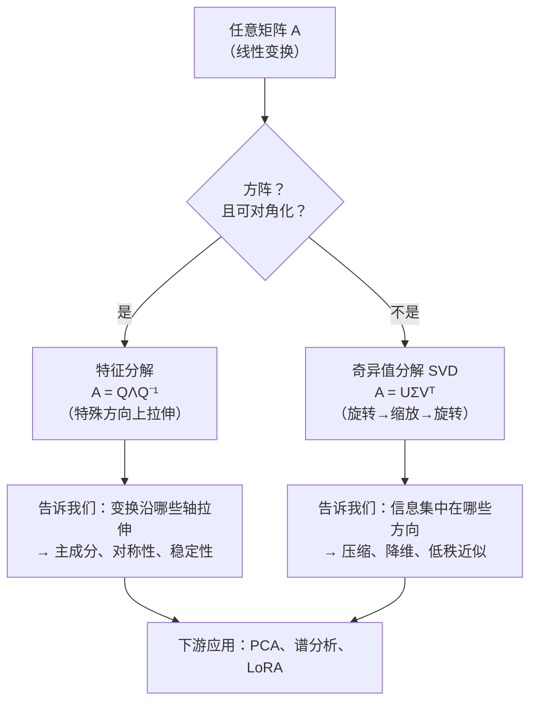
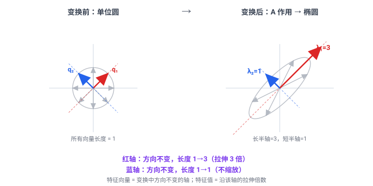
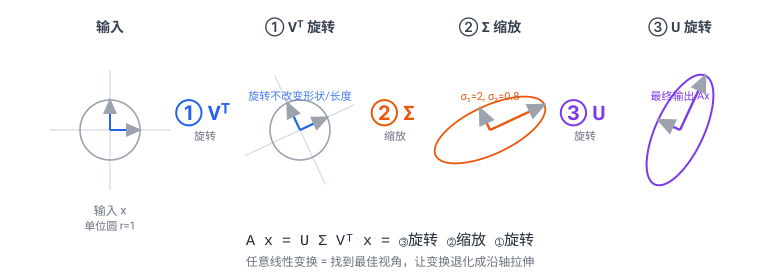
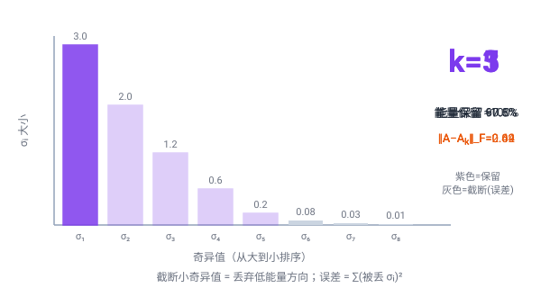

# 第 2 章 线性代数：分解与几何

上一章我们学会了「怎么算」向量与矩阵：点积、矩阵乘法、范数、余弦相似度。但有一个问题被我们刻意搁置了——

> **一个矩阵到底在「做」什么？它把空间揉成了什么形状？**

`x @ W` 这一行代码，我们在 Ch 01 里只笼统地说「它是一个线性变换」。可是同样叫线性变换，有的矩阵只是把坐标轴旋转了一下，有的把整个平面拉伸成一条线，有的把高维信息压缩到少数几个方向上。**要想看清这些，必须学会把矩阵「拆开」**——这就是本章的主题：**特征分解（eigendecomposition）**与**奇异值分解（Singular Value Decomposition, SVD）**。

这两个工具是后面好几章的钥匙：理解注意力里「信息往哪些子空间投影」（Ch 12、Ch 22）、理解为什么模型权重能被压缩（Ch 34 LoRA）、理解为什么降维和主成分分析有效——全都建立在「把矩阵拆成方向 + 缩放」这件事上。

## 2.1 学习目标

读完本章，你应该能够：

- 用一句话说清楚**特征向量、特征值**的含义，写出特征方程 $\det(A-\lambda I)=0$ ；
- 默写出对称矩阵的对角化 $A=Q\Lambda Q^\top$ ，并解释为什么 $Q$ 是正交矩阵；
- 默写出 SVD 的形式 $A=U\Sigma V^\top$ ，并能在 2 维平面里画出「旋转→缩放→旋转」的三步几何分解；
- 说出**矩阵秩**的定义，并解释「低秩 ≈ 可压缩 ≈ 信息有冗余」这层等价关系；
- 写出**投影矩阵** $P=A(A^\top A)^{-1}A^\top$ ，并知道它把任何向量投影到 $A$ 的列空间；
- 写出**伪逆** $A^+=V\Sigma^+U^\top$ ，并解释它为何给出最小二乘解、与投影矩阵如何闭环；
- 说出 **SVD 与 PCA 的关系**：主成分 = 右奇异向量，各方向方差 = $\sigma_i^2/n$ ；
- 把这些概念和本书的实战内容挂钩：明白 LoRA（Ch 34）为什么用两个小矩阵代替一个大矩阵，背后正是 SVD 低秩近似 + Eckart-Young 定理。

本章承接 Ch 01「运算」的地基，向上盖一层「结构」。

## 2.2 直觉与动机

### 类比一：橡皮膜上的「自然振动方向」

想象你把一张方形橡皮膜四个角钉在木框上，然后用手指从下方顶起一个点。膜会被你顶得鼓起来，但仔细看：膜上有一些特定的方向，它们只是被**单纯拉伸**，没有被「拧转」。

这是一个很深刻的几何事实：**对很多变换来说，存在某些特殊方向，这些方向上的向量在变换后只是被缩放、方向不变。** 这些「方向不变的轴」就是**特征向量（eigenvector）**，对应的缩放倍数就是**特征值（eigenvalue）**。

更技术化地说，对方阵 $A$ ，如果存在非零向量 $\mathbf{v}$ 和标量 $\lambda$ 使得

$$
A\mathbf{v} = \lambda \mathbf{v}
$$

那么 $\mathbf{v}$ 是 $A$ 的特征向量， $\lambda$ 是对应的特征值。一句话概括——

> **特征向量 = 变换中「方向不变」的轴；特征值 = 沿这个轴的拉伸倍数。**

### 类比二：会旋转的复印机——「旋转-缩放-旋转」

但并不是每个矩阵都有「方向不变的轴」——比如一个纯旋转矩阵，它把每个方向都拧转了，没有哪个向量变换后还和原来共线。怎么办？

数学家找到了一个更通用、对**任意**矩阵都成立的拆解方式：**奇异值分解（SVD）**。它的核心思想是——

> **任何线性变换，都可以拆成三步：① 旋转一下坐标系；② 沿新坐标轴拉伸/压缩；③ 再旋转一下。**

这个三步走的直觉极其有用。生活化的类比是一台「会旋转的复印机」：你递进去一张纸，机器先转一下、再放大、最后又转一下，吐出来的就是变形后的复印件。**无论原变换多么复杂，它都能被分解为「旋转 + 沿轴缩放 + 旋转」**。

下面这张概念图把「特征分解」和「SVD」放在同一个框架里对比：

注意 SVD 是特征分解的「推广」：当 $A$ 是对称方阵时，SVD 和特征分解会给出同一组方向（只是符号上略有差别）。**SVD 对任意形状、任意性质的矩阵都成立**——这是它成为「线性代数瑞士军刀」的根本原因。

### 为什么 LLM 离不开「拆矩阵」

先用一张表剧透，让你知道这些抽象工具在后面会出现在哪里：

| 概念 | 在 LLM 中的角色 | 本书首次出现 |
|------|----------------|-------------|
| 特征值 / 特征向量 | 注意力权重的稳态、谱分析 | Ch 12、Ch 22 |
| SVD | 模型压缩、初始化分析 | Ch 34 |
| 矩阵秩 | LoRA 的核心假设： $\Delta W$ 是低秩的 | Ch 34 |
| 低秩近似 | LoRA 的 $B_{d\times r}A_{r\times d}$ | Ch 34 |
| 投影矩阵 | 注意力的「信息投影到子空间」 | Ch 12、Ch 22 |
| 正交矩阵 | 旋转位置编码 RoPE 的核心 | Ch 21 |

带着这张表，我们正式进入数学定义。

## 2.3 数学定义

### 2.3.1 特征值与特征向量

设 $A$ 是 $n\times n$ 的方阵。如果存在非零向量 $\mathbf{v}\in\mathbb{R}^n$ 和标量 $\lambda\in\mathbb{C}$ 使得

$$
A\mathbf{v} = \lambda \mathbf{v}
$$

则称 $\mathbf{v}$ 是 $A$ 的**特征向量**， $\lambda$ 是对应的**特征值**。把等式改写成

$$
(A - \lambda I) \mathbf{v} = \mathbf{0}
$$

要使非零解 $\mathbf{v}$ 存在，矩阵 $A - \lambda I$ 必须奇异（不可逆），即

$$
\boxed{ \det(A - \lambda I) = 0 }
$$

这就是**特征方程（characteristic equation）**。它是一个关于 $\lambda$ 的 $n$ 次多项式方程，解出来就得到全部特征值。

#### 几何演示：哪些方向「方向不变」

下图把对称矩阵 $A=\begin{pmatrix}2 & 1 \cr 1 & 2\end{pmatrix}$ 作用在单位圆的 8 个向量上。绝大多数向量都被「拧转」了方向（既旋转又拉伸），唯独沿两个特殊方向的向量——特征向量——**只被缩放、方向不变**：红轴拉长 3 倍、蓝轴保持原长。

#### 手算例题：一个对称矩阵的特征分解

设 $`A = \begin{pmatrix} 2 & 1 \cr 1 & 2 \end{pmatrix}`$ 。**第一步，列特征方程求 $\lambda$**：

$$
\det(A - \lambda I) = \begin{vmatrix} 2-\lambda & 1 \cr 1 & 2-\lambda \end{vmatrix} = (2-\lambda)^2 - 1 = (\lambda-1)(\lambda-3) = 0
$$

解得 $\lambda_1 = 3,\ \lambda_2 = 1$ 。**第二步，代回 $(A-\lambda I)\mathbf{v}=\mathbf{0}$ 求特征向量**：

- $\lambda_1=3$ ： $(A-3I)\mathbf{v}=\begin{pmatrix}-1 & 1 \cr 1 & -1\end{pmatrix}\mathbf{v}=\mathbf{0}$ → $\mathbf{v}\propto(1,1)^\top$ ，单位化 $`\mathbf{q}_1=\tfrac{1}{\sqrt2}(1,1)^\top`$ ；
- $\lambda_2=1$ ： $(A-I)\mathbf{v}=\begin{pmatrix}1 & 1 \cr 1 & 1\end{pmatrix}\mathbf{v}=\mathbf{0}$ → $\mathbf{v}\propto(1,-1)^\top$ ，单位化 $`\mathbf{q}_2=\tfrac{1}{\sqrt2}(1,-1)^\top`$ 。

注意 $`\mathbf{q}_1^\top\mathbf{q}_2 = \tfrac12(1\cdot1+1\cdot(-1))=0`$ ——**对称矩阵的两个特征向量天然正交**，这不是巧合，2.4 节会给证明。**第三步，验证** $Q\Lambda Q^\top = A$ ：

$$
Q=\tfrac{1}{\sqrt2}\begin{pmatrix}1 & 1 \cr 1 & -1\end{pmatrix},\quad \Lambda=\begin{pmatrix}3 & 0 \cr 0 & 1\end{pmatrix} \;\Longrightarrow\; Q\Lambda Q^\top = \tfrac12\begin{pmatrix}1 & 1 \cr 1 & -1\end{pmatrix}\begin{pmatrix}3 & 0 \cr 0 & 1\end{pmatrix}\begin{pmatrix}1 & 1 \cr 1 & -1\end{pmatrix} = \begin{pmatrix}2 & 1 \cr 1 & 2\end{pmatrix} = A\;\checkmark
$$

把 $A$ 拆成 $Q\Lambda Q^\top$ ，几何上就是：「把坐标系转到 $\mathbf{q}_1,\mathbf{q}_2$ 这两根特征轴上 → 沿轴分别拉伸 3 倍和 1 倍 → 转回原坐标系」。**这正是特征分解的几何内核**。

### 2.3.2 对角化与特征分解

如果 $A$ 有 $n$ 个线性无关的特征向量 $`\mathbf{v}_1, \ldots, \mathbf{v}_n`$ ，把它们按列拼成矩阵 $`Q = [\mathbf{v}_1, \ldots, \mathbf{v}_n]`$ ，对应的特征值拼成对角阵 $\Lambda = \mathrm{diag}(\lambda_1, \ldots, \lambda_n)$ ，则有

$$
A Q = Q \Lambda \quad\Longrightarrow\quad \boxed{ A = Q \Lambda Q^{-1} }
$$

这就是**特征分解（eigendecomposition）**：把 $A$ 拆成「换基 → 沿轴缩放 → 换回原基」三步。

**对称矩阵的特殊地位。** 当 $A$ 是**实对称矩阵（symmetric matrix）**（ $A = A^\top$ ）时，有三条极其漂亮的好事同时发生：

1. 特征值 $\lambda_i$ 全是**实数**；
2. 不同特征值对应的特征向量**两两正交**；
3. 可以选出一组**标准正交**特征向量 $\{\mathbf{q}_i\}$ ，满足 $`\mathbf{q}_i^\top\mathbf{q}_j = \delta_{ij}`$ （ $\delta$ 为 Kronecker 记号）。

此时 $Q$ 是**正交矩阵（orthogonal matrix）**，满足 $Q^\top Q = I$ ，即 $Q^{-1} = Q^\top$ ，特征分解简化为

$$
\boxed{ A = Q \Lambda Q^\top, \qquad Q^\top Q = I }
$$

> **正交矩阵 = 旋转（或反射）。** 因为 $Q^\top Q = I$ 意味着 $Q$ 保持所有向量的长度（ $\Vert Q\mathbf{x}\Vert = \Vert\mathbf{x}\Vert$ ），它只能旋转坐标系、不能拉伸。这条性质后面会反复用到。

> **⚠️ 常见误区：正交矩阵一定 $\det Q=1$ 吗？** 不一定。由 $Q^\top Q=I$ 取行列式得 $`(\det Q)^2=1`$ ，所以 $\det Q=\pm 1$ 。 $\det Q=+1$ 是**纯旋转**（如逆时针转 $90^\circ$ 的 $\begin{pmatrix}0 & -1\cr 1 & 0\end{pmatrix}$ ）， $\det Q=-1$ 是**反射**（如 $\begin{pmatrix}1 & 0\cr 0 & -1\end{pmatrix}$ 把 $y$ 轴翻折）。RoPE（Ch 21）用的是纯旋转，故始终 $\det=+1$ 。

> **⚠️ 常见误区：方阵的特征值一定是实数吗？** 未必。例如旋转矩阵 $`\begin{pmatrix}0 & 1\cr -1 & 0\end{pmatrix}`$ 的特征方程 $\lambda^2+1=0$ 给出 $\lambda=\pm i$ （纯虚数）——这恰恰对应「它把每个方向都拧转了，没有实方向的轴」。**只有实对称矩阵（ $A=A^\top$ ）才保证特征值全实数**，这也是它地位特殊的根本原因。

**为什么对称矩阵的特征向量两两正交？（证明）** 设 $A\mathbf{q}_i=\lambda_i\mathbf{q}_i$ 、 $A\mathbf{q}_j=\lambda_j\mathbf{q}_j$ 且 $\lambda_i\ne\lambda_j$ 。在第一个等式左乘 $\mathbf{q}_j^\top$ ：

$$
\mathbf{q}_j^\top A\mathbf{q}_i = \lambda_i \mathbf{q}_j^\top\mathbf{q}_i
$$

利用对称性 $A=A^\top$ ，左边 $=(A\mathbf{q}_j)^\top\mathbf{q}_i=\lambda_j \mathbf{q}_j^\top\mathbf{q}_i$ 。两式相减：

$$
(\lambda_i-\lambda_j) \mathbf{q}_j^\top\mathbf{q}_i = 0
$$

因 $\lambda_i\ne\lambda_j$ ，只能 $\mathbf{q}_j^\top\mathbf{q}_i=0$ ，即正交。重根情形可用 Gram–Schmidt 在同一特征子空间内正交化。这就是 $Q^\top Q=I$ 得以成立的保证。

### 2.3.3 奇异值分解（SVD）

特征分解要求 $A$ 是方阵、且能对角化，条件苛刻。SVD 把这些限制全部去掉——**任何形状的矩阵都有 SVD**。

设 $A \in \mathbb{R}^{m\times n}$ ，则存在正交矩阵 $U \in \mathbb{R}^{m\times m}$ 、对角矩阵 $\Sigma \in \mathbb{R}^{m\times n}$ 、正交矩阵 $V \in \mathbb{R}^{n\times n}$ ，使得

$$
\boxed{ A = U \Sigma V^\top }
$$

其中 $\Sigma$ 对角线上的非负实数 $\sigma_1 \geq \sigma_2 \geq \cdots \geq 0$ 叫**奇异值（singular values）**； $U$ 的列向量 $\mathbf{u}_i$ 叫**左奇异向量**， $V$ 的列向量 $\mathbf{v}_i$ 叫**右奇异向量**。它们满足

$$
A\mathbf{v}_i = \sigma_i \mathbf{u}_i, \qquad A^\top \mathbf{u}_i = \sigma_i \mathbf{v}_i
$$

非零奇异值的个数，恰好等于 $\mathrm{rank}(A)$ 。

> **⚠️ 常见误区：SVD 的 $U$ 、 $V$ 是唯一确定的吗？** 不是。① 当某两个奇异值相等（重根）时，它们对应的左/右奇异向量可以在各自的子空间里**任选一组正交基**；② 即便是单奇异值， $`\mathbf{u}_i`$ 和 $`\mathbf{v}_i`$ 也可以同时**反转符号**（ $`(-\mathbf{u}_i)(-\mathbf{v}_i)^\top=\mathbf{u}_i\mathbf{v}_i^\top`$ 不变）， $U,V$ 不变乘积。唯一确定的是**奇异值本身**和它们张成的子空间。所以实践中别指望两次 SVD 给出「逐元素相同」的 $U,V$ ——这是正常的。

#### 手算例题：剪切矩阵的 SVD（一个漂亮的彩蛋）

特征分解要求方阵且可对角化，但下面这个「剪切矩阵」 $`A=\begin{pmatrix}1 & 1 \cr 0 & 1\end{pmatrix}`$ 是个经典的「特征分解不友好」例子——它把正方形错切成平行四边形，没有现成的「方向不变轴」。我们用 SVD 把它拆开。**第一步，算 $A^\top A$ 并对角化**：

$$
A^\top A = \begin{pmatrix}1 & 0 \cr 1 & 1\end{pmatrix}\begin{pmatrix}1 & 1 \cr 0 & 1\end{pmatrix} = \begin{pmatrix}1 & 1 \cr 1 & 2\end{pmatrix}
$$

它的特征方程 $\det(A^\top A - \lambda I)=(1-\lambda)(2-\lambda)-1=\lambda^2-3\lambda+1=0$ ，解得 $`\lambda_{1,2}=\tfrac{3\pm\sqrt5}{2}`$ 。于是奇异值为

$$
\sigma_1 = \sqrt{\tfrac{3+\sqrt5}{2}} = \tfrac{1+\sqrt5}{2} \approx 1.618,\qquad \sigma_2 = \sqrt{\tfrac{3-\sqrt5}{2}} = \tfrac{\sqrt5-1}{2} \approx 0.618
$$

——没错，** $\sigma_1$ 正好是黄金比 $\varphi$ ， $\sigma_2$ 正好是 $1/\varphi$ **！这是剪切矩阵的一个著名彩蛋。**第二步，求右奇异向量** $`\mathbf{v}_i`$ （即 $A^\top A$ 的特征向量），单位化后得 $`\mathbf{v}_1\approx(0.526, 0.851)^\top`$ 、 $`\mathbf{v}_2\approx(0.851, -0.526)^\top`$ 。**第三步，由 $`\mathbf{u}_i=A\mathbf{v}_i/\sigma_i`$ 求左奇异向量**，得 $`\mathbf{u}_1\approx(0.851, 0.526)^\top`$ 、 $`\mathbf{u}_2\approx(0.526, -0.851)^\top`$ 。拼起来：

$$
U\approx\begin{pmatrix}0.851 & 0.526 \cr 0.526 & -0.851\end{pmatrix},\ \Sigma=\begin{pmatrix}1.618 & 0 \cr 0 & 0.618\end{pmatrix},\ V\approx\begin{pmatrix}0.526 & 0.851 \cr 0.851 & -0.526\end{pmatrix}
$$

可以验证 $U\Sigma V^\top$ 乘回去恰好还原 $A$ 。**直观读法**：剪切这个「斜着推」的操作，本质上 = 先旋转把推的方向对齐到坐标轴（ $V^\top$ ）→ 沿轴拉伸 $\varphi$ 和 $1/\varphi$ 倍（ $\Sigma$ ）→ 再旋转回来（ $U$ ）。**这就是「SVD 比特征分解更通用」的活样本**：哪怕矩阵没有特征轴，SVD 也能为它造一组「旋转-缩放-旋转」。

### 2.3.4 矩阵的秩

矩阵 $A \in \mathbb{R}^{m\times n}$ 的**秩（rank）**有几种等价定义，本书采用最直观的一种：

> **$\mathrm{rank}(A)$ = $A$ 的列向量中线性无关的最多个数 = $A$ 的列空间维数。**

它也是非零奇异值的个数。直觉上，秩衡量的是「这个矩阵里有多少**真正独立**的信息」——其余的列都是这些独立列的线性组合，属于冗余。

- 满秩：所有列彼此独立，信息最「密」；
- 低秩：很多列可以由少数几列拼出来，存在大量冗余，因此**可压缩**。

> **⚠️ 常见误区：秩亏损（非满秩）可怕在哪？** 三重麻烦：① $A^{-1}$ 不存在，方程 $A\mathbf{x}=\mathbf{b}$ 要么无解要么有无穷多解；② 条件数 $\kappa=\sigma_1/\sigma_r\to\infty$ ，数值上病态——微小扰动会被放大成巨大误差，梯度方向不可靠；③ 信息被「压扁」到低维子空间，丢失的方向无法恢复。这也是为什么 Eckart-Young 截断时，**故意**把那些 $\sigma_i\approx 0$ 的方向当噪声丢掉，反而更稳健。

### 2.3.5 正交与投影矩阵

两个向量 $\mathbf{x}, \mathbf{y}$ **正交（orthogonal）**当且仅当

$$
\mathbf{x}^\top \mathbf{y} = 0
$$

（这正是 Ch 01 讲过的「点积为零 ⟺ 几何垂直」。）一组向量两两正交且都是单位长度，就叫**标准正交基（orthonormal basis）**；正交矩阵 $Q$ 的列向量正是一组标准正交基。

设 $A \in \mathbb{R}^{m\times n}$ （ $m \geq n$ ）列满秩。 $A$ 的**列空间（column space）**是所有形如 $A\mathbf{x}$ 的向量构成的子空间。把任意向量 $\mathbf{b}\in\mathbb{R}^m$ 投影到这个子空间上，得到投影向量

$$
P \mathbf{b} = A(A^\top A)^{-1}A^\top \mathbf{b}
$$

其中

$$
\boxed{ P = A(A^\top A)^{-1}A^\top }
$$

就是**投影矩阵（projection matrix）**。它满足两条关键性质： $P^2 = P$ （投影两次等于投影一次）、 $P^\top = P$ （对称）。投影矩阵在最小二乘法（least squares）和注意力的「信息投影」里都会登场。

#### 几何演示与手算例题

把向量 $\mathbf{b}=(3,4)^\top$ 投影到一维列空间 $\mathrm{span}\{(1,1)^\top\}$ 上。此时 $A=\begin{pmatrix}1\cr 1\end{pmatrix}$ ， $`A^\top A=\begin{pmatrix}2\end{pmatrix}`$ ， $(A^\top A)^{-1}=\begin{pmatrix}1/2\end{pmatrix}$ ：

$$
P = A(A^\top A)^{-1}A^\top = \begin{pmatrix}1\cr 1\end{pmatrix}\cdot\tfrac12\cdot\begin{pmatrix}1 & 1\end{pmatrix} = \begin{pmatrix}0.5 & 0.5\cr 0.5 & 0.5\end{pmatrix}
$$

作用在 $\mathbf{b}$ 上： $`P\mathbf{b}=(0.5\cdot3+0.5\cdot4,\ 0.5\cdot3+0.5\cdot4)^\top=(3.5,3.5)^\top`$ ——正好落在直线 $x_1=x_2$ 上。残差 $`\mathbf{b}-P\mathbf{b}=(-0.5,0.5)^\top`$ ，它与列空间方向 $(1,1)^\top$ 的点积 $=-0.5+0.5=0$ ，**残差确实与列空间正交**（这就是「最近点」的几何含义）。再验证两条性质： $`P^2=\begin{pmatrix}0.5 & 0.5\cr 0.5 & 0.5\end{pmatrix}^2=\begin{pmatrix}0.5 & 0.5\cr 0.5 & 0.5\end{pmatrix}=P\ \checkmark`$ ， $`P^\top=P\ \checkmark`$ 。

## 2.4 推导与几何

### 2.4.1 SVD 的三步几何分解

SVD 最震撼的不是公式，而是它揭示的几何图景。把 $A\mathbf{x}$ 拆开看：

$$
A\mathbf{x} = U\Sigma V^\top \mathbf{x} = \underbrace{U}_{\text{③ 旋转}} \underbrace{\Sigma}_{\text{② 缩放}} \underbrace{V^\top \mathbf{x}}_{\text{① 旋转}}
$$

从右往左读： $V^\top$ 先把输入向量**旋转**到一个对齐的坐标系（因为 $V^\top$ 是正交矩阵，只旋转不缩放）； $\Sigma$ 接着沿每个坐标轴**独立缩放**（第 $i$ 轴缩放 $\sigma_i$ 倍）； $U$ 最后再**旋转**到输出坐标系。

我们用一个二维的圆来直观感受：输入是一个单位圆，经过 $A$ 变换后变成一个椭圆。下图把这三步分别画出来（基向量用蓝/橙/紫三色对应三步）：

这张图揭示了一个深刻事实：**任何线性变换的本质，都是「找到一个最佳视角，让变换退化成沿轴拉伸」**。椭圆的长半轴 $= \sigma_1$ ，短半轴 $= \sigma_2$ ；如果某个奇异值 $\sigma_i = 0$ ，说明变换在那个方向上把信息「压扁」消失了——这正是「秩亏损」的几何含义。

### 2.4.2 SVD 的存在性推导（草图）

为什么 SVD 对任意矩阵都成立？关键在于 $A^\top A$ 这个对称半正定矩阵。对任意 $\mathbf{x}$ ，

$$
\mathbf{x}^\top(A^\top A)\mathbf{x} = (A\mathbf{x})^\top(A\mathbf{x}) = \Vert A\mathbf{x}\Vert^2 \geq 0
$$

所以 $A^\top A$ 是半正定的，它的特征值全非负。设其特征分解为

$$
A^\top A = V \Lambda V^\top, \qquad \lambda_i \geq 0
$$

定义奇异值 $\sigma_i = \sqrt{\lambda_i}$ ，并令 $`\mathbf{u}_i = A\mathbf{v}_i / \sigma_i`$ （对 $\sigma_i > 0$ 的项），可以验证 $\{\mathbf{u}_i\}$ 也是一组标准正交基，且

$$
A\mathbf{v}_i = \sigma_i \mathbf{u}_i
$$

把它们按列拼起来就得到 $A = U\Sigma V^\top$ 。**注意「 $A^\top A$ 」「 $AA^\top$ 」这两个矩阵的谱（特征值集合）决定了 SVD 的全部信息**——这也是为什么 SVD 在后面分析「权重矩阵的能量分布」时如此好用。

### 2.4.3 秩与信息量：低秩 ≈ 可压缩

秩为什么重要？因为它度量了「有效信息量」。考虑一个 $1000\times 1000$ 的矩阵 $A$ ：

- 若 $\mathrm{rank}(A) = 1000$ （满秩），它携带 100 万个独立数字，不可压缩；
- 若 $\mathrm{rank}(A) = 5$ ，那么它其实只需要 $2\times 5\times 1000 = 10000$ 个数字就能精确重建（存两个小矩阵 $U_5\Sigma_5$ 和 $V_5^\top$ ），**压缩了 100 倍**。

这就是 SVD 的「压缩」威力：保留前 $k$ 个最大的奇异值，丢掉小的，得到

$$
A_k = \sum_{i=1}^{k} \sigma_i \mathbf{u}_i \mathbf{v}_i^\top = U_k \Sigma_k V_k^\top
$$

$A_k$ 是秩为 $k$ 的矩阵，它只需存 $k(m+n)$ 个数，远少于 $mn$ 个。问题是：**丢掉那些小奇异值，损失有多大？**

### 2.4.4 Eckart-Young 定理：最佳低秩近似

答案是 Eckart-Young 定理，它是 SVD 最优雅的结论之一：

> **截断 SVD 给出的 $A_k$ 是所有秩不超过 $k$ 的矩阵中，最接近 $A$ 的那个。**

形式化地，对任意秩 $\leq k$ 的矩阵 $B$ ，

$$
\Vert A - A_k\Vert_2 = \sigma_{k+1}  \leq  \Vert A - B\Vert_2
$$

（这里 $\Vert\cdot\Vert_2$ 是谱范数，即最大奇异值。）对 Frobenius 范数 $\Vert\cdot\Vert_F$ 也有类似结论：

$$
\Vert A - A_k\Vert_F^2 = \sum_{i=k+1}^{r} \sigma_i^2
$$

也就是说：**误差等于被丢掉的那些奇异值的「能量」**。只要 $\sigma_{k+1}, \sigma_{k+2}, \ldots$ 都很小， $A_k$ 就几乎是 $A$ 本身。

**为什么 $A_k$ 一定是最优的？（证明草图）** 关键工具是 Courant–Fischer 极小极大原理，它给出 $\sigma_{k+1}=\min_{\dim S=k}\max_{\mathbf{x}\in S,\ \Vert\mathbf{x}\Vert=1}\Vert A\mathbf{x}\Vert$ 的等价形式：

$$
\sigma_{k+1} = \max_{\dim W=k+1}\ \min_{\mathbf{x}\in W,\ \Vert\mathbf{x}\Vert=1}\Vert A\mathbf{x}\Vert
$$

任取一个秩 $\le k$ 的矩阵 $B$ 。由于 $\mathrm{null}(B)$ 的维数 $\ge n-k$ ，它必定与某个 $(k+1)$ 维子空间 $W$ （取 $W=\mathrm{span}\{\mathbf{v}_1,\ldots,\mathbf{v}_{k+1}\}$ ）相交——即存在单位向量 $\mathbf{x}^\ast\in W\cap\mathrm{null}(B)$ 。于是 $B\mathbf{x}^\ast=\mathbf{0}$ ，

$$
\Vert A-B\Vert_2 \ge \Vert(A-B)\mathbf{x}^\ast\Vert = \Vert A\mathbf{x}^\ast\Vert \ge \min_{\mathbf{x}\in W}\Vert A\mathbf{x}\Vert = \sigma_{k+1}
$$

而 $A_k$ 恰好取到这个下界（误差正是 $\sigma_{k+1}\mathbf{u}_{k+1}\mathbf{v}_{k+1}^\top$ 那一项）。故 $A_k$ 是所有秩 $\le k$ 矩阵中最接近 $A$ 的——「最优」二字名至实归。这个证明的精髓是**维数论证**：秩 $\le k$ 的矩阵必然「看不见」至少一个 $k{+}1$ 维方向，而那个方向上的 $A$ 恰好有 $\sigma_{k+1}$ 的能量，逃不掉。

这意味着我们可以把矩阵按「重要性」排序地拆开： $\sigma_1$ 对应最重要、最「有能量」的方向， $\sigma_n$ 对应最不重要的方向。**截断小奇异值，就是扔掉信息含量最低的部分**——这正是降维、压缩、主成分分析（PCA）共同的数学根源。

下面这张动态图示意了「奇异值谱」如何指导压缩决策（取一组真实形状的奇异值 $\sigma=(3.0, 2.0, 1.2, 0.6, 0.2, 0.08, 0.03, 0.01)$ ， $k$ 在 $1/3/5$ 间循环切换）：

#### 手算验证：截断的代价到底有多大

用上面这组奇异值，我们可以把 Eckart-Young 的两个误差公式算到具体数字。先算总能量 $\sum\sigma_i^2$ ：

$$
\sum_{i=1}^{8}\sigma_i^2 = 9 + 4 + 1.44 + 0.36 + 0.04 + 0.0064 + 0.0009 + 0.0001 = 14.85
$$

| 截断到秩 $k$ | 保留能量 $\sum_{i\le k}\sigma_i^2$ | 能量保留率 | Frobenius 误差 $\Vert A-A_k\Vert_F=\sqrt{\sum_{i>k}\sigma_i^2}$ | 谱范数误差 $\Vert A-A_k\Vert_2=\sigma_{k+1}$ |
|---|---|---|---|---|
| $k=1$ | $9.00$ | $60.6\%$ | $\sqrt{5.85}=2.42$ | $\sigma_2=2.00$ |
| $k=3$ | $14.44$ | $97.3\%$ | $\sqrt{0.41}=0.64$ | $\sigma_4=0.60$ |
| $k=5$ | $14.84$ | $\approx 100\%$ | $\sqrt{0.0074}=0.09$ | $\sigma_6=0.08$ |

读这张表能直接看到 Eckart-Young 的威力：**只保留前 3 个奇异值（丢掉 5 个），能量已保留 $97.3\%$，Frobenius 误差仅 $0.64$**——而存储量从 8 个奇异对降到 3 个。这正是「长尾谱」的含金量：少数几个大奇异值抓住了几乎全部信息，剩下的都是「噪声级」的小尾巴，扔掉无损大局。

### 2.4.5 伪逆：把 SVD 与投影矩阵闭环

$P=A(A^\top A)^{-1}A^\top$ 要求 $A$ 列满秩，可现实数据矩阵常常是「扁的」或秩亏损的——这时 $A^\top A$ 不可逆。**伪逆（pseudoinverse）** $A^+$ 是对矩阵求逆的最通用推广，对**任意**形状的矩阵都有定义，而它的公式正是用 SVD 写出的：

$$
\boxed{ A^+ = V\Sigma^+ U^\top }
$$

其中 $\Sigma^+$ 的构造极其简单：把 $\Sigma$ 对角线上的非零奇异值 $\sigma_i$ **取倒数** $1/\sigma_i$ ，零奇异值仍保持为 0，再整体转置。直觉上， $A^+$ 把 $A$ 的「旋转-缩放-旋转」**逐步求逆**： $U^\top$ 反向旋转、 $\Sigma^+$ 沿轴取倒数缩放（零方向丢弃）、 $V$ 转回原坐标系。

伪逆最经典的应用是**最小二乘解**：当方程组 $A\mathbf{x}=\mathbf{b}$ 无精确解（ $\mathbf{b}$ 不在 $A$ 的列空间里）时，最优的折中是让残差最小，即

$$
\hat{\mathbf{x}} = A^+\mathbf{b}
$$

这个解的几何含义与 2.3.5 节的投影矩阵**完全闭环**：把 $\hat{\mathbf{x}}$ 代回 $A$ ，得到的 $`A\hat{\mathbf{x}}`$ 正是 $\mathbf{b}$ 在列空间上的投影 $P\mathbf{b}$ 。换句话说——

> **最小二乘 = 先把 $\mathbf{b}$ 投影到列空间（ $P\mathbf{b}$ ），再解「正好可解」的方程 $A\hat{\mathbf{x}}=P\mathbf{b}$ 。** 伪逆 $A^+$ 一次性把这两步打包完成。

这条等价关系把本章最重要的两件工具（SVD 与投影）牢牢焊在一起，也预告了 Ch 06《优化》里「最小化 $\Vert A\mathbf{x}-\mathbf{b}\Vert^2$ 」的闭式解。

### 2.4.6 SVD 与主成分分析（PCA）的严格关系

2.5 节的钩子四提到「PCA 的数学核心就是 SVD 的截断形式」，这里给出严格版本。设数据矩阵 $X\in\mathbb{R}^{n\times d}$ ，每一行是一个样本（ $n$ 个样本、 $d$ 维特征）。**第一步，中心化**：减去每一列的均值，使每维均值为 0（这步不可省，否则「主成分」会被均值方向污染）。**第二步**，中心化后的协方差矩阵为

$$
C = \tfrac{1}{n}X^\top X
$$

这是一个 $d\times d$ 的对称半正定矩阵。对它做特征分解 $C=V\Lambda V^\top$ ，则：

- **主成分 = $V$ 的列向量**（即 $X$ 的右奇异向量）；
- **第 $i$ 主方向上的方差 = $\sigma_i^2/n$** （ $\sigma_i$ 是 $X$ 的奇异值），这正是 $\Lambda$ 的对角元；
- **前 $k$ 个主成分的方差累积贡献率 = $\dfrac{\sum_{i\le k}\sigma_i^2}{\sum_i\sigma_i^2}$** ——和 2.4.4 节那张谱图的「能量保留率」是同一个量。

所以 **PCA = 对中心化数据矩阵做 SVD，取前 $k$ 个右奇异向量当投影方向**。把 $X$ 投影到这 $k$ 个方向上得到的 $XV_k$ ，就是 $d$ 维数据降到 $k$ 维后的主成分得分——这正是 Eckart-Young 定理在统计版的应用：丢弃方差最小的方向，损失最小。本书后面凡是提到「用 PCA/SVD 把 768 维词嵌入降到 2 维画图」，走的都是这条路。

## 2.5 与本项目联系

理论就绪，现在把它和 zllm 钉死。本节依然是「前方路口预告牌」——记住这些钩子，等读到对应章节时会恍然大悟。

### 钩子一：LoRA 的核心 = 低秩近似（Ch 34）⭐

这是本章最重要、也最直接的钩子。LoRA（Low-Rank Adaptation）是当前大模型微调的事实标准。它的核心假设极其简单：

> **微调时，权重的更新量 $\Delta W$ 是「低秩」的——即便 $W$ 本身是个 $d\times d$ 的大矩阵， $\Delta W$ 的有效信息维度其实很小。**

基于这个假设，LoRA 不直接学 $\Delta W$ ，而是用两个小矩阵的乘积来近似它：

$$
\Delta W  \approx  B A, \qquad B \in \mathbb{R}^{d\times r},\ A \in \mathbb{R}^{r\times d}, \quad r \ll d
$$

参数量从 $d^2$ 降到 $2dr$ 。以 zllm 默认配置 $d = 768$ 、LoRA 秩 $r = 16$ 为例：

$$
d^2 = 768^2 = 589 824  \longrightarrow  2dr = 2\times 768\times 16 = 24 576
$$

**参数量降到原来的约 $4.2\%$ （压缩近 24 倍）**，却能逼近全参数微调的效果。

下图把「秩越大、近似越准，但参数越多」这层权衡直观地画出来：左侧是同一目标在 $k=1/4/8/16$ 下的重建（秩越大越清晰），右侧是 LoRA 用两个小矩阵 $B_{d\times r}A_{r\times d}$ 替代大方块 $\Delta W_{d\times d}$ 的结构对比。

不同秩 $r$ 下的参数与压缩比一览（ $d=768$ ）：

| 秩 $r$ | LoRA 参数量 $2dr$ | 占全参 $d^2$ 比例 | 压缩倍数 |
|---|---|---|---|
| $r=4$  | 6 144   | $1.0\%$ | $\sim 96\times$ |
| $r=8$  | 12 288  | $2.1\%$ | $\sim 48\times$ |
| $r=16$ | 24 576  | $4.2\%$ | $\sim 24\times$ |
| $r=32$ | 49 152  | $8.3\%$ | $\sim 12\times$ |
| $r=64$ | 98 304  | $16.7\%$ | $\sim 6\times$ |

实践里 $r=8\sim 16$ 通常是「性价比甜点」：再小会欠拟合（可学子空间太窄），再大边际收益递减。**为什么 $\Delta W$ 会是低秩的？** 这有实证与理论双重依据：Aghajanyan et al. (2020) 发现预训练模型的「内禀维度（intrinsic dimension）」远小于参数维度——即只需在很小的子空间里优化就能搞定下游任务；Hu et al. (2021, LoRA 原论文) 进一步观察到，**预训练权重 $W$ 本身有效秩很高，但任务适配所需的更新方向 $\Delta W$ 集中在极少数主轴上**（奇异值谱呈长尾）。这与本章 2.4.4 节的「长尾谱 = 可压缩」完全对应。

这背后正是本章的两条理论：

1. **SVD 低秩近似**：若 $\Delta W$ 的奇异值谱是「长尾」（少数几个大奇异值 + 一堆小奇异值），那么用一个秩 $r$ 的矩阵就能很好地近似它——这正是 Eckart-Young 定理的实战版本。
2. **秩 = 有效信息维度**： $BA$ 的秩不超过 $r$ ，相当于我们**主动把学习限制在一个 $r$ 维子空间里**，既省参数又起正则化作用。

> **一句话记住 LoRA：用 $B_{d\times r}A_{r\times d}$ 代替 $\Delta W_{d\times d}$ ，把可学参数从 $d^2$ 压到 $2dr$ ——这就是 SVD 低秩近似的工程化。** 等读 Ch 34 时，你会看到这套理论如何变成几十行 PyTorch 代码。

### 钩子二：注意力 = 信息投影到子空间（Ch 12、Ch 22）

注意力的 $Q = \mathbf{x}W_Q$ 、 $K = \mathbf{x}W_K$ 、 $V = \mathbf{x}W_V$ 三步，本质是把隐藏向量**投影**到三个不同的子空间里。把 $W_Q, W_K, W_V$ 看成投影矩阵（不一定是正交投影，但是「线性投影」），本章的几何语言就能直接用上：

- **查询子空间 / 键子空间**：决定「哪些词该关注哪些词」，相关度通过点积（Ch 01）计算；
- **值子空间**：决定「被关注后传递的内容」；
- **残差连接 + 子空间**：残差路径让原始信息完整地流过每一层，注意力只在「子空间内」做增量调整——这就是「残差子空间」的直觉。

更进一步，多头注意力（Ch 22）把隐藏向量投影到 $h$ 个**低维子空间**（每个头维度 $d/h$ ），各自独立做注意力——这本质上是一种**结构化的降维**，和本章「秩与子空间」的思想一脉相承。

### 钩子三：RoPE = 用正交矩阵做旋转（Ch 21）

旋转位置编码（RoPE）把「位置 $m$ 」编码成一个**正交旋转矩阵** $R_m$ ，作用在查询和键上：

$$
\mathbf{q}_m  \longrightarrow  R_m \mathbf{q}_m, \qquad R_m^\top R_m = I
$$

为什么用正交矩阵？因为 $R_m^\top R_n = R_{n-m}$ ，**两个旋转的相对关系只依赖位置差 $n-m$**——这正是「相对位置编码」的数学根源。本章学透了「正交矩阵 = 纯旋转、保长度」，Ch 21 就只剩实现细节要学。

### 钩子四：主成分与降维思想（贯穿全书）

SVD 的截断形式 $A_k$ 就是**主成分分析（Principal Component Analysis, PCA）**的数学核心：找一组正交基（主成分），让数据沿这些方向的方差依次递减。这个思想在 LLM 里无处不在：

- 词嵌入可视化时，常用 PCA/SVD 把 768 维降到 2 维来画图；
- 模型分析里，研究权重的奇异值谱可以判断「这个矩阵有多冗余、能不能压缩」；
- 量化、知识蒸馏（Ch 39）背后也有「保留主要成分、丢弃次要成分」的影子。

一句话总结这四个钩子：**特征分解告诉我们变换的「主轴」，SVD 把任意变换拆成「旋转-缩放-旋转」，秩告诉我们「有效信息量」，投影告诉我们「如何把信息映射到子空间」。** 这四件武器合起来，就是后面理解注意力、LoRA、RoPE 的几何地基。

## 2.6 本章小结

让我们把这一章浓缩成几条可以随身携带的结论：

1. **特征分解**： $A\mathbf{v}=\lambda\mathbf{v}$ ，特征方程 $\det(A-\lambda I)=0$ 。对一般可对角化方阵 $A=Q\Lambda Q^{-1}$ ；**实对称矩阵**更特殊， $A=Q\Lambda Q^\top$ ，特征值全实数、特征向量可正交归一。
2. **SVD**：任意 $A\in\mathbb{R}^{m\times n}$ 都能写成 $A=U\Sigma V^\top$ ；几何上 = **旋转 → 沿轴缩放 → 旋转**。 $\sigma_i$ 衡量各方向的「能量」。
3. **秩**： $\mathrm{rank}(A)$ = 独立信息维度 = 非零奇异值个数。**低秩 ⟺ 可压缩 ⟺ 信息冗余**。
4. **Eckart-Young 定理**：截断 SVD $`A_k = \sum_{i=1}^k\sigma_i\mathbf{u}_i\mathbf{v}_i^\top`$ 是最佳秩 $k$ 近似；误差 $\Vert A-A_k\Vert_2 = \sigma_{k+1}$ 。
5. **正交与投影**： $\mathbf{x}^\top\mathbf{y}=0$ ⟺ 几何垂直；正交矩阵 $Q^\top Q=I$ 只旋转不拉伸；投影矩阵 $P=A(A^\top A)^{-1}A^\top$ 把向量映到 $A$ 的列空间，满足 $P^2=P$ 。
6. **伪逆**： $A^+=V\Sigma^+U^\top$ 对任意矩阵有定义；最小二乘解 $\hat{\mathbf{x}}=A^+\mathbf{b}$ ，其像 $A\hat{\mathbf{x}}=P\mathbf{b}$ 正是 $\mathbf{b}$ 在列空间的投影——**SVD 与投影在此闭环**。
7. **SVD 与 PCA**：中心化数据矩阵的协方差 $\tfrac1n X^\top X$ 特征分解给出 SVD 的 $V$ ；主成分 = 右奇异向量，方差 = $\sigma_i^2/n$ ，方差累积率 = 能量保留率。

> **前方预告。** 本章把矩阵拆成了「方向 + 缩放」，但 LLM 里到处都是**不确定性**：下一个 token 是什么？模型预测有多可信？训练 loss 为什么用交叉熵？这些问题的语言不再是线性代数，而是**概率论**。Ch 03《概率论基础》会引入随机变量、分布、期望、方差，为后面的 softmax、交叉熵、采样解码铺好最后一块数学地砖。

### 思考题

> 写出答案前，建议先在脑子里画图，再用公式验证。

1. **概念题**：对称矩阵 $A=Q\Lambda Q^\top$ 里的 $Q$ 是正交矩阵。请用一句话解释「为什么对称矩阵的特征向量可以选成两两正交」，并据此说明 $Q^\top Q = I$ 的几何含义。（提示：联系 Ch 01 的「正交 ⟺ 点积为零」。）
2. **计算题**：设 $`A = \begin{pmatrix} 3 & 0 \cr 0 & 1 \end{pmatrix}`$ 。求它的特征值、特征向量，写出它的 SVD 的 $U, \Sigma, V$ 三个矩阵。再设 $`B = \begin{pmatrix} 0 & 1 \cr -1 & 0 \end{pmatrix}`$ ，说明 $B$ 有没有实特征值，并写出它的 SVD——你能直观看出「SVD 比特征分解更通用」的原因吗？
3. **应用题**：zllm 默认 $d=768$ ，若对某一层的权重 $W\in\mathbb{R}^{768\times 768}$ 做 LoRA，取秩 $r=16$ 。计算参数量从 $d^2$ 降到 $2dr$ 的压缩比；并说明：如果 $W$ 的奇异值谱是「平坦」的（所有 $\sigma_i$ 几乎相等），LoRA 还会有效吗？为什么？（提示：联系 Eckart-Young 定理。）

---

读完本章，你已经能用「特征分解 + SVD + 秩 + 投影」这套语言拆解任意矩阵变换了。下一章（Ch 03《概率论基础》）我们换一套语言，从「确定性」走向「不确定性」，为 softmax、交叉熵和采样解码打好概率论的地基。
