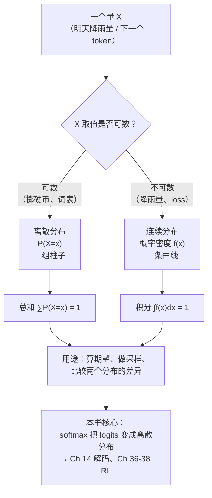

# 第 3 章 概率论基础

前两章我们都在跟「确定性」打交道：给定向量 $\mathbf{x}$ 和矩阵 $W$ ，`x @ W` 的结果永远只有一个，算一次和算一万次完全相同。但只要你让模型「开口说话」，确定性就消失了——

> **给定「今天天气真」，下一个 token 是「好」还是「差」？模型给出的不是唯一答案，而是一组可能性。**

这就是概率论（probability theory）登场的时刻。语言模型每走一步，本质上都在**词表上画一张概率分布**：它给「好」打 0.6 分、给「差」打 0.3 分、给「晴」打 0.05 分……然后把这张分布交出去，由解码器（Ch 14）按某种策略挑出下一个词。可以说，**整部大语言模型，从头到尾都在做一件事——计算、比较、采样概率分布**。

本章是 Part I 数学基础的第三章，承接 Ch 02 结尾「从确定性走向不确定性」的预告。我们要把后面所有章节反复用到的概念彻底讲透：**样本空间与概率公理、条件概率、贝叶斯定理、联合与边缘分布、期望与独立性、几种常见分布，以及最重要的那座桥——softmax**。

## 3.1 学习目标

读完本章，你应该能够：

- 默写出**概率的三条公理**（非负性、规范性、可列可加性），并据此判断「什么样的函数可以当作概率」；
- 写出**条件概率** $P(A\mid B)=P(A,B)/P(B)$ ，并用它推出**贝叶斯定理** $P(\theta\mid D)=\dfrac{P(D\mid\theta)P(\theta)}{P(D)}$ ；
- 逐项说出贝叶斯公式里**先验（prior）、似然（likelihood）、后验（posterior）、证据（evidence）**的物理含义，并体会「贝叶斯 = 用数据更新信念」这层直觉；
- 区分**联合分布、边缘分布、条件分布**三者关系，掌握「求和/积分消元」的技巧；
- 写出**期望** $E[X]$ 的定义、**独立性** $P(A,B)=P(A)P(B)$ 的判据；
- 写出**伯努利、类别分布、均匀、高斯**四种分布的定义，特别是高斯 $\mathcal{N}(\mu,\sigma^2)$ 的概率密度；
- 把 **softmax** 理解成「类别分布的参数化」——它把任意实数向量（logits）归一化成一组概率，是本章通往 LLM 的关键桥梁。

本章承接 Ch 01–02 的「确定性运算」地基，向上盖一层「不确定性」的语言。

## 3.2 直觉与动机

### 类比一：频率派 vs 贝叶斯派——「概率」到底描述什么

关于「概率是什么」这个问题，历史上两派吵了两百年：

- **频率派（frequentist）**：概率是「长期重复试验中事件发生的频率极限」。掷硬币掷无穷多次，正面朝上的比例趋近于 $1/2$ ，所以「正面概率」 $=0.5$ 。
- **贝叶斯派（Bayesian）**：概率是「对某个命题为真的**置信程度（degree of belief）**」。即便只掷一次硬币，我也可以说「我相信它正面的概率是 0.5」——这种置信度会随着新证据不断更新。

对工程师而言，两派的**计算规则完全一样**（都是后面那几条公理），差别只在于「你怎么解释这个数」。本书默认采用贝叶斯视角——因为它和机器学习最契合：**训练模型，本质上就是用数据 $D$ 不断更新我们对参数 $\theta$ 的置信度**，这正是贝叶斯定理的精髓。

> **一句话记牢：贝叶斯视角下，「学习」=「用证据更新信念」。**

### 类比二：从「点」到「云」——确定性的语言不够用了

确定性的世界是「点」： $\mathbf{x}$ 是 $\mathbb{R}^3$ 里的一个确定点。不确定性的世界是「云」：天气预报不说「明天降雨量是 12mm」，而说「降雨量在 10–15mm 的概率是 70%」——**它给每个可能的结果都配了一个权重，这组权重的总和是 1**。

把这组权重画出来，就得到一条曲线（连续情形）或一根根柱子（离散情形），这条曲线/这些柱子就是**概率分布（probability distribution）**。下面这张概念图把「确定 vs 不确定」「离散 vs 连续」四种情形放在同一个框架里：



注意一个关键细节：**离散分布的 $P(X=x)$ 是一个真实的概率**（取值在 $[0,1]$ ，求和为 1）；而**连续分布的 $f(x)$ 叫「概率密度（probability density）」**，它本身不是概率，可以对单点的密度 $>1$ ，只有它围出的面积才代表概率（ $\int$ 才 $=1$ ）。这条区别后面讲高斯时会再次出现，务必牢记。

### 为什么 LLM 离不开概率论

先用一张表剧透，让你知道这些抽象概念在后面会出现在哪里：

| 概念 | 在 LLM 中的角色 | 本书首次出现 |
|------|----------------|-------------|
| 类别分布 / categorical | 语言模型每步在词表上输出的分布 | Ch 13、Ch 26 |
| softmax | 把 logits 归一化成概率（类别分布的参数化） | Ch 13、Ch 26 |
| 期望 | 期望风险、奖励期望、优势函数 | Ch 06、Ch 37 |
| 高斯分布 | 权重初始化、连续奖励建模 | Ch 09、Ch 38 |
| 贝叶斯定理 | 参数推断、MAP 估计、DPO 推导 | Ch 04、Ch 36 |
| 独立性 | 「i.i.d. 样本」「条件独立的注意力」假设 | Ch 09、Ch 12 |
| 概率分布上的运算 | 采样（temperature/top-k/top-p）、策略比 ratio | Ch 14、Ch 37、Ch 38 |

带着这张表，我们正式进入数学定义。

## 3.3 数学定义

### 3.3.1 样本空间、事件与概率公理

一个随机试验所有可能结果的集合叫**样本空间（sample space）**，记作 $\Omega$ ； $\Omega$ 的子集叫**事件（event）**。例如掷一颗骰子， $\Omega=\{1,2,3,4,5,6\}$ ，「掷出偶数」是事件 $\{2,4,6\}$ 。

概率是一个从事件到实数的函数 $P(\cdot)$ ，必须满足三条**概率公理（Kolmogorov axioms）**：

1. **非负性（non-negativity）**：对任意事件 $A$ ，
   $$
   P(A) \geq 0
   $$
2. **规范性（normalization）**：
   $$
   P(\Omega) = 1
   $$
3. **可列可加性（countable additivity）**：对任意**两两互斥**的事件序列 $A_1, A_2, \ldots$ （即 $A_i\cap A_j=\varnothing, i\neq j$ ），
   $$
   P \left(\bigcup_{i=1}^{\infty} A_i\right) = \sum_{i=1}^{\infty} P(A_i)
   $$

这三条公理是整个概率论的「宪法」。**任何一个想自称「概率」的函数，都必须同时满足这三条**——尤其是规范性 $\sum P = 1$ ，它正是 softmax 那个分母 $\sum e^{z_i}$ 必须出现的原因。

### 3.3.2 条件概率与独立性

在已知事件 $B$ 发生的前提下，事件 $A$ 发生的概率称为**条件概率（conditional probability）**：

$$
\boxed{ P(A\mid B) = \frac{P(A, B)}{P(B)}, \qquad P(B) > 0 }
$$

其中 $P(A,B)$ 是 $A$ 和 $B$ **同时发生**的概率（即联合概率）。直觉上：我们把目光从整个样本空间 $\Omega$ 收窄到 $B$ 的范围里，看看 $A$ 在这个新范围里占多大比例。

如果 $A$ 的发生与 $B$ 是否发生**毫无关系**，即

$$
\boxed{ P(A, B) = P(A) P(B) }
$$

就称 $A$ 与 $B$ **独立（independent）**。等价地，独立时 $P(A\mid B)=P(A)$ ——「知道 $B$ 发生并不能帮我更好地预测 $A$ 」。机器学习里随处可见的「i.i.d.（独立同分布）样本」假设，就是要求每个训练样本彼此独立、来自同一个分布。

### 3.3.3 联合、边缘与求和消元

对多个随机变量 $X, Y$ ，它们**联合分布（joint distribution）**$P(X, Y)$ 描述了「 $X=x$ 且 $Y=y$ 」同时发生的概率。如果我们只关心 $X$ 、不关心 $Y$ ，就把 $Y$ **「积掉」**，得到 $X$ 的**边缘分布（marginal distribution）**：

$$
\boxed{ P(X) = \sum_{y} P(X, y) \quad\text{（离散）}\qquad\text{或}\qquad p(x) = \int p(x, y) dy \quad\text{（连续）} }
$$

这个「**对不关心的变量求和/积分**」的操作叫**边缘化（marginalization）**，是概率推理最基础的工具。后面贝叶斯公式的分母 $P(D)$ 就是一个边缘分布——把参数 $\theta$ 积掉得到「数据 $D$ 出现的总概率」。

### 3.3.4 期望

随机变量的**期望（expectation / 期望值）**是它「长期平均」会取的值，定义为概率加权的求和（或积分）：

$$
\boxed{ E[X] = \sum_{x} x P(X=x) \quad\text{（离散）}\qquad\text{或}\qquad E[X] = \int x p(x) dx \quad\text{（连续）} }
$$

直觉：把每个取值 $x$ 乘以它发生的概率 $P(X=x)$ ，再全部加起来。期望满足**线性性**：

$$
E[aX + bY] = a E[X] + b E[Y]
$$

（注意： $E[XY]=E[X]E[Y]$ 只有在 $X,Y$ 独立时才成立。）方差 $\mathrm{Var}(X)=E[(X-E[X])^2]$ 衡量「取值偏离期望的剧烈程度」。期望与方差是 Ch 06（最优化）里梯度、噪声分析的常客。

### 3.3.5 常见分布

#### 1. 伯努利分布 Bernoulli

最简单的随机变量：一次「成功/失败」试验，取值 $\{0,1\}$ ，成功概率 $\phi$ ：

$$
P(X=1) = \phi, \quad P(X=0) = 1-\phi, \qquad E[X]=\phi
$$

例如「这条评论是正面（1）还是负面（0）」就是一个伯努利变量。

#### 2. 类别分布 categorical

伯努利只有两种结果，把它推广到 $K$ 种结果就是**类别分布（categorical distribution）**：取值 $\{1,2,\ldots,K\}$ ，每个类有自己的概率 $\pi_1,\pi_2,\ldots,\pi_K$ ，满足

$$
P(X=k) = \pi_k, \qquad \sum_{k=1}^{K} \pi_k = 1, \quad \pi_k \geq 0
$$

**这就是语言模型每步输出的分布！** zllm 默认词表大小 $\text{vocab\_size}=6400$ ，所以模型每走一步，就是在 $\{1,\ldots,6400\}$ 上输出一个 6400 维的类别分布。整个 Part IV–VI 都围绕「如何生成、如何优化这个分布」展开。

#### 3. 均匀分布 uniform

最「无信息」的分布：区间 $[a,b]$ 上每个点概率密度相等：

$$
p(x) = \begin{cases} \dfrac{1}{b-a}, & x\in[a,b] \cr 0, & \text{否则} \end{cases}, \qquad E[X]=\frac{a+b}{2}
$$

权重初始化、拒绝采样里的基准分布都用得上它。

#### 4. 高斯（正态）分布 Gaussian / Normal

自然界与深度学习里出现频率最高的分布。对均值 $\mu$ 、方差 $\sigma^2$ ，其**概率密度函数（pdf）**为：

$$
\boxed{ p(x) = \frac{1}{\sqrt{2\pi\sigma^2}} \exp \left(-\frac{(x-\mu)^2}{2\sigma^2}\right), \qquad X\sim\mathcal{N}(\mu,\sigma^2) }
$$

记号 $X\sim\mathcal{N}(\mu,\sigma^2)$ 读作「 $X$ 服从均值为 $\mu$ 、方差为 $\sigma^2$ 的高斯分布」。它满足 $E[X]=\mu$ 、 $\mathrm{Var}(X)=\sigma^2$ 。当 $\mu=0, \sigma=1$ 时叫**标准正态分布** $\mathcal{N}(0,1)$ 。高斯是权重初始化（Ch 09）、连续奖励建模（Ch 38）、中心极限定理的主角。

## 3.4 推导与几何

### 3.4.1 贝叶斯定理的推导与逐项解读

把条件概率公式 $P(A\mid B)=P(A,B)/P(B)$ 用两次，就有 $P(A,B)=P(A\mid B)P(B)=P(B\mid A)P(A)$ ，整理得**贝叶斯定理（Bayes' theorem）**：

$$
\boxed{ P(\theta\mid D) = \frac{P(D\mid\theta) P(\theta)}{P(D)} }
$$

在机器学习的语境里，我们通常关心「参数 $\theta$ 」，并把手里的数据记作 $D$ 。贝叶斯定理的四项各有专门的名字：

| 项 | 名称 | 直觉含义 |
|----|------|---------|
| $P(\theta)$ | **先验 prior** | 在看到数据前，我们对参数 $\theta$ 的信念 |
| $P(D\mid\theta)$ | **似然 likelihood** | 若参数真是 $\theta$ ，观察到数据 $D$ 的可能性 |
| $P(\theta\mid D)$ | **后验 posterior** | 看到数据后，我们对 $\theta$ 的更新信念 |
| $P(D)$ | **证据 evidence** | 数据 $D$ 在所有可能 $\theta$ 下的总概率（归一化常数） |

分母 $P(D)$ 可以通过对参数边缘化得到（这正是「求和消元」的用武之地）：

$$
P(D) = \sum_{\theta} P(D\mid\theta) P(\theta) \quad\text{（离散）}\qquad\text{或}\qquad P(D) = \int P(D\mid\theta) P(\theta) d\theta \quad\text{（连续）}
$$

于是贝叶斯定理可以改写成不含 $P(D)$ 的比例形式（这是工程实现最常用的版本）：

$$
\boxed{ \text{后验}  \propto  \text{似然} \times \text{先验} }
$$

下面这张示意图用「信念曲线」展示了贝叶斯更新的几何过程：先验是一条平缓的曲线（「我对 $\theta$ 有点相信但不坚定」），似然是数据贡献的尖峰（「数据强烈暗示 $\theta$ 在某值附近」），后验则是两者的折中——

```
   对参数 θ 的置信度 p(θ)
        ↑
   先验 │    ╭─────╮                 ← 先验 p(θ)：平缓，「不太确定」
        │   ╱       ╲
        │  ╱         ╲
        │ ╱           ╲
        │╱             ╲
        ├─────────────────────────→  θ
        │        ╭╮
   似然 │       ╱  ╲                   ← 似然 P(D|θ)：尖峰，「数据指向这里」
        │      ╱    ╲
        │     ╱      ╲
        │  ╭─╯        ╲─╮
        ├─────────────────────────→  θ
        │       ╭╮
   后验 │      ╱  ╲                   ← 后验 p(θ|D)：先验与似然的「加权折中」
        │     ╱    ╲                   （峰位置被似然拉过去，但比似然更宽）
        │  ╭─╯      ╲─╮
        └─────────────────────────→  θ

   几何直觉：后验 = 先验被似然「按比例修正」。
   数据越多，似然越尖，后验越向似然靠拢——信念越来越被证据主导。
```

这张图揭示了一个深刻事实：**贝叶斯推断是「先验（旧信念）」与「似然（新证据）」之间的一场拔河**。数据量少时，先验主导（后验更靠近先验）；数据量多时，似然主导（后验逼近似然的尖峰）。这套思想是 Ch 04《统计推断》里 **MAP（最大后验估计）= 最大化「似然 $\times$ 先验」** 的直接来源。

> **一句话记牢贝叶斯：后验 ∝ 似然 × 先验——用证据更新信念。**

### 3.4.2 softmax：类别分布的参数化（关键桥梁）⭐

这是本章最重要、与 LLM 联系最紧的一节。问题来了：**类别分布**要求 $\sum_k \pi_k = 1$ 且 $\pi_k\geq 0$ ，但神经网络最后一层吐出来的 **logits** 是任意实数 $z_1, z_2, \ldots, z_K$ （可正可负、不归一）。怎么把这样一组实数变成合法的概率？

答案就是 **softmax**：

$$
\boxed{ \pi_k = \mathrm{softmax}(z)_k = \frac{\exp(z_k)}{\sum_{j=1}^{K} \exp(z_j)}, \qquad k=1,\ldots,K }
$$

它同时满足类别分布的两条要求，正好对应概率公理：

- **非负性**： $\exp(z_k)>0$ ，故 $\pi_k>0$ ；
- **规范性**：分母 $\sum_j \exp(z_j)$ 保证 $\sum_k \pi_k = 1$ 。

换句话说，**softmax 是「类别分布的一种参数化」**——它用一组无约束的实数（logits）去参数化一个合法的类别分布。指数 $\exp$ 不是随便选的：它把实数轴整体映射到正实数（解决非负），再配一个归一化分母（解决求和为 1）。zllm 里这一步发生在 `CausalLM` 头（Ch 26），输出形状是 `(batch, seq, vocab_size)`，最后一维就是 6400 个 logits 经 softmax 后的概率。

理解了 softmax，前面 Ch 02「矩阵分解」与本章就接上了：模型先用一层层矩阵乘法把输入「变换」成一串 logits（确定的线性变换），再用 softmax 把 logits「翻译」成概率分布（引入不确定性）。**确定性与不确定性，在这里完成了交接。**

> **这座桥通向哪里？** 一旦有了这个 6400 维的概率分布，下一步就是「按它采样挑词」——这正是 Ch 14《解码策略理论》的主题：`temperature` 缩放 logits、`top-k` 截断候选集、`top-p`（nucleus）按累计概率截断，**全部是分布上的运算**。本章先把分布的「定义」讲清楚，Ch 14 再讲分布的「操作」。

### 3.4.3 期望的几何：重心与「长期平均」

期望 $E[X]$ 还有一层几何直觉：**它是概率分布这条曲线/这组柱子的「重心」**。把概率看成质量，期望就是质量的平衡点。下图用一个离散分布示意：

```
   概率 P
    ↑  0.4 │  ██
    │      │  ██
    │  0.3 │  ██ ██
    │      │  ██ ██
    │  0.2 │  ██ ██ ██
    │      │  ██ ██ ██
    │  0.1 │  ██ ██ ██ ██
    │      └──────────────→ 取值 x
              1   2   3   4

   E[X] = 1·0.4 + 2·0.3 + 3·0.2 + 4·0.1 = 2.0
   ← 重心落在 x=2，正是「按概率加权后的平均位置」。
```

方差则衡量这堆质量「散得多开」——越集中方差越小，越分散方差越大。期望与方差这对概念，在 Ch 06（梯度下降的噪声）和 Ch 37（强化学习的优势函数 $A = R - E[R]$ ）里会反复出现。

## 3.5 与本项目联系

理论就绪，现在把它和 zllm 钉死。本节依然是「前方路口预告牌」——记住这些钩子，等读到对应章节时会恍然大悟。

### 钩子一：语言模型每步输出一个类别分布（Ch 13、Ch 26）⭐

这是本章最重要、也最直接的钩子。zllm 默认词表 `vocab_size=6400`（见 `zllm/config.py`），模型每预测一步，最后一层 `CausalLM` 头会吐出一个 6400 维的 logits 向量，经 softmax 后变成一个 6400 维的**类别分布**：

$$
\pi_k = \mathrm{softmax}(z)_k = \frac{\exp(z_k)}{\sum_{j=1}^{6400} \exp(z_j)}, \qquad k=1,\ldots,6400
$$

这一句话同时绑定了本章三个核心概念：**类别分布（数学对象）+ softmax（参数化方法）+ 词表维度 6400（工程实例）**。整本书后半段——从预训练的交叉熵 loss（Ch 05、Ch 31）到对齐算法——本质都是在「生成、比较、优化这个 6400 维分布」。

### 钩子二：解码采样 = 概率分布上的运算（Ch 14）

有了分布，怎么挑出下一个 token？最朴素的是**贪心解码（greedy）**：永远取概率最大的那个 $k^*=\arg\max_k \pi_k$ 。但贪心会让输出单调重复、毫无创造性。所以 Ch 14 会引入一系列「在分布上动手脚」的技巧：

- **温度 temperature**：把 logits 缩放 $\pi_k \propto \exp(z_k/T)$ 。 $T\to 0$ 退化为贪心（分布变尖锐）， $T\to\infty$ 趋近均匀分布（分布变平坦）；
- **top-k**：只保留概率最大的 $k$ 个候选，其余置零后重新归一化；
- **top-p（nucleus）**：保留累计概率达到 $p$ 的最小候选集，其余置零。

注意这三个操作无一例外**都是在类别分布上做变换**：缩放、截断、重归一化。本章把分布的「定义」讲清楚了，Ch 14 就能专心讲分布的「操作」。没有本章的地基，Ch 14 的 temperature/top-k/top-p 全是空中楼阁。

### 钩子三：对齐算法 = 概率分布上的优化（Ch 36–38）

微调与对齐阶段（Part VI），策略（policy） $\pi_\theta$ 本身就是一个**条件概率分布** $\pi_\theta(y\mid x)$ ——「给定输入 $x$ ，模型生成 $y$ 的概率」。三大对齐算法全都在这个分布上做文章：

- **Ch 36 DPO（Direct Preference Optimization）**：直接比较**当前策略** $\pi_\theta$ 与**参考策略** $\pi_{\mathrm{ref}}$ 的概率比 $\dfrac{\pi_\theta(y_w\mid x)}{\pi_{\mathrm{ref}}(y_w\mid x)}$ ，用偏好数据把模型往「偏好回答 $y_w$ 」拉；
- **Ch 37 PPO（Proximal Policy Optimization）**：核心是**重要性采样比（importance ratio）** $r(\theta)=\dfrac{\pi_\theta(a\mid s)}{\pi_{\mathrm{old}}(a\mid s)}$ ——新旧策略生成同一个动作的概率之比，PPO 用 clip 防止这个比值偏离 1 太远；
- **Ch 38 GRPO（Group Relative Policy Optimization）**：在 PPO 基础上去掉 critic，用一组样本的**相对优势**驱动策略 $\pi_\theta$ 更新，依然是分布上的比值运算。

这三个算法的名字、细节各不相同，但骨架是同一个：**它们都在比较、约束、优化「模型输出分布」 $\pi_\theta$**。本章的「条件概率」「概率分布」「独立性」就是它们的公共地基。等读 Part VI 时回头再看这张表，你会豁然开朗。

### 钩子四：贝叶斯思想 → MAP 估计（Ch 04）

本章的贝叶斯定理后验 $\propto$ 似然 $\times$ 先验，是 Ch 04《统计推断》的入场券。Ch 04 会讲两种参数估计：

- **MLE（最大似然估计）**： $\hat\theta_{\mathrm{MLE}} = \arg\max_\theta P(D\mid\theta)$ ——只看似然，忽略先验；
- **MAP（最大后验估计）**： $\hat\theta_{\mathrm{MAP}} = \arg\max_\theta P(D\mid\theta)P(\theta)$ ——似然乘先验再取最大。

注意 **MAP = MLE + 先验**：当数据无穷多时两者重合（似然主导先验）；数据稀少时先验起「正则化」作用，防止过拟合。其实 **L2 正则化 = 高斯先验下的 MAP**、**L1 正则化 = 拉普拉斯先验下的 MAP**——这套联系把「正则化」与「贝叶斯先验」缝合在了一起。这些细节留到 Ch 04、Ch 06 展开，本章只需先把「后验 ∝ 似然 × 先验」刻进脑子里。

### 钩子五：独立性与 i.i.d. 假设（贯穿全书）

训练时我们总假设样本「**i.i.d.（独立同分布）**」——每个样本来自同一个分布（同分布），且彼此不相互影响（独立）。这个假设让 Ch 05 的交叉熵 loss 可以拆成各项之和、让 Ch 09 的梯度下降有理论保障。一旦独立性被破坏（如时间序列、如自生成的 RL 数据），就要换更复杂的工具（这正是 Ch 38 GRPO 处理 RL 数据非独立性的动机）。本章学透了「独立 $\Leftrightarrow P(A,B)=P(A)P(B)$ 」，后面读这些章节就不会在前提假设上卡壳。

一句话总结这五个钩子：**类别分布是语言模型输出的「形状」，softmax 是它的「参数化」，贝叶斯是「用数据更新信念」的法则，期望与独立性是「平均与互不影响」的语言，而 DPO/PPO/GRPO 全都是在输出分布上做优化。** 这五件武器合起来，就是后面理解解码、对齐、推断的概率论地基。

## 3.6 本章小结

让我们把这一章浓缩成几条可以随身携带的结论：

1. **概率公理**：非负性 $P(A)\geq 0$ 、规范性 $P(\Omega)=1$ 、可列可加性——**任何自称「概率」的函数都必须满足这三条**，softmax 的归一化分母正是为了满足规范性。
2. **条件概率与贝叶斯**： $P(A\mid B)=P(A,B)/P(B)$ ；贝叶斯定理 $P(\theta\mid D)=\dfrac{P(D\mid\theta)P(\theta)}{P(D)}$ ，等价地**后验 $\propto$ 似然 $\times$ 先验**——用证据更新信念。
3. **联合 / 边缘 / 期望 / 独立**：联合 $P(X,Y)$ 经求和/积分消元得边缘 $P(X)$ ；期望 $E[X]=\sum x P(x)$ 是分布的「重心」；独立 $P(A,B)=P(A)P(B)$ 是「互不影响」的数学刻画。
4. **常见分布**：伯努利（0/1）、类别分布（ $K$ 类，语言模型的输出形态）、均匀、高斯 $\mathcal{N}(\mu,\sigma^2)$ （pdf $=\dfrac{1}{\sqrt{2\pi\sigma^2}}\exp(-\dfrac{(x-\mu)^2}{2\sigma^2})$ ）。
5. **softmax 桥梁**： $\pi_k=\dfrac{\exp(z_k)}{\sum_j\exp(z_j)}$ 把任意 logits 归一化成合法类别分布——它是「确定性的神经网络」与「不确定性的概率输出」之间的交接点。

> **前方预告。** 本章我们学会了「描述」一个概率分布，但还没回答最关键的问题：**给定一堆数据，怎么「反推」出产生这些数据的分布或参数？** 训练模型时，我们手里有语料 $D$ ，想求的正是参数 $\theta$ ——这要用到 MLE/MAP、点估计与区间估计、假设检验。Ch 04《统计推断》会把贝叶斯定理变成可计算的估计方法，并在那里第一次正式写下「交叉熵 / 负对数似然」的雏形，为 Ch 05《信息论》与预训练 loss（Ch 31）铺好最后一公里。

### 思考题

> 写出答案前，建议先想「这件事对应哪条公理或哪个分布」，再用公式验证。

1. **概念题**：softmax 满足概率公理的哪两条？请用 $\exp(z_k)>0$ 和 $\sum_k \pi_k=1$ 解释「为什么 softmax 输出一定是合法的概率」。如果把 softmax 里的 $\exp$ 换成 $z_k^2$ （即 $\pi_k = z_k^2 / \sum_j z_j^2$ ），它还能保证「非负」吗？能保证「规范性」吗？（提示：想想 $z_k$ 为负时 $z_k^2$ 会怎样，以及这能否构成合法分布的隐患。）
2. **计算题**：某疾病在人群中的先验发病率 $P(\text{病})=0.001$ ；检测仪器对病人呈阳性的概率（灵敏度） $P(\text{阳}\mid\text{病})=0.99$ ，对健康人误报阳性的概率 $P(\text{阳}\mid\text{健康})=0.05$ 。现某人检测为阳性，请用贝叶斯定理计算他真正患病的后验概率 $P(\text{病}\mid\text{阳})$ ，并据此解释「为什么罕见病即使检测很准，一次阳性也不必过度恐慌」。（提示：分母 $P(\text{阳})$ 要用全概率公式对「病 / 健康」两类边缘化。）
3. **应用题**：zllm 默认 `vocab_size=6400`，假设某一步模型对某 token 的 logits 是 $z=(2.0, 1.0, 0.5, 0,\ldots,0)$ （其余 6396 维都是 0）。手算（可借助计算器）前三维的 softmax 概率 $\pi_1,\pi_2,\pi_3$ ，并回答：如果对 logits 施加 temperature $T=2$ （即用 $z_k/2$ 替代 $z_k$ ），这三个概率会如何变化、分布会变「尖」还是变「平」？这与 Ch 14 的采样多样性有什么关系？

---

读完本章，你已经能用「公理 + 条件概率 + 贝叶斯 + 分布 + 期望 + softmax」这套语言描述不确定性了。下一章（Ch 04《统计推断》）我们将学会「从数据反推分布与参数」——把贝叶斯定理变成可操作的 MLE / MAP 估计，为预训练 loss 与正则化方法补上最后一块数学地砖。
