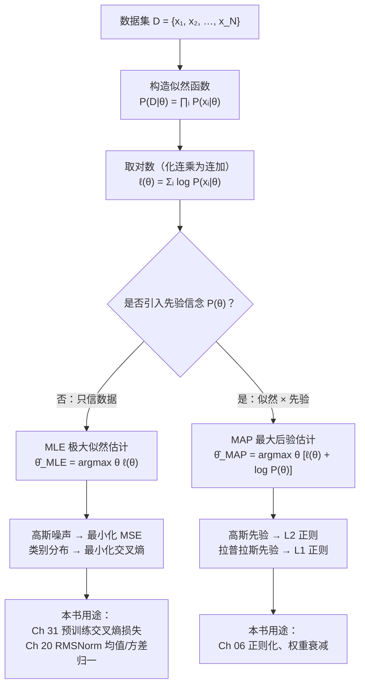

# 第 4 章 统计推断

上一章我们学会了「描述」一个概率分布——给定参数 $\theta$ ，写出 $P(x\mid\theta)$ 。但训练模型时方向正好反过来：**我们手里有一堆数据 $D=\{x_1,x_2,\ldots,x_N\}$ ，要反推出最可能产生这批数据的参数 $\theta$**。这就是本章的主题——**统计推断（statistical inference）**。

> **给定一批语料，模型该把权重 $\theta$ 设成多少，才能「最合理」地解释这些数据？**

本章是 Part I 数学基础的第四章，承接 Ch 03 结尾「贝叶斯定理 → MAP 估计」「交叉熵雏形」的预告。我们要补上最后一块把数学和训练 loss 缝起来的地砖：**期望、方差、协方差等数字特征；极大似然估计（MLE）与最大后验估计（MAP）；以及两座关键桥梁——「高斯噪声下 MLE 等价于最小化均方误差」「类别分布下 MLE 的负对数似然就是交叉熵」**。读懂这两座桥，你就能在 Ch 31 看到「预训练为什么用交叉熵损失」时，从概率论的根上回答「为什么」。

## 4.1 学习目标

读完本章，你应该能够：

- 写出**期望** $E[X]$ 、**方差** $\mathrm{Var}(X)=E[(X-E[X])^2]$ 、**标准差** $\sigma=\sqrt{\mathrm{Var}(X)}$ 的定义，并理解「方差 = 离散程度」的几何直觉；
- 写出**协方差** $\mathrm{Cov}(X,Y)=E[(X-E[X])(Y-E[Y])]$ 与**相关系数** $\rho_{X,Y}=\mathrm{Cov}(X,Y)/(\sigma_X\sigma_Y)$ ，说明 $\rho\in[-1,1]$ 衡量「线性相关」的强弱；
- 写出**似然函数** $P(D\mid\theta)=\prod_i P(x_i\mid\theta)$ 与**对数似然** $\ell(\theta)=\sum_i \log P(x_i\mid\theta)$ ，并解释「为什么连乘要取对数变连加」；
- 默写 **MLE（极大似然估计）** $\hat\theta_{\text{MLE}}=\arg\max_\theta \ell(\theta)$ 与 **MAP（最大后验估计）** $\hat\theta_{\text{MAP}}=\arg\max_\theta [\ell(\theta)+\log P(\theta)]$ ，并说出「**MAP = MLE + 先验正则**」这层关系；
- 独立推导两座桥：① 高斯噪声假设下 **MLE 等价于最小化均方误差（MSE）**；② 伯努利/类别分布下 **MLE 的负对数似然（NLL）= 交叉熵**；
- 把这两座桥对应到本书后续：**预训练的交叉熵损失（Ch 31）** 是类别分布 MLE 的 NLL；**RMSNorm（Ch 20）** 是对 hidden vector 做均值/方差归一化；**Xavier/He 初始化（Ch 10）** 由方差控制导出。

本章承接 Ch 03 的概率语言，向上把「贝叶斯定理」变成可计算的参数估计方法，并为 Ch 05《信息论》里的熵、交叉熵、KL 散度铺好出发平台。

## 4.2 直觉与动机

### 类比一：MLE 找「最可能」，MAP 找「最合理」

假设你有一枚硬币，掷了 10 次，7 次正面。请问它「正面概率」 $\phi$ 是多少？

- **频率派 / MLE 的回答**：哪样的硬币最可能掷出「7 正 3 反」这个结果？答案就是让似然 $\phi^7(1-\phi)^3$ 最大的那个 $\phi$ ，对 $\phi$ 求导令其为零，得 $\hat\phi_{\text{MLE}}=7/10=0.7$ 。**MLE 只看数据，只问「哪个参数让数据最可能出现」。**
- **贝叶斯派 / MAP 的回答**：但凭常识，市面上的硬币大多很公平（ $\phi\approx0.5$ ）。我只掷了 10 次，样本太少，凭什么完全相信「0.7」？于是我把「公平」这个先验信念 $P(\phi)$ （在 0.5 附近取峰）乘到似然上，再取最大——这就是 MAP。**MAP = MLE + 先验**：数据少时先验拉一把，数据多时先验被似然淹没。

一句话区分两者：

> **MLE 找「最可能产生数据的参数」；MAP 在此之上加一个「先验信念」，找「最合理的参数」。当数据量趋于无穷，两者重合。**

### 类比二：从「描述分布」到「反推参数」

Ch 03 解决的是**正向问题**：参数 $\theta$ 已知，问「数据 $x$ 服从什么分布」。本章解决**反向问题**：数据 $D$ 已知，问「最可能产生 $D$ 的 $\theta$ 是多少」。机器学习全程都在解这个反向问题——训练就是用数据反推参数。下面这张图把两种估计方法的逻辑流摆在同一个框架里：



这张图是本章的「地图」：上半段是定义（似然、对数似然），下半段是两座桥（MLE↔MSE、MLE↔交叉熵）和正则化联系（MAP↔L2）。后面三节都在填这张图的细节。

### 为什么 LLM 离不开统计推断

先用一张表剧透，让你看清这些抽象方法在后面出现在哪里：

| 方法 / 概念 | 在 LLM 中的角色 | 本书首次出现 |
|------------|----------------|-------------|
| MLE（极大似然） | 预训练目标的理论根基（最大化语料似然） | Ch 31 |
| 交叉熵损失 / NLL | 预训练 & SFT 的实际损失函数 | Ch 05、Ch 26、Ch 31、Ch 33 |
| MAP + 高斯先验 | 权重衰减（weight decay）= L2 正则 | Ch 06、Ch 29 |
| 期望、方差 | RMSNorm 归一化、梯度噪声分析 | Ch 20、Ch 06 |
| 协方差 | 权重初始化（Xavier/He）的动机 | Ch 10 |
| 交叉熵 ↔ KL 散度 | 蒸馏损失、DPO 隐含目标 | Ch 05、Ch 39 |

带着这张表，我们正式进入数学定义。

## 4.3 数学定义

### 数字特征：期望、方差、标准差

Ch 03 已经给出了期望的定义。本章把它和它的「散度伴侣」一并讲透。随机变量 $X$ 的**期望（expectation / 均值）**为：

$$
\boxed{ E[X] = \sum_{x} x P(X=x) \quad\text{（离散）}\qquad\text{或}\qquad E[X] = \int x p(x) dx \quad\text{（连续）} }
$$

期望是分布的「重心」（Ch 03 已述）。但只看重心不够——「集中在 0 附近」和「散得很开」的分布重心可能都是 0。衡量「散得多开」的量叫**方差（variance）**：

$$
\boxed{ \mathrm{Var}(X) = E \left[(X-E[X])^2\right] }
$$

直觉：每个取值 $x$ 偏离期望 $E[X]$ 多少，平方（避免正负抵消）后按概率加权平均。方差越小，分布越集中在均值附近；方差越大，越分散。方差的**平方根**叫**标准差（standard deviation）**：

$$
\sigma_X = \sqrt{\mathrm{Var}(X)}
$$

为什么要单独定义标准差？因为方差是「 $x$ 的平方量纲」，而标准差和 $x$ 同量纲，物理意义更直接（例如「身高方差」是 $\text{cm}^2$ ，「身高标准差」是 cm）。本书 Ch 20 的 RMSNorm 用的就是**标准差归一化**： $(x - E[X])/\sigma$ 。一个常用展开式（计算方差时省去两次求期望）：

$$
\mathrm{Var}(X) = E[X^2] - (E[X])^2
$$

### 协方差与相关系数

当我们关心**两个**随机变量 $X, Y$ 是否「同步变化」时，需要**协方差（covariance）**：

$$
\boxed{ \mathrm{Cov}(X,Y) = E \left[(X-E[X])(Y-E[Y])\right] = E[XY] - E[X]E[Y] }
$$

- $\mathrm{Cov}(X,Y)>0$ ： $X$ 大时 $Y$ 也倾向于大（正相关）；
- $\mathrm{Cov}(X,Y)<0$ ： $X$ 大时 $Y$ 倾向于小（负相关）；
- $\mathrm{Cov}(X,Y)=0$ ：**不相关**（注意：不相关 ≠ 独立，但独立一定不相关）。

协方差的量纲是 $X$ 量纲乘 $Y$ 量纲，不好跨对象比较。把它「标准化」除掉两个标准差，就得到**相关系数（correlation coefficient / Pearson $\rho$ ）**：

$$
\boxed{ \rho_{X,Y} = \frac{\mathrm{Cov}(X,Y)}{\sigma_X \sigma_Y}, \qquad \rho_{X,Y}\in[-1, +1] }
$$

$\rho=\pm 1$ 表示完全线性相关， $\rho=0$ 表示无线性关系。协方差矩阵 $\Sigma$ （其 $(i,j)$ 元是 $\mathrm{Cov}(X_i,X_j)$ ，对角元是方差）是多元高斯分布 $\mathcal{N}(\boldsymbol\mu,\Sigma)$ 的形状参数，也是 Ch 10 讨论权重初始化「各层激活方差要均衡」时反复出现的对象。

### 似然函数与对数似然

现在进入本章核心。给定数据集 $D=\{x_1,x_2,\ldots,x_N\}$ （假设 i.i.d.）和一组带参数 $\theta$ 的分布族 $P(x\mid\theta)$ ，**似然函数（likelihood）**定义为：

$$
\boxed{ P(D\mid\theta) = \prod_{i=1}^{N} P(x_i\mid\theta) }
$$

注意一个易混点：**似然 $P(D\mid\theta)$ 与概率 $P(x\mid\theta)$ 是同一个函数，但视角相反**——概率把 $\theta$ 当固定常数、 $x$ 当变量；似然把 $x$ （已观测数据）当固定常数、 $\theta$ 当变量。所以似然是「 $\theta$ 的函数」，记作 $L(\theta)=P(D\mid\theta)$ 。

由于 $N$ 个小概率连乘会导致数值下溢（计算机算成 0），且连乘难求导，工程上几乎总是取对数变成**对数似然（log-likelihood）**：

$$
\boxed{ \ell(\theta) = \log P(D\mid\theta) = \sum_{i=1}^{N} \log P(x_i\mid\theta) }
$$

取对数有三个好处：① 化连乘为连加（数值稳定、好算）；② $\log$ 是单调递增函数，**最大化 $L(\theta)$ 等价于最大化 $\ell(\theta)$**，最优解不变；③ 指数族分布取对数后形式更简洁（高斯、伯努利都是）。

### 极大似然估计 MLE

**极大似然估计（Maximum Likelihood Estimation, MLE）**就是「让似然最大的那个参数」：

$$
\boxed{ \hat\theta_{\text{MLE}} = \arg\max_{\theta} P(D\mid\theta) = \arg\max_{\theta} \ell(\theta) = \arg\max_{\theta} \sum_{i=1}^{N} \log P(x_i\mid\theta) }
$$

等价地，最小化**负对数似然（Negative Log-Likelihood, NLL）**：

$$
\hat\theta_{\text{MLE}} = \arg\min_{\theta}  \underbrace{\left[-\sum_{i=1}^{N} \log P(x_i\mid\theta)\right]}_{\text{NLL}}
$$

NLL 才是工程里真正优化的目标（最小化损失）。**预训练的交叉熵损失就是 NLL 的具体实例**——这是 4.4 节要重点推的第二座桥。

### 最大后验估计 MAP

MLE 完全只信数据。但样本少时，MLE 容易过拟合（极端情形：掷 1 次硬币正面，MLE 估计 $\hat\phi=1$ ，明显不合理）。**贝叶斯派**的做法是把先验 $P(\theta)$ 纳入考虑，最大化**后验** $P(\theta\mid D)$ 。由 Ch 03 贝叶斯定理 $P(\theta\mid D)\propto P(D\mid\theta)P(\theta)$ ，取对数得**最大后验估计（Maximum A Posteriori, MAP）**：

$$
\boxed{ \hat\theta_{\text{MAP}} = \arg\max_{\theta}\Big[\underbrace{\log P(D\mid\theta)}_{\text{对数似然 } \ell(\theta)} + \underbrace{\log P(\theta)}_{\text{对数先验}}\Big] }
$$

对比可见 **MAP = MLE + 先验**：把 MLE 目标 $\ell(\theta)$ 再加一个对数先验项 $\log P(\theta)$ 。这个先验项起到「正则化」作用——它惩罚 $\theta$ 偏离先验认为「合理」的区域。当 $P(\theta)$ 是均匀分布（无信息先验）， $\log P(\theta)$ 是常数，MAP 退化为 MLE。当数据量 $N\to\infty$ ，似然项 $\sum_i$ 越来越大、先验项被淹没，MAP 同样趋于 MLE。

## 4.4 推导与几何

本节推导两座桥，它们是本章最值钱的内容——把抽象的 MLE 翻译成你天天在代码里写的损失函数。

### 桥一：高斯噪声假设下，MLE 等价于最小化均方误差（MSE）⭐

**场景**：回归问题。模型对输入 $x_i$ 给出预测 $f_\theta(x_i)$ ，真实值为 $y_i$ 。假设预测与真实之间的误差来自高斯噪声：

$$
y_i = f_\theta(x_i) + \epsilon_i, \qquad \epsilon_i \overset{\text{i.i.d.}}{\sim} \mathcal{N}(0,\sigma^2)
$$

等价地， $y_i\mid x_i;\theta \sim \mathcal{N}(f_\theta(x_i),\sigma^2)$ ，其概率密度为：

$$
P(y_i\mid x_i;\theta) = \frac{1}{\sqrt{2\pi\sigma^2}}\exp \left(-\frac{(y_i - f_\theta(x_i))^2}{2\sigma^2}\right)
$$

**推导**：由 i.i.d. 假设，整个数据集的对数似然为：

$$
\ell(\theta) = \sum_{i=1}^{N}\log P(y_i\mid x_i;\theta) = \sum_{i=1}^{N}\left[-\frac{1}{2}\log(2\pi\sigma^2) - \frac{(y_i - f_\theta(x_i))^2}{2\sigma^2}\right]
$$

把与 $\theta$ 无关的常数项提出，整理得：

$$
\ell(\theta) = -\frac{N}{2}\log(2\pi\sigma^2)  -  \frac{1}{2\sigma^2}\underbrace{\sum_{i=1}^{N}\big(y_i - f_\theta(x_i)\big)^2}_{\text{误差平方和 SSE}}
$$

第一项是常数（ $\sigma$ 与 $\theta$ 无关），最大化 $\ell(\theta)$ **完全等价于**最小化 SSE。而 **均方误差（Mean Squared Error, MSE）**正是 SSE 除以样本数：

$$
\boxed{ \hat\theta_{\text{MLE}}  \equiv  \arg\min_\theta \frac{1}{N}\sum_{i=1}^{N}\big(y_i - f_\theta(x_i)\big)^2  =  \arg\min_\theta \text{MSE}(\theta) }
$$

**结论（请刻进脑子）**：

> **「最小化 MSE」不是拍脑袋选的损失——它是「误差服从零均值高斯」这一假设下，MLE 推出来的必然结果。** 高斯噪声 ⟹ 平方误差，二者是同一枚硬币的两面。

**几何直觉**：平方 $(y_i - f_\theta(x_i))^2$ 是一条开口向上的抛物线，离 0 越远惩罚增长越快——这就是 MSE 对「大误差」特别敏感（被平方放大）的原因，也是它比绝对值误差（MAE）更怕离群点的根源。下图示意这条抛物线惩罚曲线：

```
   单点惩罚 (y - f)²
        ↑                  ╱  ← 平方惩罚：误差越大，
        │                 ╱     惩罚增长越陡（怕离群点）
        │                ╱
        │              ╱
        │           ╱
        │        ╱
        │     ╱
        │  ╱
        │╱___________________________
        └───────────────────────────→ 预测误差 (y - f)
       0                        ±大误差

   几何：MSE = 所有样本点到对角线 y=f 的垂直距离平方和的平均。
   高斯假设让 MLE 自动给出这个「平方碗」形状的损失。
```

这个结论解释了为什么回归任务几乎都用 MSE、为什么它怕离群点，也为 Ch 06「梯度下降在 MSE 下如何收敛」埋下伏笔。

### 桥二：类别分布下，MLE 的负对数似然就是交叉熵 ⭐⭐

这是本章**最重要**的一座桥——它直接通向 Ch 31 预训练损失和 Ch 05 信息论。

**场景**：分类问题（含语言模型的「下一个 token 预测」）。每个样本 $(x_i, y_i)$ ，其中 $y_i$ 是真实类别。模型对类别 $k$ 输出预测概率 $\hat\pi_{ik}=\mathrm{softmax}(z_{ik})$ （logits 经 softmax 归一，Ch 03）。真实标签用 **one-hot 向量** $\mathbf{t}_i$ 表示： $t_{ik}=1$ 当 $k=y_i$ ，其余为 0。

**伯努利情形（二分类）**：先看最简单的二分类。真实标签 $y\in\{0,1\}$ ，模型预测正类概率 $\hat\pi$ 。伯努利似然为：

$$
P(y\mid\hat\pi) = \hat\pi^{ y}(1-\hat\pi)^{1-y}
$$

对数似然 $\ell = y\log\hat\pi + (1-y)\log(1-\hat\pi)$ ，负对数似然：

$$
\text{NLL}_{\text{伯努利}} = -\big[y\log\hat\pi + (1-y)\log(1-\hat\pi)\big] = H_{\text{bce}}(\mathbf{t},\hat{\boldsymbol\pi})
$$

这正是**二元交叉熵（binary cross-entropy）**。

**类别分布情形（多分类 / 语言模型）**：把它推广到 $K$ 类。类别分布的似然为：

$$
P(\mathbf{t}_i\mid\hat{\boldsymbol\pi}_i) = \prod_{k=1}^{K}\hat\pi_{ik}^{ t_{ik}}
$$

（因为 $\mathbf{t}_i$ 是 one-hot，连乘里只有真实类 $k=y_i$ 那项不为 1，所以它其实就是 $\hat\pi_{i,y_i}$ 。写成连乘形式是为了和交叉熵公式对齐。）取对数得单样本对数似然：

$$
\log P(\mathbf{t}_i\mid\hat{\boldsymbol\pi}_i) = \sum_{k=1}^{K} t_{ik}\log\hat\pi_{ik}
$$

整个数据集的 NLL：

$$
\boxed{ \text{NLL}_{\text{类别}} = -\sum_{i=1}^{N}\sum_{k=1}^{K} t_{ik}\log\hat\pi_{ik}  =  \underbrace{\sum_{i=1}^{N} H(\mathbf{t}_i,\hat{\boldsymbol\pi}_i)}_{\text{交叉熵之和}} }
$$

其中 $H(\mathbf{t},\hat{\boldsymbol\pi})=-\sum_k t_k\log\hat\pi_k$ 就是 Ch 05 要讲的**交叉熵（cross-entropy）**。**结论**：

> **「分类任务用交叉熵损失」不是经验之谈，而是「真实标签服从类别分布」这一假设下，MLE 推出来的必然结果。** 类别分布 + MLE ⟹ 交叉熵损失。

对语言模型而言，每一步「预测下一个 token」就是在 vocab_size 个类里做分类——真实下一个 token 是 one-hot，模型输出是 softmax 后的类别分布，所以预训练的损失**自然就是**这个交叉熵（NLL）。zllm 默认 `vocab_size=6400`，所以 Ch 31 你会看到训练循环里最小化的就是：

$$
\mathcal{L}_{\text{CE}} = -\frac{1}{N}\sum_{i=1}^{N}\log\hat\pi_{i,y_i}
$$

**两座桥的并排对比**：

| 噪声 / 标签假设 | MLE 等价的最小化目标 | 适用场景 |
|----------------|---------------------|---------|
| 误差 $\sim\mathcal{N}(0,\sigma^2)$ （高斯） | **MSE** 均方误差 | 回归 |
| 标签 $\sim$ 伯努利 / 类别分布 | **交叉熵 / NLL** | 分类、语言模型 |

记住这张表，你就把「损失函数为什么长这样」从概率论的根上打通了。这正是本章衔接 Ch 05《信息论》（熵、交叉熵、KL 散度的严格定义）与 Ch 31《预训练》的枢纽。

### MAP 与正则化：先验 = 正则项（桥接 Ch 06）⭐

回头看 MAP 目标 $\arg\max_\theta[\ell(\theta)+\log P(\theta)]$ 。**对数先验 $\log P(\theta)$ 在数值上扮演的角色，正是「正则化项」**：

- 若先验是**零均值高斯** $P(\theta)=\mathcal{N}(\mathbf{0},\tau^2 I)$ ，则 $\log P(\theta)=-\dfrac{\Vert\theta\Vert_2^2}{2\tau^2}+\text{const}$ ，于是 MAP 等价于 **MLE + L2 正则（权重衰减 weight decay）**：

$$
\hat\theta_{\text{MAP}} = \arg\min_\theta\Big[\text{NLL}(\theta) + \lambda\Vert\theta\Vert_2^2\Big], \qquad \lambda=\frac{1}{2\tau^2}
$$

- 若先验是**零均值拉普拉斯**分布 $P(\theta)\propto\exp(-\Vert\theta\Vert_1/\tau)$ ，则 MAP 等价于 **MLE + L1 正则（产生稀疏解）**。

这套联系把「正则化」和「贝叶斯先验」缝合为同一件事：**L2 权重衰减 = 高斯先验下的 MAP 估计**。所以你在 Ch 06、Ch 29 看到 `weight_decay` 超参数时，它在概率论上的身份就是「先验强度 $\lambda$ 」。数据越少，先验（正则）越重要；数据越多，似然主导，正则影响减弱——这正是 MAP 的全部直觉。

> **一句话记牢：MAP = MLE + 先验；高斯先验 = L2 正则；最小化交叉熵 = 类别分布 MLE；最小化 MSE = 高斯噪声 MLE。**

## 4.5 与本项目联系

理论就绪，现在把它和 zllm 钉死。本节是「前方路口预告牌」——记住这些钩子，等读到对应章节时会恍然大悟。

### 钩子一：预训练的交叉熵损失 = 类别分布 MLE 的负对数似然（Ch 31）⭐⭐

这是本章最重要、也最直接的钩子，直接由「桥二」落地。zllm 预训练做的是**下一个 token 预测（Next-Token Prediction, NTP）**：给定上文，在 6400 维词表上预测下一个 token。这正是一个 6400 类的分类问题——真实标签是 one-hot，模型输出是 softmax 后的类别分布。所以训练循环里最小化的损失函数，**从概率论根上就是类别分布 MLE 的负对数似然**：

$$
\mathcal{L}_{\text{CE}} = -\frac{1}{N}\sum_{i=1}^{N}\log\hat\pi_{i,y_i} = -\frac{1}{N}\sum_{i=1}^{N}\sum_{k=1}^{6400} t_{ik}\log\hat\pi_{ik}
$$

等读到 Ch 26（CausalLM 头 + Loss）和 Ch 31（预训练 NTP 与训练循环），你会看到 PyTorch 的 `F.cross_entropy(logits, targets)` 这一行代码——它的数学身份就是本节的 NLL。本章把「为什么是交叉熵」回答到了底：因为「下一个 token 服从类别分布」这一假设，加上「用 MLE 估计模型参数」这一原则，逻辑必然导出交叉熵损失。**没有第二种选择。**

### 钩子二：RMSNorm 本质是均值/方差归一化（Ch 20）⭐

Ch 20 要讲的 **RMSNorm（Root Mean Square Normalization）** 是 LLaMA 系模型的标准归一化层。它的数学操作是：对一个 token 的 hidden vector $\mathbf{h}\in\mathbb{R}^d$ ，先算其**均方根**（一种「平均偏离 0 的程度」，省去了减均值的步骤），再用它缩放：

$$
\mathrm{RMSNorm}(\mathbf{h}) = \frac{\mathbf{h}}{\sqrt{\frac{1}{d}\sum_{j=1}^{d} h_j^2}}\odot\boldsymbol\gamma
$$

这里的 $\sqrt{\frac{1}{d}\sum_j h_j^2}$ 正是本章「方差/标准差」概念的一个变体——它衡量 hidden vector 各分量的「能量大小」，然后把向量归一化到「单位能量」尺度。如果换成更标准的 **LayerNorm**，则是完整的均值/方差归一化 $\frac{\mathbf{h}-E[\mathbf{h}]}{\sqrt{\mathrm{Var}(\mathbf{h})}}$ ，**直接用到了本章定义的期望 $E$ 和方差 $\mathrm{Var}$**。本章把「方差是什么」讲透了，Ch 20 就能专心讲「为什么要做这一步归一化」（答：稳定各层激活尺度、让训练动力学平滑）。

### 钩子三：方差/协方差 → 权重初始化 Xavier/He（Ch 10）⭐

初始化神经网络权重时，最朴素的目标是「让每一层输出的方差不要爆炸、也不要消失」——前向传播时方差保持稳定，反向传播时梯度方差也保持稳定。**Xavier（Glorot）初始化**正是用「输入维度 $n_{\text{in}}$ 」控制权重方差，使输出方差与输入方差同阶：

$$
\mathrm{Var}(W_{ij}) = \frac{1}{n_{\text{in}}}, \qquad W_{ij}\sim\mathcal{N} \left(0,\frac{1}{n_{\text{in}}}\right)
$$

这是「**前向方差守恒**」的直接要求：输出 $y_j=\sum_i w_{ij}x_i$ 的方差 $\propto n_{\text{in}}\cdot\mathrm{Var}(w)\cdot\mathrm{Var}(x)$ ，想让 $\mathrm{Var}(y)\approx\mathrm{Var}(x)$ 就得 $\mathrm{Var}(w)\propto 1/n_{\text{in}}$ 。He 初始化（针对 ReLU 系激活，会「砍掉」一半信号）则改为 $\mathrm{Var}(W)=2/n_{\text{in}}$ 。**这套推导的每一行都用到了本章的方差公式 $\mathrm{Var}(\sum w_ix_i)=\sum\mathrm{Var}(w_ix_i)$**（独立性假设下）。等读到 Ch 10 反向传播与训练动力学，你会看到「方差守恒」如何精确指导初始化策略——本章的方差定义就是那里的数学语言。

### 钩子四：MAP = MLE + 正则 → 权重衰减与正则化（Ch 06、Ch 29）

4.4 节末尾已经推过：**L2 权重衰减 = 高斯先验下的 MAP**。这把「正则化」从「调参技巧」提升为「贝叶斯先验」。zllm 训练器（Ch 29）里的 `weight_decay` 超参数，在概率论上的身份就是先验强度 $\lambda$ ： $\lambda$ 越大，先验越强（越相信「权重应该接近 0」），模型越不容易过拟合； $\lambda$ 越小，越相信数据。这套 MAP↔正则的对应关系，让你在 Ch 06《最优化基础》看到各种正则项时，能直接从贝叶斯视角理解「它在惩罚什么样的参数」。

一句话总结这四个钩子：**预训练用交叉熵是因为「下一个 token 是类别分布 + MLE」；RMSNorm/初始化用方差是因为「归一化与守恒都靠方差」；权重衰减是高斯先验下的 MAP。** 统计推断的三个核心工具——MLE、MAP、方差——就这样贯穿了从归一化、初始化到损失函数的整条训练链路。

## 4.6 本章小结

让我们把这一章浓缩成几条可以随身携带的结论：

1. **数字特征**：期望 $E[X]$ 是分布的「重心」；方差 $\mathrm{Var}(X)=E[(X-E[X])^2]=E[X^2]-(E[X])^2$ 衡量「散度」；标准差 $\sigma=\sqrt{\mathrm{Var}}$ 与原变量同量纲。协方差 $\mathrm{Cov}(X,Y)$ 与相关系数 $\rho\in[-1,1]$ 衡量「同步变化」。
2. **似然与对数似然**：似然 $P(D\mid\theta)=\prod_i P(x_i\mid\theta)$ 是「 $\theta$ 的函数」；取对数得 $\ell(\theta)=\sum_i\log P(x_i\mid\theta)$ ，化连乘为连加、数值稳定、不改变最优解。
3. **MLE 与 MAP**： $\hat\theta_{\text{MLE}}=\arg\max_\theta\ell(\theta)$ ，等价于最小化 NLL； $\hat\theta_{\text{MAP}}=\arg\max_\theta[\ell(\theta)+\log P(\theta)]$ 。**MAP = MLE + 先验**：数据少时先验主导，数据多时趋于 MLE。
4. **两座桥**：① 高斯噪声 ⟹ MLE 等价于最小化 **MSE**；② 类别分布 ⟹ MLE 的 NLL 就是**交叉熵**。这两座桥把抽象的 MLE 翻译成了天天在写的损失函数。
5. **正则化联系**：**L2 权重衰减 = 高斯先验下的 MAP**，**L1 = 拉普拉斯先验下的 MAP**——正则项与贝叶斯先验是同一件事。

> **前方预告。** 本章我们用 MLE/MAP 学会了「从数据反推参数」，并写下交叉熵损失的雏形 $H(\mathbf{t},\hat{\boldsymbol\pi})=-\sum_k t_k\log\hat\pi_k$ 。但还有几个问题没回答：**「分布与分布之间的差异」怎么度量？为什么交叉熵恰好等于「真实分布的熵 + KL 散度」？KL 散度又为什么在蒸馏（Ch 39）和 DPO（Ch 36）里反复出现？** Ch 05《信息论》会从「熵」这条全新的线索重新切入，把本章的交叉熵放在「熵—交叉熵—KL 散度」的完整框架里，为预训练 loss、知识蒸馏、对齐算法补齐最后一组数学工具。

### 思考题

> 写答案前，建议先想「这题对应哪座桥 / 哪个分布」，再动笔推导。

1. **推导题**：假设回归模型的噪声服从**拉普拉斯分布** $p(\epsilon)=\frac{1}{2b}\exp(-|\epsilon|/b)$ （而不是高斯），请仿照「桥一」的推导，写出此时的对数似然 $\ell(\theta)$ ，并证明此时 MLE 等价于最小化**绝对值误差**（MAE） $\sum_i|y_i-f_\theta(x_i)|$ 而非 MSE。据此解释：为什么说「MAE 比 MSE 更鲁棒、更不怕离群点」？这与「拉普拉斯分布比高斯分布尾部更厚」有什么关系？（提示：比较平方惩罚 $e^2$ 与绝对值惩罚 $|e|$ 在 $e$ 很大时的增长速度。）
2. **计算题**：zllm 默认 `vocab_size=6400`。假设某一步模型对真实 token 的预测概率 $\hat\pi_{y}=0.1$ （其余概率分散在别的 token 上）。请计算这一步的负对数似然 $-\log\hat\pi_y$ （自然对数），并换算成以 2 为底的「困惑度（perplexity）」 $\text{PPL}=2^{-\log_2\hat\pi_y}=\hat\pi_y^{-1}$ 。如果模型改进后预测概率提升到 $0.4$ ，困惑度降到多少？（提示：困惑度越低越好；这与 Ch 14、Ch 32 的训练监控直接相关。）
3. **概念题**：本章证明了「L2 权重衰减 = 高斯先验下的 MAP」。请回答：(a) 如果想让某些权重精确等于 0（产生稀疏解），应选哪种先验、对应哪种正则？(b) 「MAP 在数据量 $N\to\infty$ 时趋于 MLE」这句话，用本章公式 $\hat\theta_{\text{MAP}}=\arg\max_\theta[\ell(\theta)+\log P(\theta)]$ 解释其机制（提示： $\ell(\theta)=\sum_{i=1}^N$ 随 $N$ 增大，而 $\log P(\theta)$ 不变，二者相对权重如何变化？）。

---

读完本章，你已经能用「期望/方差/协方差 + MLE/MAP + 两座桥（MSE、交叉熵）」这套工具，从概率论的根上回答「为什么预训练用交叉熵损失、为什么回归用 MSE、为什么加权重衰减」。下一章（Ch 05《信息论》）我们将从「熵」这条全新线索切入，把本章的交叉熵扩展为「熵—交叉熵—KL 散度」的完整框架，为知识蒸馏（Ch 39）与对齐算法（Ch 36）补上最后一组数学工具。
