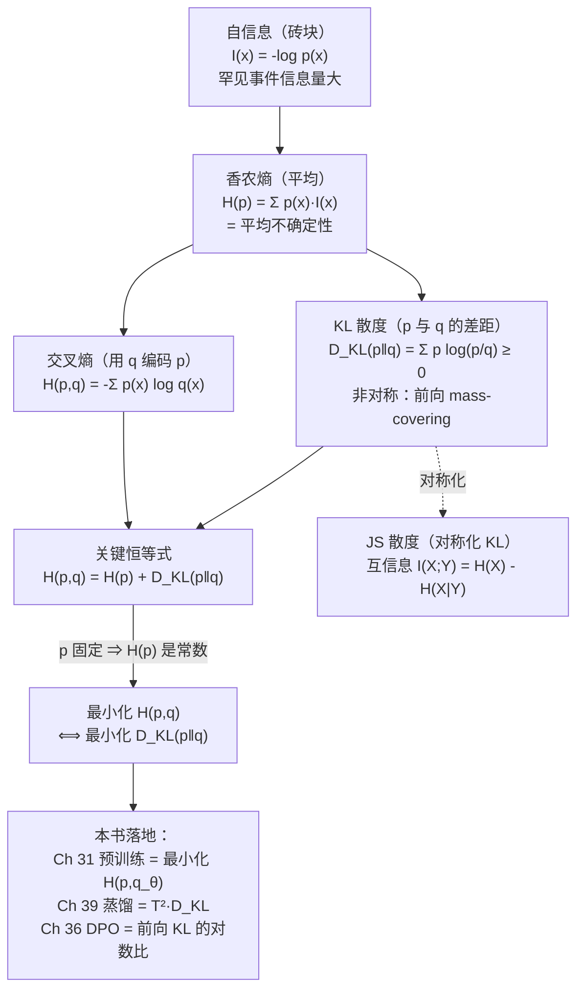

# 第 5 章 信息论

Ch 04 的「桥二」告诉我们一个硬结论：**类别分布下 MLE 的负对数似然就是交叉熵** $H(\mathbf{t},\hat{\boldsymbol\pi})=-\sum_k t_k\log\hat\pi_k$ ，预训练用它做损失（Ch 31）。但「交叉熵」这个名字从哪来？为什么它叫「熵」？除了交叉熵，Ch 39 知识蒸馏反复提到的 **KL 散度**又是什么，为什么蒸馏损失要乘一个 $T^2$ ？Ch 36 DPO 里那个 $\log\pi_\theta/\pi_{\text{ref}}$ 和本节有什么关系？

> **给定两个分布 $p$ 和 $q$ ，怎么度量它们「差多远」？为什么这个「距离」恰好能当损失用？**

本章是 Part I 数学基础的第五章，承接 Ch 04 结尾「熵—交叉熵—KL 散度框架」的预告。我们要补上最后一组把数学和训练 loss 缝起来的地砖——**自信息、香农熵、交叉熵、KL 散度、互信息**。读懂这一章，你就能在 Ch 31 看到「预训练为什么用交叉熵」、在 Ch 39 看到「蒸馏为什么要用温度缩放的 KL」、在 Ch 36 看到「DPO 为什么用对数比」时，从信息论的根上回答「为什么」。本章是 NTP 与交叉熵损失的**直接理论来源**。

## 5.1 学习目标

读完本章，你应该能够：

- 写出**自信息（self-information）** $I(x)=-\log p(x)$ ，并解释「越罕见的事件，信息量越大」的直觉；
- 写出**香农熵（Shannon entropy）** $H(p)=-\sum_x p(x)\log p(x)$ （离散）与**微分熵（differential entropy）**（连续），说明「熵 = 平均意外程度 = 不确定性」；
- 写出**交叉熵（cross-entropy）** $H(p,q)=-\sum_x p(x)\log q(x)$ ，并指出它衡量「用分布 $q$ 编码服从 $p$ 的事件，平均需要多少信息」；
- 默写 **KL 散度（Kullback–Leibler divergence）** $D_{KL}(p\Vertq)=\sum_x p(x)\log\frac{p(x)}{q(x)}$ ，并说出它**非负、当且仅当 $p=q$ 时为 0、且不对称**这三条性质；
- 独立推导关键恒等式 **$H(p,q)=H(p)+D_{KL}(p\Vertq)$**，并据此论证「当真实分布 $p$ 固定时，最小化交叉熵 $\Longleftrightarrow$ 最小化 KL 散度」；
- 区分 **nat（自然对数，ln）** 与 **bit（ $\log_2$ ）** 两种度量单位，并说出「困惑度（perplexity）」与熵的换算关系；
- 简述 **JS 散度（对称化的 KL）** 与 **互信息 $I(X;Y)=H(X)-H(X|Y)$** 的定义和用途。

本章承接 Ch 04 的概率语言，向上把「交叉熵」从一个公式提升为一组工具（熵—交叉熵—KL—互信息），并为 Ch 06《最优化基础》里「最小化 loss」的操作补上「loss 在信息论上意味着什么」这层含义。

## 5.2 直觉与动机

### 类比一：信息 = 意外程度

假设朋友告诉你两件事：

1. 「明天太阳会从东边升起。」——你会觉得这句话**毫无信息量**，因为它几乎必然发生（ $p\approx1$ ）。
2. 「明天会下陨石雨。」——你会立刻紧张起来，因为这件事极罕见（ $p\approx0$ ），一旦发生信息量巨大。

这说明一个朴素的道理：**一个事件越不可预测（概率越低），它发生时带来的「信息」就越多。** 把这个直觉写成公式，就是**自信息**：

$$
I(x) = -\log p(x)
$$

注意三件事：① $p$ 越小， $-\log p$ 越大，信息量越大；② $p=1$ （必然事件）时 $I=0$ ，毫无信息；③ 用对数让「独立事件的信息可加」——两个独立事件同时发生的概率 $p_1p_2$ ，取对数后变 $I_1+I_2$ ，信息量相加。

> **一句话记牢：信息量 = 意外程度 = $-\log p$ 。必然的事没意外，罕见的事最惊人。**

### 类比二：熵 = 平均意外程度

单独一个事件的信息量叫自信息。但如果问「**一个分布整体上有多不确定**」，就要把所有可能事件的「意外程度」按它们的发生概率加权平均——这就是**香农熵**：

$$
H(p) = \underbrace{\sum_x p(x)\cdot I(x)}_{\text{按概率加权平均}} = -\sum_x p(x)\log p(x)
$$

- 确定性分布（某个 $p(x)=1$ ，其余为 0）：没有任何意外， $H=0$ 。
- 均匀分布（所有 $x$ 等概率）：最「不可预测」，熵最大。

**熵 = 一个分布的「平均不可预测性」。** 这正是训练语言模型时关心的量——模型的预测分布如果熵很高（对下一个 token 很犹豫），说明它还没学明白；如果熵很低但预测错了，说明它过度自信（这是 overconfident / 灾难性错误的信号）。

### 几何图示：二元熵随概率变化 ⭐

最能直观感受熵的，是**二元分布**（Bernoulli）的熵曲线。设正面概率为 $p$ 、反面为 $1-p$ ，其熵为 $H(p)=-p\log_2 p-(1-p)\log_2(1-p)$ 。画出 $H$ 随 $p$ 变化的曲线：

```
   二元熵 H(p) = -p·log₂p - (1-p)·log₂(1-p)      单位: bit
        1.0 ┤                         ●  ← p=0.5：熵最大 = 1 bit
            │                      ╱       （最不确定，最"意外"）
            │                   ╱
            │                ╱
            │             ╱
        0.5 ┤          ╱
            │       ╱
            │    ╱
            │ ╱
        0.0 ┼────●───────────────●──────────→ p (正面概率)
            0   0.25            0.5         1.0
            必然反面            均匀         必然正面
            (p=0)              (p=0.5)       (p=1)
            熵=0               熵=1 bit      熵=0

   几何：熵曲线关于 p=0.5 对称，在 p=0.5 处取峰（最不可预测），
         在 p=0 与 p=1（必然事件）处为 0（完全确定）。
   含义：两端是"完全确定的硬币"——没有意外，没有信息；
         中间是"完全公平的硬币"——最不可预测，平均信息量最大。
```

这条抛物线状的曲线是本章的「视觉锚点」。记住它的形状，你就记住了熵的全部直觉：**越接近均匀，越不确定；越接近确定，熵越低。**

### 为什么 LLM 离不开信息论

先用一张表剧透，让你看清这些概念在后面出现在哪里：

| 概念 | 在 LLM 中的角色 | 本书首次出现 |
|------|----------------|-------------|
| 自信息 $I(x)$ | 单个 token 的 NLL，困惑度的砖块 | 本章、Ch 14、Ch 32 |
| 香农熵 $H(p)$ | 衡量预测分布的「犹豫程度」；熵正则、温度采样 | 本章、Ch 14 |
| 交叉熵 $H(p,q)$ | **预训练 & SFT 的损失函数**（NTP loss） | Ch 04、Ch 26、Ch 31 |
| KL 散度 $D_{KL}(p\Vertq)$ | **知识蒸馏损失**；DPO 隐含的 KL 正则 | 本章、Ch 36、Ch 39 |
| 关键恒等式 $H(p,q)=H(p)+D_{KL}$ | 解释「为什么最小化 CE = 最小化 KL」 | 本章 |
| JS 散度 / 互信息 | GAN 训练（JS）、特征选择、表征学习 | 本章（简述） |

下面这张图把本章的「概念地图」摆在同一个框架里——从最底层的「自信息」一路组装到最顶层的「互信息」，中间夹着香农熵、交叉熵、KL 散度与那条贯穿全章的关键恒等式：



这张图是本章的「骨架」：底座是自信息，向上平均成香农熵，再向两个方向延伸——交叉熵（换一个编码分布 $q$ ）和 KL 散度（两个分布的差距），二者由关键恒等式 $H(p,q)=H(p)+D_{KL}$ 缝合，最终导出「最小化 CE ⟺ 最小化 KL」这条贯穿预训练/蒸馏/对齐的核心结论。后面三节都在填这张图的细节。

带着这张表，我们正式进入数学定义。

## 5.3 数学定义

### 5.3.1 自信息

事件 $x$ 的**自信息（self-information / 信息量）**定义为：

$$
\boxed{ I(x) = -\log p(x) }
$$

对数的底决定单位：以 $e$ （自然对数 $\ln$ ）为底，单位是 **nat（奈特）**；以 $2$ 为底，单位是 **bit（比特）**；以 $10$ 为底较少用。换算关系 $\log_2 a = \log_2 e \cdot \ln a \approx 1.443 \ln a$ ，即 $1 \text{nat} \approx 1.443 \text{bit}$ 。

为什么用对数？三个工程/数学动机：① **可加性**：独立事件 $x,y$ 同时发生的概率 $p(x)p(y)$ ，信息量 $I(x,y)=-\log[p(x)p(y)]=I(x)+I(y)$ ，信息可加；② **平滑性**： $\log$ 是 $p$ 的平滑单调递减函数，便于求导（求梯度）；③ **与 MLE 的联系**：对数似然 $\ell(\theta)=\sum\log P(x_i\mid\theta)$ （Ch 04）里每一项就是「负自信息」，NLL $=-\ell=\sum I(x_i)$ 。

### 5.3.2 香农熵

分布 $p$ 的**香农熵（Shannon entropy）**是自信息的期望（平均信息量）：

$$
\boxed{ H(p) = -\sum_{x} p(x)\log p(x) = E_{x\sim p} \left[I(x)\right] }
$$

约定 $0\log 0=0$ （因为 $\lim_{p\to0^+}p\log p=0$ ，必然事件/不可能事件都不贡献熵）。 $H(p)\ge0$ ，且对 $K$ 类离散分布， $0\le H(p)\le\log K$ ，上界在均匀分布 $p(x)=1/K$ 时取得（最不可预测），下界在确定性分布时取得（完全可预测）。

对**连续**随机变量，把求和换成积分，得到**微分熵（differential entropy）**：

$$
h(p) = -\int_{-\infty}^{\infty} p(x)\log p(x) dx
$$

注意：微分熵**不**具备离散熵的非负性（可以为负），也不是「平均信息量」的严格类比（连续变量需要无限精度，严格说信息无穷大）。本章重点关注离散情形——因为语言模型的 token 是离散的，词表上的分布天然就是离散分布。高斯分布 $\mathcal{N}(\mu,\sigma^2)$ 的微分熵为 $\frac12\log(2\pi e\sigma^2)$ ，方差的「不确定性」含义在这里再次体现： $\sigma$ 越大，分布越散，熵越高。

### 5.3.3 交叉熵

若真实分布为 $p$ ，但我们用一个近似分布 $q$ 来编码/预测服从 $p$ 的事件，所需平均信息量叫**交叉熵（cross-entropy）**：

$$
\boxed{ H(p,q) = -\sum_{x} p(x)\log q(x) = E_{x\sim p} \left[-\log q(x)\right] }
$$

注意：自信息里是 $-\log p(x)$ （用真实分布编码自己），交叉熵里换成 $-\log q(x)$ （用近似分布 $q$ 来编码）。直觉：**「猜」得越准（ $q$ 在真实事件处越大）， $-\log q$ 越小，交叉熵越低。** 当 $q=p$ 时， $H(p,p)=H(p)$ （退化为自熵）。

这正是 Ch 04「桥二」里出现的那个 $H(\mathbf{t},\hat{\boldsymbol\pi})$ 的严格定义：真实标签 $\mathbf{t}$ 是 one-hot（一种特殊的 $p$ ），模型预测 $\hat{\boldsymbol\pi}$ 是 $q$ ，交叉熵 $H(\mathbf{t},\hat{\boldsymbol\pi})=-\sum_k t_k\log\hat\pi_k$ 衡量「模型把概率质量给了错误类别时，平均要多付多少信息代价」。

### 5.3.4 KL 散度

度量两个分布「差多远」的核心工具是 **KL 散度（Kullback–Leibler divergence，相对熵）**：

$$
\boxed{ D_{KL}(p \Vert q) = \sum_{x} p(x)\log\frac{p(x)}{q(x)} = E_{x\sim p} \left[\log\frac{p(x)}{q(x)}\right] }
$$

KL 散度有三条关键性质（5.4 节会证明非负性）：

1. **非负性**： $D_{KL}(p\Vertq)\ge0$ ，当且仅当 $p=q$ （处处相等）时为 0。
2. **不对称性**： $D_{KL}(p\Vertq)\ne D_{KL}(q\Vertp)$ （一般情况），所以它**不是真正的「距离」**，只是「散度」（divergence）。 $D_{KL}(p\Vertq)$ 叫**前向 KL**（forward KL，以 $p$ 为基准）， $D_{KL}(q\Vertp)$ 叫**反向 KL**（reverse KL），二者侧重不同。
3. **期望下的对数比**：它是 $\log(p/q)$ 在 $p$ 下的期望，衡量「 $q$ 把 $p$ 高概率区域低估了多少」。

不对称性的直觉很重要，后面对齐算法会用到：

- **前向 KL** $D_{KL}(p\Vertq)$ ：在 $p$ 高概率处， $q$ 必须也高概率（否则 $p(x)\log(p/q)\to\infty$ ）。行为是「**mass-covering / mean-seeking**」—— $q$ 倾向覆盖 $p$ 的所有峰（怕漏掉 $p$ 的高概率处），导致 $q$ 偏宽。
- **反向 KL** $D_{KL}(q\Vertp)$ ：在 $q$ 高概率处， $p$ 必须也高概率。行为是「**mode-seeking**」—— $q$ 倾向锁住 $p$ 的某一个峰（怕把概率放到 $p$ 低概率处），导致 $q$ 偏窄。

### 5.3.5 关键恒等式：交叉熵 = 熵 + KL 散度 ⭐

把交叉熵和 KL 散度联系起来，会得到本章最重要的恒等式。展开 $D_{KL}(p\Vertq)$ ：

$$
D_{KL}(p\Vertq) = \sum_x p(x)\log\frac{p(x)}{q(x)} = \underbrace{\left[-\sum_x p(x)\log q(x)\right]}_{H(p,q)} - \underbrace{\left[-\sum_x p(x)\log p(x)\right]}_{H(p)}
$$

移项即得：

$$
\boxed{ H(p,q) = H(p) + D_{KL}(p\Vertq) }
$$

读法：**用 $q$ 编码 $p$ 的平均信息代价，等于「 $p$ 自身的不确定性」加上「 $q$ 相对 $p$ 多出来的那部分代价（KL 散度）」。** 换句话说，交叉熵 = 不可避免的底噪（熵）+ 可优化的差距（KL）。这个分解是 5.4 节推导「最小化 CE ⟺ 最小化 KL」的基石。

### 5.3.6 JS 散度与互信息（简述）

**JS 散度（Jensen–Shannon divergence）** 是 KL 散度的对称化版本，定义：

$$
D_{JS}(p\Vertq) = \frac12 D_{KL} \left(p \Big\Vert \frac{p+q}{2}\right) + \frac12 D_{KL} \left(q \Big\Vert \frac{p+q}{2}\right)
$$

它有三大优点：① **对称** $D_{JS}(p\Vertq)=D_{JS}(q\Vertp)$ ；② **有界** $0\le D_{JS}\le\log 2$ （用自然对数）；③ **有定义**（即使 $q$ 在某处为 0，中间分布 $(p+q)/2$ 仍 $>0$ ，不会出现 KL 那样的 $\infty$ ）。它的平方根 $\sqrt{D_{JS}}$ 是一个真正的度量（满足三角不等数）。GAN 的原始目标函数里的「 $-\log D$ 」就与 JS 散度密切相关，是 GAN 收敛性分析的核心量。

**互信息（mutual information）** 衡量两个随机变量「共享多少信息」：

$$
\boxed{ I(X;Y) = H(X) - H(X\mid Y) = D_{KL} \left(p(x,y) \Vert p(x)p(y)\right) }
$$

读法：「知道 $Y$ 之后， $X$ 的不确定性减少多少」。 $I(X;Y)\ge0$ ，当且仅当 $X,Y$ 独立时为 0。互信息是 KL 散度的特例（联合分布 vs 边际乘积），也是特征选择、表征学习（如对比学习的 InfoNCE 损失）、互信息最大化预训练的理论基础。本章只点到为止，后续章节用到时再展开。

## 5.4 推导与几何

本节做两件事：① 推导本章最关键的结论「最小化交叉熵 $\Longleftrightarrow$ 最小化 KL 散度」；② 解释 nat 与 bit 的区别，以及困惑度（perplexity）如何与熵挂钩。

### 5.4.1 推导：最小化交叉熵 ⟺ 最小化 KL（当 $p$ 固定）⭐⭐

**场景**：这是本章最值钱的推导，直接通向 Ch 31 预训练损失。设有真实（数据）分布 $p$ 和模型分布 $q_\theta$ （参数 $\theta$ ），训练时 $p$ 是固定的（由数据决定）， $\theta$ 是要调的。

**推导**：由 5.3 节恒等式 $H(p,q_\theta)=H(p)+D_{KL}(p\Vertq_\theta)$ ，对 $\theta$ 求最小化目标：

$$
\arg\min_\theta H(p,q_\theta) = \arg\min_\theta \big[H(p) + D_{KL}(p\Vertq_\theta)\big]
$$

关键一步： $p$ 是固定的，**$H(p)=-\sum_x p(x)\log p(x)$ 不含 $\theta$ ，是一个与 $\theta$ 无关的常数**。加一个常数不改变最小化的解：

$$
\boxed{ \arg\min_\theta H(p,q_\theta)  \equiv  \arg\min_\theta D_{KL}(p\Vertq_\theta) }
$$

**结论（请刻进脑子）**：

> **当真实分布 $p$ 固定时，最小化交叉熵 $H(p,q_\theta)$ 与最小化 KL 散度 $D_{KL}(p\Vertq_\theta)$ 等价，最优 $\theta$ 完全相同。** 因为 $H(p,q)=H(p)+D_{KL}$ ，而 $H(p)$ 只是常数平移，不影响极小值点。

这正是为什么预训练可以直接用交叉熵当 loss——它的极小化方向和「让模型分布 $q_\theta$ 逼近数据分布 $p$ 」完全一致。 $H(p)$ 那部分是数据的「内在难度」，无法优化；我们只能优化 $D_{KL}$ 这部分「可消除的差距」。

### 5.4.2 推导：KL 散度的非负性（Gibbs 不等式）⭐

为完整起见，证明 $D_{KL}(p\Vertq)\ge0$ 。利用 $-\log$ 是凸函数及 Jensen 不等式：

$$
-D_{KL}(p\Vertq) = \sum_x p(x)\log\frac{q(x)}{p(x)} = E_{x\sim p} \left[\log\frac{q(x)}{p(x)}\right]  \le  \log E_{x\sim p} \left[\frac{q(x)}{p(x)}\right] = \log \left(\sum_x q(x)\right) = \log 1 = 0
$$

（最后一步用 $q$ 是合法概率分布， $\sum q=1$ 。）所以 $-D_{KL}\le0$ ，即 $D_{KL}\ge0$ ，等号当且仅当 $\frac{q(x)}{p(x)}$ 处处为常数（结合 $\sum p=\sum q=1$ 推出常数 $=1$ ，即 $p=q$ ）。

**几何含义**： $D_{KL}\ge0$ 与 $H(p,q)\ge H(p)$ 互为表里——用任何 $q\ne p$ 编码 $p$ ，平均代价都不小于用 $p$ 自己编码（ $H(p)$ 是最优编码代价，这是香农信源编码定理的内容）。

### 5.4.3 nat 与 bit：为什么自然对数是默认

信息论教材常用 $\log_2$ （单位 bit），因为通信与编码天然面向二进制。但**机器学习几乎一律用自然对数 $\ln$ （单位 nat）**，原因有二：

1. **求导方便**：指数族分布（高斯、softmax）的概率密度里本来就有 $e$ ，取 $\ln$ 后形式最简洁，导数不含多余的 $\log 2$ 系数。
2. **与梯度/损失对齐**：PyTorch 的 `F.cross_entropy`、`F.kl_div` 内部全部用 $\ln$ ，梯度链路里没有 $\log_2$ 的系数，数值与链式法则自然吻合。

换算关系（牢记）：

$$
\log_2 a = \frac{\ln a}{\ln 2}, \qquad 1 \text{nat} = \frac{1}{\ln 2} \text{bit} \approx 1.443 \text{bit}
$$

所以「以 $e$ 为底算出的交叉熵」乘以 $1/\ln 2$ 就得到「以 2 为底的 bit 形式」。

### 5.4.4 困惑度：熵的可读化

训练监控里常出现**困惑度（perplexity, PPL）**，它把熵/交叉熵换算成「等效选择数」，更直观：

$$
\mathrm{PPL} = \exp \big(H(p,q)\big) = 2^{H_2(p,q)}
$$

（ $H$ 用 nat 时取 $\exp$ ， $H_2$ 用 bit 时取 $2^x$ 。）直觉：困惑度 = 「模型在每个位置上等效于在多少个候选之间均匀犹豫」。例如 PPL$=10$ 表示模型在每个 token 位置「像在 10 个等概率候选里猜」。PPL 越低越好：PPL$=1$ 意味着模型完全确定（ $H=0$ ）。

对单步预测，若模型给真实 token 的概率是 $\hat\pi_y$ ，则该步困惑度 $\mathrm{PPL}=\hat\pi_y^{-1}$ （这是 Ch 04 思考题 2 用过的换算）。整个序列的 PPL 是各 token NLL 的指数平均。Ch 14（解码策略）和 Ch 32（训练监控）会反复用到这个量。

```
   交叉熵 H(p,q) 与困惑度 PPL = exp(H) 的对应（nat）
        PPL
        ↑
       16 ┤                          ╱  ← H 大 → PPL 指数增长
          │                       ╱      （模型"超犹豫"，等效候选多）
          │                    ╱
        4 ┤                 ╱
          │              ╱
          │          ╱
        1 ┤───────●                      ← H=0 → PPL=1（完全确定）
          └───────────────────────→ H(p,q)  (nat)
          0     0.5    1.0    1.5    2.0
          
   几何：PPL 是 H 的指数函数，故对 H 的微小改善在 PPL 上放大显示，
         这就是训练曲线常用 PPL 监控的原因（变化更醒目）。
```

## 5.5 与本项目联系

理论就绪，现在把它和 zllm 钉死。本节三个钩子全部来自本章的核心工具（交叉熵、KL 散度、对数比），等读到对应章节时会恍然大悟。

### 钩子一：预训练 = 最小化模型分布与数据经验分布的交叉熵（Ch 31）⭐⭐

这是本章最重要、也最直接的钩子。zllm 预训练做的是**下一个 token 预测（Next-Token Prediction, NTP）**：给定上文，在 6400 维词表上预测下一个 token。设数据的真实（经验）分布为 $p$ （语料里下一个 token 的真实概率），模型分布为 $q_\theta=\mathrm{softmax}(z_\theta)$ 。训练循环里最小化的损失，从信息论根上就是：

$$
\mathcal{L}_{\text{CE}} = H(p, q_\theta) = -\sum_{x} p(x)\log q_\theta(x)  \equiv  \underbrace{H(p)}_{\text{常数}} + \underbrace{D_{KL}(p\Vertq_\theta)}_{\text{真正在优化的差距}}
$$

结合 5.4 节的等价推导：

> **预训练就是在最小化模型分布 $q_\theta$ 与数据经验分布 $p$ 的交叉熵；因为 $p$ 固定，这等价于最小化 $D_{KL}(p\Vertq_\theta)$ ——即让模型分布尽可能逼近数据分布。**

Ch 26（CausalLM 头 + Loss）和 Ch 31（预训练 NTP 与训练循环）里你会看到 `F.cross_entropy(logits, targets)` 这一行——它的信息论身份就是交叉熵 $H(p,q_\theta)$ ，它的优化目标就是 KL 散度 $D_{KL}(p\Vertq_\theta)$ 。本章把「为什么是交叉熵」回答到了底：因为它在信息论上等价于「让模型逼近数据」，而这正是「学习」的数学定义。

### 钩子二：知识蒸馏 = 温度缩放后的 KL（Ch 39， $T^2\cdot D_{KL}$ ）⭐⭐

**知识蒸馏（knowledge distillation）** 让一个小「学生」模型模仿一个大「教师」模型。关键技巧是**温度缩放（temperature scaling）**：把 logits $\mathbf{z}$ 除以温度 $T>1$ 再 softmax，得到更「软」的概率分布：

$$
q^{(T)}_k = \frac{\exp(z_k/T)}{\sum_j \exp(z_j/T)}
$$

温度 $T$ 越高，分布越软（越接近均匀），暗类（dark classes，logits 略低的类）的相对关系被放大——这些「软标签」携带了教师学到的类间相似性，是硬 one-hot 标签丢失的信息。蒸馏损失是**教师软分布与学生软分布之间的 KL 散度**：

$$
\mathcal{L}_{\text{distill}} = T^2 \cdot D_{KL} \left(q^{(T)}_{\text{teacher}} \Big\Vert q^{(T)}_{\text{student}}\right)
$$

**为什么要乘 $T^2$ ？——梯度尺度补偿。** 当 logits 除以 $T$ 进入 softmax 时，softmax 输出对 logits 的梯度会按 $1/T$ 缩放（因为 $\partial \mathrm{softmax}(z/T)/\partial z \propto 1/T$ ），于是软标签 KL 项对 logits 的梯度整体被压低 $\sim 1/T^2$ 。乘上 $T^2$ 把这个缩放补回来，使**软标签 KL 项的梯度量级与硬标签交叉熵项（ $T=1$ ）保持一致**。这样调整温度 $T$ （控制「软度」）时，不会意外地拨大或拨小梯度——蒸馏里温度和梯度量级被解耦了。

完整蒸馏损失通常是硬标签 CE 与软标签 KL 的加权组合：

$$
\mathcal{L} = (1-\alpha) \underbrace{H(p, q^{(1)}_{\text{student}})}_{\text{硬标签 CE}} + \alpha \underbrace{T^2 D_{KL} \left(q^{(T)}_{\text{teacher}} \big\Vert q^{(T)}_{\text{student}}\right)}_{\text{软标签 KL（梯度补偿）}}
$$

Ch 39 会把这套公式落到 zllm 的蒸馏训练器代码里。本章让你先理解：**蒸馏损失里的 KL 不是随便选的，它是「让学生分布逼近教师分布」的数学定义； $T^2$ 不是魔数，它是梯度尺度补偿的必然结果。**

### 钩子三：KL 的非对称性 → DPO 的对数比（Ch 36）⭐

本章强调过 KL 散度**不对称**： $D_{KL}(\pi_\theta\Vert\pi_{\text{ref}})\ne D_{KL}(\pi_{\text{ref}}\Vert\pi_\theta)$ 。这个不对称性在**对齐算法**里至关重要。

**RLHF / DPO 的核心约束**是「让策略 $\pi_\theta$ 优化奖励，但不要离参考策略 $\pi_{\text{ref}}$ （通常是 SFT 后的模型）太远」——这个「不要太远」在数学上就是用 **前向 KL** $D_{KL}(\pi_\theta\Vert\pi_{\text{ref}})$ 来度量的。把它写开：

$$
D_{KL}(\pi_\theta\Vert\pi_{\text{ref}}) = E_{y\sim\pi_\theta} \left[\log\frac{\pi_\theta(y)}{\pi_{\text{ref}}(y)}\right]
$$

里面的 **$\log\frac{\pi_\theta(y)}{\pi_{\text{ref}}(y)}$ 就是 DPO 反复用的那个对数比**——它是 KL 散度的被积函数（逐项贡献）。DPO（Ch 36）把 RLHF 的「奖励最大化 + KL 约束」问题，通过这个对数比，转化为一个无需强化学习的纯监督损失，里面同时出现 $\log\pi_\theta/\pi_{\text{ref}}$ 的偏好项与拒绝项之差。

为什么用**前向** KL（ $\pi_\theta\Vert\pi_{\text{ref}}$ ）而非反向？因为前向 KL 是 **mass-covering**：它逼策略 $\pi_\theta$ 不要漏掉 $\pi_{\text{ref}}$ 的高概率区域（否则 $\log(\pi_\theta/\pi_{\text{ref}})$ 在那些区域的惩罚结构会失控），防止对齐后模型「塌缩」到某个狭窄模式、丢掉 SFT 学到的多样性。这正是 5.3 节那个「前向 KL 偏 mass-covering、反向 KL 偏 mode-seeking」结论在工程上的落地。本章把「KL 为什么不对称、不对称对算法意味着什么」讲透了，Ch 36 就能专心讲 DPO 的推导而不必回头补这些底子。

一句话总结这三个钩子：**预训练用交叉熵（= 让 $q_\theta$ 逼近 $p$ ，等价最小化 KL）；蒸馏用温度缩放的 KL（ $T^2$ 是梯度补偿）；对齐用前向 KL 的对数比（mass-covering 防塌缩）。** 信息论的核心三件套——熵、交叉熵、KL 散度——就这样贯穿了从预训练、蒸馏到对齐的整条训练链路。

## 5.6 本章小结

让我们把这一章浓缩成几条可以随身携带的结论：

1. **自信息**： $I(x)=-\log p(x)$ ，事件越罕见信息量越大；必然事件信息为 0。对数底定单位： $\ln$ →nat， $\log_2$ →bit， $1 \text{nat}\approx1.443 \text{bit}$ 。
2. **香农熵**： $H(p)=-\sum_x p(x)\log p(x)$ ，自信息的期望，衡量分布的「平均不确定性」。均匀分布熵最大，确定性分布熵为 0。连续情形对应微分熵（可为负，需谨慎）。
3. **交叉熵**： $H(p,q)=-\sum_x p(x)\log q(x)$ ，用 $q$ 编码服从 $p$ 的事件的平均代价。 $q=p$ 时退化为 $H(p)$ 。**NTP / 分类损失就是交叉熵。**
4. **KL 散度**： $D_{KL}(p\Vertq)=\sum_x p(x)\log\frac{p(x)}{q(x)}\ge0$ （ $p=q$ 时为 0），**非对称**，前向 KL 偏 mass-covering，反向 KL 偏 mode-seeking。
5. **关键恒等式**： $H(p,q)=H(p)+D_{KL}(p\Vertq)$ 。当 $p$ 固定时，**最小化交叉熵 $\Longleftrightarrow$ 最小化 KL 散度**——这是预训练用交叉熵当 loss 的信息论根基。
6. **JS 散度**（对称化、有界的 KL）与**互信息** $I(X;Y)=H(X)-H(X\mid Y)$ （变量间共享的信息）作为补充工具。
7. **困惑度** $\mathrm{PPL}=\exp(H)$ 把熵换算成「等效选择数」，是训练监控的常用量。

> **一句话记牢：交叉熵 = 熵 + KL；最小化交叉熵就是最小化 KL（ $p$ 固定）；预训练用 CE，蒸馏用 $T^2 \cdot$KL，对齐用前向 KL 的对数比。**

> **前方预告。** 至此，Part I 的概率/统计/信息论三件套（Ch 03–05）已经齐备：我们有了「分布」「似然/MLE/MAP」「熵/交叉熵/KL」三组工具，能从根上回答「为什么预训练用交叉熵、为什么蒸馏用 KL」。但还有一件最关键的事没讲——**拿到一个损失函数之后，到底怎么一步步把它最小化？** 梯度下降为什么能找到极小值？学习率怎么定？为什么 Adam 比 SGD 更省心？下一章（Ch 06《最优化基础》）将离开「定义损失」的领地，进入「优化损失」的战场：从梯度下降、动量到 Adam，从学习率调度到权重衰减，把「定义好 loss」和「真正把它降下去」之间的最后一段路铺通。信息论告诉我们 loss 是什么，最优化告诉我们怎么降它。

### 思考题

> 写答案前，建议先想「这题用哪个公式（自信息 / 熵 / 交叉熵 / KL / 恒等式）」，再动笔推导。

1. **推导题**：利用 5.4 节的恒等式 $H(p,q)=H(p)+D_{KL}(p\Vertq)$ 和 KL 的非负性，证明 **$H(p,q)\ge H(p)$**（即「用任何 $q$ 编码 $p$ ，平均代价不小于用 $p$ 自己编码」）。并据此解释：当模型预测分布 $q_\theta$ 恰好等于真实分布 $p$ 时，为什么交叉熵损失恰好降到 $H(p)$ 这个「不可消除的下界」？这个下界对应训练监控里的什么现象？（提示：联系「数据本身的难度」与「loss 不可能降到 0」。）
2. **计算题**：设真实分布 $p=(0.5, 0.3, 0.2)$ （三类），模型预测分布 $q=(0.6, 0.3, 0.1)$ 。请计算：(a) 自信息 $I(x)$ 对每个类（nat）；(b) 交叉熵 $H(p,q)$ （nat）；(c) KL 散度 $D_{KL}(p\Vertq)$ （nat）；(d) 验证 $H(p,q)=H(p)+D_{KL}(p\Vertq)$ 是否成立。若改用 $\log_2$ ，把以上结果换算成 bit 形式。（提示： $H(p)\approx1.030$ nat，可作验算锚点。）
3. **概念题**：本章指出 KL 散度不对称，且前向 KL $D_{KL}(p\Vertq)$ 偏 mass-covering、反向 KL $D_{KL}(q\Vertp)$ 偏 mode-seeking。请回答：(a) RLHF/DPO 用前向 KL $D_{KL}(\pi_\theta\Vert\pi_{\text{ref}})$ 正则策略，为什么选前向而非反向？用 mass-covering 的含义解释「防止对齐后模型塌缩」。(b) 知识蒸馏里用 $T^2\cdot D_{KL}$ （Ch 39），为什么温度 $T>1$ 能让分布变「软」、暴露暗类信息？从 $\mathrm{softmax}(z/T)$ 的最大值与次大值的差距随 $T$ 变化来分析。

---

读完本章，你已经能用「自信息 / 香农熵 / 交叉熵 / KL 散度 / 互信息」这套工具，从信息论的根上回答「为什么预训练用交叉熵、为什么蒸馏用温度缩放的 KL、为什么对齐用前向 KL 的对数比」。下一章（Ch 06《最优化基础》）我们将离开「定义 loss」的领地，进入「优化 loss」的战场：梯度下降、动量、Adam、学习率调度——把信息论告诉我们的「loss 是什么」翻译成「怎么真正把它降下去」。
