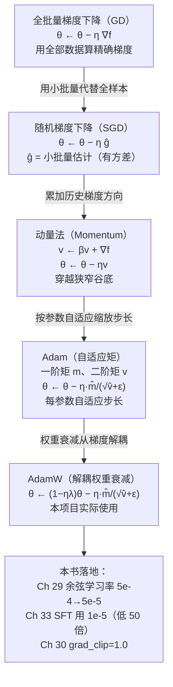

# 第 6 章 最优化基础

Ch 05 信息论告诉我们一个干净的结论：**预训练就是在最小化交叉熵** $H(p,q_\theta)$ ，让模型分布 $q_\theta$ 逼近数据分布 $p$ ——这等价于最小化 KL 散度。但「最小化」三个字怎么落地？ $q_\theta$ 是一个由数亿参数 $\theta$ 决定的分布，这些参数要怎么动，才能让 loss 一点点降下去？为什么不能一步到位？为什么有时候 loss 越训越大？为什么预训练用 AdamW 而不是最朴素的梯度下降？为什么 SFT 的学习率要比预训练低 50 倍？

> **给定一个损失函数 $\mathcal{L}(\theta)$ 和它的梯度 $\nabla\mathcal{L}(\theta)$ ，怎么一步步调整参数 $\theta$ ，让 loss 尽可能降下去？**

本章是 Part I 数学基础的第六章，承接 Ch 05 结尾「最优化告诉我们怎么降 loss」的预告。我们要补上「定义 loss」与「真正降 loss」之间的最后一段理论——**梯度、梯度下降、随机梯度下降、动量、Adam/AdamW**，以及学习率与凸性这两件决定训练成败的命门。读懂这一章，你就能在 Ch 29 看到「余弦学习率从 $5\times10^{-4}$ 退火到 $5\times10^{-5}$ 」、在 Ch 33 看到「SFT 用 $1\times10^{-5}$ 」、在 Ch 30 看到 `grad_clip=1.0` 时，从最优化的根上回答「为什么这么设」。本章是 Part V 训练循环的**直接理论来源**。

## 6.1 学习目标

读完本章，你应该能够：

- 写出**梯度（gradient）** $\nabla f(\theta)$ 的定义，并说出「梯度是一个向量，指向函数值**最快上升**的方向，负梯度指向最快下降方向」；
- 默写**梯度下降（Gradient Descent, GD）**更新式 $\theta_{t+1}=\theta_t-\eta\nabla f(\theta_t)$ ，解释学习率 $\eta$ 的角色，并说明 $\eta$ 过大/过小的几何后果（发散 vs 慢收敛）；
- 用**一阶泰勒展开**独立推导「负梯度是约束步长下的最速下降方向」；
- 写出**随机梯度下降（Stochastic Gradient Descent, SGD）**的小批量梯度估计 $\hat{\mathbf{g}}=\frac1{|B|}\sum_{i\in B}\nabla\ell_i$ ，并指出小批量估计引入**方差**是 SGD 区别于全批量 GD 的关键；
- 默写**动量法（momentum）** $v_t=\beta v_{t-1}+\nabla f$ ， $\theta_{t+1}=\theta_t-\eta v_t$ ，并用「穿越狭窄谷底」的几何图景解释动量为何能抑制横向往复振荡、加速沿谷底方向的收敛；
- 写出 **Adam** 的一阶矩 $m_t$ 、二阶矩 $v_t$ 、偏差校正 $\hat m_t,\hat v_t$ 与更新式 $\theta_{t+1}=\theta_t-\eta \hat m_t/(\sqrt{\hat v_t}+\varepsilon)$ ，解释「每参数自适应步长」的原理；
- 简述 **AdamW** 相对 Adam 的关键改进：**权重衰减解耦（decoupled weight decay）**；
- 区分**凸优化**（全局最优）与**非凸优化**（局部最优、鞍点），并说明神经网络是非凸的、但实践中 SGD 类方法仍能找到泛化良好的解。

本章承接 Ch 04 的「最小化 loss」目标与 Ch 05 的「loss = 交叉熵」结论，把「怎么最小化」从直觉提升为一套可分析的工具链，并为 Ch 07《微积分与链式法则》里「梯度怎么算出来」铺好动机。

## 6.2 直觉与动机

### 类比一：下山与最陡下降

假设你被蒙上眼睛扔到一座山上，目标是走到海拔最低的山谷。你看不见全局地形，只能感受到脚下这块地的**坡度**——朝哪个方向走一步，海拔升得最快；朝哪个方向走，海拔降得最快。最朴素、也最自然的策略是：**每一步都朝「脚下最陡的下坡方向」迈一小步**。重复足够多次，你大概率会走到某个山谷（虽然不一定是全世界最深的那一个）。

这个类比把最优化的核心要素全部映射出来：

| 下山类比 | 最优化术语 |
|---------|-----------|
| 你的位置（经纬度） | 参数 $\theta$ （一个高维向量） |
| 海拔 | 损失函数 $f(\theta)$ （loss 曲面 / loss landscape） |
| 脚下坡度「最陡上升方向」 | 梯度 $\nabla f(\theta)$ |
| 「最陡下坡方向」 | 负梯度 $-\nabla f(\theta)$ |
| 每一步迈多远 | 学习率 $\eta$ （learning rate） |
| 「走一步、看坡、再走」 | 迭代 $\theta_{t+1}=\theta_t-\eta\nabla f(\theta_t)$ |
| 你可能停在的某个山谷 | 局部极小值（local minimum） |

> **一句话记牢：梯度指向「最快上升」，所以我们要朝**负**梯度方向走——这就是「梯度下降」的全部直觉。**

注意一个反直觉的点：梯度指向**上升**方向，而我们要**下降**，所以更新式里是**减号**： $\theta_{t+1}=\theta_t-\eta\nabla f$ 。这个减号是「下降」二字的来源。

### 类比二：碗 vs 起伏的山地——凸与非凸

下山类比里藏着两种截然不同的地形：

- **凸地形（碗）**：整座山像一个碗，只有一个谷底。无论你从哪里出发、怎么走，最终都会走到同一个最低点——**全局最优（global minimum）**。这是凸优化（convex optimization）的世界，理论保证非常强。
- **非凸地形（连绵起伏的山）**：有很多个山谷、鞍部、平台。你走到的「山谷」可能只是附近最低的**局部极小值（local minimum）**，未必是全局最低；还可能卡在**鞍点（saddle point）**——某个方向上是谷底、另一方向上是山脊。

**神经网络是非凸的。** 一个有几十亿参数的网络，loss 曲面上有天文数字的局部极小值和鞍点。好消息是：在**过参数化（overparameterized）**的设定下（参数远多于数据点），绝大多数局部极小值的 loss 都很低、且泛化良好；真正的麻烦往往不是局部极小，而是**鞍点和平坦区**让优化变慢。这也是为什么我们后面要引入动量和 Adam——它们的一大作用就是帮优化器穿越/逃离这些「难走的区域」。

### 概念地图：从 GD 到 Adam ⭐

下面这张 Mermaid 图把本章的工具链摆在同一个框架里——从最朴素的「全批量梯度下降」出发，逐步加料（随机化 → 动量 → 自适应），最终通向 zllm 实际使用的 AdamW：



这张图是本章的「骨架」：每一站都解决前一站的某个痛点——SGD 解决「全批量梯度太贵」、动量解决「SGD 在狭窄谷底来回振荡」、Adam 解决「不同参数应该用不同步长」、AdamW 解决「权重衰减与自适应学习率耦合后变形」。后面三节都在填这张图的细节。

带着这张图，我们正式进入数学定义。

## 6.3 数学定义

### 6.3.1 梯度

设 $f:\mathbb{R}^d\to\mathbb{R}$ 是一个可微的标量函数（在本书里就是损失 $\mathcal{L}$ ），参数 $\theta=(\theta_1,\dots,\theta_d)\in\mathbb{R}^d$ 。**梯度（gradient）** $\nabla f(\theta)$ 是一个 $d$ 维**向量**，由 $f$ 对每个分量的偏导数组成：

$$
\boxed{ \nabla f(\theta) = \left(\frac{\partial f}{\partial\theta_1},\ \frac{\partial f}{\partial\theta_2},\ \dots,\ \frac{\partial f}{\partial\theta_d}\right) }
$$

梯度有三个要刻进脑子的性质：

1. **它是向量，不是标量**：与 $\theta$ 同维，每个分量告诉一个参数「往哪边动会让 $f$ 升高」。
2. **方向 = 最快上升方向**：在 $\theta$ 的一个小邻域里，沿 $\nabla f(\theta)$ 方向走单位长度， $f$ 增加得最多（6.4 节用泰勒展开证明）。
3. **模长 = 最陡坡度**： $\Vert\nabla f(\theta)\Vert$ 越大，局部越「陡」，越接近极值点时梯度越接近零（在极值点处 $\nabla f=0$ ）。

> 负梯度 $-\nabla f(\theta)$ 指向**最快下降**方向——这就是梯度下降要走的方向。

### 6.3.2 梯度下降

给定学习率 $\eta>0$ （learning rate，也叫步长 step size），**梯度下降（Gradient Descent, GD）**的更新式为：

$$
\boxed{ \theta_{t+1} = \theta_t - \eta \nabla f(\theta_t) }
$$

读法：「站在 $\theta_t$ ，朝**负梯度方向**（最快下降）迈一步 $\eta$ 」。重复这一步，序列 $\{\theta_t\}$ 在满足一定条件（如 $f$ 凸、 $\eta$ 足够小）时会收敛到极小值点。

这里要分清三种「梯度下降」的叫法（按每步用多少数据算梯度）：

| 名称 | 每步用的数据 | 梯度估计 | 特点 |
|------|------------|---------|------|
| **批量梯度下降（Batch GD）** | 全部 $N$ 个样本 | $\nabla f=\frac1N\sum_{i=1}^N\nabla\ell_i$ （精确） | 准但慢；一步要走遍整个数据集 |
| **随机梯度下降（SGD，严格义）** | 1 个样本 | $\nabla\ell_i$ （噪声大） | 快但抖；每步方差极大 |
| **小批量 SGD（minibatch SGD）** | $|B|$ 个样本（如 32/64） | $\hat{\mathbf{g}}=\frac1{|B|}\sum_{i\in B}\nabla\ell_i$ | **工程默认**，精度与速度的折中 |

> 工程语境里说「SGD」几乎总是指**小批量 SGD**——下面我们也沿用这个约定。

### 6.3.3 随机梯度下降（SGD）

设总样本集为 $\{x_1,\dots,x_N\}$ ，每个样本的损失为 $\ell_i(\theta)=\ell(\theta;x_i)$ ，总损失 $\mathcal{L}(\theta)=\frac1N\sum_i\ell_i$ 。全批量 GD 每步要算 $\frac1N\sum_{i=1}^N\nabla\ell_i$ ，当 $N$ 达到百万、千万级（预训练语料）时，这一步本身就贵得不可接受。

**SGD 的核心思想：用一个小批量 $B\subset\{1,\dots,N\}$ （ $|B|\ll N$ ）的梯度平均值，作为全批量梯度的估计**：

$$
\boxed{ \hat{\mathbf{g}}_t = \frac{1}{|B_t|}\sum_{i\in B_t}\nabla\ell_i(\theta_t),\qquad \theta_{t+1}=\theta_t-\eta \hat{\mathbf{g}}_t }
$$

只要 $B_t$ 是随机抽的， $\hat{\mathbf{g}}_t$ 就是全批量梯度 $\nabla\mathcal{L}(\theta_t)$ 的**无偏估计**（ $`E[\hat{\mathbf{g}}_t]=\nabla\mathcal{L}(\theta_t)`$ ）。但它**有方差**：不同小批量算出的 $\hat{\mathbf{g}}_t$ 各不相同，会在真值附近抖动。这个方差是把双刃剑（6.4 节展开）：它让 SGD 不易卡死在鞍点（噪声能「踢」出去），但也让收敛轨迹抖动、需要调 $\eta$ 和动量来稳住。

### 6.3.4 动量法（Momentum）

SGD 在一类地形上特别难受：**狭窄谷底（narrow ravine）**——一个方向陡、另一个方向平缓的地形（loss 曲面在神经网络里极其常见）。SGD 在陡的方向上反复跨越谷壁来回振荡，而沿谷底方向的真正进展却被这些振荡拖慢。**动量法（momentum）**通过**累加历史梯度方向**来抑制这种横向往复：

$$
\boxed{ v_t = \beta v_{t-1} + \nabla f(\theta_t),\qquad \theta_{t+1}=\theta_t-\eta v_t }
$$

其中 $\beta\in[0,1)$ 是动量系数（常取 $0.9$ ）， $v_t$ 叫「速度」（velocity）。直觉： $v_t$ 是历史梯度的**指数加权滑动平均**。在沿谷底方向上，梯度方向稳定（一直指向谷底深处）， $v_t$ 不断累加、越走越快；在跨越谷壁方向上，梯度方向每步**正负翻转**（一会儿指向左壁、一会儿指向右壁），平均下来相互抵消，振荡被压制。一句话：**动量让「一致的方向」叠加加速、让「来回振荡的方向」相互抵消**。（PyTorch 的 `torch.optim.SGD(momentum=...)` 还有一个变体，把 $\eta$ 乘在 $\nabla f$ 上而非 $v_t$ 上，本质等价。）

### 6.3.5 Adam：自适应矩估计 ⭐⭐

动量法虽然缓解了「狭窄谷底」问题，但它对所有参数用**同一个**步长 $\eta$ 。问题是：不同参数的梯度量级可能差好几个数量级（嵌入层 vs 注意力权重 vs LayerNorm 缩放），一个统一的 $\eta$ 对某些参数太大、对另一些又太小。**Adam（Adaptive Moment Estimation）** 同时维护梯度的**一阶矩**（均值，类似动量）和**二阶矩**（未中心化方差），用二阶矩给每个参数**单独**缩放步长：

$$
\begin{aligned}
m_t &= \beta_1 m_{t-1} + (1-\beta_1) g_t \quad &\text{(一阶矩：梯度的滑动平均)}\cr
v_t &= \beta_2 v_{t-1} + (1-\beta_2) g_t^2 \quad &\text{(二阶矩：梯度平方的滑动平均)}\cr
\hat m_t &= \frac{m_t}{1-\beta_1^t},\qquad \hat v_t = \frac{v_t}{1-\beta_2^t} \quad &\text{(偏差校正)}\cr
\theta_{t+1} &= \theta_t - \eta \frac{\hat m_t}{\sqrt{\hat v_t}+\varepsilon} \quad &\text{(更新)}
\end{aligned}
$$

其中 $`g_t=\hat{\mathbf{g}}_t`$ 是当前步的小批量梯度， $g_t^2$ 是逐元素平方， $m_t,v_t$ 与 $\theta$ 同维。典型超参 $\beta_1=0.9,\ \beta_2=0.999,\ \varepsilon=10^{-8}$ （PyTorch 的 `torch.optim.AdamW` 默认值）。

四个关键点：

1. **一阶矩 $m_t$**：就是动量——梯度的指数加权平均，提供「一致方向」的累积。
2. **二阶矩 $v_t$**：梯度平方的滑动平均，衡量「这个参数最近的梯度有多大」。**梯度一直很大的参数， $v_t$ 大，更新时分母 $\sqrt{\hat v_t}$ 大，实际步长被压小**；梯度一直很小的参数， $v_t$ 小，步长相对放大。这就是「**每参数自适应步长**」。
3. **偏差校正（bias correction）**：为什么需要 $1-\beta^t$ 这一项？因为 $m_0=v_0=0$ ，初始几步的滑动平均会系统性地**偏小**（被零拉低）。乘以 $1/(1-\beta^t)$ 把这个「冷启动偏差」补回来——当 $t$ 很大时 $\beta^t\to0$ ，校正项趋于 1，不再起作用。这在训练初期至关重要：没有它，前几十步的步长会小到几乎不动。
4. **$\varepsilon$**：一个小常数（ $10^{-8}$ ）防止分母为零，并在 $\hat v_t$ 极小时给步长设个上限。

直觉式记忆：Adam = **「动量（方向）+ 自适应步长（每参数单独调速）+ 偏差校正（初期不卡壳）」**。它把动量法的「穿越谷底」能力和「每参数不同步长」的需求一次性解决，是当前深度学习最常用的优化器。

### 6.3.6 AdamW：解耦的权重衰减

**权重衰减（weight decay）**等价于 $L_2$ 正则化：在损失里加一项 $\frac{\lambda}{2}\Vert\theta\Vert^2$ ，鼓励参数不要太大、防过拟合。在**标准 SGD** 里，这等价于每步把参数轻微缩小：

$$
\theta_{t+1}=(1-\eta\lambda)\theta_t-\eta g_t
$$

但在 **Adam** 里，如果把 $L_2$ 项加进梯度（让 $g_t\leftarrow g_t+\lambda\theta_t$ ），权重衰减就会被 Adam 的二阶矩 $v_t$ **缩放**——梯度大的参数，权重衰减也被压小，梯度小的参数反而被衰减得更多，破坏了「所有参数等比例衰减」的正则化意图。

**AdamW** 的改进：把权重衰减**从梯度里解耦出来**，直接作用在参数上，不让它经过 $m_t/v_t$ 的缩放：

$$
\boxed{ \theta_{t+1} = \underbrace{(1-\eta\lambda)\theta_t}_{\text{权重衰减（直接作用）}} - \eta \frac{\hat m_t}{\sqrt{\hat v_t}+\varepsilon} }
$$

这样权重衰减对所有参数都是「**等比例 $\lambda$**」的，不受梯度量级干扰，正则化效果更稳定、更可预测。这也是为什么现代大模型训练（包括 zllm）几乎一律用 **AdamW 而不是 Adam**——PyTorch 里就是 `torch.optim.AdamW(params, lr=..., weight_decay=...)`。

## 6.4 推导与几何

本节做四件事：① 用一阶泰勒展开证明「负梯度是约束步长下的最速下降方向」（这是整个梯度下降的理论基石）；② 分析学习率过大/过小的几何后果；③ 用几何图景说明动量如何穿越狭窄谷底；④ 解释 Adam 自适应步长的原理。

### 6.4.1 推导：负梯度是最速下降方向（一阶泰勒展开）⭐⭐

**问题**：站在 $\theta_t$ ，我们想找一个单位方向 $\mathbf{d}$ （ $\Vert\mathbf{d}\Vert=1$ ），朝它走一小步 $\theta_t+\alpha\mathbf{d}$ ，让 $f$ **下降最快**。哪个 $\mathbf{d}$ 最优？

**推导**：把 $f$ 在 $\theta_t$ 处做**一阶泰勒展开**（first-order Taylor expansion）：

$$
f(\theta_t+\alpha\mathbf{d}) \approx f(\theta_t) + \alpha \nabla f(\theta_t)^\top\mathbf{d}
$$

我们要最小化线性近似里的「变化量」 $\alpha \nabla f(\theta_t)^\top\mathbf{d}$ （ $\alpha>0$ 固定），即最小化 $\nabla f(\theta_t)^\top\mathbf{d}$ 。由 Cauchy–Schwarz 不等式（Ch 01）：

$$
\nabla f(\theta_t)^\top\mathbf{d} \ge -\Vert\nabla f(\theta_t)\Vert\cdot\Vert\mathbf{d}\Vert = -\Vert\nabla f(\theta_t)\Vert
$$

等号成立当且仅当 $\mathbf{d}$ 与 $-\nabla f(\theta_t)$ 同向，即：

$$
\boxed{ \mathbf{d}^* = -\frac{\nabla f(\theta_t)}{\Vert\nabla f(\theta_t)\Vert} }
$$

**结论（请刻进脑子）**：

> **在固定步长 $\alpha$ 的约束下，让 $f$ 下降最快的方向，就是负梯度方向 $-\nabla f(\theta_t)$ 。** 梯度下降 $\theta_{t+1}=\theta_t-\eta\nabla f(\theta_t)$ 每一步都在做这个「局部最速下降」。

注意几个边界条件：① 这个结论是**局部**的——它只看脚下一小步，不知道远处的地形，所以可能走进局部极小值；② 它依赖一阶近似，**步长 $\eta$ 必须足够小**，否则线性近似失效、可能「跨过」了真正的谷底（见下节）；③ 在极值点处 $\nabla f=0$ ，没有方向，算法停住（这就是「收敛」的判据之一）。

### 6.4.2 学习率过大/过小：发散 vs 慢收敛 ⭐

学习率 $\eta$ 是训练里**最关键、也最容易出事**的超参数。同样一个负梯度方向， $\eta$ 不同会让结果天差地别。用一个一维的「碗」 $f(\theta)=\frac12\theta^2$ （极小值在 $\theta=0$ ）来感受：

```
   学习率 η 对梯度下降的影响（f(θ)=½θ²，极小值在 θ=0）

   场景 A：η 过小（如 η=0.01）—— 慢收敛
   f(θ) ↑                                        每步只挪一点点，
        │  ●                                     几百步才到谷底，
        │   ●                                    浪费算力。
        │    ●
        │      ●●●●●●●●●●●●●●●
        └──────────────────────────────→ θ
        起点                                   0(极小)

   场景 B：η 适中（如 η=1.0，对 ½θ² 恰为临界）—— 平稳下降
   f(θ) ↑                                        一步（或几步）
        │ ●                                      到谷底，不抖。
        │  ●
        │   ●
        │    ●
        └────●──────────────────────────→ θ

   场景 C：η 过大（如 η=1.5）—— 发散，loss 越训越大
   f(θ) ↑                              ●  ← 第3步跨过谷底、
        │                        ●        飞到对面更高处，
        │                  ●              每步 |θ| 更大，
        │            ●                    f=½θ² 也更大，
        │      ●                          形成「越跨越远」
        │  ●                              的发散。训练失败。
        └────●──────────────────────→ θ
              起点            0
              （本应往 0 走，却越走越远）
```

**几何解读**：梯度下降本质上是用「线性近似」预测地形。 $\eta$ 越大，每步走越远，线性近似越容易失真——当 $\eta$ 超过某临界值（对 $\frac12\theta^2$ 是 $\eta=1$ ，对应二阶曲率信息），更新点会**跨过**谷底飞到对面更高处；下一步梯度反向但更大，又跨回来飞到更高处……形成**越走越远的发散**。这就是训练时 loss 突然变 `nan` 或飙升的典型成因。

```
   学习率过大的发散机理（一维 ½θ²）

   θ_{t+1} = θ_t − η·θ_t = (1−η)θ_t

   |1−η| < 1  (η∈(0,2))  → 收敛（|θ| 每步缩小）
   |1−η| = 1  (η=2)      → 永久振荡：θ ↔ −θ
   |1−η| > 1  (η>2)      → 发散：|θ| 每步变大，loss 飞天

   f(θ)=½θ² 沿轨迹的值：
        η=0.5: 0.5 → 0.125 → 0.031 → …   ✓ 平稳下降
        η=1.5: 0.5 → 0.125 → 0.031(但θ变号且更大)… 实际发散
        η=2.0: 0.5 → 0.5 → 0.5 → …       ✗ 永久振荡
   （说明：临界 η 与函数的「曲率/最大特征值」相关，
    高维 loss 曲面各方向曲率不同，故需自适应方法）
```

> **一句话记牢：学习率太大 → 发散（loss 飞天）；太小 → 慢（浪费算力）；合适的 $\eta$ 是训练能否成功的命门，也是 Ch 29 学习率调度的核心。**

### 6.4.3 动量如何穿越狭窄谷底 ⭐

回到 6.3 节那个「狭窄谷底」问题。一个二维的谷底长这样： $`f(\theta_1,\theta_2)=\underbrace{50\theta_1^2}_{\text{陡（跨谷壁）}}+\underbrace{\theta_2^2}_{\text{平缓（沿谷底）}}`$ ——沿 $\theta_1$ （跨谷壁）方向极陡，沿 $\theta_2$ （沿谷底）方向平缓。最优路径是「沿 $\theta_2$ 快速前进，不被 $\theta_1$ 的陡壁拽得来回撞」。

```
   狭窄谷底上的优化轨迹（俯视图，谷底沿 θ₂ 方向延伸）

   θ₁ (跨谷壁，陡)
   ↑
   │  ●  SGD（无动量）：在陡壁间来回振荡，
   │   ↘╲                              沿谷底进展缓慢。
   │     ●  ╲                           被陡梯度反复「拽回」。
   │      ↗ ╲
   │       ●   ╲
   │        ↗    ●
   │         ╲   ↗
   │          ●   ╲           ←─ 振荡方向（θ₁）
   │           ↘   ●
   │            ╲   ↗
   │             ●   ╲
   │              ↘   ●
   │               ╲   ╲
   │                ●●●●●●●  ←─ 沿谷底前进（θ₂）
   └──────────────────────────────→ θ₂ (沿谷底，平缓)
   起点

   动量法（β=0.9）：
   v_t = β·v_{t-1} + ∇f
   - θ₁ 方向：梯度正负交替（撞左壁推右、撞右壁推左），
     β·v_{t-1} 与新梯度符号相反 → 大量抵消 → 振荡被抑制。
   - θ₂ 方向：梯度方向稳定（一直指向 θ₂ 增大的谷底深处），
     β·v_{t-1} 与新梯度同号 → 不断累加 → 越走越快。
```

**数学上看**：动量更新 $v_t=\beta v_{t-1}+g_t$ 把 $v_t$ 展开成历史梯度的滑动和 $v_t=\sum_{\tau=0}^{t-1}\beta^\tau g_{t-\tau}$ 。在 $\theta_1$ 方向上 $g_{t}$ 符号交替，加权和中正负项相互抵消， $v_t$ 在 $\theta_1$ 上始终很小；在 $\theta_2$ 方向上 $g_t$ 同号，加权求和近似于 $\frac{1}{1-\beta}$ 倍的单步梯度（ $\beta=0.9$ 时约放大 10 倍），实际步长被有效放大。**这就是动量「一致方向加速、振荡方向抵消」的几何与代数含义。**

### 6.4.4 Adam 的自适应步长：每参数单独调速

Adam 的精髓在分母 $\sqrt{\hat v_t}$ 。考虑两个参数 $\theta_a,\theta_b$ ，前者梯度量级一直很大（如 $g_a\sim10^{-1}$ ），后者一直很小（如 $g_b\sim10^{-4}$ ）：

- 用统一 $\eta$ 的动量法：要不让 $\theta_a$ 步子太大（发散），要不让 $\theta_b$ 步子太小（不动），顾此失彼。
- 用 Adam： $\hat v_a\sim10^{-2}$ ， $\sqrt{\hat v_a}\sim10^{-1}$ ； $\hat v_b\sim10^{-8}$ ， $\sqrt{\hat v_b}\sim10^{-4}$ 。更新量 $\eta\hat m/\sqrt{\hat v}$ 对两者**量级相当**（都被各自的 $\sqrt{\hat v}$ 归一化了），相当于「**把每个参数的梯度都拉到同一尺度后再走同样大小的步**」。

直觉：Adam 给每个参数发一双「**按自己脚码定制**」的鞋——脚（梯度）大的参数步幅按比例缩，脚小的按比例放，最后大家走的「有效步长」差不多。这对参数量级差异巨大的模型（嵌入层有几亿参数、LayerNorm 只有几百参数，梯度量级差几个数量级）特别友好，也是 Adam 几乎不用怎么调参就能跑起来的根本原因。

代价：Adam 多存一份 $v_t$ （与参数同维），多一次逐元素乘除；但在现代 GPU 上这点开销可以忽略，换来的是「开箱即用」的鲁棒性。

## 6.5 与本项目联系

理论就绪，现在把它和 zllm 钉死。本节三个钩子全部来自本章的核心工具（学习率、自适应优化、梯度模长），等读到对应章节时会恍然大悟。

### 钩子一：余弦学习率退火 + AdamW（Ch 29）⭐⭐

zllm 的预训练用 **AdamW** 作优化器（`zllm/training/pretrain.py`），学习率用**余弦退火（cosine annealing）**调度——从一个较大的 base lr 出发，按余弦曲线**平滑下降**到一个较小的终止 lr：

$$
\boxed{ \mathrm{lr}(s) = \text{base}\times\left(0.1 + 0.45\left(1+\cos \left(\pi \frac{s}{S}\right)\right)\right) }
$$

其中 $s$ 是当前训练步， $S$ 是总训练步数。代入 $s=0$ ： $\mathrm{lr}(0)=\text{base}\times(0.1+0.45\times2)=\text{base}\times1.0=\text{base}$ ；代入 $s=S$ ： $\mathrm{lr}(S)=\text{base}\times(0.1+0.45\times0)=\text{base}\times0.1$ 。zllm 预训练设 `base_lr=5e-4`（`PretrainConfig.learning_rate=5e-4`，对应 `zllm/training/utils.py:46` 的 `get_lr`），所以 lr 沿余弦曲线从 $5\times10^{-4}$ 平滑降到 $5\times10^{-5}$ （降到 base 的 1/10）。

为什么用余弦而不是「线性降到 0」？余弦曲线在两端**变化慢、中间变化快**——初期 lr 高、快速探索；末期 lr 低、精细收敛；中间平滑过渡。这与本章 6.4 节的「学习率过大发散、过小慢收敛」直接呼应：**训练初期 loss 曲面粗糙，用大 lr 快速穿越鞍点区；训练后期接近极小值，必须降 lr 才能精细收敛（否则大 lr 会在极小值附近反复抖动）**。Ch 29 会把 `get_lr` 的代码逐行拆开，并对比线性、余弦、warmup 三种调度的 loss 曲线。

### 钩子二：SFT 为何用小得多的学习率（Ch 33）⭐⭐

zllm 的监督微调（SFT）同样用 AdamW，但学习率只有 `SFTConfig.learning_rate=1e-5`——比预训练的 $5\times10^{-4}$ **低整整 50 倍**（代码注释明确写「预训练的 1/50」）。为什么？

回到本章 6.2 节的「非凸地形」直觉：预训练是从**随机初始化**出发，在一片未知的 loss 曲面上「**探索**」——此时用大 lr（ $5\times10^{-4}$ ）能快速移动、穿越平坦区和鞍点。而 SFT 是在**已经预训练好**的模型上微调——此时的 $\theta$ 已经位于一个「**预训练 loss 很低**」的好区域，SFT 只是想在这个区域附近做**小幅调整**，让它学会对话格式。

如果 SFT 仍用大 lr，每步位移太大，会**把预训练学到的知识冲掉**——这就是**灾难性遗忘（catastrophic forgetting）**：模型为了学新任务（对话），把旧知识（语言能力、世界知识）给忘了。用 $1/50$ 的小 lr，相当于在预训练的好区域**做精细微调**，每步只挪一小点，既学到了对话格式、又不破坏预训练能力。这背后的数学正是本章的「学习率控制每步位移大小」——**lr 小 → 每步 $\Vert\theta_{t+1}-\theta_t\Vert=\eta\Vert\hat m/\sqrt{\hat v}\Vert$ 小 → 不易跳出预训练的好区域**。Ch 33 会把这个直觉和 SFT 的 label masking、`from_weight='pretrain'` 等工程细节串起来。

### 钩子三：梯度裁剪防止爆炸（Ch 29 / Ch 30）⭐

zllm 所有训练器（pretrain、SFT、DPO、PPO、GRPO、distillation）都有同一行：

```python
torch.nn.utils.clip_grad_norm_(model.parameters(), cfg.grad_clip)  # grad_clip=1.0
```

`grad_clip=1.0` 是**梯度裁剪（gradient clipping）**：如果当前步所有参数梯度的**全局 $L_2$ 范数** $\Vert\mathbf{g}\Vert_2=\sqrt{\sum_i g_i^2}$ 超过 $1.0$ ，就把整个梯度向量**按比例缩放**到范数恰好为 $1.0$ （ $\mathbf{g}\leftarrow 1.0\cdot\mathbf{g}/\Vert\mathbf{g}\Vert_2$ ）；不超过则不动。

这直接呼应本章 6.4 节的「学习率过大会发散」：即便 $\eta$ 设得合理，**个别 step 的梯度也可能突然爆炸**（长序列的反向传播、罕见的高 loss 样本、训练初期的不稳定），导致 $\eta\mathbf{g}$ 这一歩跨得太大、loss 飞天。梯度裁剪给每步的「梯度模长」设一个**硬上限**，相当于给 6.4 节那套「 $\eta$ 太大发散」的机理加一道保险——**无论某个 step 的梯度多大，实际位移 $\eta\mathbf{g}$ 的模长都不会超过 $\eta\cdot1.0$**。这里用到 Ch 01 的 $L_2$ 范数概念（ $\Vert\mathbf{g}\Vert_2$ ），而梯度本身怎么算出来——尤其是为什么长序列会让梯度爆炸——则要等 Ch 07《微积分与链式法则》讲清反向传播的链式法则后才能彻底明白。

一句话总结这三个钩子：**AdamW 提供自适应优化（本章 6.3），余弦调度把 lr 从 $5\times10^{-4}$ 退火到 $5\times10^{-5}$ （本章 6.4 的学习率几何），SFT 用 $1/50$ 的小 lr 防灾难性遗忘（非凸地形上的精细微调），梯度裁剪用 $L_2$ 范数给每步位移设上限防爆（本章 6.4 + Ch 01 范数 + Ch 07 链式法则）。** 最优化基础就这样贯穿了从预训练到微调的整条训练链路。

## 6.6 本章小结

让我们把这一章浓缩成几条可以随身携带的结论：

1. **梯度**： $\nabla f(\theta)=(\partial f/\partial\theta_1,\dots,\partial f/\partial\theta_d)$ 是向量，指向**最快上升**方向；负梯度 $-\nabla f$ 指向最快下降方向； $\Vert\nabla f\Vert$ 衡量局部陡峭程度。
2. **梯度下降**： $\theta_{t+1}=\theta_t-\eta\nabla f(\theta_t)$ 。每步朝负梯度走 $\eta$ 。**负梯度是最速下降方向**可由一阶泰勒展开 + Cauchy–Schwarz 严格证明。
3. **学习率**： $\eta$ 过大 → 跨过谷底、发散（loss 飞天）；过小 → 慢收敛（浪费算力）。 $\eta$ 是训练成败的命门。
4. **SGD**：用小批量梯度 $\hat{\mathbf{g}}=\frac1{|B|}\sum_{i\in B}\nabla\ell_i$ 估计全批量梯度，无偏但有方差。方差既是噪声（抖动）也是福利（逃离鞍点）。
5. **动量**： $v_t=\beta v_{t-1}+\nabla f$ ， $\theta\leftarrow\theta-\eta v_t$ 。一致方向累加加速、振荡方向相互抵消，**穿越狭窄谷底**。
6. **Adam**：一阶矩 $m_t$ （动量）+ 二阶矩 $v_t$ （梯度平方滑动平均）+ 偏差校正 $\hat m_t,\hat v_t$ ，更新 $\theta\leftarrow\theta-\eta\hat m_t/(\sqrt{\hat v_t}+\varepsilon)$ 。**每参数自适应步长**，对参数量级差异鲁棒。
7. **AdamW**：把权重衰减从梯度**解耦**，直接 $(1-\eta\lambda)\theta$ 作用于参数，正则化更稳定。**现代大模型默认优化器。**
8. **凸 vs 非凸**：凸优化有唯一全局最优；神经网络是非凸的，有过参数化带来的众多低 loss 局部极小与鞍点，SGD/Adam 仍能找到泛化良好的解。

> **一句话记牢：负梯度是最速下降方向（泰勒展开证）；SGD 用小批量估计梯度；动量穿越谷底；Adam 每参数自适应；AdamW 解耦权重衰减——zllm 用 AdamW + 余弦 lr（ $5\times10^{-4}\to5\times10^{-5}$ ）+ 梯度裁剪（ $L_2$ 范数 $\le1.0$ ）训练。**

> **前方预告。** 本章把「怎么降 loss」的算法讲清了——梯度下降、SGD、动量、Adam。但有一个最基础的环节一直被我们**当成黑盒**：每一步要用的**梯度 $\nabla f(\theta)$ 到底是怎么算出来的**？一个几十亿参数的网络，手动对每个参数求偏导显然不现实；而「损失对第 100 层某个权重的梯度」要通过一条长长的「链」从输出一路传回输入。这条「链」就是**链式法则（chain rule）**，它是反向传播（backpropagation）的数学灵魂，也是为什么深层网络会梯度爆炸/消失的根源（呼应本章的梯度裁剪）。下一章（Ch 07《微积分与链式法则》）将从导数、偏导、链式法则讲起，把「梯度从哪来、为什么深网络梯度难传」彻底讲透——为 Ch 08 的 PyTorch 自动微分、Ch 10 的反向传播实战铺好最后一块理论地砖。

### 思考题

> 写答案前，建议先想「这题用哪个工具（泰勒展开 / 梯度下降式 / 动量展开 / Adam 更新式）」，再动笔推导。

1. **推导题**：用一阶泰勒展开证明「负梯度是约束步长 $\Vert\mathbf{d}\Vert=1$ 下的最速下降方向」。具体地：写出 $f(\theta+\alpha\mathbf{d})$ 的一阶近似，用 Cauchy–Schwarz 不等式说明 $\nabla f(\theta)^\top\mathbf{d}\ge-\Vert\nabla f(\theta)\Vert$ ，并指出等号成立的条件。进一步问：如果取消「单位方向」约束，改成「步长上限 $\Vert\alpha\mathbf{d}\Vert\le r$ 」，最优更新方向是否改变？最优**步长**呢？（提示：方向不变，仍是负梯度；但步长取到上限 $r$ ——这正是梯度下降「走满学习率」的依据。）
2. **分析题**：考虑 $f(\theta_1,\theta_2)=50\theta_1^2+\theta_2^2$ （本章 6.4 节的狭窄谷底）。（a）写出在点 $(1,1)$ 处的梯度，指出哪个分量主导。（b）用纯 SGD（ $\eta=0.01$ ，无动量）更新一步， $\theta_1$ 和 $\theta_2$ 各变化多少？哪个方向被「拽」得更厉害？（c）改用动量法（ $\beta=0.9,\eta=0.01$ ），假设 $v_0=0$ ，第一步 $v_1$ 各分量是多少？再走几步后， $\theta_1$ 方向的 $v$ 会如何（提示：梯度符号交替导致累加抵消）？（d）据此解释为什么动量能在这种地形上加速收敛。
3. **概念题**：（a）Adam 的偏差校正 $\hat m_t=m_t/(1-\beta_1^t)$ 为什么在训练初期（ $t$ 小）特别重要？如果去掉它，前几十步的实际步长会发生什么（提示： $m_0=0$ 导致 $m_t$ 系统性偏小）？（b）AdamW 相比 Adam，把权重衰减从梯度里「解耦」出来——请解释：为什么在标准 Adam 里把 $L_2$ 项加进梯度会破坏「等比例衰减所有参数」的正则化意图？结合分母 $\sqrt{\hat v_t}$ 说明。（c）zllm 预训练 lr=$5\times10^{-4}$ 、SFT lr=$1\times10^{-5}$ （低 50 倍），从「非凸地形上的探索 vs 精细微调」和「灾难性遗忘」两个角度解释这个差距。

---

读完本章，你已经能用「梯度 / 梯度下降 / SGD / 动量 / Adam/AdamW / 学习率几何 / 凸与非凸」这套工具，回答「怎么把 loss 一步步降下去」「为什么预训练用大 lr、SFT 用小 lr」「为什么用 AdamW + 余弦退火 + 梯度裁剪」。但每一步要用的**梯度**一直是个黑盒——它到底怎么算出来的？为什么深网络的梯度会爆炸或消失？下一章（Ch 07《微积分与链式法则》）将从导数、偏导、链式法则讲起，揭开反向传播的数学灵魂，把本章的「 $\nabla f(\theta)$ 」从一个符号变成一套可计算、可分析的算法。
