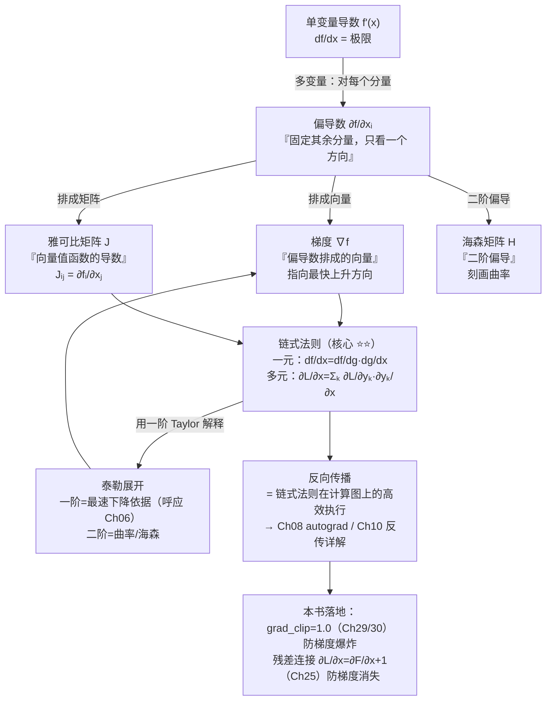

# 第 7 章 微积分与链式法则

Ch 06 把「怎么降 loss」的算法讲清了——梯度下降、SGD、动量、Adam/AdamW。但贯穿整章有一个最基础的环节一直被我们**当成黑盒**：每一步要用的**梯度 $\nabla f(\theta)$ 到底是怎么算出来的**？一个几十亿参数的网络，谁也写不出 $\partial\mathcal{L}/\partial\theta_i$ 的显式表达式；而「损失对第 100 层某个权重的梯度」要从输出一路传回输入，穿过一条上百层长的「链」。这条链就是**链式法则（chain rule）**——它是反向传播（backpropagation）的数学灵魂，也是为什么深网络会梯度爆炸/梯度消失的根源（呼应 Ch 06 末尾的 `grad_clip=1.0`）。

> **给定一个复合函数 $L=f_n\circ f_{n-1}\circ\cdots\circ f_1$ ，怎么把 $\partial L/\partial x$ 拆成每一级 $f_k$ 的局部导数的乘积与求和？**

本章是 Part I 数学基础的第七章，承接 Ch 06 末尾「梯度到底怎么算」的预告。我们要把上一章里那个 $\nabla f(\theta)$ 从一个**符号**变成一套**可计算、可分析**的工具链——**偏导数、梯度、雅可比矩阵、海森矩阵、链式法则、泰勒展开**。读懂这一章，你就能在 Ch 08 看到 PyTorch 的 `loss.backward()` 时明白它在做什么，在 Ch 10 看到反向传播的逐层推导时不再发怵，在 Ch 25 看到「残差连接为何能训深网络」时一眼看穿那条「+1」直通路径的几何含义，在 Ch 29/Ch 30 再次看到 `grad_clip=1.0` 时从链式法则的根上回答「为什么梯度会爆炸」。

## 7.1 学习目标

读完本章，你应该能够：

- 写出**偏导数（partial derivative）** $\partial f/\partial x_i$ 的定义，并区分「对一个分量求导、其余分量固定」与全导数的差别；
- 默写**梯度（gradient）** $\nabla f=(\partial f/\partial x_1,\dots,\partial f/\partial x_n)$ 是偏导数排成的向量，并复述「梯度指向最快上升方向」（Ch 06 已用，本章补上其微积分来源）；
- 写出**雅可比矩阵（Jacobian matrix）** $J_{ij}=\partial f_i/\partial x_j$ ，并解释它是「向量值函数的导数」「局部线性近似的矩阵」；
- 写出**海森矩阵（Hessian matrix）** $H_{ij}=\partial^2 f/\partial x_i\partial x_j$ ，简述它刻画**曲率**（二阶信息）——并据此理解 Ch 06「学习率与二阶曲率」的关联；
- 默写**一元链式法则** $\frac{df}{dx}=\frac{df}{dg}\cdot\frac{dg}{dx}$ 与**多元链式法则** $\frac{\partial L}{\partial x}=\sum_k\frac{\partial L}{\partial y_k}\frac{\partial y_k}{\partial x}$ ；
- 写出**一阶/二阶泰勒展开** $f(x)\approx f(a)+f'(a)(x-a)+\tfrac12 f''(a)(x-a)^2$ ，并说明「一阶=最速下降的依据（呼应 Ch 06）」「二阶=曲率/海森」；
- **手算**一个两层复合函数 $L=\sigma(w_2(\mathrm{ReLU}(w_1 x+b_1))+b_2)$ 的链式法则全过程——这是反向传播的雏形，为 Ch 10 直接埋下伏笔；
- 解释**雅可比作为局部线性近似**的几何含义，以及**梯度模长**与**梯度裁剪**的一阶泰勒动机；
- 概述**残差连接**在链式法则下为何缓解梯度消失： $\partial L/\partial x=\partial F/\partial x+1$ （为 Ch 25 Transformer Block 埋伏笔）。

本章承接 Ch 06「负梯度是最速下降方向」的一阶泰勒证明，把那一步用到的「偏导、梯度、泰勒展开」补齐严谨定义，并为 Ch 08《张量计算与 PyTorch 自动微分》和 Ch 10《反向传播与训练动力学》铺好最后一块理论地砖。

## 7.2 直觉与动机

### 类比一：复合函数=流水线，链式法则=拆账

假设你有一条三段流水线加工一个零件：第 1 段把原料 $x$ 加工成半成品 $u$ （ $u=g(x)$ ），第 2 段把 $u$ 加工成 $v$ （ $v=h(u)$ ），第 3 段把 $v$ 加工成成品 $y$ （ $y=k(v)$ ）。现在问：**原料 $x$ 每多投一单位，最终成品 $y$ 多产出多少？** 答案显然不是某一段单独决定的，而是「每一段的产出/投入比」连乘：

$$
\frac{dy}{dx} = \underbrace{\frac{dy}{dv}}_{\text{第3段}}\cdot\underbrace{\frac{dv}{du}}_{\text{第2段}}\cdot\underbrace{\frac{du}{dx}}_{\text{第1段}}
$$

这就是一元链式法则的**全部直觉**：复合函数的总变化率，等于每一级局部变化率的**乘积**。深度网络就是一条超长的「加工流水线」——输入 $x$ 经过几十上百层非线性变换变成 loss $L$ ，损失对输入的敏感度就是这条流水线上每一级「局部放大率」的连乘。

| 流水线类比 | 微积分术语 |
|---------|-----------|
| 原料 $x$ | 输入变量 |
| 半成品 $u,v$ | 中间变量（隐藏层激活值） |
| 成品 $y$ / 最终损失 $L$ | 输出 / 标量 loss |
| 「每段的产出/投入比」 | 该段的**局部导数** $\frac{d(\text{出})}{d(\text{入})}$ |
| 总变化率 $dy/dx$ | 链式法则的连乘 |
| 某一段把信号放大很多倍 | 该段导数 $>1$ ，可能**梯度爆炸** |
| 某一段把信号压成几乎为零 | 该段导数 $<1$ （如 sigmoid 的 $<0.25$ ），可能**梯度消失** |

> **一句话记牢：链式法则 = 把「总变化量」按流水线的每一级拆开，每一级负责一段局部导数，总导数 = 各级局部导数的连乘（多元时再对分叉/汇合求和）。**

### 类比二：从单变量到多变量——导数「升级」成矩阵

单变量函数 $y=f(x)$ 的导数 $f'(x)$ 是一个**数**，告诉你「 $x$ 动一点， $y$ 动多少」。但深度学习里的函数几乎都是多变量的：

- 标量函数 $f:\mathbb{R}^n\to\mathbb{R}$ （比如 loss）：输入是向量，输出是数。它的「导数」是**梯度**——一个与输入同维的向量，告诉你「每个输入分量各动一点，输出总共动多少」。
- 向量值函数 $f:\mathbb{R}^n\to\mathbb{R}^m$ （比如一层神经网络：输入向量 $\to$ 输出向量）：它的「导数」是**雅可比矩阵**——一个 $m\times n$ 的矩阵，第 $(i,j)$ 个元素是「第 $j$ 个输入动一点，第 $i$ 个输出动多少」。
- 想知道 loss 曲面在某点「有多弯」（曲率），要看**二阶导数**——这排成**海森矩阵**。

所以本章其实是把单变量微积分「升级」到多变量：**导数 $\to$ 梯度 $\to$ 雅可比；二阶导数 $\to$ 海森**。链式法则也从「连乘」升级成「矩阵连乘」（外加对汇合节点的求和）。

### 概念地图：从导数到反向传播 ⭐

下面这张 Mermaid 图把本章的概念按「从单变量到多变量、从定义到链式法则、再到反向传播」串起来，并标出与后续章节的挂钩点：



这张图是本章的「骨架」：左半边是定义（偏导→梯度/雅可比/海森），右半边是应用（链式法则→泰勒→反向传播）。最关键的节点是**链式法则**——它把「局部导数」串成「总导数」，是整章的灵魂，也是反向传播的数学身份。带着这张图，我们进入严格的数学定义。

## 7.3 数学定义

### 偏导数

设 $f:\mathbb{R}^n\to\mathbb{R}$ ， $\mathbf{x}=(x_1,\dots,x_n)$ 。**偏导数（partial derivative）** $\partial f/\partial x_i$ 就是「**固定其余 $n-1$ 个分量，只把 $x_i$ 当自变量**」求的普通导数：

$$
\boxed{ \frac{\partial f}{\partial x_i}(\mathbf{x})=\lim_{h\to0}\frac{f(\dots,x_i+h,\dots)-f(\dots,x_i,\dots)}{h} }
$$

几何上， $\partial f/\partial x_i$ 是曲面 $z=f(\mathbf{x})$ 沿 $x_i$ 轴方向的**斜率**——你站在 $\mathbf{x}$ 处，只朝 $x_i$ 方向看，地面的坡度。

> 一个易混点：偏导数 $\partial f/\partial x_i$ 把其余变量当作**常数**（与它们无关）；而如果 $x_i$ 本身又依赖另一个变量 $t$ （即 $x_i=x_i(t)$ ），那 $f$ 对 $t$ 的「总变化率」要用链式法则把所有依赖 $t$ 的路径加起来——这就是 7.3 节末尾多元链式法则的来源。

### 梯度

把 $n$ 个偏导数**排成一个向量**，就是**梯度（gradient）**：

$$
\boxed{ \nabla f(\mathbf{x})=\left(\frac{\partial f}{\partial x_1},\ \frac{\partial f}{\partial x_2},\ \dots,\ \frac{\partial f}{\partial x_n}\right) }
$$

梯度与输入 $\mathbf{x}$ 同维。Ch 06 已经用过它并证明了三个性质（向量、最快上升方向、模长=最陡坡度）——本章把它在「偏导数」这个更底层的基础上重新定位：**梯度是偏导数的打包，是标量函数的「全导数」表示**。

> 记号约定：本书里 $\nabla f$ 一律指列向量，与 $\theta$ 同形； $\nabla_\theta f$ 强调对 $\theta$ 求导。

### 雅可比矩阵

梯度处理的是「**输入向量 $\to$ 输出标量**」的函数。但神经网络的一层是「**输入向量 $\to$ 输出向量**」： $\mathbf{f}:\mathbb{R}^n\to\mathbb{R}^m$ ， $\mathbf{f}(\mathbf{x})=(f_1(\mathbf{x}),\dots,f_m(\mathbf{x}))$ 。它的「导数」是一个矩阵——**雅可比矩阵（Jacobian matrix）**：

$$
\boxed{ J_{\mathbf{f}}(\mathbf{x})=\begin{pmatrix}
\dfrac{\partial f_1}{\partial x_1} & \cdots & \dfrac{\partial f_1}{\partial x_n}\cr
\vdots & \ddots & \vdots\cr
\dfrac{\partial f_m}{\partial x_1} & \cdots & \dfrac{\partial f_m}{\partial x_n}
\end{pmatrix},\qquad (J_{\mathbf{f}})_{ij}=\frac{\partial f_i}{\partial x_j} }
$$

注意形状： $J$ 是 $m\times n$ （输出维 $\times$ 输入维）。两个关键视角：

1. **「向量值函数的导数」**：当 $m=1$ （输出标量）， $J$ 退化为 $1\times n$ 的**行向量**，正是梯度的转置 $\nabla f^\top$ ；当 $n=1$ （输入标量）， $J$ 退化为 $m\times 1$ 的列向量。所以**梯度是雅可比的特例**。
2. **「局部线性近似」**：在 $\mathbf{x}$ 附近， $\mathbf{f}(\mathbf{x}+\Delta\mathbf{x})\approx\mathbf{f}(\mathbf{x})+J_{\mathbf{f}}(\mathbf{x}) \Delta\mathbf{x}$ ——把非线性函数在局部**用线性变换（矩阵乘）近似**。这正是反向传播里「梯度沿网络回传」时每一步要乘的东西（7.4 节展开）。

### 海森矩阵

梯度（一阶导）告诉你「往哪走」，但不告诉你「地面有多弯」。曲率信息藏在**二阶偏导**里，排成**海森矩阵（Hessian matrix）**：

$$
\boxed{ H_f(\mathbf{x})=\begin{pmatrix}
\dfrac{\partial^2 f}{\partial x_1\partial x_1} & \cdots & \dfrac{\partial^2 f}{\partial x_1\partial x_n}\cr
\vdots & \ddots & \vdots\cr
\dfrac{\partial^2 f}{\partial x_n\partial x_1} & \cdots & \dfrac{\partial^2 f}{\partial x_n\partial x_n}
\end{pmatrix},\qquad H_{ij}=\frac{\partial^2 f}{\partial x_i\partial x_j} }
$$

$H$ 是 $n\times n$ 方阵。当 $f$ 的二阶偏导连续时（神经网络里几乎总是成立）， $H$ **对称**（ $H_{ij}=H_{ji}$ ，Schwarz 定理）。两个用途：

1. **曲率**： $H$ 的特征值描述 loss 曲面在各个方向上「弯得多厉害」。特征值全正 $\Rightarrow$ 局部像个碗（凸）；有正有负 $\Rightarrow$ 鞍点；全负 $\Rightarrow$ 局部极大。
2. **学习率上限**：Ch 06 那个「 $f=\frac12\theta^2$ 临界 $\eta=1$ 」的结论，本质是 $\eta<2/f''=2/H$ ——**学习率上限由海森的最大特征值决定**（这就是为什么各方向曲率不同的高维 loss 需要自适应方法）。本书不深究二阶方法（牛顿法、L-BFGS），但记住海森=曲率，就足以理解「为什么有的方向能走大步、有的方向只能挪一点点」。

> 一句话：**梯度（一阶）告诉你方向，海森（二阶）告诉你步长能多大。** 现代优化器（Adam）用二阶矩 $v_t$ 近似曲率信息，避免直接算 $H$ （ $n\times n$ 在几十亿参数下根本存不下）。

### 链式法则（一元）

设 $y=f(g(x))$ ，即 $y$ 通过中间变量 $u=g(x)$ 依赖于 $x$ ： $x\xrightarrow{g}u\xrightarrow{f}y$ 。**一元链式法则**：

$$
\boxed{ \frac{dy}{dx}=\frac{df}{dg}\cdot\frac{dg}{dx}\quad\text{即}\quad \frac{dy}{dx}=\frac{dy}{du}\cdot\frac{du}{dx} }
$$

读法：「 $x$ 动一点 → $u$ 动 $\frac{du}{dx}$ 倍 → $y$ 再动 $\frac{dy}{du}$ 倍，总放大率是两级放大率的**乘积**」。这正是 7.2 节流水线类比的形式化。

### 链式法则（多元）

深度网络的中间变量都是向量，且**一个输入会通过多条路径影响 loss**（汇合节点）。设 $L$ 依赖向量 $\mathbf{y}=(y_1,\dots,y_m)$ ，而每个 $y_k$ 又依赖 $x$ ，则**多元链式法则**要对所有路径求和：

$$
\boxed{ \frac{\partial L}{\partial x}=\sum_{k=1}^{m}\frac{\partial L}{\partial y_k}\cdot\frac{\partial y_k}{\partial x} }
$$

读法：「 $x$ 通过 $m$ 条支路（每个 $y_k$ 是一条）影响 $L$ ，总导数 = 各支路导数的**和**」。用矩阵/雅可比写更紧凑：若 $\mathbf{y}=g(\mathbf{x})$ ， $L=h(\mathbf{y})$ ，则

$$
\frac{\partial L}{\partial \mathbf{x}}=\underbrace{\left(\frac{\partial L}{\partial \mathbf{y}}\right)}_{1\times m}^{ \top} \cdot \underbrace{J_g(\mathbf{x})}_{m\times n}\quad\Longrightarrow\quad \nabla_{\mathbf{x}}L=J_g(\mathbf{x})^\top \nabla_{\mathbf{y}}L
$$

这个 **$\nabla_{\mathbf{x}}L=J^\top\nabla_{\mathbf{y}}L$** 是反向传播的**核心公式**——把「下游已知的梯度 $\nabla_{\mathbf{y}}L$ 」乘上「本层的雅可比转置 $J^\top$ 」得到「上游需要的梯度 $\nabla_{\mathbf{x}}L$ 」。Ch 08 的 autograd 和 Ch 10 的反向传播都是在反复执行这一步。

### 泰勒展开

**泰勒展开（Taylor expansion）**用多项式逼近一个函数。在点 $a$ 附近：

$$
\boxed{ f(x)\approx \underbrace{f(a)}_{\text{常数}}+\underbrace{f'(a)(x-a)}_{\text{一阶（线性）}}+\underbrace{\tfrac12 f''(a)(x-a)^2}_{\text{二阶（曲率）}}+\cdots }
$$

- **一阶（线性）近似**： $f(x)\approx f(a)+f'(a)(x-a)$ 。Ch 06 正是用它证明了「负梯度是最速下降方向」——把 loss 在当前点局部线性化，找下降最快的方向。
- **二阶近似**：加上 $\tfrac12 f''(a)(x-a)^2$ ，多 capturing 了「弯曲」。多变量情形里 $f''$ 换成海森 $H$ ： $f(\mathbf{x}+\Delta\mathbf{x})\approx f(\mathbf{x})+\nabla f^\top\Delta\mathbf{x}+\tfrac12\Delta\mathbf{x}^\top H \Delta\mathbf{x}$ 。

> 一句话：**一阶泰勒 $\Rightarrow$ 梯度下降（用方向）；二阶泰勒 $\Rightarrow$ 曲率/海森（决定步长上限）。** Ch 06 的全部几何（发散、临界 $\eta$ ）都可以从二阶泰勒里推出来。

## 7.4 推导与几何

本节做三件事：① **手算**一个两层复合函数的链式法则全过程（反向传播的雏形）；② 解释雅可比作为「局部线性近似」的几何含义；③ 用一阶泰勒说明梯度裁剪的动机。

### 手算：两层复合函数的链式法则（反向传播雏形）⭐⭐

考虑一个极简但结构完整的「两层网络」：输入标量 $x$ ，经过一个带 ReLU 的隐藏层和一个带 sigmoid 的输出层，最后取平方 loss：

$$
\boxed{ u=\mathrm{ReLU}(w_1 x+b_1)\ \longrightarrow\ z=w_2 u+b_2\ \longrightarrow\ y=\sigma(z)\ \longrightarrow\ L=\tfrac12(y-t)^2 }
$$

其中 $\sigma(z)=1/(1+e^{-z})$ ，目标值 $t$ 已知。计算图如下：

```
   计算图（前向：→ ；反向传梯度：←）

   x ──→(×w₁)──→ s=w₁x ──→(＋b₁)──→ h=w₁x+b₁ ──→(ReLU)──→ u
                                                                    │
                                                                    ↓
                              L ←─(½Δ²)← Δ=y−t ←─(σ)← z ←─(＋b₂)← q=w₂u
                                                                          ↑
                                                                          └──(×w₂)──← u
```

**任务**：求 $L$ 对四个参数 $w_1,b_1,w_2,b_2$ 的偏导（这就是反向传播要干的事）。我们用链式法则**从 $L$ 往回**逐级算（这正是「反向」二字的由来）。

**第 0 步（输出端）**：

$$
\frac{\partial L}{\partial \Delta}= \Delta = y-t,\qquad \frac{\partial L}{\partial y}=\Delta
$$

**第 1 步（过 sigmoid）**： $y=\sigma(z)$ ， $\sigma'(z)=\sigma(z)(1-\sigma(z))=y(1-y)$ 。链式法则：

$$
\frac{\partial L}{\partial z}=\frac{\partial L}{\partial y}\cdot\frac{\partial y}{\partial z}=\Delta\cdot y(1-y)  =:\bar z
$$

（记号 $\bar z:=\partial L/\partial z$ 表示「 $z$ 处收到的梯度」，下同。）

**第 2 步（过线性层 $z=w_2 u+b_2$ ）**： $z$ 依赖 $w_2,u,b_2$ 三个变量，每个都是一条支路：

$$
\frac{\partial L}{\partial w_2}=\bar z\cdot\frac{\partial z}{\partial w_2}=\bar z\cdot u,\qquad
\frac{\partial L}{\partial b_2}=\bar z\cdot\frac{\partial z}{\partial b_2}=\bar z\cdot 1=\bar z,\qquad
\frac{\partial L}{\partial u}=\bar z\cdot\frac{\partial z}{\partial u}=\bar z\cdot w_2  =:\bar u
$$

注意：**对权重 $w_2$ 求导用到的是该层的输入 $u$ ；对输入 $u$ 求导用到的是该层的权重 $w_2$**——这种「交叉」是反向传播里反复出现的模式（Ch 10 会归纳成「权重的梯度 = 上游梯度 ⊗ 该层输入；输入的梯度 = 上游梯度 ⊗ 该层权重转置」）。

**第 3 步（过 ReLU）**： $u=\mathrm{ReLU}(h)$ ，导数是分段函数 $\mathrm{ReLU}'(h)=\mathbb{1}[h>0]$ （ $h>0$ 时为 1，否则为 0）：

$$
\frac{\partial L}{\partial h}=\bar u\cdot\mathrm{ReLU}'(h)=\bar u\cdot\mathbb{1}[h>0]  =:\bar h
$$

**关键观察**：若 $h\le0$ ， $\bar h=0$ ——梯度被 ReLU **完全截断**，这一支路（以及更上游的 $w_1,b_1$ ）这一步拿不到任何梯度。这就是「死神经元（dead ReLU）」的来源，也是 ReLU 相比 sigmoid 能缓解梯度消失但仍可能「死」的代价（Ch 09、Ch 23 SwiGLU 会进一步讨论）。

**第 4 步（过第一个线性层 $h=w_1 x+b_1$ ）**：

$$
\frac{\partial L}{\partial w_1}=\bar h\cdot\frac{\partial h}{\partial w_1}=\bar h\cdot x,\qquad
\frac{\partial L}{\partial b_1}=\bar h\cdot\frac{\partial h}{\partial b_1}=\bar h\cdot 1=\bar h
$$

**最终四个梯度**（汇总）：

| 参数 | 梯度表达式 | 依赖的前向量 |
|------|-----------|-------------|
| $w_2$ | $\Delta\cdot y(1-y)\cdot u$ | $u$ （隐藏层激活） |
| $b_2$ | $\Delta\cdot y(1-y)$ | — |
| $w_1$ | $\Delta\cdot y(1-y)\cdot w_2\cdot\mathbb{1}[h>0]\cdot x$ | $x$ （输入）、 $w_2$ 、 $h$ |
| $b_1$ | $\Delta\cdot y(1-y)\cdot w_2\cdot\mathbb{1}[h>0]$ | $w_2$ 、 $h$ |

**反向传播的全部精髓都在这张表里**：

1. **从后往前算**：先算 $\bar z$ ，再用 $\bar z$ 算 $\bar u$ ，再用 $\bar u$ 算 $\bar h$ ——每一步只用到「上游传来的梯度」和「本层前向时存的中间量」。这就是为什么反向传播要**存前向激活值**（Ch 30 会讲这是显存大头）。
2. **乘积链**：越靠前的参数，梯度表达式里乘的项越多（ $w_1$ 的梯度含 5 个因子）。若每个因子都略小于 1（比如 sigmoid 的 $y(1-y)\le0.25$ ），连乘会**指数衰减**——梯度消失；若每个因子都略大于 1，连乘会**指数增长**——梯度爆炸。这就是 Ch 06 `grad_clip` 要防爆的根本原因，也是深层网络训练难的数学根源。
3. **复杂度**：手算这套链式法则，前向一遍 + 反向一遍，每层只做几次矩阵乘——**总开销约等于一次前向**。这正是反向传播的伟大之处（Ch 10 会严格证明它把「逐参数求导」从 $O(n^2)$ 降到 $O(n)$ ）。

> 一句话：**反向传播 = 在计算图上倒着走一遍链式法则，每到一个节点用「上游梯度 × 本层局部导数」算出本节点的梯度并继续往前传。** Ch 08 会把这套流程交给 PyTorch 的 autograd 自动执行，Ch 10 会把它写成矩阵形式并分析训练动力学。

### 雅可比作为「局部线性近似」

7.3 节说过 $\mathbf{f}(\mathbf{x}+\Delta\mathbf{x})\approx\mathbf{f}(\mathbf{x})+J_{\mathbf{f}}\Delta\mathbf{x}$ 。用一张一维的图感受：

```
   非线性函数 f 的局部线性近似（切线 = 一阶泰勒 = 雅可比的退化）

   f(x)
    ↑        ╱ ← 真实曲线 f（非线性）
    │      ╱ │
    │    ╱   │
    │  f(a)──●── ← 切线（一阶近似）：f(a)+f'(a)(x−a)
    │  ╱      │      在 a 附近和曲线贴合得很好
    │╱        │      但 x 离 a 越远，近似越差（二阶曲率项显现）
    └─────────┼─────────→ x
              a

   多变量情形：切线 → 切平面（超平面），斜率由雅可比 J 给出。
   反向传播里每一步 Jᵀ·(上游梯度) 就是把上游梯度「投影」回输入空间。
```

几何含义：雅可比 $J_{\mathbf{f}}(\mathbf{x})$ 是非线性函数 $\mathbf{f}$ 在 $\mathbf{x}$ 处的**最佳线性逼近**——在 $\mathbf{x}$ 的小邻域里，用线性变换（矩阵乘）代替非线性变换，误差是 $O(\Vert\Delta\mathbf{x}\Vert^2)$ （二阶项，对应海森）。反向传播之所以能逐层乘雅可比，正是因为「梯度」本质是一阶量，在线性近似下严格成立。

### 梯度模长与梯度裁剪的一阶泰勒动机 ⭐

Ch 06 末尾提过 `grad_clip=1.0`。现在用一阶泰勒把它说透。一步梯度下降后 loss 的**变化量**（一阶近似）：

$$
\mathcal{L}(\theta-\eta\mathbf{g})-\mathcal{L}(\theta)\approx -\eta \mathbf{g}^\top\mathbf{g}=-\eta\Vert\mathbf{g}\Vert_2^2
$$

也就是说：**一步实际位移的「大小」正比于 $\eta\Vert\mathbf{g}\Vert_2$ ，loss 下降量正比于 $\eta\Vert\mathbf{g}\Vert_2^2$**。但一阶近似只在 $\eta\Vert\mathbf{g}\Vert_2$ **足够小**时成立——一旦 $\Vert\mathbf{g}\Vert_2$ 突然变大（梯度爆炸，源于链式法则的连乘）， $\eta\mathbf{g}$ 这一歩就跨出了线性近似的有效范围，loss 不降反升（Ch 06「发散」）。

**梯度裁剪**给这个「一步位移大小」设硬上限：

$$
\mathbf{g}\leftarrow\begin{cases}\mathbf{g}, & \Vert\mathbf{g}\Vert_2\le c\cr \dfrac{c}{\Vert\mathbf{g}\Vert_2}\mathbf{g}, & \Vert\mathbf{g}\Vert_2>c\end{cases}\quad(c=1.0\text{ 在 zllm})
$$

裁剪后无论原始梯度多大，实际位移模长 $\eta\Vert\mathbf{g}\Vert_2\le\eta c$ ，一阶近似始终有效。这就是 `grad_clip` 防爆的一阶泰勒动机——**把每步位移限制在线性近似可信的范围内**。这里用到的 $\Vert\mathbf{g}\Vert_2=\sqrt{\sum_i g_i^2}$ 正是 Ch 01 的 $L_2$ 范数；而「梯度为什么可能突然爆炸」则要回到链式法则：当某层雅可比的最大奇异值 $>1$ 且层数很深时，连乘让 $\Vert\mathbf{g}\Vert_2$ 随深度指数增长（7.5 节与残差连接一起展开）。

## 7.5 与本项目联系

理论就绪，现在把它和 zllm 钉死。本节三个钩子全部来自本章的核心工具（链式法则、雅可比、梯度模长），等读到对应章节时会恍然大悟。

### 钩子一：反向传播 = 链式法则在计算图上的高效执行（Ch 08 / Ch 10）⭐⭐

7.4 节那张手算的表，就是一个**微型反向传播**。zllm 的每次 `loss.backward()`（PyTorch 调用）做的事，本质上就是把这套「从 loss 倒着走、每到一个节点用 $\nabla_{\mathbf{x}}L=J^\top\nabla_{\mathbf{y}}L$ 算上游梯度」的流程，**自动化地跑在整张计算图上**：

- 每个算子（矩阵乘、LayerNorm、softmax、attention）都预先注册了自己的雅可比转置 $J^\top$ ；
- 前向时 autograd 把计算图录下来（存中间激活值）；
- 反向时从 $\partial L/\partial L=1$ 出发，**拓扑逆序**逐节点调用 $J^\top$ 把梯度往回传。

这就是 Ch 08《张量计算与 PyTorch 自动微分》要拆开讲的 autograd 机制，也是 Ch 10《反向传播与训练动力学》要写成矩阵形式并分析梯度流（gradient flow）的对象。**反向传播没有新的数学，它就是链式法则**——本章给的 $\nabla_{\mathbf{x}}L=J^\top\nabla_{\mathbf{y}}L$ 是它唯一的公式。

### 钩子二：梯度裁剪 `grad_clip=1.0`（Ch 29 / Ch 30）防梯度爆炸 ⭐

zllm 所有训练器（pretrain、SFT、DPO、PPO、GRPO、distillation）都有同一行：

```python
torch.nn.utils.clip_grad_norm_(model.parameters(), cfg.grad_clip)  # grad_clip=1.0
```

7.4 节已经用一阶泰勒解释了它的动机：**给每步位移模长 $\eta\Vert\mathbf{g}\Vert_2$ 设上限，保证线性近似有效、防止 loss 发散**。这里再补上「为什么梯度会爆炸」的链式法则视角：zllm 的模型有若干层 Transformer Block（Ch 25），每一层带一个雅可比 $J_k$ ；从 loss 回传到嵌入层，总雅可比是 $J_1^\top J_2^\top\cdots J_L^\top$ 的**连乘**。若各 $J_k$ 的最大奇异值略大于 1（比如注意力没归一化好、或某层激活值偏大），连乘会让梯度模长 $\Vert\mathbf{g}\Vert_2$ 随深度 $L$ **指数增长**——这就是梯度爆炸。`grad_clip=1.0` 用 $L_2$ 范数（Ch 01）给这个连乘产物设硬上限，是防爆的工程兜底。Ch 29 会展示 `clip_grad_norm_` 的逐行实现，Ch 30 会讲它在混合精度训练里与 `grad_accum` 的配合。

> 反过来，若各 $J_k$ 的最大奇异值略小于 1（典型如 sigmoid 层，雅可比元素 $\le0.25$ ），连乘让 $\Vert\mathbf{g}\Vert_2$ **指数衰减**——梯度消失，浅层几乎学不到东西。这正是下一个钩子要解决的问题。

### 钩子三：残差连接为何缓解梯度消失（Ch 25 Transformer Block）⭐⭐

残差连接（residual connection）的结构是 $\mathbf{x}_{\text{out}}=\mathbf{x}+F(\mathbf{x})$ ——输出等于「输入」加上「一个子层 $F$ 的输出」。用链式法则求它对 $\mathbf{x}$ 的雅可比：

$$
\frac{\partial \mathbf{x}_{\text{out}}}{\partial \mathbf{x}}=I+\frac{\partial F}{\partial \mathbf{x}}
$$

其中 $I$ 是单位矩阵。梯度回传时，**那条 $I$ （恒等映射）给梯度提供了一条「+1」直通路径**：

$$
\nabla_{\mathbf{x}}L=\left(I+\frac{\partial F}{\partial \mathbf{x}}\right)^\top \nabla_{\mathbf{x}_{\text{out}}}L=\nabla_{\mathbf{x}_{\text{out}}}L+\left(\frac{\partial F}{\partial \mathbf{x}}\right)^\top \nabla_{\mathbf{x}_{\text{out}}}L
$$

即便 $\partial F/\partial\mathbf{x}$ 很小（ $F$ 那条支路梯度消失）， $\nabla_{\mathbf{x}}L$ 仍至少有 $`\nabla_{\mathbf{x}_{\text{out}}}L`$ 这一项——**梯度不会衰减到零**。把 $L$ 个残差块串起来，回传梯度的连乘里多了 $L$ 个「 $I+\text{小量}$ 」，整体不会指数衰减。这就是为什么 Transformer（Ch 25 的 Block + Backbone）和 ResNet 能训到几十上百层深——**残差连接在链式法则层面给梯度开了一条无损直通路**。Ch 25 会把 zllm 的 `TransformerBlock` 逐行拆开，并标出每条残差边在计算图上的位置。

一句话总结这三个钩子：**反向传播就是链式法则在计算图上的高效执行（Ch 08/10）；梯度爆炸源于雅可比连乘的指数增长，`grad_clip=1.0` 用 $L_2$ 范数设硬上限防爆（Ch 29/30）；残差连接用 $I+\partial F/\partial\mathbf{x}$ 给梯度开「+1」直通路，让深网络梯度不消失（Ch 25）。** 微积分与链式法则就这样贯穿了从 autograd 到深网络架构的整条主线。

## 7.6 本章小结

让我们把这一章浓缩成几条可以随身携带的结论：

1. **偏导数**： $\partial f/\partial x_i$ 是「固定其余分量、只看 $x_i$ 方向」的斜率。
2. **梯度**： $\nabla f=(\partial f/\partial x_1,\dots,\partial f/\partial x_n)$ 是偏导数排成的向量，指向最快上升方向（Ch 06 用过，本章补上其偏导数来源）。
3. **雅可比矩阵**： $J_{ij}=\partial f_i/\partial x_j$ 是向量值函数 $\mathbf{f}:\mathbb{R}^n\to\mathbb{R}^m$ 的「导数」，是**局部线性近似**的矩阵。梯度是它的 $m=1$ 特例。
4. **海森矩阵**： $H_{ij}=\partial^2 f/\partial x_i\partial x_j$ 是二阶偏导排成的方阵，刻画**曲率**；其特征值决定学习率上限（呼应 Ch 06「临界 $\eta$ 」）。
5. **链式法则（一元）**： $\frac{df}{dx}=\frac{df}{dg}\cdot\frac{dg}{dx}$ ——总变化率=各级局部变化率的乘积（流水线类比）。
6. **链式法则（多元）**： $\frac{\partial L}{\partial x}=\sum_k\frac{\partial L}{\partial y_k}\frac{\partial y_k}{\partial x}$ ，矩阵形式 $\nabla_{\mathbf{x}}L=J^\top\nabla_{\mathbf{y}}L$ ——**反向传播的核心公式**。
7. **泰勒展开**： $f(x)\approx f(a)+f'(a)(x-a)+\tfrac12 f''(a)(x-a)^2$ 。一阶=最速下降依据（Ch 06 已证），二阶=曲率/海森。
8. **反向传播**=链式法则在计算图上的高效执行：从 loss 倒着走，每节点用「上游梯度 × 本层雅可比转置」算本节点梯度并继续传。雅可比连乘 $>1$ $\Rightarrow$ 梯度爆炸； $<1$ $\Rightarrow$ 梯度消失。
9. **梯度裁剪**：用 $L_2$ 范数 $\Vert\mathbf{g}\Vert_2$ 给每步位移设上限，一阶泰勒动机是「保证线性近似有效、防爆」。
10. **残差连接**： $\mathbf{x}_{\text{out}}=\mathbf{x}+F(\mathbf{x})$ 的雅可比是 $I+\partial F/\partial\mathbf{x}$ ，「+1」项给梯度开无损直通路，缓解梯度消失。

> **一句话记牢：偏导→梯度→雅可比（局部线性近似）→链式法则（反向传播的灵魂）→泰勒（一阶定方向、二阶定步长）；雅可比连乘爆炸用 `grad_clip=1.0` 兜底，连乘消失用残差连接的「+1」直通路破解。**

> **前方预告。** 本章把「梯度怎么算」的数学讲透了——链式法则让一个几十亿参数的网络也能在 $O(n)$ 时间内算出每个参数的梯度。但「手算链式法则」显然不现实，我们需要一个**自动**执行它的系统。下一章（Ch 08《张量计算与 PyTorch 自动微分》）将从张量（tensor）这个基本数据结构讲起，拆开 PyTorch 的 autograd 引擎——它是如何在前向时「录下」计算图、在反向时按拓扑逆序执行 $\nabla_{\mathbf{x}}L=J^\top\nabla_{\mathbf{y}}L$ 的。读完 Ch 08，你就能彻底理解 zllm 里每一行 `loss.backward()` 在做什么，为 Ch 09 的神经网络基础和 Ch 10 的反向传播矩阵推导铺平道路。

### 思考题

> 写答案前，建议先想「这题是套哪个公式（偏导定义 / 链式法则一元或多元 / 泰勒展开 / 雅可比转置公式）」，再动笔推导。

1. **手算题**：考虑本章 7.4 节那个两层网络 $u=\mathrm{ReLU}(w_1 x+b_1),\ z=w_2 u+b_2,\ y=\sigma(z),\ L=\tfrac12(y-t)^2$ 。给定 $x=2,\ w_1=1,\ b_1=-3,\ w_2=2,\ b_2=0,\ t=1$ 。（a）前向算出 $u,z,y,L$ 的数值。（b）按 7.4 节的反向流程，逐步算出 $\bar y,\bar z,\bar u,\bar h$ 以及 $\partial L/\partial w_1,\partial L/\partial b_1,\partial L/\partial w_2,\partial L/\partial b_2$ 的数值。（c）特别地， $h=w_1 x+b_1=-1<0$ ，ReLU 把梯度截断为 0——请据此说明 $w_1,b_1$ 这一步拿不到梯度，并解释这为什么是「死 ReLU」的一个实例。（提示： $\bar h=0$ 导致 $\partial L/\partial w_1=\partial L/\partial b_1=0$ 。）
2. **推导题**：（a）设 $L=f(y_1,y_2)$ ，而 $y_1=g_1(x),\ y_2=g_2(x)$ （一个 $x$ 通过两条支路影响 $L$ ）。用多元链式法则写出 $\frac{dL}{dx}$ ，指出「求和」对应哪一步。（b）推广：若 $\mathbf{y}=g(\mathbf{x})$ （ $\mathbf{y}\in\mathbb{R}^m$ ）， $L=h(\mathbf{y})$ ，请从 $\nabla_{\mathbf{x}}L=J_g(\mathbf{x})^\top\nabla_{\mathbf{y}}L$ 出发，说明为什么「反向传播要先有 $\nabla_{\mathbf{y}}L$ 才能算 $\nabla_{\mathbf{x}}L$ 」——这正是「反向」二字的由来。（c）若把 $g$ 换成一个 $m\times n$ 的常数矩阵 $A$ （线性层 $\mathbf{y}=A\mathbf{x}$ ）， $J_g$ 是什么？ $\nabla_{\mathbf{x}}L$ 与 $\nabla_{\mathbf{y}}L$ 的关系是什么？（提示： $J_g=A$ ，故 $\nabla_{\mathbf{x}}L=A^\top\nabla_{\mathbf{y}}L$ ——这就是全连接层反向传播的矩阵形式，Ch 10 会用到。）
3. **概念题**：（a）用一阶泰勒展开说明「梯度裁剪为什么能防爆」：写出一步更新后 loss 变化量的线性近似，指出当 $\Vert\mathbf{g}\Vert_2$ 多大时线性近似失效，并说明 `clip_grad_norm_` 把 $\Vert\mathbf{g}\Vert_2$ 限制在 $c=1.0$ 如何让线性近似重新有效。（b）残差连接 $\mathbf{x}_{\text{out}}=\mathbf{x}+F(\mathbf{x})$ 的雅可比是 $I+\partial F/\partial\mathbf{x}$ 。假设深网络中没有残差连接时，每层雅可比的最大奇异值是 $0.9$ ， $L=100$ 层后梯度模长缩为原来的多少？加上残差连接后（假设 $\partial F/\partial\mathbf{x}$ 很小），回传梯度大致保持多少？据此解释残差连接为何能让网络训到上百层。（c）海森矩阵的特征值与 Ch 06 的「临界学习率 $\eta<2/f''$ 」有什么关系？为什么现代优化器（Adam）用二阶矩 $v_t$ **近似**曲率信息，而不是直接算海森？（提示：海森是 $n\times n$ ，几十亿参数下存不下； $v_t$ 只用对角元近似。）

---

读完本章，你已经能用「偏导 / 梯度 / 雅可比 / 海森 / 链式法则 / 泰勒展开」这套工具，回答「梯度怎么算出来」「为什么深网络会梯度爆炸/消失」「为什么残差连接能训深网络」「`grad_clip` 防爆的数学依据」。但「手算链式法则」对几十亿参数的网络显然不现实——我们需要一个**自动**执行它的系统。下一章（Ch 08《张量计算与 PyTorch 自动微分》）将从张量这个基本数据结构讲起，拆开 PyTorch 的 autograd 引擎，看它如何在前向时录下计算图、在反向时按拓扑逆序自动执行本章的 $\nabla_{\mathbf{x}}L=J^\top\nabla_{\mathbf{y}}L$ ——为 Ch 09 神经网络基础和 Ch 10 反向传播的矩阵推导铺平最后一段路。
