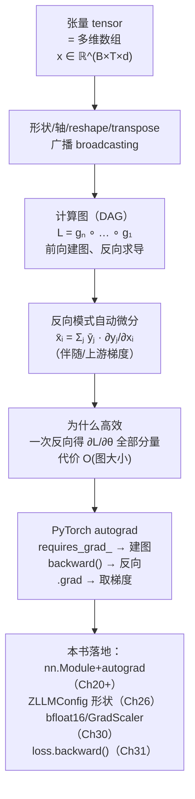
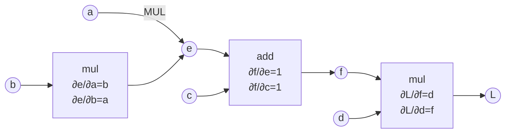

# 第 8 章 张量计算与 PyTorch 自动微分

Ch 07 把「梯度怎么算」的数学讲透了——链式法则 $\nabla_{\mathbf{x}}L=J^\top\nabla_{\mathbf{y}}L$ 让一个几十亿参数的网络也能在 $O(n)$ 时间内算出每个参数的梯度。但「手算链式法则」对真实网络显然不现实：zllm 的模型有上千万到上亿参数，排成几十层、每层几百次矩阵乘、注意力、归一化，谁也写不出 $\partial\mathcal{L}/\partial\theta_i$ 的显式表达式。我们需要一个**自动**执行链式法则的系统——它在**前向**时把计算过程「录下来」建成一张图，在**反向**时按拓扑逆序自动执行 $\nabla_{\mathbf{x}}L=J^\top\nabla_{\mathbf{y}}L$ 。这个系统就是 PyTorch 的 **autograd（自动微分引擎）**，而它操作的基本数据结构就是**张量（tensor）**。

> **给定一个由几百个算子（矩阵乘、归一化、注意力……）组成的网络前向 $L=f(\theta)$ ，怎么让机器自动算出 $\partial\mathcal{L}/\partial\theta$ 的每一个分量，而不必手写一行求导代码？**

本章是 Part I 数学基础的**收官章**，也是通向 Part II 与全部实战章的**工程桥梁**。从本章起读者就要真正触碰代码了。我们要把 Ch 01–07 积累的全部数学（向量/矩阵 → 雅可比 → 链式法则）落到一个具体可运行的计算框架里：**张量**是把数学对象工程化的容器，**计算图**是把复合函数结构化的 DAG，**反向模式自动微分**是把链式法则自动化的算法。读懂本章，你就能在 Ch 09 第一次写 `nn.Module` 时明白它为何自带 `backward`，在 Ch 20–26 把每个算子组装成完整计算图时胸有成竹，在 Ch 31 预训练循环里看到 `loss.backward()` 时一眼看穿它在整张图上跑了什么，在 Ch 30 看到 `bfloat16` + `GradScaler` 时知道这是 autograd 的精度优化。

## 8.1 学习目标

读完本章，你应该能够：

- 用一句话说清**张量（tensor）= 多维数组**，并写出本书通用的张量形状记法 $x\in\mathbb{R}^{B\times T\times d}$ （ $B$=batch、 $T$=序列长度、 $d$=隐藏维度）；
- 区分**维度/轴（dim/axis）**、**形状（shape）**、**元素总数（numel）**，并说明 `reshape`/`view` 只改形状不改数据、`transpose`/`permute` 交换轴顺序；
- 默写 **broadcasting（广播）规则**：形状从右往左对齐，某轴为 1 则沿该轴复制扩展，其余轴必须相等；
- 解释**计算图（computational graph）**是**有向无环图（DAG）**：前向时建图（每个算子节点记录输入、输出与局部雅可比），反向时求导；
- 写出**反向模式自动微分（reverse-mode AD）**的核心公式 $\bar{x_i}=\sum_j\bar{y_j}\frac{\partial y_j}{\partial x_i}$ ，其中 $\bar{\cdot}$ 表示**伴随（adjoint）/上游梯度**；
- 论证**为什么反向模式比正向模式高效**：一次反向即可得到标量 loss 对**所有**参数的梯度，总代价 $O(\text{图大小})$ ，而正向模式要跑 $n$ 次才能得到完整梯度向量；
- **手算**一个小计算图 $L=(a\cdot b+c)\cdot d$ 的前向 + 反向全过程，标注每个中间节点的局部梯度与伴随；
- 写出一段 5–8 行的通用 PyTorch autograd 代码（`requires_grad_` / `backward()` / `.grad`），并解释它与手算流程的一一对应。

本章承接 Ch 07 的 $\nabla_{\mathbf{x}}L=J^\top\nabla_{\mathbf{y}}L$ ，把它从「纸上的公式」变成「PyTorch 每次自动跑的算法」，并为 Ch 09 神经网络基础与 Ch 10 反向传播矩阵推导铺平最后一段路——Part I 的数学地基到此封顶，Part II 的模型大厦从这里起建。

## 8.2 直觉与动机

### 类比一：从标量到张量——「数字」一层层打包

数学里我们用标量 $x\in\mathbb{R}$ 、向量 $\mathbf{x}\in\mathbb{R}^n$ 、矩阵 $A\in\mathbb{R}^{m\times n}$ 。但训练 LLM 时，数据几乎都是「更高维的数组」：一个 batch 的 token 嵌入是三维的（batch × 序列 × 隐藏维），一批注意力分数是四维的（batch × 头 × 序列 × 序列）。**张量（tensor）** 就是这些「任意维数组」的统称——它是 Ch 01 向量/矩阵概念的直接推广：

| 数学对象 | 维数（轴数） | 形状记法 | 例子 |
|---------|------------|---------|------|
| 标量 scalar | 0 维 | $\mathbb{R}$ | loss 值 $L=2.3$ |
| 向量 vector | 1 维 | $\mathbb{R}^{n}$ | 一条句子嵌入 $\mathbf{h}\in\mathbb{R}^{768}$ |
| 矩阵 matrix | 2 维 | $\mathbb{R}^{m\times n}$ | 权重 $W\in\mathbb{R}^{768\times 3072}$ |
| 张量 tensor | $\ge3$ 维 | $\mathbb{R}^{B\times T\times d}$ | 一批序列嵌入 $x\in\mathbb{R}^{32\times 128\times 768}$ |

本书统一用 $x\in\mathbb{R}^{B\times T\times d}$ 这套形状记法： $B$ 是 batch size（批大小）， $T$ 是 sequence length（序列长度，token 数）， $d$ 是 hidden size（隐藏维度）。这套记法在 zllm 的 `ZLLMConfig`（`hidden_size=768`）里直接落地，会在 Ch 26 被组装成完整的 Transformer 计算图。

> **一句话记牢：张量 = 多维数组 = 向量/矩阵的自然推广；形状（shape）用一个轴长度的元组描述，如 `(B, T, d)`。所有深度学习计算（前向、反向）都是张量上的运算。**

### 类比二：计算图=流水线图纸，前向建图、反向对账

把 7.2 节那个「流水线」类比搬过来，但这次我们**把整条流水线的结构画成一张图**。每个加工环节（乘法、加法、矩阵乘、激活函数……）是一个**节点（node）**，原料、半成品、成品在**边（edge）**上流动。前向时物料从输入流向输出（建图 + 算数值），反向时「对账单」（梯度）从输出倒着流回输入（每个节点只负责把自己那段局部导数乘上去）。

这张图有三个关键性质：

1. **有向（directed）**：边有方向，数据只能顺着算子的输入→输出流动，不存在「循环」（权重更新是在 step 之间发生，单次前向内是 DAG）。
2. **无环（acyclic）**：一次前向里没有环——这是「函数能算出一个确定值」的前提。RNN 的「时间展开」就是把跨时间的循环展开成一条长链 DAG（Ch 11）。
3. **可微（differentiable）**：每个节点的局部导数 $\partial\text{out}/\partial\text{in}$ 都能算出来——否则链式法则在这里就断了（不可微处要靠次梯度或重参数化绕过，Ch 09 会讨论）。

所以**计算图 = 把复合函数 $L=g_n\circ\dots\circ g_1$ 结构化的 DAG**：前向建图（`output = op(inputs)` 并记下中间值），反向按拓扑逆序逐节点执行 $\nabla_{\mathbf{x}}L=J^\top\nabla_{\mathbf{y}}L$ （Ch 07 的核心公式）。

### 概念地图：从张量到 autograd ⭐

下面这张 Mermaid 图把本章概念按「张量 → 计算图 → 反向模式 AD → PyTorch 落地」串起来，并标出与后续章节的挂钩点：



这张图是本章骨架：左侧是**数据结构**（张量、形状、广播），中间是**组织方式**（计算图 DAG），右侧是**算法**（反向模式 AD）和**实现**（PyTorch autograd）。最关键的节点是**反向模式自动微分**——它是 Ch 07 链式法则的「自动执行版」，也是整章的灵魂。带着这张图，我们进入严格的数学定义。

## 8.3 数学定义

### 8.3.1 张量与形状

一个 **$k$ 阶张量（order-$k$ tensor）** $X$ 是一个 $k$ 维数组，其**形状（shape）**是一个 $k$ 元组 $(n_1,n_2,\dots,n_k)$ ，表示沿每个**轴（axis，又称 dim）** 的长度。其元素总数（number of elements，`numel`）为各轴长度的乘积：

$$
\boxed{ X\in\mathbb{R}^{n_1\times n_2\times\cdots\times n_k},\qquad \text{numel}(X)=\prod_{i=1}^{k}n_i }
$$

本书最常用的形状是三维张量 $x\in\mathbb{R}^{B\times T\times d}$ ：第 0 轴是 batch（ $B$ 个独立样本），第 1 轴是序列长度（每条样本 $T$ 个 token），第 2 轴是隐藏维度（每个 token 用 $d$ 维向量表示）。

**形状变换**有两种本质不同的操作：

1. **`reshape` / `view`（不搬数据）**：只重新划分轴，元素总数与**内存布局**都不变。例如 $x\in\mathbb{R}^{B\times T\times d}$ 可 `reshape` 成 $\mathbb{R}^{(B\cdot T)\times d}$ （把每条样本的 $T$ 个 token 摊平成一个长 batch）。条件：新形状的元素总数必须等于旧形状。
2. **`transpose` / `permute`（搬轴顺序）**：交换轴的顺序，元素不变但内存布局变了。例如把 $x\in\mathbb{R}^{B\times T\times d}$ 转置成 $\mathbb{R}^{B\times d\times T}$ 。矩阵转置 $A\mapsto A^\top$ （Ch 01）是二维特例。

> 易混点：`reshape` 改的是「怎么看这块内存」，`transpose` 改的是「轴的排列」。前者不触发数据拷贝（只要内存连续），后者可能触发。autograd 对这两种操作都正确处理梯度（反向时做对应的「逆形状变换」）。

### 8.3.2 广播（broadcasting）

两个形状不同的张量做逐元素运算（加、乘）时，**广播（broadcasting）**把它们对齐到同一形状。规则有两条：

$$
\boxed{ \text{(1) 形状从右往左对齐；(2) 某轴长度为 1 则沿该轴复制扩展，其余轴必须相等。} }
$$

例如 $A\in\mathbb{R}^{B\times T\times d}$ 与 $b\in\mathbb{R}^{d}$ 相加：先把 $b$ 左侧补 1 成 $(1,1,d)$ ，再沿前两轴各复制 $B,T$ 次，得到 $(B,T,d)$ ，逐元素加。数学上即：

$$
(A+b)_{i,j,k}=A_{i,j,k}+b_{k}
$$

广播在 LLM 里无处不在：偏置加法（权重 $\in\mathbb{R}^{d}$ 加到 $\in\mathbb{R}^{B\times T\times d}$ 上）、LayerNorm 减均值、attention 的 causal mask（ $\in\mathbb{R}^{T\times T}$ 广播到 $\in\mathbb{R}^{B\times H\times T\times T}$ ）。**广播不分配新内存，只在概念上「复制」**——反向求导时，autograd 会把被广播轴上的梯度**求和**回去（因为正向是复制，反向就是 sum，呼应 Ch 01 的 $\sum$ ）。

### 8.3.3 计算图（DAG）

把一个复合函数 $L=g_n\circ g_{n-1}\circ\cdots\circ g_1$ 的每个 $g_k$ 看作一个**算子节点（op node）**，输入输出张量是**变量节点（variable node）**，就得到一张**计算图（computational graph）**——它是**有向无环图（DAG）**：

$$
\boxed{ L=g_n\circ g_{n-1}\circ\cdots\circ g_1,\qquad \mathcal{G}=(V,E)\ \text{为 DAG} }
$$

其中 $V$ 是节点集（变量 + 算子）， $E$ 是依赖边（ $u\to v$ 表示 $v$ 直接依赖 $u$ ）。两个关键性质：

- **前向（forward）**：从叶子（输入/参数）到根（输出 $L$ ）按拓扑顺序算每个节点的值，**同时记录中间结果与算子的局部雅可比**——这一步叫**建图（trace / build）**。
- **反向（backward）**：从根 $L$ 出发，按**拓扑逆序**逐节点把梯度往叶子传——这一步叫**求导（differentiate）**。

### 8.3.4 反向模式自动微分

设节点 $x_i$ 是某个算子的输入， $y_j$ 是该算子的输出。记 $\bar{v}:=\partial L/\partial v$ 为节点 $v$ 的**伴随（adjoint）**，即「loss 对 $v$ 的梯度」，也叫**上游梯度（upstream gradient）**。反向模式自动微分的核心公式是：

$$
\boxed{ \bar{x_i}=\sum_{j}\bar{y_j}\cdot\frac{\partial y_j}{\partial x_i} }
$$

读法：「 $x_i$ 的伴随 = 对所有**直接下游** $y_j$ ，把『 $y_j$ 已收到的上游梯度 $\bar{y_j}$ 』乘以『本算子的局部雅可比元素 $\partial y_j/\partial x_i$ 』，再求和」。这正是 Ch 07 多元链式法则 $\nabla_{\mathbf{x}}L=J^\top\nabla_{\mathbf{y}}L$ 的逐元素写法： $\bar{\mathbf{x}}=J^\top\bar{\mathbf{y}}$ 。每个算子只需提供自己的局部雅可比转置 $J^\top$ ，autograd 负责按拓扑逆序把它们串起来。

### 8.3.5 正向模式 vs 反向模式：为什么反向模式赢

自动微分有两种「方向」：

- **正向模式（forward-mode AD）**：从输入端出发，沿拓扑顺序，每个变量同时携带它对**某一个输入** $x_k$ 的导数 $\partial v/\partial x_k$ 。跑一遍得到「 $L$ 对**某一个**参数」的梯度。要得到 $L$ 对**全部 $n$ 个参数**的梯度，要跑 $n$ 遍。代价 $O(n\cdot\text{图大小})$ 。
- **反向模式（reverse-mode AD）**：从输出端出发，沿拓扑逆序，每个变量携带 $L$ 对它的导数 $\partial L/\partial v$ 。跑**一遍**反向，就同时得到 $L$ 对**所有**参数的梯度。代价 $O(\text{图大小})$ 。

深度学习的损失永远是**标量**（ $L\in\mathbb{R}$ ，一个数），而参数是**几千万到上百亿个**——即「1 个输出、 $n$ 个输入」。这种「输出少、输入多」的结构，恰好让反向模式用**一次**反向得到全部梯度，而正向模式要 $n$ 次。所以：

$$
\boxed{ \text{标量 loss }L\text{ 对 }n\text{ 个参数求梯度：反向模式 }O(\text{图大小})\ \gg\ \text{正向模式 }O(n\cdot\text{图大小}) }
$$

这就是为什么 PyTorch、TensorFlow 等所有深度学习框架都采用**反向模式**自动微分。注意反向模式的「便宜」有个前提：**loss 是标量**。如果输出是一个长向量（比如要对一个 $m$ 维输出求完整雅可比），反向模式也要跑 $m$ 遍，此时优势消失——这就是为什么算完整雅可比矩阵很贵（Ch 10 会再提）。

> 一句话：**反向模式 = 用「从输出倒着走一次」换「一次得到对所有参数的梯度」，在标量 loss 场景下完胜正向模式。** 这也是 `loss.backward()`（而非 `loss.forward_grad()`）成为深度学习标配的根本原因。

## 8.4 推导与几何

本节做两件事：① **手算**一个小计算图 $L=(a\cdot b+c)\cdot d$ 的前向 + 反向全过程，把 8.3 节的公式落到具体数字上；② 给出一段最短的 PyTorch autograd 代码，验证它与手算完全一致。

### 8.4.1 手算：小计算图的前向 + 反向 ⭐⭐

取一个四输入一输出的计算图：

$$
\boxed{ e=a\cdot b\ \longrightarrow\ f=e+c\ \longrightarrow\ L=f\cdot d }
$$

即 $L=(a\cdot b+c)\cdot d$ 。计算图如下（前向 → 建图，反向 ← 求导）：



**前向（建图，取 $a=2,\ b=3,\ c=4,\ d=5$ ）**：

$$
e=a\cdot b=6,\qquad f=e+c=10,\qquad L=f\cdot d=50
$$

每个算子节点在前向时记下：自己的输入值（用来算局部雅可比）和输出值。例如 `mul` 节点 $L=f\cdot d$ 记下 $f=10,d=5$ ，因为它的局部导数 $\partial L/\partial f=d=5$ 、 $\partial L/\partial d=f=10$ 都要用到这些前向值——**这就是为什么反向传播必须先存前向激活值**（Ch 07 已点出，Ch 30 会讲这是显存大头）。

**反向（求导，起点 $\bar L=\partial L/\partial L=1$ ）**：

**第 1 步（过 $L=f\cdot d$ ）**：局部导数 $\partial L/\partial f=d=5$ ， $\partial L/\partial d=f=10$ 。

$$
\bar f=\bar L\cdot\frac{\partial L}{\partial f}=1\cdot 5=5,\qquad \bar d=\bar L\cdot\frac{\partial L}{\partial d}=1\cdot 10=10
$$

**第 2 步（过 $f=e+c$ ）**：局部导数 $\partial f/\partial e=1$ ， $\partial f/\partial c=1$ （加法是「梯度分发」）。

$$
\bar e=\bar f\cdot\frac{\partial f}{\partial e}=5\cdot 1=5,\qquad \bar c=\bar f\cdot\frac{\partial f}{\partial c}=5\cdot 1=5
$$

**第 3 步（过 $e=a\cdot b$ ）**：局部导数 $\partial e/\partial a=b=3$ ， $\partial e/\partial b=a=2$ （乘法的「交叉」规律：对 $a$ 求导用 $b$ ，对 $b$ 求导用 $a$ ——Ch 07 提过，Ch 10 会归纳成全连接层的反向公式）。

$$
\bar a=\bar e\cdot\frac{\partial e}{\partial a}=5\cdot 3=15,\qquad \bar b=\bar e\cdot\frac{\partial e}{\partial b}=5\cdot 2=10
$$

**结果汇总**（与解析解对照）：

| 参数 | 反向得到 | 解析解 $\partial L/\partial(\cdot)$ | 是否一致 |
|------|---------|-----------------------------------|---------|
| $a$ | $\bar a=15$ | $b\cdot d=3\cdot5=15$ | ✅ |
| $b$ | $\bar b=10$ | $a\cdot d=2\cdot5=10$ | ✅ |
| $c$ | $\bar c=5$ | $d=5$ | ✅ |
| $d$ | $\bar d=10$ | $ab+c=6+4=10$ | ✅ |

**反向传播的全部精髓都在这张表里**：

1. **从后往前算**：先 $\bar L$ ，再 $\bar f,\bar d$ ，再 $\bar e,\bar c$ ，最后 $\bar a,\bar b$ ——每步只用「上游已算好的伴随」和「本节点前向存的局部值」。这正是 8.3 节反向模式 AD 的执行流程。
2. **加法分发、乘法交叉**：加法节点把上游梯度原样分给每个输入（ $\partial f/\partial e=\partial f/\partial c=1$ ）；乘法节点把上游梯度乘上「另一个输入」（对 $a$ 求导乘 $b$ ）。这两条是所有更复杂算子（矩阵乘、卷积）反向的原子规律。
3. **复杂度**：前向 3 个算子、反向 3 个算子，总开销约 $2\times$ 前向。对 $n$ 个算子的图，反向代价 $O(n)$ ——一次拿到全部 4 个参数的梯度。若用正向模式要跑 4 遍（每个参数一遍），参数一多就完全不可行。

### 8.4.2 PyTorch autograd 最小示例

上面手算的流程，PyTorch 用 `requires_grad_` + `backward()` + `.grad` 三件套自动完成。**下面这段代码是通用的 autograd 示范，不依赖 zllm 任何模块**（zllm 专属的代码串联从 Part III 开始）：

```python
import torch
a = torch.tensor(2.0, requires_grad=True)   # 标记 a 需要被求导（叶子张量）
b = torch.tensor(3.0, requires_grad=True)
L = (a * b + 4.0) * 5.0                      # 前向：autograd 自动建图（c=4, d=5 已嵌入）
L.backward()                                  # 反向：从 L 按拓扑逆序回传伴随
print(a.grad, b.grad)                         # tensor(15.) tensor(10.) —— 与 8.4 节手算完全一致
```

这 6 行对应 autograd 的三步：

1. **`requires_grad=True`**：把 $a,b$ 标记为**叶子张量（leaf tensor）**——它们的 `.grad` 会被填充。模型参数默认就是 `requires_grad=True`（Ch 09 的 `nn.Parameter` 会讲）。
2. **前向建图**：`a * b + 4.0` 这条表达式执行时，autograd 在后台**录下**一张计算图（`mul → add → mul`），每个中间张量（如 `e=a*b`）记下「我是哪个算子算出来的、输入是谁」，用于反向。
3. **`L.backward()`**：从 $\bar L=1$ 出发，按拓扑逆序自动执行 8.4 节那套手算，把每个叶子张量的伴随填进 `.grad`。`a.grad` 就是 $\bar a=15$ 。

> 关键点：`backward()` **只对标量 loss** 调用（深度学习里 loss 永远是标量，正好匹配 8.3 节「反向模式高效」的前提）。调用后默认计算图被释放（节省显存），所以一次 `backward` 只能调一次——下个 step 重新前向建图。这正是 Ch 31 预训练循环里每个 batch 都要重跑一次前向 + `loss.backward()` 的原因。

这套 `requires_grad → 前向建图 → backward → .grad` 的机制，把 Ch 07 的 $\nabla_{\mathbf{x}}L=J^\top\nabla_{\mathbf{y}}L$ 完全自动化了——**你永远不用手写求导代码**，只要前向是「可微算子的组合」，autograd 就能自动回传梯度。

## 8.5 与本项目联系

理论就绪，现在把它和 zllm 钉死。本节四个钩子展示 autograd 如何贯穿从模型定义到预训练循环的整条主线。

### 钩子一：`nn.Module` + autograd 是 zllm 所有模型的基石（Ch 09 / Ch 20+）⭐⭐

zllm 的每一个模型组件——`RMSNorm`（Ch 20）、`RotaryEmbedding`（Ch 21）、`GQA`（Ch 22）、`SwiGLU`（Ch 23）、`TransformerBlock`（Ch 25）、`ZLLMForCausalLM`（Ch 26）——都是 `torch.nn.Module` 的子类。`nn.Module` 做了两件事把本章理论落地：

1. **参数托管**：`nn.Parameter` 是 `requires_grad=True` 的张量，自动登记到模块，`model.parameters()` 一键取出所有待求导参数。
2. **前向建图**：在 `forward()` 里写的每一条张量运算（`@`、`+`、`F.softmax`……）都被 autograd 自动录图，无需手写 `backward`。

所以 zllm 的作者只写前向，梯度由 autograd 免费提供。这就是「从零训练 LLM」能在几千行代码里完成的前提——如果没有 autograd，光是给 Transformer 写反向传播就要几万行。Ch 09 会从零讲 `nn.Module` 的设计，Ch 20–26 会逐个组件拆开它们的计算图。

### 钩子二：`ZLLMConfig` 的张量形状约定（Ch 26 组装完整计算图）⭐

本章定义的形状记法 $x\in\mathbb{R}^{B\times T\times d}$ 在 zllm 里有一套固定约定：`hidden_size=768`（即 $d=768$ ）、`num_hidden_layers=8`（8 层 Transformer Block）。Ch 26 会把这些配置组装成一张完整的计算图：

```
input_ids (B, T) ──embed──► x ∈ ℝ^(B×T×768)
                              │
                   ┌──────────┴──────────┐
                   │ TransformerBlock × 8 │  ← Ch 25：每层含 attention + SwiGLU + 2 条残差
                   └──────────┬──────────┘
                              ▼
                          hidden ∈ ℝ^(B×T×768)
                              │
                       lm_head + softmax
                              ▼
                         logits ∈ ℝ^(B×T×V)
                              │
                         cross-entropy
                              ▼
                         loss ∈ ℝ  （标量 ← 反向模式的起点）
```

每个箭头都是可微算子，整张图就是 $L=g_n\circ\dots\circ g_1$ 的实例化。`loss.backward()` 一调用，梯度从标量 `loss` 一路回传到 `embed` 层的所有参数——本章的反向模式 AD 在真实模型上的执行。注意 `V` 是词表大小（Ch 17–19 的分词器决定），与 $d=768$ 不同维。

### 钩子三：`bfloat16` 混合精度是 autograd 的工程优化（Ch 30）⭐

本章假设张量都是 `float32`（32 位浮点）。但在 GPU 上算几十亿参数时，`float32` 太吃显存和带宽。**混合精度（Automatic Mixed Precision, AMP）**用 `bfloat16`（16 位）存中间激活、用 `float32` 存主权重，在几乎不损失精度的情况下把训练速度翻倍、显存减半。它的两个核心组件是 autograd 的直接延伸：

- **`autocast`**：前向时自动把部分算子（矩阵乘、attention）降到 `bfloat16` 执行——**仍由 autograd 录图、反向**，只是张量精度变了。
- **`GradScaler`**：梯度下溢是 **fp16**（5 位指数）的真实风险——梯度太小而变成 0，所以先把 loss 放大一个因子再 `backward()`，让梯度落在可表示范围内，更新前再缩回来。**bf16 有 8 位指数（与 fp32 相同），几乎不下溢**，故 bf16 下 GradScaler 形同虚设；zllm 仍保留该调用以兼容 fp16 路径。

所以 **Ch 30 的 AMP 不是新算法，而是本章 autograd 在低精度下的工程封装**——autocast 改精度、GradScaler 保数值稳定，底层的「建图 + 拓扑逆序回传」完全不变。zllm 默认 `dtype=bfloat16`，这是 LLM 训练的现代标配。

### 钩子四：`loss.backward()` 在 Ch 31 预训练循环里每步都调用 ⭐⭐

把 Ch 06 的优化循环和本章的 autograd 拼起来，就是 LLM 训练的完整一步：

```python
logits = model(input_ids)              # 前向：autograd 自动建图（Ch 26 的完整计算图）
loss = F.cross_entropy(logits, labels) # 标量 loss —— 反向模式的起点
loss.backward()                        # 反向：autograd 按拓扑逆序回传，填充所有 .grad（本章核心）
optimizer.step()                       # 用 .grad 更新参数（Ch 06 的 AdamW）
optimizer.zero_grad()                  # 清空 .grad，为下一步建新图做准备
```

这五行就是 Ch 31 预训练循环的骨架。`loss.backward()` 这一调用，背后是本章反向模式 AD 在一张几十层、上百万算子的计算图上全自动执行——**你永远不用关心哪一层先求导、哪个算子局部雅可比是什么，autograd 全包了**。Ch 06 的「算梯度 → 走一步」、Ch 07 的「链式法则算梯度」、本章的「autograd 自动算梯度」三者在此闭环。

一句话总结这四个钩子：**zllm 所有模型都是 `nn.Module` + autograd（Ch 09/20+）；`ZLLMConfig` 的 hidden=768/8 层形状约定在 Ch 26 组装成完整计算图；`bfloat16` 混合精度（Ch 30）是 autograd 的精度优化；`loss.backward()`（Ch 31）每步调用，把本章的反向模式 AD 跑在真实模型上。** 张量、计算图、autograd 这三件套，就这样把 Ch 01–07 的数学变成了可运行的训练代码。

## 8.6 本章小结

让我们把这一章浓缩成几条可以随身携带的结论：

1. **张量（tensor）= 多维数组**：向量/矩阵的推广。本书通用形状记法 $x\in\mathbb{R}^{B\times T\times d}$ （ $B$=batch、 $T$=序列、 $d$=隐藏维），对应 zllm 的 `hidden_size=768`。
2. **形状变换**：`reshape`/`view` 只改轴划分（不搬数据），`transpose`/`permute` 交换轴顺序（搬内存）。autograd 对两者都正确回传梯度。
3. **广播（broadcasting）**：形状从右往左对齐，某轴为 1 则沿该轴复制扩展。反向时被广播轴的梯度**求和**回去（正向复制 ↔ 反向求和）。
4. **计算图（DAG）**：复合函数 $L=g_n\circ\dots\circ g_1$ 的结构化表示。前向建图（记中间值与局部雅可比），反向按**拓扑逆序**求导。
5. **反向模式自动微分**： $\bar{x_i}=\sum_j\bar{y_j}\frac{\partial y_j}{\partial x_i}$ ，其中 $\bar{v}=\partial L/\partial v$ 是伴随（上游梯度）。逐元素写法即 Ch 07 的 $\bar{\mathbf{x}}=J^\top\bar{\mathbf{y}}$ 。
6. **反向模式为何高效**：标量 loss 对 $n$ 个参数求梯度，反向模式一次 $O(\text{图大小})$ 搞定，正向模式要 $n$ 次。深度学习「1 个标量 loss、海量参数」的结构天然契合反向模式。
7. **autograd 三件套**：`requires_grad=True` 标记叶子 → 前向自动建图 → `loss.backward()` 拓扑逆序回传 → `.grad` 取梯度。加法分发、乘法交叉是其原子规律。
8. **反向必须先存前向**：局部雅可比要用到前向激活值，所以反向传播的显存开销主要来自前向中间结果的缓存（Ch 30 的显存优化针对此）。

> **一句话记牢：张量是容器、计算图是结构、反向模式 AD 是算法；`requires_grad→建图→backward→.grad` 把 Ch 07 的链式法则 $\nabla_{\mathbf{x}}L=J^\top\nabla_{\mathbf{y}}L$ 全自动化，让一个几十亿参数的网络也能一步算出全部梯度。**

> **Part I 收官，交接 Part II。** 至此，Part I 数学基础全部就位——线性代数（Ch 01–02）给了向量/矩阵/分解，概率统计（Ch 03–04）给了不确定性语言，信息论（Ch 05）给了 loss 的设计依据，最优化（Ch 06）给了下降算法，微积分与链式法则（Ch 07）给了梯度的数学身份，本章（Ch 08）把这一切落到张量计算与 PyTorch autograd 这个可运行的框架上。**数学地基封顶，模型大厦起建。** 下一章（Ch 09《神经网络基础》）将从 `nn.Module` 与第一个线性层 + 激活函数讲起，把本章的 autograd 用在真正的「可学习参数」上；Ch 10 则会把反向传播写成完整的矩阵推导，揭示训练动力学的本质。带上 Part I 的全部工具，我们正式进入 Part II——深度学习与 Transformer 理论。

### 思考题

> 写答案前，建议先想「这题在考哪个概念（张量形状 / 广播 / 计算图拓扑 / 反向模式公式 / autograd 机制）」，再动笔。

1. **手算题**：扩展 8.4 节的计算图为 $L=((a\cdot b+c)\cdot d+e)\cdot f$ ，即在原 $L$ 上再加一个加法和一个乘法。取 $a=2,\ b=3,\ c=4,\ d=5,\ e=6,\ f=7$ 。（a）画出新的计算图（DAG），标出所有中间节点 $e_1=ab,\ f_1=e_1+c,\ g_1=f_1 d,\ h_1=g_1+e,\ L=h_1 f$ 。（b）按 8.4 节的反向流程，从 $\bar L=1$ 出发逐步算出 $\bar a,\bar b,\bar c,\bar d,\bar e,\bar f$ 的数值。（c）验证 $\bar a=bd f=3\cdot5\cdot7=105$ 、 $\bar e=f=7$ 与解析解一致，并解释「乘法交叉、加法分发」在你的计算中各出现了几次。（提示：加法 2 次、乘法 3 次；每经过一次乘法就把上游梯度乘上「另一个输入」。）
2. **概念题**：（a）用 8.3 节的反向模式 vs 正向模式复杂度论证说明：为什么 PyTorch 的 `loss.backward()` 要求 loss 是**标量**？如果 loss 是一个 $m$ 维向量，反向模式要调用几次才能得到完整雅可比 $\partial\mathbf{L}/\partial\theta$ ？（b）设一个网络有 $n=10^8$ 个参数、 $N=10^6$ 个算子节点。正向模式求完整梯度要跑多少遍、总开销是多少量级？反向模式跑几遍、总开销是多少量级？据此定量解释「LLM 训练必须用反向模式」。（提示：正向 $n\cdot O(N)=10^{14}$ ，反向 $O(N)=10^6$ ，差 8 个数量级。）（c）广播的反向：若 $A\in\mathbb{R}^{B\times T\times d}$ 与 $b\in\mathbb{R}^{d}$ 相加得 $C=A+b$ ，已知 $\bar C\in\mathbb{R}^{B\times T\times d}$ ，求 $\bar b\in\mathbb{R}^{d}$ 。为什么是沿前两轴求和？（提示：正向沿前两轴复制 $b$ ，反向就是 $\bar b_k=\sum_{i,j}\bar C_{i,j,k}$ 。）
3. **实现题**：用 PyTorch 写一段代码验证 8.4 节的手算结果——构造 `requires_grad=True` 的标量张量 $a,b,c,d$ （值取 $2,3,4,5$ ），定义 $L=(a\cdot b+c)\cdot d$ ，调用 `L.backward()`，打印 `a.grad, b.grad, c.grad, d.grad`。（a）确认输出是 `15, 10, 5, 10`，与表 8.4 完全一致。（b）如果不调用 `optimizer.zero_grad()` 而再次前向 + `backward()`，`.grad` 会怎样变化？为什么 zllm 训练循环每步都要 `zero_grad()`？（提示：autograd 默认 `.grad` 是**累加**而非覆盖，不清零会让梯度混入上一步的残留。）（c）思考：为什么 `backward()` 之后默认释放计算图？这对显存和「下一步重新建图」各有什么影响？（联系 Ch 30 的显存优化。）

---

读完本章，你已经掌握了 **张量、计算图、反向模式自动微分、PyTorch autograd** 这套工程工具链——它把 Ch 07 的链式法则 $\nabla_{\mathbf{x}}L=J^\top\nabla_{\mathbf{y}}L$ 变成了 `loss.backward()` 这一行代码。**Part I 数学基础到此全部封顶**：从 Ch 01 的向量到本章的 autograd，我们已经具备了理解「一个 LLM 是怎么被训练出来的」所需的全部数学与工程基础。带着这套工具，我们正式进入 **Part II 深度学习与 Transformer 理论**——下一章（Ch 09《神经网络基础》）将从 `nn.Module`、线性层、激活函数讲起，第一次写出真正「有可学习参数」的模型；Ch 10 则会把反向传播展开成完整的矩阵推导，揭示训练动力学的深层规律。
