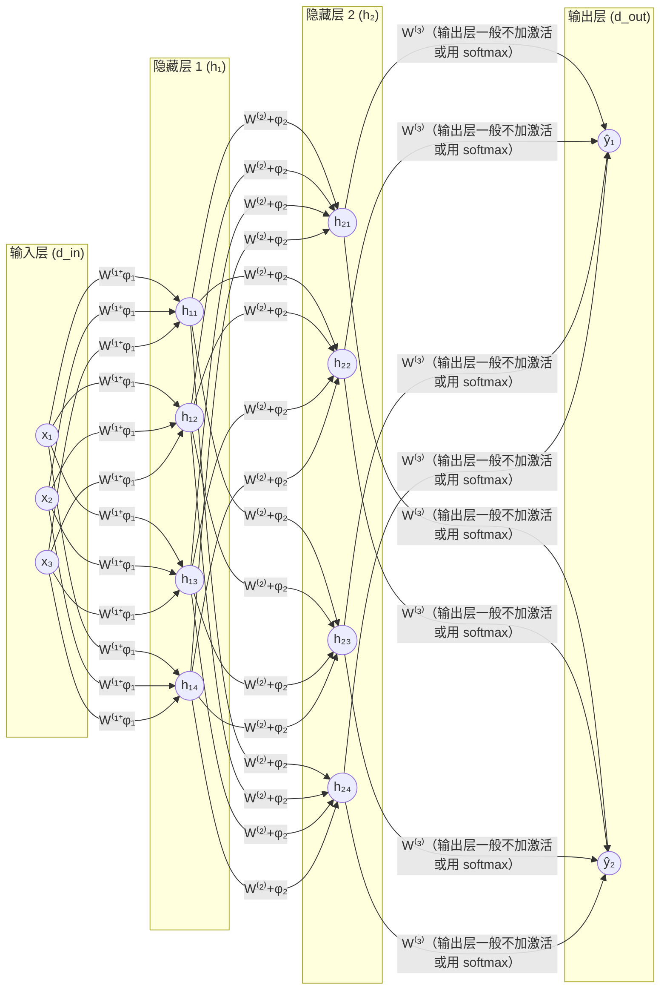
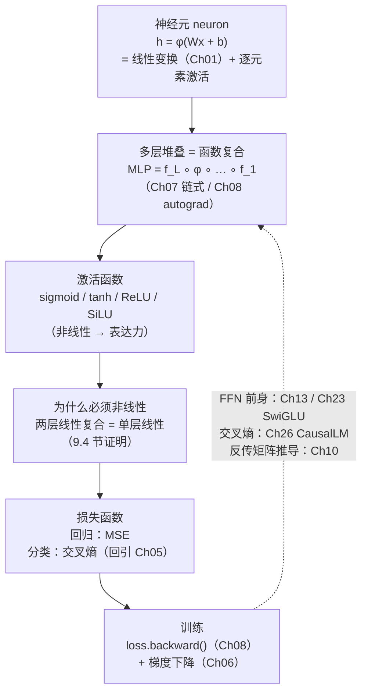

# 第 9 章 神经网络基础

Part I 把数学地基封了顶：Ch 01 告诉我们矩阵乘法就是**线性变换** $A\mathbf{x}$ ，Ch 06 告诉我们怎么用**梯度下降** $\theta\leftarrow\theta-\eta\nabla\mathcal{L}$ 把损失一点点降下去，Ch 07 给了**链式法则** $\nabla_{\mathbf{x}}L=J^\top\nabla_{\mathbf{y}}L$ 让梯度能穿越复合函数，Ch 08 把这一切交给 `loss.backward()` 自动执行。但这些工具一直面对的是「一个矩阵」或「一条小计算图」——真正的语言模型是**几十层堆叠的、带非线性激活的复合函数**。本章就把这个「层 + 激活」的最小单元拼出来：它是 Part II 的**开门章**，从这里起我们要第一次写出真正「有可学习参数、有非线性」的模型。

最小单元其实极简——**一个神经元（neuron）= 一次线性加权求和 + 一次非线性激活**： $\mathbf{h}=\phi(W\mathbf{x}+\mathbf{b})$ 。把它多层堆叠、用链式法则串起来，就是**多层感知机（Multi-Layer Perceptron, MLP）**——一切深度网络的祖先，也是 Transformer 前馈层（Ch 13、Ch 23）的直系前身。激活函数选什么、损失函数怎么定、为什么非要有非线性，这三个问题是本章的全部主线。

> **给定一堆「输入向量 → 输出标签」的数据，怎么用「线性变换 + 非线性激活」堆出一个能从数据里学规律的函数 $f_\theta$ ？为什么去掉非线性激活，堆再多层也白搭？**

本章是 **Part II 深度学习与 Transformer 理论**的起点。它**消费** Ch 01（矩阵乘=线性变换）、Ch 06（梯度下降）、Ch 07（链式法则）、Ch 08（autograd），把它们装进第一个真正可训练的模型；它**产出** MLP、激活函数、损失函数这套词汇，给 Ch 10（反向传播的矩阵推导）提供网络结构，给 Ch 23（SwiGLU 前馈层）提供激活函数，给 Ch 26（CausalLM 头）提供损失函数。读懂本章，你就能在 Ch 23 看到 `silu(gate(x) * up(x))` 时一眼认出「这不过是 MLP 换了个激活 + 加了门控」，在 Ch 26 看到 `F.cross_entropy(logits, labels)` 时知道它就是 Ch 05 的交叉熵挂在 MLP 输出端。

## 9.1 学习目标

读完本章，你应该能够：

- 写出**单个神经元**的公式 $\mathbf{h}=\phi(W\mathbf{x}+\mathbf{b})$ ，并指出它由「线性变换（Ch 01）+ 逐元素非线性激活」两段组成；
- 把**多层感知机（MLP）**写成函数复合 $`\mathbf{f}_L\circ\phi_{L-1}\circ\mathbf{f}_{L-1}\circ\cdots\circ\phi_1\circ\mathbf{f}_1`$ ，并解释「层间非线性」是堆叠能增加表达力的唯一原因；
- 默写四种激活函数的定义与导数：**sigmoid** $\sigma(x)=\frac{1}{1+e^{-x}}$ 、**tanh**、**ReLU** $\max(0,x)$ 、**SiLU/Swish** $x\sigma(x)$ ；
- 对每个激活函数说出它的**形状特征与梯度缺陷**：sigmoid 的梯度消失、ReLU 的死神经元、SiLU 的平滑可导；
- 写出两种损失函数：回归用的 **MSE** $\frac1n\sum_i(\hat y_i-y_i)^2$ ，分类用的**交叉熵** $-\sum_k t_k\log\hat\pi_k$ （回引 Ch 05）；
- **证明**「两层线性变换的复合仍是线性变换」，并据此论证「去掉非线性激活，多层 MLP 退化成单层线性模型」；
- 论证为什么 MLP 是 Transformer **前馈网络（FFN）**的前身，并预告 SwiGLU（Ch 23）与交叉熵损失（Ch 26）。

本章承接 Ch 08 的 autograd，把「可微算子的组合」具化为「线性层 + 激活的堆叠」，并为 Ch 10 把反向传播写成矩阵推导铺好网络结构。

## 9.2 直觉与动机

### 类比一：从生物神经元到数学神经元

生物神经元的工作方式很朴素：树突接收一堆输入信号，每个信号乘上一个**突触强度**（有的强、有的弱），加起来得到一个总激励；如果总激励超过某个**阈值**，神经元就「放电」输出一个脉冲，否则保持静息。这套「**加权求和 + 阈值触发**」的机制，正是人工神经元的蓝本。

把它数学化：输入向量 $\mathbf{x}\in\mathbb{R}^{d_{\text{in}}}$ 是树突收到的信号；权重向量 $\mathbf{w}\in\mathbb{R}^{d_{\text{in}}}$ 是突触强度；偏置 $b\in\mathbb{R}$ 是阈值；加权求和 $z=\mathbf{w}^\top\mathbf{x}+b$ 是总激励；激活函数 $\phi:\mathbb{R}\to\mathbb{R}$ 是「放电」规则。一个神经元的输出就是：

$$
h=\phi(\mathbf{w}^\top\mathbf{x}+b)
$$

把 $d_{\text{out}}$ 个这样的神经元**并行**排成一排、共用同一个输入 $\mathbf{x}$ ，每个神经元有自己的权重行 $\mathbf{w}_i^\top$ 和偏置 $b_i$ ，就得到一个**层（layer）**。把这 $d_{\text{out}}$ 行权重摞成矩阵 $W\in\mathbb{R}^{d_{\text{out}}\times d_{\text{in}}}$ 、偏置摞成向量 $\mathbf{b}\in\mathbb{R}^{d_{\text{out}}}$ ，再用激活函数逐元素作用，就是一个线性层的完整公式：

$$
\mathbf{h}=\phi(W\mathbf{x}+\mathbf{b})
$$

这里 $W\mathbf{x}$ 正是 Ch 01 的矩阵乘法 = 线性变换； $+\mathbf{b}$ 是 Ch 08 讲过的广播加偏置； $\phi(\cdot)$ 逐元素作用，把线性变换「弯折」成非线性映射。**一个层 = 一个线性变换 + 一个逐元素非线性**——这是全书所有模型组件的最小重复单元。

> **一句话记牢：神经元 = 加权求和（ $W\mathbf{x}+\mathbf{b}$ ，线性）+ 激活（ $\phi$ ，非线性）。两者缺一不可：去掉线性就没有「学习权重」，去掉非线性就没有「表达力」（9.4 节会严格证明）。**

### 类比二：MLP = 多层堆叠 = 函数复合

单层神经元只能学一个「弯一次」的映射，太弱。真正的力量来自**堆叠**：把上一层的输出 $\mathbf{h}^{(\ell-1)}$ 当下一层的输入，每层都有自己的 $W^{(\ell)},\mathbf{b}^{(\ell)},\phi^{(\ell)}$ ，层层套娃。这就是**多层感知机（MLP）**：

$$
\mathbf{h}^{(1)}=\phi_1(W^{(1)}\mathbf{x}+\mathbf{b}^{(1)}),\quad \mathbf{h}^{(2)}=\phi_2(W^{(2)}\mathbf{h}^{(1)}+\mathbf{b}^{(2)}),\quad \dots
$$

用 Ch 07 的语言说，这就是**函数复合** $`f=\mathbf{f}_L\circ\phi_{L-1}\circ\cdots\circ\mathbf{f}_1`$ ；用 Ch 08 的语言说，这就是一张**计算图**，每个 $\mathbf{f}_\ell$ （线性层）和 $\phi_\ell$ （激活）都是一个算子节点，前向建图、反向由 `loss.backward()` 自动求导。所以 MLP 把 Part I 的四件武器——线性变换、梯度下降、链式法则、autograd——全部串到了一起。

下面这张图是一个典型的 3 层 MLP（输入层 → 隐藏层 1 → 隐藏层 2 → 输出层），每个圆圈是一个神经元，每条连线是一个权重 $W_{ij}$ ：



每两层之间都是「矩阵乘 + 偏置 + 激活」的三段式。**全连接（fully connected）**——每个上层神经元都和所有下层神经元相连——是 MLP 的标志，也是它和后面卷积网络、注意力网络（只让一部分位置交互）的分野。Transformer 的前馈层（Ch 13、Ch 23）本质上就是这样一个两层 MLP，只不过激活函数换成了带门控的 SwiGLU。

### 概念地图：从神经元到 MLP 到损失 ⭐

把本章概念按「神经元 → MLP → 激活函数 → 损失函数 → 训练」串起来，并标出与后续章节的挂钩点：



这张图是本章骨架：左上是**结构**（神经元 → MLP），中间是**关键部件**（激活函数）和**理论命门**（为什么非线性），右下是**学习目标**（损失 + 训练）。虚线箭头指向后续章节——MLP 会在 Ch 23 变身 SwiGLU、在 Ch 26 接上交叉熵损失、在 Ch 10 展开成矩阵形式的反向传播。带着这张图进入严格的数学定义。

## 9.3 数学定义

### 9.3.1 线性层（全连接层）

设输入 $\mathbf{x}\in\mathbb{R}^{d_{\text{in}}}$ ，权重矩阵 $W\in\mathbb{R}^{d_{\text{out}}\times d_{\text{in}}}$ ，偏置 $\mathbf{b}\in\mathbb{R}^{d_{\text{out}}}$ 。一个**线性层（linear layer）**（又叫**全连接层 fully-connected layer**）定义为：

$$
\boxed{ \mathbf{z}=W\mathbf{x}+\mathbf{b},\qquad z_i=\sum_{j=1}^{d_{\text{in}}}W_{ij} x_j+b_i }
$$

这正是 Ch 01 的矩阵乘法： $W$ 把 $\mathbb{R}^{d_{\text{in}}}$ 里的向量线性变换到 $\mathbb{R}^{d_{\text{out}}}$ 。 $W$ 的每一行 $\mathbf{w}_i^\top$ 是一个神经元的权重， $b_i$ 是它的偏置。**线性层的可学习参数就是 $W$ 和 $\mathbf{b}$**——它们的元素总数 $d_{\text{out}}\times d_{\text{in}}+d_{\text{out}}$ 在大模型里动辄上千万，是 autograd 要回传梯度的对象。

> 批处理：实际训练一次喂一个 batch，输入变成 $X\in\mathbb{R}^{B\times d_{\text{in}}}$ （ $B$ 是 batch size）。线性层写成 $Z=XW^\top+\mathbf{b}$ ，输出 $Z\in\mathbb{R}^{B\times d_{\text{out}}}$ 。偏置 $\mathbf{b}$ 靠 Ch 08 的广播加到每行上。本章为简洁主要写单样本形式 $W\mathbf{x}+\mathbf{b}$ ，结论对 batch 形式完全成立。

### 9.3.2 神经元与激活函数

把线性变换的结果 $\mathbf{z}$ 逐元素套上一个**激活函数（activation function）** $\phi:\mathbb{R}\to\mathbb{R}$ ，就得到一个**神经元层**：

$$
\boxed{ \mathbf{h}=\phi(W\mathbf{x}+\mathbf{b}),\qquad h_i=\phi(z_i) }
$$

这里 $\phi$ 逐元素作用（即 $h_i=\phi(z_i)$ ，不同分量互不影响）。 $\phi$ 的选择决定了这一层「怎么弯折」。下面是四种最常用的激活函数，每个都给出定义与导数（导数是 Ch 07 链式法则、Ch 10 矩阵反传要用到的局部雅可比）。

**Sigmoid**（ logistic sigmoid，把任意实数压到 $(0,1)$ ）：

$$
\sigma(x)=\frac{1}{1+e^{-x}},\qquad \sigma'(x)=\sigma(x)\bigl(1-\sigma(x)\bigr)
$$

导数推导：令 $s=\sigma(x)$ ，则 $\sigma'(x)=\frac{e^{-x}}{(1+e^{-x})^2}=s\cdot\frac{e^{-x}}{1+e^{-x}}=s(1-s)$ 。这个「导数用原函数表示」的形式在反向传播里极方便，但也埋下了**梯度消失**的隐患（9.4 节详谈）。

**Tanh**（双曲正切，压到 $(-1,1)$ ）：

$$
\tanh(x)=\frac{e^{x}-e^{-x}}{e^{x}+e^{-x}},\qquad \tanh'(x)=1-\tanh^2(x)
$$

它与 sigmoid 的关系： $\tanh(x)=2\sigma(2x)-1$ 。值域以 $0$ 为中心（zero-centered），收敛通常比 sigmoid 快，但同样有梯度饱和问题。

**ReLU**（Rectified Linear Unit，整流线性单元，现代深度学习的默认激活）：

$$
\mathrm{ReLU}(x)=\max(0,x),\qquad \mathrm{ReLU}'(x)=\begin{cases}1,&x>0\cr0,&x<0\end{cases}
$$

$x=0$ 处不可导，工程上取次梯度（通常记为 $0$ ）。ReLU 的最大优点：**正区间梯度恒为 1**，深层网络也不会梯度消失——这是它能训练百层网络的根基。代价是**死神经元**（dead neuron）：负区间梯度恒为 $0$ ，一旦某个神经元的输入长期为负，它就再也收不到梯度、永久「死亡」。

**SiLU / Swish**（Sigmoid Linear Unit，现代 LLM 的标配激活）：

$$
\mathrm{SiLU}(x)=x \sigma(x)=\frac{x}{1+e^{-x}},\qquad \mathrm{SiLU}'(x)=\sigma(x)+x \sigma(x)\bigl(1-\sigma(x)\bigr)=\sigma(x)\bigl[1+x\bigl(1-\sigma(x)\bigr)\bigr]
$$

SiLU 是 ReLU 的「平滑版」： $x\to+\infty$ 时 $\mathrm{SiLU}(x)\to x$ （和 ReLU 一样线性增长）， $x\to-\infty$ 时 $\mathrm{SiLU}(x)\to 0$ （但不像 ReLU 那样硬截断到 $0$ ，而是平滑地趋近）。它在 $x<0$ 区域**有非零梯度**（不像 ReLU 那样直接归零），因此没有死神经元问题；又因为处处光滑可导，训练比 ReLU 更稳。zllm 的 SwiGLU（Ch 23）正是用 SiLU 做门控。

> 一句话对比：**sigmoid/tanh 平滑但饱和（梯度消失）；ReLU 不饱和但有死区；SiLU 兼顾平滑、不饱和、非零负梯度**——这就是现代 LLM 普遍选 SiLU 系激活的原因。

### 9.3.3 多层感知机（MLP）

$L$ 层 MLP 是 $L$ 个「线性层 + 激活」的复合。记第 $\ell$ 层的输入为 $\mathbf{h}^{(\ell-1)}$ （约定 $\mathbf{h}^{(0)}=\mathbf{x}$ 为网络输入），输出为 $\mathbf{h}^{(\ell)}$ ，则：

$$
\boxed{ \mathbf{h}^{(\ell)}=\phi_\ell\bigl(W^{(\ell)}\mathbf{h}^{(\ell-1)}+\mathbf{b}^{(\ell)}\bigr),\quad \ell=1,\dots,L }
$$

整个 MLP 就是 $`f_\theta(\mathbf{x})=\mathbf{h}^{(L)}=\phi_L\circ\mathbf{f}_L\circ\cdots\circ\phi_1\circ\mathbf{f}_1(\mathbf{x})`$ ，其中 $\mathbf{f}_\ell(\cdot)=W^{(\ell)}(\cdot)+\mathbf{b}^{(\ell)}$ 是第 $\ell$ 个线性变换。所有参数 $\theta=\{W^{(\ell)},\mathbf{b}^{(\ell)}\}_{\ell=1}^L$ 都是可学习的。**输出层**（第 $L$ 层）的激活 $\phi_L$ 视任务而定：回归任务常不加激活（直接输出实数），分类任务接 softmax 把 logits 变成概率分布（见损失函数小节）。

MLP 的「层间宽度」 $d_1,d_2,\dots,d_L$ 是超参数。一个常见配置是「先扩张再收缩」：比如 $d_{\text{in}}\to 4d\to d_{\text{out}}$ ——这正是 Transformer FFN（Ch 13、Ch 23）的形状。注意「$4d$」是原始 Transformer 的约定，**zllm 实际采用 π-缩放**：`intermediate_size=2432`（$\lceil 768\pi/64\rceil\times 64$，约 3.17 倍，对齐 64 倍数以提升 Tensor Core 利用率，详见 Ch 16/23）。

### 9.3.4 损失函数

网络定义好后，还需要一个**损失函数（loss function）** $\mathcal{L}$ 来衡量「预测和真值差多少」。Ch 06 的梯度下降就是沿 $-\nabla_\theta\mathcal{L}$ 更新参数。两种最基本的损失：

**均方误差（Mean Squared Error, MSE）**——回归任务的默认损失。设真值 $\mathbf{y}\in\mathbb{R}^{n}$ 、预测 $\hat{\mathbf{y}}\in\mathbb{R}^{n}$ ：

$$
\boxed{ \mathcal{L}_{\text{MSE}}(\mathbf{y},\hat{\mathbf{y}})=\frac{1}{n}\sum_{i=1}^{n}(y_i-\hat y_i)^2 }
$$

MSE 对每个误差平方求平均，**大误差被放大**（平方），因此对离群点敏感。它的梯度 $\partial\mathcal{L}/\partial\hat y_i=-\frac{2}{n}(y_i-\hat y_i)$ 形式简单、处处可导，是教学首选。

**交叉熵损失（Cross-Entropy Loss）**——分类任务与语言模型的默认损失。设真实标签为 one-hot 向量 $\mathbf{t}$ （第 $k$ 类为 $1$ 、其余为 $0$ ），模型预测的概率分布为 $\hat{\boldsymbol\pi}=\mathrm{softmax}(\mathbf{z})$ ，则：

$$
\boxed{ \mathcal{L}_{\text{CE}}(\mathbf{t},\hat{\boldsymbol\pi})=-\sum_{k=1}^{K}t_k\log\hat\pi_k=-\log\hat\pi_{y} }
$$

最后一步是因为 one-hot 里只有 $t_y=1$ 、其余为 $0$ ，求和只剩正确类 $y$ 的负对数概率。这正是 Ch 05 讲过的交叉熵 $H(\mathbf{t},\hat{\boldsymbol\pi})$ ——Ch 05 已经从信息论根上证明了「最小化交叉熵 ⟺ 最小化 KL 散度 ⟺ 让模型分布逼近数据分布」，本章不再重复，只把它**当作分类与语言模型的标准损失**使用。

> softmax + 交叉熵是一个「黄金组合」：softmax 把 logits $\mathbf{z}$ 变成概率 $\hat{\boldsymbol\pi}$ ，交叉熵衡量 $\hat{\boldsymbol\pi}$ 与真值 $\mathbf{t}$ 的差距。把两者合起来对 logits 求导，会得到一个异常简洁的结果 $\partial\mathcal{L}/\partial\mathbf{z}=\hat{\boldsymbol\pi}-\mathbf{t}$ （Ch 10 会严格推导）——这个「预测减真值」的形式是分类网络反向传播的起点。

## 9.4 推导与几何

本节做两件事：① 画出四种激活函数的**形状**并分析它们的**梯度特性**（梯度消失 / 死神经元 / 平滑）；② **证明**「没有非线性，多层 MLP 退化成单层线性」——这是全章最关键的理论命门。

### 9.4.1 激活函数的形状与梯度特性

把四种激活函数画在同一张图上对比（横轴 $x$ ，纵轴 $\phi(x)$ ）：

```
   φ(x)
    ↑                      SiLU  ──────╲
  3 ┤                            ╱      ╲────  (x→+∞ 时 SiLU≈x，与 ReLU 重合)
    │                           ╱
  2 ┤          ReLU ──────────╱──────────→  (x>0: 斜率 1)
    │         ╱               ╱
  1 ┤        ╱           tanh ╱············→  (饱和到 ±1)
    │       ╱       ·········
  0 ┤──────╱········──────────────────── ────→  ReLU 在 x=0 折点
    │  ···╱········· sigmoid (饱和到 0/1)
 -1 ┤ ·╱
    │╱
 -2 ┤       SiLU 在 x<0 有小幅负值后回到 0（平滑，无死区）
    │   ╲
 -3 ┤     ╲────
    └────┬────┬────┬────┬────┬────┬────→ x
        -3   -2   -1    0    1    2    3

   sigmoid: S 形, 值域 (0,1), 两端饱和 → 梯度→0（梯度消失）
   tanh   : S 形, 值域 (-1,1), 两端饱和 → 梯度→0（梯度消失, 但比 sigmoid 轻）
   ReLU   : x<0 为 0, x>0 为 x, 折点不可导 → 负区死神经元
   SiLU   : 平滑, x<0 有小负值后回 0, x>0 趋近 x → 无死区、处处可导
```

四个激活函数各有「软肋」，训练时必须权衡：

**Sigmoid / Tanh 的梯度消失（vanishing gradient）。** 注意 $\sigma'(x)=\sigma(x)(1-\sigma(x))$ 的最大值：当 $\sigma(x)=0.5$ 时取到 $\sigma'(x)=0.25$ ； $x$ 远离 $0$ 时 $\sigma(x)$ 趋近 $0$ 或 $1$ ， $\sigma'(x)$ 趋近 $0$ 。tanh 同理（ $\tanh'(x)=1-\tanh^2(x)$ 在 $|\tanh|\to1$ 时趋 $0$ ）。把多层 sigmoid 串起来，按 Ch 07 链式法则，深层梯度是各层 $\sigma'$ 的连乘——每个因子 $\le 0.25$ ，乘十几层就指数级衰减到几乎为零。**梯度一消失，深层参数就收不到学习信号、训不动**——这是早期深网训不起来的根本原因，也是 ReLU 兴起的直接动机。

**ReLU 的死神经元（dead neuron）。** ReLU 在正区间梯度恒为 $1$ （彻底告别梯度消失），这是它的胜利。但代价是负区间梯度恒为 $0$ ：如果一个神经元的输入 $z_i$ 因为某次大梯度更新而长期落在负区，它对损失的梯度永远是 $0$ ，这个神经元就**永久死亡**、再也不更新。死神经元多了，网络的「有效宽度」缩水，表达力下降。各种改良版（Leaky ReLU 给负区一个小斜率、GELU/SiLU 给负区一个平滑的非零响应）都是为缓解这个问题。

**SiLU 的平滑与负区非零。** SiLU 在 $x<0$ 区域并非硬截断到 $0$ ，而是先略微下探到一个小的负值（约 $-0.28$ 在 $x\approx-1.28$ 处），再平滑地回到 $0$ ； $x>0$ 时趋近 $x$ （和 ReLU 一样）。关键好处：① 处处光滑可导（没有 ReLU 的折点），数值稳定；② 负区有非零梯度（ $\mathrm{SiLU}'(x)$ 在 $x<0$ 不为零），没有死神经元；③ 实验上在大模型上经验性地优于 ReLU。代价是计算稍贵（要算一次 sigmoid），但 GPU 上这点开销可忽略——**所以现代 LLM（包括 zllm）几乎清一色用 SiLU 系激活**。

### 9.4.2 为什么必须有非线性激活 ⭐⭐

现在回答本章标题背后最深刻的问题：**为什么一定要有激活函数 $\phi$ ？去掉它，堆一百层线性层会怎样？**

答案：**会退化成单层线性模型，白堆。** 给个简短证明。考虑两层**没有激活**的线性层（即 $\phi$ 是恒等函数）：

$$
\mathbf{h}^{(1)}=W^{(1)}\mathbf{x}+\mathbf{b}^{(1)},\qquad \mathbf{h}^{(2)}=W^{(2)}\mathbf{h}^{(1)}+\mathbf{b}^{(2)}
$$

把 $\mathbf{h}^{(1)}$ 代入 $\mathbf{h}^{(2)}$ ：

$$
\mathbf{h}^{(2)}=W^{(2)}\bigl(W^{(1)}\mathbf{x}+\mathbf{b}^{(1)}\bigr)+\mathbf{b}^{(2)}=\underbrace{\bigl(W^{(2)}W^{(1)}\bigr)}_{W'}\mathbf{x}+\underbrace{\bigl(W^{(2)}\mathbf{b}^{(1)}+\mathbf{b}^{(2)}\bigr)}_{\mathbf{b}'}
$$

也就是说，两层线性层的复合等价于**单层**线性层，参数为 $W'=W^{(2)}W^{(1)}$ 、 $\mathbf{b}'=W^{(2)}\mathbf{b}^{(1)}+\mathbf{b}^{(2)}$ 。无论堆多少层，最终都能被一层吸收。归纳到 $L$ 层：

$$
\boxed{ \text{若所有 }\phi_\ell\text{ 都是线性的，则 }L\text{ 层 MLP }=\text{ 单层线性变换 }W'\mathbf{x}+\mathbf{b}',\text{ 层数白堆。} }
$$

**这就是激活函数不可替代的根本原因**：非线性是阻止「多层塌缩成一层」的唯一机制。只有每层之间塞进非线性 $\phi$ ，复合函数才无法被单层吸收，堆叠才真正增加表达力。换言之，**深度学习的「深度」之所以有用，前提是每层之间有非线性激活**。

> 几何直觉：线性变换只能「旋转 + 缩放」（Ch 01），无论复合多少次，整体仍是旋转 + 缩放——它**弯不出曲线**。而非线性激活把决策边界「掰弯」，让网络能拟合任意复杂的函数（这正是**万能逼近定理 universal approximation theorem** 的内容：只要有一层足够宽的隐藏层 + 非线性激活，MLP 就能以任意精度逼近任何连续函数）。没有非线性，再宽再深也只能画直线。

## 9.5 与本项目联系

理论就绪，现在把它和后续章节钉死。本节四个钩子展示「线性层 + 激活 + 损失」如何在 Transformer 里落地。

### 钩子一：SwiGLU = MLP + SiLU 门控（Ch 23）⭐⭐

本章的 MLP 是一个「线性层 → 激活 → 线性层」的三段式（扩张 → 激活 → 收缩）。Transformer 的**前馈网络（Feed-Forward Network, FFN）**就是这个 MLP 的直系后代，差别只在激活函数和「门控」。zllm 用的 **SwiGLU**（Ch 23）把标准的 $\phi(\cdot)$ 升级成「**SiLU 门控**」：先把输入投影到两个等宽的中间向量，一个过 SiLU、另一个当作「门」逐元素相乘，再投影回原宽度：

$$
\boxed{ \mathrm{FFN}(\mathbf{x})=\mathrm{down}\bigl(\mathrm{SiLU}(\mathrm{gate}(\mathbf{x}))\odot\mathrm{up}(\mathbf{x})\bigr) }
$$

其中 $\mathrm{up}(\mathbf{x})=W_{\text{up}}\mathbf{x}$ 、 $\mathrm{gate}(\mathbf{x})=W_{\text{gate}}\mathbf{x}$ 是两个并行的线性扩张（把 $d$ 维扩到 $d_{\text{ff}}$ 维，zllm 用 π-缩放取 2432，见上文）， $\mathrm{SiLU}(\cdot)$ 是本章定义的 $x\sigma(x)$ ， $\odot$ 是逐元素乘， $\mathrm{down}(\cdot)=W_{\text{down}}(\cdot)$ 是线性收缩（把 $d_{\text{ff}}$ 维压回 $d$ 维）。

读懂本章你就读懂了 SwiGLU 的 90%：它就是「MLP 的激活函数从 ReLU 换成 SiLU，并多加了一个门控分支」。SiLU 的平滑性 + 门控的「选择性放行」让 FFN 比传统 ReLU-MLP 表达力更强、训练更稳——这是现代 LLM（LLaMA、Mistral、zllm）普遍选 SwiGLU 的原因。Ch 13 会讲 Transformer 整体架构，Ch 23 会逐行拆开 SwiGLU 的实现，到那时你会回来感谢本章打下的激活函数基础。

### 钩子二：CausalLM 用交叉熵损失（Ch 26）⭐⭐

本章定义的交叉熵损失 $`\mathcal{L}_{\text{CE}}=-\log\hat\pi_y`$ 正是语言模型训练的标准损失。zllm 的 `ZLLMForCausalLM`（Ch 26）做**下一个 token 预测（Next-Token Prediction, NTP）**：给定上文，在词表（大小 $V$ ）上预测下一个 token。流程是：

$$
\text{隐藏向量 }\mathbf{h}\in\mathbb{R}^{d}\ \xrightarrow{\ \text{lm\_head}\ }\ \mathbf{z}\in\mathbb{R}^{V}\ \xrightarrow{\ \text{softmax}\ }\ \hat{\boldsymbol\pi}\in\mathbb{R}^{V}\ \xrightarrow{\ \text{cross-entropy}\ }\ \mathcal{L}
$$

`lm_head` 是一个把 $d$ 维压回 $V$ 维的线性层（本章的 $W^{(L)}$ ）；softmax 把 logits $\mathbf{z}$ 变成概率 $\hat{\boldsymbol\pi}$ ；交叉熵衡量 $\hat{\boldsymbol\pi}$ 与真值 token 的差距。Ch 05 已经从信息论证明了「最小化交叉熵 ⟺ 让模型分布逼近数据分布」，本章把它和「线性层 + softmax」接上，闭环就完成了。Ch 26 会讲 weight tying（让 `lm_head` 和 embedding 共享权重）、label masking（SFT 时只对回答算 loss）等工程细节，但损失函数的内核就是本章的交叉熵。

### 钩子三：MLP 是 Transformer FFN 的前身（Ch 13 / Ch 23）⭐

Transformer（Ch 13）的每个 Block 由两半组成：**注意力层（Ch 12）** + **前馈层（FFN）**。注意力层负责「token 之间交换信息」，FFN 负责「每个 token 自己做非线性变换」——而 FFN 就是本章的 MLP。换句话说：

$$
\text{Transformer Block}=\text{Attention}+\underbrace{\text{MLP（本章）}}_{\text{FFN，Ch 23}}+\text{残差}+\text{归一化}
$$

本章学透了 MLP，Ch 13 学 Transformer 时你就只剩「注意力」和「残差/归一化」两块新东西要学，FFN 这块是已经会的。这也是为什么本章是 Part II 的开门章：它是后续一切架构（RNN、CNN、Transformer）的**共同地基**——任何深度网络，剥到底都是「线性层 + 非线性激活」的堆叠。

### 钩子四：反向传播的矩阵推导交给 Ch 10

本章只写了前向（ $\mathbf{h}=\phi(W\mathbf{x}+\mathbf{b})$ ）和损失，没写「怎么算 $\partial\mathcal{L}/\partial W^{(\ell)}$ 」。原因有二：① Ch 08 的 autograd 已经让 `loss.backward()` 全自动完成，工程上不需要手写；② 但**理解**训练动力学（为什么深网难训、为什么残差连接能缓解梯度消失、为什么要归一化）必须掌握矩阵形式的反向传播。Ch 10 会把本章的 MLP 展开成完整的矩阵反传公式：

$$
\frac{\partial\mathcal{L}}{\partial W^{(\ell)}}=\boldsymbol\delta^{(\ell)}\bigl(\mathbf{h}^{(\ell-1)}\bigr)^\top,\qquad \boldsymbol\delta^{(\ell)}=\bigl(W^{(\ell+1)}\bigr)^\top\boldsymbol\delta^{(\ell+1)}\odot\phi_\ell'(\mathbf{z}^{(\ell)})
$$

其中 $\boldsymbol\delta^{(\ell)}=\partial\mathcal{L}/\partial\mathbf{z}^{(\ell)}$ 是「误差信号」。注意那个 $\phi_\ell'(\mathbf{z}^{(\ell)})$ ——它正是本章每个激活函数的导数！sigmoid 的 $\sigma'\le0.25$ 会把误差信号层层衰减（梯度消失），ReLU 的 $\mathrm{ReLU}'\in\{0,1\}$ 会把负区误差信号直接归零（死神经元）——9.4 节讲的激活函数梯度特性，在 Ch 10 的矩阵反传里会以「误差信号衰减/归零」的形态精确重现。所以本章是 Ch 10 的**直接前置**：先认清每个 $\phi'$ 长什么样，Ch 10 才能把它们插进矩阵链式法则里。

## 9.6 本章小结

让我们把这一章浓缩成几条可以随身携带的结论：

1. **神经元 = 线性 + 激活**： $\mathbf{h}=\phi(W\mathbf{x}+\mathbf{b})$ 。 $W\mathbf{x}+\mathbf{b}$ 是 Ch 01 的线性变换， $\phi$ 是逐元素非线性。两者缺一不可。
2. **MLP = 多层复合**： $\mathbf{h}^{(\ell)}=\phi_\ell(W^{(\ell)}\mathbf{h}^{(\ell-1)}+\mathbf{b}^{(\ell)})$ ，整个网络是函数复合 $`f=\phi_L\circ\mathbf{f}_L\circ\cdots\circ\mathbf{f}_1`$ ，由 Ch 08 的 autograd 自动求导。
3. **四种激活**：sigmoid $\frac{1}{1+e^{-x}}$ 、tanh、ReLU $\max(0,x)$ 、SiLU $x\sigma(x)$ 。现代 LLM 默认选 SiLU 系（平滑、无死区、负区非零梯度）。
4. **梯度特性**：sigmoid/tanh 饱和 → 梯度消失（ $\sigma'\le0.25$ ）；ReLU 负区梯度为零 → 死神经元；SiLU 处处光滑可导、负区非零 → 兼顾两者优点。
5. **两种损失**：回归用 MSE $\frac1n\sum(y_i-\hat y_i)^2$ ，分类/语言模型用交叉熵 $-\log\hat\pi_y$ （回引 Ch 05，最小化交叉熵 ⟺ 最小化 KL）。
6. **非线性不可替代**：两层线性复合 = 单层线性（ $W^{(2)}W^{(1)}\mathbf{x}+(W^{(2)}\mathbf{b}^{(1)}+\mathbf{b}^{(2)})$ ），所以没有激活函数，堆再多层也白搭——**深度之所以有用，前提是非线性**。
7. **MLP 是 Transformer FFN 的前身**：FFN（Ch 13/23）就是「线性扩张 → 激活 → 线性收缩」的 MLP，SwiGLU 把激活换成 SiLU 门控（Ch 23）。
8. **交叉熵是语言模型的损失**：`lm_head` 线性层 + softmax + 交叉熵（Ch 26），最小化它就是让模型分布逼近数据分布（Ch 05）。

> **一句话记牢：神经元是「线性变换 + 非线性激活」的堆叠单元；MLP 是它的多层复合；激活函数的导数决定梯度能否回流（sigmoid 消失、ReLU 死区、SiLU 平滑）；没有非线性，深度就是幻觉。**

> **前方预告。** 本章搭好了「网络结构」——一个 $L$ 层 MLP 是怎么前向算出预测、怎么用交叉熵算损失的。但「怎么从损失一步步算到每层 $W^{(\ell)}$ 的梯度」我们故意留白了：它需要把 Ch 07 的链式法则展开成矩阵形式，揭示「误差信号 $\boldsymbol\delta^{(\ell)}$ 如何在层间反向流动」。下一章（Ch 10《反向传播与训练动力学》）就专门做这件事——把本章的 MLP 喂进矩阵反传公式，看清梯度消失/爆炸的物理来源、残差连接与归一化为什么是深网的命门。带着本章的 $\phi'$ 和 MLP 结构，我们进入 Ch 10。

### 思考题

> 写答案前，建议先想「这题在考哪个概念（神经元公式 / 激活函数导数 / 非线性必要性 / 损失函数选择）」，再动笔推导。

1. **推导题**：用 9.4 节的方法把证明推广到三层。设三层线性层（无激活） $\mathbf{h}^{(1)}=W^{(1)}\mathbf{x}+\mathbf{b}^{(1)}$ 、 $\mathbf{h}^{(2)}=W^{(2)}\mathbf{h}^{(1)}+\mathbf{b}^{(2)}$ 、 $\mathbf{h}^{(3)}=W^{(3)}\mathbf{h}^{(2)}+\mathbf{b}^{(3)}$ 。（a）求出等价的单层参数 $W'$ 、 $\mathbf{b}'$ （写成 $W^{(1)},W^{(2)},W^{(3)},\mathbf{b}^{(1)},\mathbf{b}^{(2)},\mathbf{b}^{(3)}$ 的表达式）。（b）若在第 1、2 层之间插入 ReLU，第 2、3 层之间插入 ReLU，这个「等价于单层」的结论还成立吗？为什么？（提示： $\mathrm{ReLU}(W^{(2)}\mathrm{ReLU}(W^{(1)}\mathbf{x}+\mathbf{b}^{(1)})+\mathbf{b}^{(2)})$ 能否写成某个 $W'\mathbf{x}+\mathbf{b}'$ ？ReLU 的非线性破坏了什么？）
2. **梯度题**：（a）已知 sigmoid 导数 $\sigma'(x)=\sigma(x)(1-\sigma(x))$ ，求 $\sigma'(x)$ 的最大值（在哪个 $x$ 取到？最大值是多少？）。据此解释：一个 10 层全 sigmoid 的 MLP，深层梯度最坏情况下会被压缩到原来的多少倍？（提示： $0.25^{10}\approx10^{-6}$ 。）（b）ReLU 在 $x>0$ 时梯度恒为 $1$ ，看似完美。但若某次大学习率更新让某神经元对所有训练样本的输入 $z_i$ 都变成负数，这个神经元的权重 $W_{i:}$ 还会更新吗？这种现象叫什么？SiLU 为什么能缓解它？（提示：算一下 $\mathrm{SiLU}'(x)$ 在 $x=-2$ 处的值，确认它非零。）
3. **损失函数题**：（a）回归任务为什么用 MSE 而不用交叉熵？（提示：回归的真值是连续实数，没有 one-hot 标签，交叉熵里的 $\log\hat\pi_k$ 对连续值无定义。）反之，分类任务为什么用交叉熵而不用 MSE？（提示：MSE + softmax 的梯度在错得离谱时会趋于零——所谓「sigmoid/softmax + MSE 的早期停滞」，而 softmax + 交叉熵的梯度是干净的 $\hat{\boldsymbol\pi}-\mathbf{t}$ 。）（b）zllm 做 NTP 任务（词表 $V=6400$ ），模型对正确 token 输出 $\hat\pi_y=0.01$ ，交叉熵损失是多少 nat？若模型改进到 $\hat\pi_y=0.5$ ，损失降了多少？（提示： $-\ln 0.01\approx4.61$ ， $-\ln 0.5\approx0.69$ 。）

---

读完本章，你已经掌握了「**神经元 = 线性变换 + 非线性激活**」「**MLP = 多层复合**」「**激活函数的形状与梯度特性**」「**MSE 与交叉熵损失**」「**非线性不可替代**」这套深度学习的最小词汇表。这是 Part II 的开门基石——后面所有架构（RNN、CNN、Transformer）剥到底都是这套词汇的不同排列。下一章（Ch 10《反向传播与训练动力学》）会把本章的 MLP 喂进矩阵形式的链式法则，看清梯度如何在层间反向流动、为什么会消失或爆炸，为理解残差连接、归一化、学习率调度打下理论基础。
