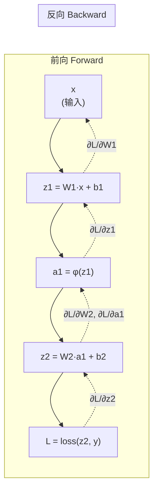

# 第 10 章 反向传播与训练动力学

上一章我们把神经元定义成「线性变换 + 非线性激活」，把多层感知机（MLP）定义成「多层复合」。但一个网络光会「前向算输出」还不够——它必须**会学习**，也就是会根据损失调整自己的权重。而这个「调整权重的依据」——梯度——正是通过**反向传播（backpropagation）**计算出来的。

反向传播不是一门新算法，它就是 Ch 07 的链式法则在计算图上的一个**高效调度**。Ch 08 的 PyTorch `loss.backward()` 已经替我们实现了它，所以本章的目标不是「重新发明 autograd」，而是让你**看懂它在做什么**：前向存了什么、反向算了什么、梯度为什么会随深度消失或爆炸、初始化和正则化又是怎么把这些病治好的。读懂这一章，你在 Ch 31 看到 `loss.backward()` 时就不会觉得它是黑魔法，在 Ch 25 看到残差连接时也能一眼看穿它「为何能训深网络」。

## 10.1 学习目标

读完本章，你应该能够：

- 用一句话说清楚反向传播的「两遍」：前向（forward）存中间激活、反向（backward）逐层求梯度；
- 默写出逐层误差信号 $\delta^{(l)}$ 和权重梯度 $\frac{\partial L}{\partial W^{(l)}}$ 的矩阵公式；
- 手推一个 2 层 MLP 的完整反传过程（明确每一步存了什么、算了什么）；
- 解释梯度消失/爆炸的根源（雅可比连乘），并说出 Xavier/He 初始化如何用方差分析来稳定它；
- 说出 $L_2$ 权重衰减和 Dropout 各自的正则化机制，以及它们在 zllm 后续章节里出现在哪里。

本章不涉及优化器细节（那是 Ch 06 的内容），只聚焦「梯度怎么算出来」和「梯度流动稳不稳定」。

## 10.2 直觉与动机

### 一个朴素的问题：百万参数怎么一起学？

一个 zllm 默认模型有约 64M 个参数，它们几乎全是矩阵里的元素。训练时，我们要为**每一个参数**算出「损失对这个参数的梯度」，再用 Ch 06 的梯度下降更新它。64M 个梯度，难道要一个个去算吗？

幸好不用。反向传播的妙处在于：**所有参数的梯度，可以在一次「从损失往回走」的遍历里全部算出来**。这就像一条流水线——产品（损失）从末端流出时，我们顺着流水线往回追溯，每一道工序（每一层）都能同时拿到「这道工序该负多少责任」的信号。

### 前向建图，反向求导

反向传播依赖一张**计算图（computational graph）**：前向时，每做一次运算就把输入和输出记下来（建图）；反向时，从损失出发，沿着图倒着走，每经过一个节点就用链式法则把「上游传来的梯度」乘以「这一步的局部导数」，得到传给下游的梯度。



实线是前向（数据流），虚线是反向（梯度流）。**关键观察**：每一层的梯度只依赖「上游传来的梯度」和「自己这一步的局部导数」——这正是链式法则的分布式版本。Ch 08 讲过，反向模式自动微分之所以高效，就是因为它一次反向就能拿到对所有参数的梯度，代价正比于图的大小。

### 为什么不直接数值求导？

一个看起来更笨但更直观的办法是「数值梯度」：对每个参数 $w_i$ 加一个微小扰动 $\epsilon$，看损失变了多少，$\frac{\partial L}{\partial w_i}\approx\frac{L(w+\epsilon e_i)-L(w-\epsilon e_i)}{2\epsilon}$。问题是 64M 个参数就要前向 64M 次，完全不可行。反向传播只需**一次前向 + 一次反向**，这是它在工程上不可替代的原因。

## 10.3 数学定义

### 记号：层数、激活、误差信号

考虑一个 $L$ 层的 MLP（Ch 09）。记第 $l$ 层：

- 线性预激活 $z^{(l)}=W^{(l)}a^{(l-1)}+b^{(l)}$，其中 $a^{(0)}=x$ 是输入；
- 激活后输出 $a^{(l)}=\phi(z^{(l)})$，$\phi$ 是激活函数；
- 最终输出 $a^{(L)}$，损失 $L=L(a^{(L)},y)$。

定义第 $l$ 层的**误差信号（error signal）**为损失对预激活的梯度：

$$
\delta^{(l)} \;\coloneqq\; \frac{\partial L}{\partial z^{(l)}}
$$

$\delta^{(l)}$ 是反传的核心载体——它把「损失如何随这一层的输入变化」这一信息从末端一路往回搬运。

### 反传四公式

把 Ch 07 的链式法则套到 MLP 上，得到经典的四个递推式：

$$
\boxed{
\begin{aligned}
\text{输出层误差：} \quad & \delta^{(L)} = \nabla_{a^{(L)}} L \;\odot\; \phi'\!\left(z^{(L)}\right) \\[4pt]
\text{隐层误差递推：} \quad & \delta^{(l)} = \left(W^{(l+1)}\right)^{\!\top} \delta^{(l+1)} \;\odot\; \phi'\!\left(z^{(l)}\right) \\[4pt]
\text{权重梯度：} \quad & \frac{\partial L}{\partial W^{(l)}} = \delta^{(l)} \left(a^{(l-1)}\right)^{\!\top} \\[4pt]
\text{偏置梯度：} \quad & \frac{\partial L}{\partial b^{(l)}} = \delta^{(l)}
\end{aligned}
}
$$

其中 $\odot$ 是逐元素乘（Hadamard 积），$\phi'$ 是激活函数的导数。请特别注意第二条递推式——它是「梯度往回传」的关键：**本层误差 = 上层误差经 $W^\top$ 反向投影 + 本层激活导数逐点调制**。整个反传就是反复套用这四条式子，从 $l=L$ 一路算到 $l=1$。

> **一个小记忆点**：前向用的是 $W$（把 $a^{(l-1)}$ 推到 $a^{(l)}$），反向用的是 $W^\top$（把 $\delta^{(l+1)}$ 推回 $\delta^{(l)}$）。矩阵被「转置后复用」，这也是为什么 autograd 不需要为反向额外存权重。

### 权重初始化：Xavier 与 He

反传还没跑，先得给权重一个**初始值**。如果全初始化为 0，同一层所有神经元算出相同的输出、拿到相同的梯度、永远同步更新——这叫「对称性破坏失败」，网络退化成一个神经元。所以初始化必须**随机**，而且要**控制方差**。

假设输入 $a^{(l-1)}$ 各分量均值 0、方差 $\sigma_{in}^2$，且与权重独立，那么线性层 $z^{(l)}_i=\sum_j W^{(l)}_{ij}a^{(l-1)}_j$ 的方差为：

$$
\mathrm{Var}(z^{(l)}_i) = n_{in}\cdot \mathrm{Var}(W_{ij})\cdot \sigma_{in}^2
$$

其中 $n_{in}$ 是该层输入维度（$W$ 的列数）。为了让前向时每层激活方差保持不变（$\mathrm{Var}(z)=\mathrm{Var}(a)$），需要：

$$
\mathrm{Var}(W_{ij}) = \frac{1}{n_{in}} \qquad \text{(Xavier / Glorot，适合 tanh/sigmoid 等零中心激活)}
$$

Xavier 的原始论文同时考虑前向和反向，给出了对称形式 $\mathrm{Var}(W)=2/(n_{in}+n_{out})$。而对于 ReLU 这类「半边为 0」的激活（会砍掉一半信号），He 初始化把方差翻倍来补偿：

$$
\mathrm{Var}(W_{ij}) = \frac{2}{n_{in}} \qquad \text{(He / Kaiming，适合 ReLU 族)}
$$

### 正则化：$L_2$ 与 Dropout

- **$L_2$ 权重衰减**：在损失里加一项 $\frac{\lambda}{2}\|W\|_2^2$，逼权重别太大。它的梯度是 $\lambda W$，所以更新时 $W\leftarrow W-\eta(\nabla L+\lambda W)=(1-\eta\lambda)W-\eta\nabla L$——每步都把权重「缩小一点点」，故称「权重衰减」。AdamW 把它从梯度项里解耦出来单独处理（Ch 06）。
- **Dropout**：训练时以概率 $p$ 随机把一部分激活置零（其余按 $1/(1-p)$ 放大以保持期望）；测试时关闭。它强迫网络不依赖任何单个神经元，相当于训练了一个「指数级大的子网络集成」。

## 10.4 推导与几何

### 手推：一个 2 层 MLP 的完整反传

理论讲完，亲手跑一遍才踏实。设一个极简网络（单样本，去掉偏置）：

$$
z^{(1)}=W^{(1)}x,\quad a^{(1)}=\phi(z^{(1)}),\quad z^{(2)}=W^{(2)}a^{(1)},\quad \hat y=\phi(z^{(2)}),\quad L=\tfrac12\|\hat y-y\|^2
$$

其中 $x\in\mathbb{R}^{3}$、隐藏层 4 维、输出 2 维，$W^{(1)}\in\mathbb{R}^{4\times3}$、$W^{(2)}\in\mathbb{R}^{2\times4}$。

**前向（建图，存中间值）：**

| 步骤 | 计算 | 要存的中间值 |
|------|------|-------------|
| 1 | $z^{(1)}=W^{(1)}x$ | $x,\ z^{(1)}$ |
| 2 | $a^{(1)}=\phi(z^{(1)})$ | $a^{(1)}$ |
| 3 | $z^{(2)}=W^{(2)}a^{(1)}$ | $z^{(2)}$ |
| 4 | $\hat y=\phi(z^{(2)})$ | $\hat y$ |
| 5 | $L=\tfrac12\|\hat y-y\|^2$ | $y$ |

**反向（从损失出发，逐层求梯度）：**

第 1 步，算输出层误差。$\frac{\partial L}{\partial \hat y}=\hat y-y$，于是

$$
\delta^{(2)}=\frac{\partial L}{\partial z^{(2)}}=(\hat y-y)\odot\phi'(z^{(2)})
$$

第 2 步，算 $W^{(2)}$ 的梯度（用公式 $\frac{\partial L}{\partial W^{(2)}}=\delta^{(2)}(a^{(1)})^\top$）：

$$
\frac{\partial L}{\partial W^{(2)}}=\underbrace{\delta^{(2)}}_{2\times1}\,\underbrace{(a^{(1)})^\top}_{1\times4}\;\in\;\mathbb{R}^{2\times4}
$$

第 3 步，把误差往回传到隐藏层（用公式 $\delta^{(1)}=(W^{(2)})^\top\delta^{(2)}\odot\phi'(z^{(1)})$）：

$$
\delta^{(1)}=(W^{(2)})^\top\delta^{(2)}\;\odot\;\phi'(z^{(1)})
$$

第 4 步，算 $W^{(1)}$ 的梯度（$\frac{\partial L}{\partial W^{(1)}}=\delta^{(1)}(a^{(0)})^\top=\delta^{(1)}x^\top$）：

$$
\frac{\partial L}{\partial W^{(1)}}=\underbrace{\delta^{(1)}}_{4\times1}\,\underbrace{x^\top}_{1\times3}\;\in\;\mathbb{R}^{4\times3}
$$

```
        前向 ─────────────────────────►
   x ──► z1 ──► a1 ──► z2 ──► ŷ ──► L
   ▲      ▲             ▲             │
   │      │             │             ▼  反向
  dW1 ◄── δ1 ◄───────── δ2 ◄──────── (ŷ−y)⊙φ'(z2)
        (W2)ᵀ·δ2⊙φ'(z1)   (ŷ−y)⊙φ'(z2)
```

把每一步对照成代码：前向就是一次次 `a = phi(a @ W.T)`，反向就是一次次 `delta = (W.T @ delta) * phi_prime(z)`。**autograd 帮你做的就是这套矩阵运算**——Ch 08 的 `loss.backward()` 一调用，上面的 $\delta^{(2)},\delta^{(1)},\frac{\partial L}{\partial W^{(2)}},\frac{\partial L}{\partial W^{(1)}}$ 全都自动填进每个张量的 `.grad` 里。

### 几何：梯度为什么会消失或爆炸

看第二条递推式 $\delta^{(l)}=(W^{(l+1)})^\top\delta^{(l+1)}\odot\phi'(z^{(l)})$。把多层叠起来，末端误差传到第 $l$ 层要连乘一长串 $(W)^\top$ 和 $\phi'$：

$$
\delta^{(l)} \;\propto\; \left(\prod_{k=l+1}^{L}(W^{(k)})^\top\right)\cdot\bigodot_{k=l}^{L-1}\phi'(z^{(k)})
$$

连乘的后果取决于每一步的「放大率」：

- 若每个 $(W^{(k)})^\top\phi'$ 的最大奇异值 $>1$，连乘让梯度**指数增长** → **梯度爆炸**；
- 若 $<1$，连乘让梯度**指数衰减** → **梯度消失**。

这正是 Ch 07 提到的「雅可比连乘」。两种病都会让训练失败：爆炸时一步跳太远、损失发散（这就是 `grad_clip` 要管的，见 10.5）；消失时浅层权重几乎拿不到梯度、学不动。

**初始化如何治这个病？** Xavier/He 的方差分析（10.3 节）正是让 $\mathrm{Var}(W)$ 取一个「既不放大也不缩小」的值，使前向激活方差和反向梯度方差在各层都保持稳定——连乘的平均放大率接近 1。这就是「好的初始化 = 让信息（前向）和信用（反向）都能平稳流过整个网络」。

## 10.5 与本项目联系

理论就绪，现在把它和 zllm 钉死。

### 钩子一：预训练每步都跑一次反传（Ch 31）

zllm 的预训练循环（Ch 31）里，每个 batch 都会执行：

```python
output = model(input_ids, labels=labels)
loss = output.loss + output.aux_loss   # Ch 26 的交叉熵 + Ch 24 MoE 辅助损失
loss.backward()                         # ← 本章的反向传播
optimizer.step()
```

一次 `loss.backward()`，就把这 ~64M 个参数的梯度全部算好。本章让你明白：这背后就是 10.4 那套「前向存激活、反向传 $\delta$」的矩阵运算，只不过由 PyTorch autograd（Ch 08）自动完成了。

### 钩子二：梯度爆炸 → grad_clip（Ch 07、Ch 29/30）

10.4 节解释了梯度为何会爆炸。zllm 的对策是**梯度裁剪**：反传之后、更新之前，用 $L_2$ 范数检查梯度模长，超过阈值 $c=1.0$ 就等比缩小（Ch 01 的范数 + Ch 07 的一阶泰勒动机）：

$$
\mathbf{g} \leftarrow \min\!\left(1,\;\frac{c}{\|\mathbf{g}\|_2}\right)\mathbf{g}
$$

这样无论梯度多大，实际位移 $\eta\|\mathbf{g}\|_2\le\eta c$，始终落在「线性近似可信」的范围内。`grad_clip=1.0` 是 zllm 预训练（Ch 29）和混合精度训练（Ch 30）的标配。

### 钩子三：Dropout 在注意力里出现（Ch 22）

本章介绍的正则化手段在 Transformer 里照样用。zllm 的 GQA 注意力（Ch 22）在 softmax 之后、加权求和之前有一个 `dropout`，训练时随机丢弃一部分注意力权重，防止模型过度依赖少数几个 token 的相关性。它的原理和本章的 Dropout 完全一致。

### 钩子四：残差连接治梯度消失（Ch 25，呼应 Ch 07）

10.4 节解释了梯度消失的根源是连乘。Transformer 的解药是**残差连接**：每个子层写成 $x' = x + F(x)$ 而不是 $x'=F(x)$。对它求导（Ch 07 已推导）：

$$
\frac{\partial x'}{\partial x} = \frac{\partial F}{\partial x} + 1
$$

那条「$+1$」给梯度开辟了一条**直通高速公路**——无论 $F$ 的雅可比多小，总有一条 $\frac{\partial L}{\partial x}\propto 1$ 的路径让梯度无损地流回浅层。这就是 Transformer 能堆到几十上百层（zllm 默认 8 层，Ch 25 的 `ZLLMBlock`）而梯度不消失的根本原因。本章把「为什么会消失」讲透，Ch 25 就能专心讲残差如何「+1」。

> **一句话总结四个钩子**：`loss.backward()` 是反传（Ch 31）；`grad_clip` 防爆炸（Ch 29/30）；注意力里的 dropout 防过拟合（Ch 22）；残差连接的「+1」防消失（Ch 25）。本章的「梯度流动」理论，就这样把后续的训练稳定性手段全串了起来。

## 10.6 本章小结

把这一章压缩成几条可以随身携带的结论：

1. **反传两遍**：前向存中间激活，反向用链式法则逐层算 $\delta^{(l)}$ 和 $\frac{\partial L}{\partial W^{(l)}}$。一次反向拿到所有参数的梯度。
2. **四公式**：$\delta^{(L)}=\nabla_a L\odot\phi'(z^{(L)})$、$\delta^{(l)}=(W^{(l+1)})^\top\delta^{(l+1)}\odot\phi'(z^{(l)})$、$\frac{\partial L}{\partial W^{(l)}}=\delta^{(l)}(a^{(l-1)})^\top$、$\frac{\partial L}{\partial b^{(l)}}=\delta^{(l)}$。前向用 $W$，反向用 $W^\top$。
3. **消失/爆炸**：根源是雅可比连乘；$\|W^\top\phi'\|>1$ 爆炸、$<1$ 消失。
4. **初始化**：Xavier $Var(W)=1/n_{in}$（tanh/sigmoid）、He $Var(W)=2/n_{in}$（ReLU）；目的是让各层激活/梯度方差稳定。
5. **正则化**：$L_2$ 权重衰减逼权重变小、Dropout 随机置零激活防过拟合。

> **前方预告。** 本章的网络还是「一次性吃掉整个输入」的 MLP。但语言是**序列**——一句话里的词有先后顺序，前后文相互依赖。下一章（Ch 11《序列建模：从 RNN/LSTM 到瓶颈》）我们会进入序列世界，看 RNN 如何用隐状态传递历史，又为何因为「无法并行 + 长程依赖弱」而遇到瓶颈——而正是这个瓶颈，逼出了 Ch 12 的注意力机制。

### 思考题

> 建议动笔算，再对照公式验证。

1. **推导题**：把 10.4 节的网络里的激活函数换成 sigmoid $\sigma$，写出 $\delta^{(2)}$ 和 $\delta^{(1)}$ 的完整表达式。若 $z^{(1)}$ 的绝对值很大（比如 $|z|>5$），$\sigma'(z)$ 大约是多少？这会怎样影响 $\delta^{(1)}$？
2. **方差题**：一个隐藏层维度 $n_{in}=768$ 的线性层，若用 Xavier 初始化且激活是 ReLU，应该用 $Var(W)=1/768$ 还是 $2/768$？为什么？如果用错了会怎样？
3. **直觉题**：残差连接写成 $x'=x+F(x)$ 时，反向传播给浅层 $x$ 的梯度有两条路径（一条经过 $F$，一条直通）。请解释为什么即使 $F$ 的梯度很小，浅层权重仍然能学到东西。

---

读完本章，你已经把「梯度如何在层间反向流动」「为什么会消失或爆炸」「初始化和正则化如何稳定它」这套训练动力学的核心讲透了。下一章（Ch 11《序列建模：从 RNN/LSTM 到瓶颈》）我们离开「吃定长输入」的 MLP，进入有先后顺序的序列世界，看看在 Transformer 出现之前，人们是怎么建模语言的，又撞上了什么墙。
