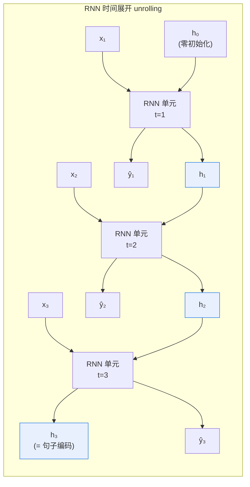

# 第 11 章 序列建模：从 RNN/LSTM 到瓶颈

上一章我们把 MLP 训练的全套动力学讲透了——前向、反向、梯度消失/爆炸、初始化与正则化。但有个前提一直没松口：MLP 吃的是**定长输入**。给它一个 $x\in\mathbb{R}^{768}$，它算出 $\hat y$，完事。可语言不是这样。一句话「我 / 今天 / 去 / 看 / 了 / 一场 / ___」——空格里填什么，取决于前面那串**有先后顺序**的词。词的个数不固定，前后文彼此依赖，而且依赖的「长度」可长可短。MLP 没法天然处理这种「变长 + 有序」的输入。

本章就来解决「怎么让网络理解序列」。我们会遇到**循环神经网络（Recurrent Neural Network, RNN）**——它用一个不断滚动更新的**隐状态（hidden state）** $\mathbf{h}_t$ 来压缩历史，每个时刻读一个新输入、更新一次状态、吐出一次输出。这个设计优雅、直觉，而且在 2010 年代统治了语言建模。但我们会发现它有两个**致命瓶颈**：一是时序依赖让计算**无法并行**，训练慢到难以承受；二是梯度沿时间连乘让**长程依赖依然学不动**——连 LSTM 的门控也只是缓解而非根治。正是这两堵墙，逼出了下一章（Ch 12）的**注意力机制（attention）**，最终演变成 Transformer。

读懂这一章，你就能理解 zllm 为什么**从头到尾不用一个 RNN**——它是一个 decoder-only Transformer（Ch 13/15），靠注意力一次性并行处理整条序列，靠位置编码注入顺序信息。RNN 不是错，它是被「训不动长序列」淘汰的。

## 11.1 学习目标

读完本章，你应该能够：

- 解释为什么 MLP 无法直接处理「变长、有序」的序列输入，而 RNN 可以；
- 默写基础 RNN 的隐状态递推式 $\mathbf{h}_t=\tanh(W_h\mathbf{h}_{t-1}+W_x\mathbf{x}_t+\mathbf{b})$，并画出它在时间上展开后的计算图；
- 描述**沿时间反向传播（Backpropagation Through Time, BPTT）**，写出 $W_h$ 的梯度为何会变成一串雅可比的连乘；
- 解释这个连乘如何导致**梯度消失/爆炸**（呼应 Ch 10），并说出 $\tanh$ 的导数有界如何「偏向消失」；
- 默写 LSTM 的三个门（输入门 $i_t$、遗忘门 $f_t$、输出门 $o_t$）与细胞状态 $c_t$ 的更新公式，解释门控为何能**缓解**长程依赖问题；
- 说清 RNN 的两个核心瓶颈——**无法并行**与**长程依赖仍弱**——以及它们如何直接导向 Transformer 的注意力机制。

本章是承上启下的一章：上承 Ch 10 的梯度动力学，下启 Ch 12 的注意力机制。

## 11.2 直觉与动机

### 语言为什么是序列

看一个最朴素的例子。下面这两句话，词一模一样，只是顺序换了：

> 「狗咬人」 / 「人咬狗」

意思完全相反。对 MLP 而言，如果把三个词的词向量**平均**成一个定长向量，两句的输入几乎相同——顺序信息被抹平了。如果想保留顺序，最笨的办法是把整句话拼成一个超长的定长向量 $\mathbf{x}=[\mathbf{e}_1;\mathbf{e}_2;\ldots;\mathbf{e}_T]$ 喂给 MLP。但这立刻带来两个麻烦：

1. **变长**：句子有长有短，MLP 的输入层维度却固定，要么截断要么补零，都丢信息；
2. **参数共享缺失**：出现在句首的「狗」和出现在句尾的「狗」，在拼接向量里落在不同位置，MLP 得为「每个位置上的同一个词」各学一套参数，效率极低。

真正想要的是这样一种网络：它能**一个词一个词地读**，每读一个词就把「到目前为止的上下文」压缩进一个固定大小的「记忆」里，下一个词进来时再更新这份记忆。这样无论句子多长，网络的「工作记忆」大小恒定，而且「狗」这个词无论出现在哪个位置都用同一套权重处理——这就是 RNN 的出发点。

### 隐状态：滚动的记忆

RNN 的核心思想可以用一句话概括：**用一个向量 $\mathbf{h}_t$ 记住「截至第 $t$ 步的全部历史」**。每来一个新输入 $\mathbf{x}_t$，它就把旧记忆 $\mathbf{h}_{t-1}$ 和新输入揉在一起，算出一个新记忆 $\mathbf{h}_t$：

$$
\mathbf{h}_t = \tanh\!\bigl(W_h\,\mathbf{h}_{t-1} + W_x\,\mathbf{x}_t + \mathbf{b}\bigr)
$$

$\mathbf{h}_t$ 既影响当前输出，又作为「传家宝」交给下一时刻。整条序列读完，$\mathbf{h}_T$ 就浓缩了整句话的语义——可以做分类、做生成、做翻译。**关键是同一组参数 $(W_h, W_x, \mathbf{b})$ 在每个时间步被复用**，所以「狗」在哪个位置都共享同一套处理逻辑。

### 时间展开：把循环画成一条链

RNN 最难理解的是那个「循环」。一个常用的破解技巧是**按时间展开（unrolling in time）**：同一个 RNN 单元在不同时刻「复制」成好几个，相邻时刻用 $\mathbf{h}$ 连起来。展开后它就是一条很深的链式 MLP——这点很重要，因为 Ch 10 的反传可以直接套上来，只不过这次是「沿时间」反传。



注意三个细节：**(1)** 图里那三个「RNN 单元」是**同一个网络**的三个时刻副本，共享同一组权重 $W_h, W_x$；**(2)** 横向的蓝线是 $\mathbf{h}$ 在时间上的传递，它把历史信息一路搬到 $\mathbf{h}_T$；**(3)** 每个 $\mathbf{h}_t$ 都可以接一个输出头吐出 $\hat{\mathbf{y}}_t$——做语言建模时，$\hat{\mathbf{y}}_t$ 就是「第 $t+1$ 个词」的预测分布（呼应 Part I 的交叉熵）。

> **一个直觉记忆**：把 RNN 想象成一个**只带一个笔记本的速记员**。每听到一个新词，他就在笔记本上把「旧笔记 + 新词」综合改写成一页新的笔记。笔记本的页数有限（隐状态维度固定），但够他一路记到散会。问题出在——他能记住多久之前的细节？这正是后面要回答的。

## 11.3 数学定义

### 记号：序列、隐状态、输出

给定一条长度为 $T$ 的输入序列 $\mathbf{x}_1, \mathbf{x}_2, \ldots, \mathbf{x}_T$，其中 $\mathbf{x}_t\in\mathbb{R}^{d_x}$ 是第 $t$ 个词的词向量（Part III 的分词和嵌入会讲怎么得到它）。RNN 维护一个隐状态 $\mathbf{h}_t\in\mathbb{R}^{d_h}$，初始化为 $\mathbf{h}_0=\mathbf{0}$。参数有三个：

- $W_h\in\mathbb{R}^{d_h\times d_h}$：**隐状态到隐状态**的权重（「记忆的演化矩阵」）；
- $W_x\in\mathbb{R}^{d_h\times d_x}$：**输入到隐状态**的权重（「读新词的投影」）；
- $\mathbf{b}\in\mathbb{R}^{d_h}$：偏置。

### 基础 RNN 递推式

$$
\boxed{\quad \mathbf{h}_t = \tanh\!\bigl(W_h\,\mathbf{h}_{t-1} + W_x\,\mathbf{x}_t + \mathbf{b}\bigr) \quad}
$$

如果每一步都要输出（比如语言建模），再接一个输出层：

$$
\hat{\mathbf{y}}_t = \mathrm{softmax}\!\bigl(W_o\,\mathbf{h}_t + \mathbf{b}_o\bigr)
$$

其中 $W_o\in\mathbb{R}^{|V|\times d_h}$ 把隐状态映射到词表大小的分布（$|V|$ 是词表大小）。整个序列的损失是各步损失之和：

$$
L = \sum_{t=1}^{T} \ell_t,\qquad \ell_t = -\log \hat{\mathbf{y}}_t[\text{目标词}_t]
$$

这就是 **next-token 预测（NTP）** 的损失——Part V 预训练（Ch 31）会把它原样搬进 Transformer，只不过那里用注意力替代了 RNN。

> **几何上 $\tanh$ 在做什么？** 它把线性组合 $W_h\mathbf{h}_{t-1}+W_x\mathbf{x}_t$ 压回 $[-1,1]$ 区间，防止隐状态数值发散。这个「压回」的副作用在 11.4 会反咬一口——它的导数最大才 1，连乘时会偏向让梯度变小。

### BPTT：沿时间反传

RNN 既然在时间上是一条链，反传就是 Ch 10 的链式法则沿着时间轴倒着走一遍——这叫 **Backpropagation Through Time（BPTT）**。考虑 $\frac{\partial L}{\partial W_h}$，由于 $W_h$ 在**每个**时间步都出现，梯度是各步贡献之和：

$$
\frac{\partial L}{\partial W_h} = \sum_{t=1}^{T} \frac{\partial \ell_t}{\partial W_h}
$$

而 $\frac{\partial \ell_t}{\partial W_h}$ 又要沿着 $\mathbf{h}_t \to \mathbf{h}_{t-1} \to \cdots \to \mathbf{h}_1$ 这条链一路反传。把链式法则展开，会出现一串**雅可比矩阵的连乘**（设 $\mathbf{a}_t = W_h\mathbf{h}_{t-1}+W_x\mathbf{x}_t+\mathbf{b}$，则 $\mathbf{h}_t=\tanh(\mathbf{a}_t)$）：

$$
\frac{\partial \mathbf{h}_t}{\partial \mathbf{h}_{t-k}} = \prod_{j=t-k+1}^{t} \underbrace{\frac{\partial \mathbf{h}_j}{\partial \mathbf{a}_j}}_{\mathrm{diag}(1-\mathbf{h}_j^2)}\;\underbrace{\frac{\partial \mathbf{a}_j}{\partial \mathbf{h}_{j-1}}}_{W_h} = \prod_{j=t-k+1}^{t} W_h\,\mathrm{diag}\!\bigl(1-\mathbf{h}_j^2\bigr)
$$

这里 $\mathrm{diag}(1-\mathbf{h}_j^2)$ 是 $\tanh$ 的雅可比（因为 $\tanh'(z)=1-\tanh^2(z)$），它是一个对角矩阵，对角元落在 $[0,1]$ 上。**这一长串连乘，就是梯度病根的所在**——下一节细说。

### LSTM：用门控掌控记忆

为了治梯度病，1997 年 Hochreiter 和 Schmidhuber 提出了**长短期记忆网络（Long Short-Term Memory, LSTM）**。它的核心思想是：给记忆开一条**几乎无损的「高速公路」**，并用三个**门（gate）**来精细控制「该记什么、该忘什么、该输出什么」。门就是一个逐元素的 sigmoid（输出 $[0,1]$，可看作「保留比例」）。

LSTM 把隐状态拆成两条：细胞状态 $\mathbf{c}_t$（长期记忆的主干道）和隐状态 $\mathbf{h}_t$（短期输出）。每步先算候选记忆 $\tilde{\mathbf{c}}_t$ 和三个门：

$$
\boxed{
\begin{aligned}
\text{输入门：}\quad & i_t = \sigma\!\bigl(W_i\,[\mathbf{h}_{t-1},\mathbf{x}_t]+\mathbf{b}_i\bigr) \\[3pt]
\text{遗忘门：}\quad & f_t = \sigma\!\bigl(W_f\,[\mathbf{h}_{t-1},\mathbf{x}_t]+\mathbf{b}_f\bigr) \\[3pt]
\text{输出门：}\quad & o_t = \sigma\!\bigl(W_o\,[\mathbf{h}_{t-1},\mathbf{x}_t]+\mathbf{b}_o\bigr) \\[3pt]
\text{候选记忆：}\quad & \tilde{\mathbf{c}}_t = \tanh\!\bigl(W_c\,[\mathbf{h}_{t-1},\mathbf{x}_t]+\mathbf{b}_c\bigr)
\end{aligned}
}
$$

其中 $[\mathbf{h}_{t-1},\mathbf{x}_t]$ 是拼接向量，$\sigma$ 是 sigmoid。然后更新细胞状态和隐状态：

$$
\boxed{
\begin{aligned}
\text{细胞状态：}\quad & \mathbf{c}_t = f_t \odot \mathbf{c}_{t-1} \;+\; i_t \odot \tilde{\mathbf{c}}_t \\[3pt]
\text{隐状态：}\quad & \mathbf{h}_t = o_t \odot \tanh(\mathbf{c}_t)
\end{aligned}
}
$$

$\odot$ 仍是逐元素乘。**最关键的是 $\mathbf{c}_t = f_t\odot\mathbf{c}_{t-1}+\cdots$ 这条更新式**：只要遗忘门 $f_t$ 接近 1，$\mathbf{c}_{t-1}$ 就几乎原样传到 $\mathbf{c}_t$——细胞状态成了一条「梯度可以直通」的传送带。这就是 LSTM 能**缓解**长程依赖的秘诀（注意只是缓解，没根治，见 11.4）。

## 11.4 推导与几何

### 梯度消失/爆炸：时间轴上的连乘

把 11.3 那串雅可比连乘摊开看。从时刻 $t$ 反传回时刻 $t-k$，梯度要乘以 $k$ 个形如 $W_h\,\mathrm{diag}(1-\mathbf{h}_j^2)$ 的因子：

$$
\frac{\partial L}{\partial \mathbf{h}_{t-k}} \;\propto\; \prod_{j=t-k+1}^{t} W_h\,\mathrm{diag}\!\bigl(1-\mathbf{h}_j^2\bigr)
$$

这跟 Ch 10 里 MLP 的「雅可比连乘」是**同一回事**，只不过这次乘法是沿时间轴而不是沿层轴。后果同样分两种：

- 若每个因子的最大奇异值 $>1$，连乘让梯度**指数增长** → **梯度爆炸**（往往可用梯度裁剪救，呼应 Ch 10 的 `grad_clip`）；
- 若 $<1$，连乘让梯度**指数衰减** → **梯度消失**，浅时刻（早期词）的权重几乎拿不到梯度，**学不动长程依赖**。

**RNN 特别偏向「消失」这一边**，原因有二：

1. $\tanh$ 的导数 $1-\tanh^2(z)$ 最大值才 1（在 $z=0$ 处），多数时刻远小于 1；
2. 即便 $W_h$ 的奇异值调到 1，乘上一个 $<1$ 的对角阵后整体仍 $<1$。

所以「想记住 50 步之前的词」在实践中几乎做不到——梯度传 50 步早衰变了。下图把这件事画清楚：

```
   梯度反传方向 ◄─────────────────────────────
   h₁ ◄── h₂ ◄── h₃ ◄── … ◄── h_T ◄── ∂L/∂h_T
   │ ×Wh·tanh'  │ ×Wh·tanh' │              │
   每走一步乘一个 <1 的因子，连乘指数衰减：
   ‖∂L/∂h₁‖ ≈ ‖∂L/∂h_T‖ · (Wh·tanh')^T  → 0
```

横轴是时间，箭头是梯度反传方向。从 $\mathbf{h}_T$ 一路往 $\mathbf{h}_1$ 走，每跨一步就乘一个 $<1$ 的因子，越早的词收到的梯度越微弱。**这正是「长程依赖学不动」的几何含义**。

### LSTM 如何缓解（但没根治）这个病

看 LSTM 细胞状态的更新 $\mathbf{c}_t = f_t\odot\mathbf{c}_{t-1}+i_t\odot\tilde{\mathbf{c}}_t$。它的雅可比是：

$$
\frac{\partial \mathbf{c}_t}{\partial \mathbf{c}_{t-1}} = \mathrm{diag}(f_t)
$$

注意——**这里没有 $W_h$，也没有 $\tanh$ 的导数**！只要 $f_t\approx 1$（遗忘门选择「全记住」），$\mathrm{diag}(f_t)$ 就接近单位阵，梯度可以几乎无损地从 $\mathbf{c}_t$ 直通到 $\mathbf{c}_{t-1}$，再直通到 $\mathbf{c}_{t-2}$……这条「细胞状态高速公路」就是 LSTM 的核心贡献：**它给长程梯度开了一条「乘以接近 1 的因子」的近无损通道**，而基础 RNN 那条通道上挤满了 $W_h\cdot\tanh'$ 这种「乘起来必小于 1」的关卡。

但这只是**缓解**。两个问题仍在：

1. **门控不是免费的**：$f_t$ 由 sigmoid 算出，若网络没学到「该开长程通道」，$f_t$ 还是会偏小，梯度照样衰减——只是「有机会」开大而已，不保证；
2. **信息仍要逐步传递**：哪怕梯度能通，$\mathbf{c}_{t-1}$ 要影响 $\mathbf{c}_t$，再影响 $\mathbf{c}_{t+1}$……**第 $t$ 步和第 $t{+}50$ 步之间隔着 50 次更新**，信息每过一站都被门「调制」一次，仍然会慢慢失真。后面会看到，这正是注意力的发力点。

> **一句话**：LSTM 把「记忆」从「每步必经 $\tanh$ 的绞肉机」升级成「有门可控的传送带」，让长程梯度**有机会**通——但「机会」不等于「保证」，而且传送带还是得一站一站走。

### 核心瓶颈一：无法并行

讲完梯度，回头看 RNN 在**工程上**的最大短板。看一眼 11.2 的展开图：$\mathbf{h}_t$ 必须等 $\mathbf{h}_{t-1}$ 算完才能开始算——**这是严格的串行依赖**。即使你有 1000 块 GPU，处理一条长度 $T=1024$ 的句子时也只能一步一步算 1024 次，无法把「第 3 步」和「第 1000 步」丢给不同 GPU 同时算。

这跟 Ch 10 的 MLP 形成鲜明对比：MLP 的同一层所有神经元可以并行算，不同层才串行。RNN 把「串行」从「层间」挪到了「**时间步间**」，而时间步往往有上千个——训练一个 RNN 语言模型，吞吐量被这条串行链死死卡住。**GPU 最擅长的是大规模并行矩阵乘**，RNN 的时序依赖恰恰让 GPU 大半算力闲置。在「数据决定上限」的时代，训得慢就意味着训不大、训不长——这是 RNN 被淘汰的直接工程原因。

### 核心瓶颈二：长程依赖仍弱

第二个瓶颈是 11.4 开头讲的梯度连乘。即便用 LSTM，第 1 个词想影响第 1000 个词，信息要经过约 1000 次门控调制——理论上「有机会通」，实际上仍会衰减。而且这种依赖是**间接**的：$\mathbf{h}_{1000}$ 对 $\mathbf{x}_1$ 的关注程度，完全取决于中间 999 步有没有把 $\mathbf{x}_1$ 的信息保真地搬运过来。**没有一条「直接路径」让 $\mathbf{h}_{1000}$ 直接看到 $\mathbf{x}_1$**。

理想的序列模型应该让**任意两个位置都能直接建立联系**——无论隔多远，一步到位。下一章会看到，注意力机制正是干这件事：每个位置都能「直接看」到其他所有位置，距离无关。

```
   RNN：信息要逐站搬运            注意力（Ch 12）：任意两点直连
   x₁ ──► h₁ ──► h₂ ──► … ──► h_T    x₁ ───────────────► h_T
                                         ╲                  ▲
   x₁ 影响 h_T 要走 T 步                  x₁ ── 直接连 ──────┘
   （每步都可能衰减）                    （距离无关，一步直达）
```

## 11.5 与本项目联系

理论讲完，把它和 zllm 钉死。**核心一句话：zllm 从头到尾不用一个 RNN**——它是一个 **decoder-only Transformer**（Ch 13、Ch 15），靠注意力 + 位置编码处理序列。下面三条钩子说清「为什么」。

### 钩子一：两个瓶颈正是注意力要解决的（Ch 12）

11.4 节总结的 RNN 两大瓶颈，正好对应 Transformer 注意力的两大优势：

- **无法并行 → 注意力可并行**：注意力把每个位置对其他所有位置的「相关度」一次性算成一个矩阵（$QK^\top$），整条序列并行计算，GPU 算力吃满；不再有「等上一步算完」的串行链。
- **长程依赖弱 → 注意力直连**：注意力的核心运算是 $\mathrm{softmax}(QK^\top/\sqrt{d})V$，第 $t$ 步可以直接「看」到第 $1$ 步——距离从 $T$ 步缩短为 $1$ 步，长程依赖不再衰减。

下一章（Ch 12《注意力机制》）会从「查询—键—值」的直觉讲起，一步步推出 $\mathrm{softmax}(QK^\top/\sqrt{d})V$，再讲多头注意力。这两个瓶颈正是动机所在。

### 钩子二：zllm 完全不用 RNN（Ch 13/15）

zllm 的模型架构（Ch 13《Transformer 架构详解》、Ch 25 的 `ZLLMBlock`、Ch 26 的 `CausalLM` 头）**没有任何循环结构**。一个 Block 里只有两件事：

```python
x = x + Attn(RMSNorm(x))    # Ch 22 GQA 注意力（替代 RNN 的时序建模）
x = x + FFN(RMSNorm(x))     # Ch 23 SwiGLU 前馈
```

注意力层负责「序列内位置的相互关注」（替代 RNN 的隐状态传递），前馈层负责「每个位置独立的非线性变换」。残差连接的「$+1$」治梯度消失（Ch 10 已讲、Ch 25 细讲），位置编码（Ch 21 RoPE）注入顺序信息——四者合起来，彻底甩掉了 RNN。本章让你看清：**RNN 被淘汰不是因为错，而是因为训不动长序列、跑不快 GPU**，Transformer 是被这两个瓶颈逼出来的解。

### 钩子三：LSTM 的「门控思想」并未消失（Ch 22/23）

虽然 RNN 整体被替换，但 LSTM 的两个聪明设计在 zllm 里换了形式延续：

- **门控**：LSTM 用 sigmoid 门控控制信息流；Transformer 的注意力里 softmax 本身就是一种「软门」（决定关注谁），Ch 23 的 SwiGLU 激活也用了门控思想（一半算值、一半当门）。
- **残差/直通通道**：LSTM 用 $\mathbf{c}_t=f_t\odot\mathbf{c}_{t-1}+\cdots$ 给梯度开直通车；Transformer 用残差连接 $x'=x+F(x)$ 的「$+1$」做同样的事（Ch 10、Ch 25）。**「给梯度开一条近无损通道」是深度网络的通用智慧**，从 LSTM 到 Transformer 一脉相承。

> **一句话总结三个钩子**：RNN 的「无法并行 + 长程弱」两个瓶颈 → 注意力（Ch 12）直接解决；zllm 是 decoder-only Transformer 不用 RNN（Ch 13/15/25/26）；LSTM 的「门控 + 直通通道」思想以新形式活在 Transformer 里（Ch 22/23/25）。本章的「为什么 RNN 不行」，正是 Transformer 「为什么行」的镜子。

## 11.6 本章小结

把这一章压缩成几条可以随身携带的结论：

1. **语言是序列**：变长、有序、前后依赖。MLP 无法直接吃变长输入，RNN 用滚动的隐状态 $\mathbf{h}_t$ 压缩历史、复用同一组参数，天然适配序列。
2. **RNN 递推式**：$\mathbf{h}_t=\tanh(W_h\mathbf{h}_{t-1}+W_x\mathbf{x}_t+\mathbf{b})$，同一组 $(W_h,W_x,\mathbf{b})$ 在每个时间步复用；按时间展开后是一条很深的链。
3. **BPTT**：RNN 的反传就是沿时间轴走链式法则，$\frac{\partial L}{\partial W_h}$ 是各步贡献之和，每步都要穿过一串雅可比连乘 $\prod W_h\,\mathrm{diag}(1-\mathbf{h}^2)$。
4. **梯度消失/爆炸**：连乘的放大率 $>1$ 爆炸、$<1$ 消失；$\tanh'$ 最大才 1，RNN 特别偏向**消失**——这就是「长程依赖学不动」的根源（呼应 Ch 10）。
5. **LSTM**：用细胞状态 $\mathbf{c}_t=f_t\odot\mathbf{c}_{t-1}+i_t\odot\tilde{\mathbf{c}}_t$ 给梯度开一条近无损直通通道（$\frac{\partial\mathbf{c}_t}{\partial\mathbf{c}_{t-1}}=\mathrm{diag}(f_t)$ 无 $W_h$、无 $\tanh'$），**缓解**长程依赖——但只是缓解，没根治。
6. **两大核心瓶颈**：(1) 时序依赖让计算**无法并行**，GPU 算力闲置、训练慢；(2) 即便有 LSTM，**长程依赖仍弱**，信息要逐站搬运、间接传递。
7. **这两个瓶颈正是注意力（Ch 12）要解决的**：并行计算 + 任意位置直接相连；zllm 因此是 decoder-only Transformer，从头到尾不用 RNN。

> **前方预告。** 看完本章你已经明白 RNN 为什么会撞墙：要么串行训不动，要么梯度传不远。下一章（Ch 12《注意力机制》）我们换一条完全不同的路——不再用「滚动的隐状态」压缩历史，而是让每个位置**直接、一次性地**看向所有其他位置，用 $\mathrm{softmax}(QK^\top/\sqrt{d})V$ 算出「该关注谁」。注意力的诞生，正是为了同时击碎本章的两大瓶颈。

### 思考题

> 建议动笔算，再对照公式验证。

1. **推导题**：设一个 3 步的基础 RNN（无输出头、损失只作用在 $\mathbf{h}_3$ 上），写出 $\frac{\partial L}{\partial \mathbf{h}_1}$ 的完整表达式（含雅可比连乘）。若每个 $W_h\,\mathrm{diag}(1-\mathbf{h}_j^2)$ 的最大奇异值是 $0.5$，$\|\frac{\partial L}{\partial \mathbf{h}_1}\|$ 大约是 $\|\frac{\partial L}{\partial \mathbf{h}_3}\|$ 的多少倍？这说明什么？
2. **对比题**：LSTM 细胞状态更新式 $\mathbf{c}_t=f_t\odot\mathbf{c}_{t-1}+i_t\odot\tilde{\mathbf{c}}_t$ 中，若遗忘门 $f_t=\mathbf{1}$（全 1 向量）、输入门 $i_t=\mathbf{0}$，$\mathbf{c}_t$ 会怎样？此时梯度 $\frac{\partial L}{\partial \mathbf{c}_{t-1}}$ 与 $\frac{\partial L}{\partial \mathbf{c}_t}$ 是什么关系？解释这为何能「记住」很久之前的输入。
3. **直觉题**：RNN 的 $\mathbf{h}_2$ 必须等 $\mathbf{h}_1$ 算完才能算。如果要处理 1000 条长度都是 512 的句子，为什么「无法并行」会严重拖慢训练？而 Transformer 注意力能怎么并行？请结合「GPU 擅长大规模矩阵乘」解释（提示：注意力把整条序列的相关度算成一个大矩阵）。

---

读完本章，你已经把「语言为什么是序列」「RNN 如何用隐状态建模序列」「它的梯度为什么会消失/爆炸」「LSTM 的门控如何缓解」「两大核心瓶颈为何致命」讲透了。下一章（Ch 12《注意力机制》）我们彻底告别「逐时刻滚动」的隐状态，进入一个让任意位置都能直接相连的新世界——那正是 Transformer 的心脏。
