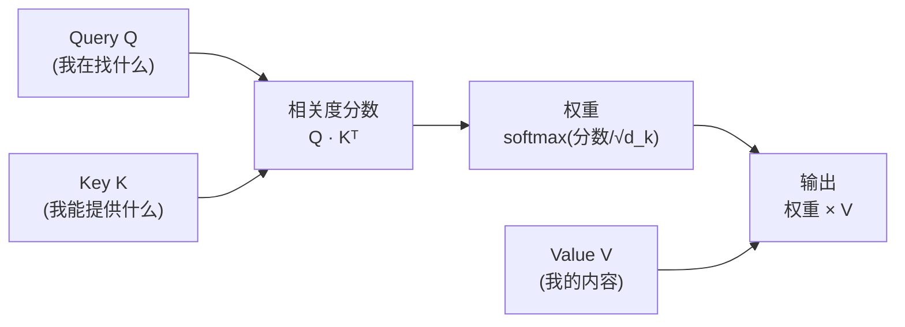

# 第 12 章 注意力机制

上一章我们看到，RNN 用「逐步传递隐状态」来建模序列，撞上了两堵墙：**无法并行**（必须等上一步算完）、**长程依赖弱**（信息要经过很多步才能传到远处）。2017 年，一篇叫 *Attention Is All You Need* 的论文用一个灵巧的运算同时推倒了这两堵墙——这个运算就是**注意力（attention）**。

本章是 Part II 的核心。整个 Transformer，乃至整个现代大语言模型，剥到底都是「注意力 + 前馈网络」的堆叠。而注意力本身，说穿了就是 Ch 01 反复铺垫的那个东西：**点积**。本章会把它从「两个向量的相关度」一步步推到「一句话里任意两个词的相关度」，再加上 softmax 和加权求和，组装成改变了一个时代的公式。

## 12.1 学习目标

读完本章，你应该能够：

- 用「数据库检索」的类比说清楚 Query / Key / Value 三者的角色；
- 默写出缩放点积注意力公式 $\mathrm{softmax}(QK^\top/\sqrt{d_k})V$，并解释每一步在做什么；
- **推导出为什么必须除以 $\sqrt{d_k}$**（点积方差随维度增长 → softmax 饱和）；
- 说出「自注意力」和「多头注意力」分别是什么、多头为何有用；
- 理解因果掩码（causal mask）如何让 decoder 只看过去；
- 把这些概念和 zllm 的实战章节挂钩：GQA、QK-Norm、KV Cache、Flash Attention（都在 Ch 22）。

## 12.2 直觉与动机

### 从「软查询」说起

想象你在用关键词搜数据库：输入一个查询（query），系统拿它和每条记录的索引（key）比对，返回最匹配的那条记录的内容（value）。这是「硬查询」——只取最相似的一个。

注意力是它的「软」版本：**不只取最匹配的，而是对所有记录都算一个相关度，按相关度加权求和，把所有 value 混在一起返回**。相关度高的 value 贡献大，相关度低的贡献小。一句话——

> **注意力 = 用 query 和每个 key 算相关度（点积）→ 把相关度变成权重（softmax）→ 用权重对所有 value 加权求和。**

把这个过程放到一句话里：每个词都当一次 query，去「询问」句子里的所有词（包括自己）「我该多关注谁」，然后把大家的 value 按关注程度加起来，作为自己新的表示。这样，**任意两个词无论隔多远，都能一步直接发生关系**——这就是注意力治好 RNN「长程依赖弱」的原理。

### 三步流水线



三步：**(1) 打分**（Q 和 K 点积）→ **(2) 归一**（softmax 变权重）→ **(3) 加权**（权重乘 V 求和）。注意 Q、K、V 都是矩阵——一行一个词，所以这是一次**批量点积**（Ch 01 的 $QK^\top$），不是一个个算。也正因如此，整句话的所有注意力可以**一次性并行算完**——这就是注意力治好 RNN「无法并行」的原理。

### 为什么 Q/K/V 要分开

你可能会问：为什么不直接用原始向量算相关度？因为「我想找什么」（query）和「我能被别人匹配上什么」（key）以及「我实际要传递的内容」（value）是三件不同的事。让模型自己学三个投影矩阵 $W_Q, W_K, W_V$，把同一个输入投影到三个不同子空间，分别承担这三种角色——这正是 Ch 02 讲的「投影到子空间」。

## 12.3 数学定义

### 缩放点积注意力

设 $Q\in\mathbb{R}^{n\times d_k}$（$n$ 个词、每个 query 维度 $d_k$）、$K\in\mathbb{R}^{n\times d_k}$、$V\in\mathbb{R}^{n\times d_v}$。注意力定义为：

$$
\boxed{\;\mathrm{Attention}(Q,K,V) \;=\; \mathrm{softmax}\!\left(\frac{QK^\top}{\sqrt{d_k}}\right)V\;}
$$

逐步拆解每一块的形状（这是理解公式的关键）：

| 表达式 | 形状 | 含义 |
|--------|------|------|
| $QK^\top$ | $n\times n$ | 第 $i$ 行第 $j$ 列 = 第 $i$ 个 query 与第 $j$ 个 key 的**点积**（相关度） |
| $QK^\top/\sqrt{d_k}$ | $n\times n$ | 缩放（12.4 节推导为何要除 $\sqrt{d_k}$） |
| $\mathrm{softmax}(\cdot)$（按行） | $n\times n$ | 每个词对 $n$ 个 key 的**注意力权重**（每行和为 1） |
| $\mathrm{softmax}(\cdot)V$ | $n\times d_v$ | 用权重对 value 加权求和 → 每个词的新表示 |

那个 $n\times n$ 的矩阵就叫**注意力矩阵**——它的 $(i,j)$ 元素告诉你「第 $i$ 个词把多少注意力分给了第 $j$ 个词」。

### 自注意力（self-attention）

当 Q、K、V 都来自同一个输入序列 $X\in\mathbb{R}^{n\times d}$ 的线性投影时，就叫**自注意力**：

$$
Q = XW_Q,\quad K = XW_K,\quad V = XW_V
$$

其中 $W_Q, W_K\in\mathbb{R}^{d\times d_k}$、$W_V\in\mathbb{R}^{d\times d_v}$ 是可学习的投影矩阵。「自」字意味着：句子在和自己做检索，让每个词重新表示成「它在该语境下的含义」。这是 Transformer 里用的形式。

### 多头注意力（multi-head attention）

一个注意力头只学一种「关注模式」。但语言里同时存在多种关系：语法上的主谓、语义上的指代、位置上的相邻……一个头顾不过来。**多头注意力**把 $d$ 维向量投影到 $h$ 个 $d_k=d/h$ 维的子空间，每个子空间独立做一次注意力，最后拼回来：

$$
\mathrm{MultiHead}(X) = \mathrm{Concat}(\mathrm{head}_1,\dots,\mathrm{head}_h)\,W_O
$$

$$
\mathrm{head}_i = \mathrm{Attention}(XW_Q^{(i)},\; XW_K^{(i)},\; XW_V^{(i)})
$$

每个头维度小（$d/h$），但头数多，总计算量和单头差不多。多头让模型在不同子空间里捕捉不同类型的相关性——这是 Ch 02「投影到多个低维子空间」思想的直接应用。

### 因果掩码（causal mask）

在 decoder（生成式）场景里，第 $i$ 个词**只能看到它和它之前的词**，不能偷看未来。做法是在算 $QK^\top$ 之后、softmax 之前，把注意力矩阵上三角（未来位置）填成 $-\infty$：

$$
\mathrm{softmax}\!\left(\frac{QK^\top + M}{\sqrt{d_k}}\right),\qquad M_{ij}=\begin{cases}0,&j\le i\\-\infty,&j>i\end{cases}
$$

$-\infty$ 经 softmax 后变成 0，未来词的权重就被完全屏蔽。zllm 是 decoder-only 模型，每一层都用这个因果掩码（Ch 13/Ch 22）。

## 12.4 推导与几何

### 为什么除以 $\sqrt{d_k}$？⭐

这是注意力公式里最容易被略过、却又最关键的一个细节。不除 $\sqrt{d_k}$ 会怎样？

设 $q, k\in\mathbb{R}^{d_k}$，各分量独立、均值 0、方差 1。它们的点积 $q\cdot k=\sum_{i=1}^{d_k}q_i k_i$ 是 $d_k$ 个独立同分布项之和，其方差为：

$$
\mathrm{Var}(q\cdot k) = \sum_{i=1}^{d_k}\mathrm{Var}(q_i k_i) = d_k\cdot\mathrm{Var}(q_i)\mathrm{Var}(k_i) = d_k
$$

也就是说，**点积的标准差是 $\sqrt{d_k}$，随维度增长**。当 $d_k$ 较大时（zllm 默认 $d_k=768/8=96$，标准差约 9.8），点积的绝对值会很大。

点积一大，softmax 就**饱和**：最大的那一两个分数的 exp 会压倒其他，权重几乎变成 one-hot（一个接近 1，其余接近 0）。饱和的 softmax 有两个坏处（回引 Ch 03/05）：

1. **梯度消失**：softmax 在饱和区对 logits 的梯度极小（Jacobian $\approx p_i(\delta_{ij}-p_j)$，当 $p$ 接近 one-hot 时趋于 0），注意力学不动；
2. **表达力退化**：注意力退化成「只看一个词」，失去了「软加权」的初衷。

**对策**：除以点积的标准差 $\sqrt{d_k}$，把点积的方差拉回 1 附近：

$$
\mathrm{Var}\!\left(\frac{q\cdot k}{\sqrt{d_k}}\right)=\frac{d_k}{d_k}=1
$$

这样 softmax 工作在「坡度适中」的区域，既能突出相关项、又保留梯度。一句口诀——

> **除以 $\sqrt{d_k}$ = 把点积的「音量」调到 softmax 舒服的范围，防止它失真（饱和）。**

### 几何：注意力矩阵长什么样

把 $\mathrm{softmax}(QK^\top/\sqrt{d_k})$ 的 $n\times n$ 矩阵画成热力图，行是 query 词、列是 key 词，颜色深浅代表注意力权重：

```
            key →
            你  好  的  世  界  啊
      你   [█   ▒   ░   ░   ░   ░]      ← "你" 主要关注自己和"好"
query 好   [▒   █   ░   ░   ░   ░]
  ↓   的   [░   ░   █   ▒   ▒   ░]      ← "的" 关注前后名词
      世   [░   ░   ▒   █   ▒   ░]
      界   [░   ░   ▒   ▒   █   ░]
      啊   [░   ░   ░   ░   ░   █]

   █=强关注  ▒=中等  ░=弱   (对角线=关注自己)
```

一个训练好的模型里，这个矩阵会呈现出有意义的模式：代词关注它的指代对象、动词关注它的宾语、每个词多少关注自己。**注意力矩阵就是模型「在看哪里」的可视化**——这也是为什么注意力常被用来做模型解释性分析。

> **几何直觉**：注意力做了什么？它把每个词的向量，沿着「相关词的方向」做了加权混合。如果两个词相关（点积大），它们在表示空间里就被拉近；如果不相关，就被推开。经过多层注意力，语义相近的词最终在 $\mathbb{R}^d$ 里聚成一簇——这呼应了 Ch 01 讲的「词向量的几何」。

## 12.5 与本项目联系

理论讲透，现在把它和 zllm 钉死。本章学的「标准注意力」，到 zllm 里演化出了好几个工程优化版本，全都在 Ch 22（GQA 注意力）实现。

### 钩子一：多头 → 分组查询注意力 GQA（Ch 22）

本章的多头注意力里，每个头都有自己独立的 Q/K/V。但 K/V 是要被缓存和反复读取的（尤其推理时），头数越多、K/V 越大、越占显存。**分组查询注意力（Grouped-Query Attention, GQA）** 是多头和「所有 Q 共享一组 K/V」（MQA）之间的折中：把 Q 头分成若干组，**每组共享一对 K/V 头**。

zllm 默认 8 个 Q 头 / 4 个 K/V 头（$n_{rep}=2$，即每 2 个 Q 头共享一组 K/V）。这样 K/V 的体积减半，显存和带宽都省，精度损失却很小。Ch 22 会看到 `repeat_kv` 如何把 4 组 K/V 复制成 8 份去配对 8 个 Q 头。

### 钩子二：QK-Norm（Ch 22）

本章 12.4 推导了「除以 $\sqrt{d_k}$」来防 softmax 饱和。zllm 还多了一层保险：**在 RoPE 之前，对 Q 和 K 各做一次 RMSNorm**（Ch 20 的归一化），把 Q/K 向量的尺度主动拉到 1 附近。这是 Qwen3 的改进，让训练更稳定。Ch 22 会看到 `q_norm` / `k_norm` 这两个模块。

### 钩子三：KV Cache（Ch 22、Ch 42）

生成式推理时，每生成一个新词，都要重新算注意力。如果每次都重算所有历史词的 K/V，复杂度是 $O(n^2)$。**KV Cache** 把已经算过的 K/V 缓存下来，每步只算新词的 K/V 追加进去——复杂度降到 $O(n)$。本章的 $K=XW_K$、$V=XW_V$ 正是缓存的对象。Ch 42 会专门讲 KV Cache 如何把推理从「每步重算」变成「每步增量」。

### 钩子四：Flash Attention（Ch 22）

注意力矩阵是 $n\times n$ 的，序列一长就爆显存。**Flash Attention** 用一种「分块 + 不实例化完整注意力矩阵」的算法，在不改变数学结果的前提下大幅降低显存、提升速度。zllm 在 Ch 22 用 PyTorch 的 `F.scaled_dot_product_attention`（底层会调 Flash）实现「Flash 路径」，同时保留一条「手动路径」（显式算 scores → mask → softmax → @V）用于 KV Cache 推理。

> **一句话总结四个钩子**：GQA 共享 K/V 省显存（Ch 22）、QK-Norm 稳尺度（Ch 22）、KV Cache 增量推理（Ch 42）、Flash Attention 省显存加速（Ch 22）。本章的标准注意力公式，就是这些工程优化的共同祖先。

## 12.6 本章小结

把这一章浓缩成几条可以随身携带的结论：

1. **注意力三步**：打分（$QK^\top$ 点积）→ 归一（softmax）→ 加权（$\times V$）。一句话里任意两词一步直达，治好了 RNN 的长程依赖病。
2. **公式**：$\mathrm{Attention}(Q,K,V)=\mathrm{softmax}(QK^\top/\sqrt{d_k})V$。Q/K/V 是输入经三个投影矩阵得到的三种角色。
3. **为什么除 $\sqrt{d_k}$**：点积方差随维度线性增长（$\mathrm{Var}=d_k$），不缩放 softmax 会饱和、梯度消失。除以标准差把方差拉回 1。
4. **自注意力**：Q/K/V 同源；**多头**：投影到 $h$ 个子空间各做一次，捕捉多种关系。
5. **因果掩码**：上三角填 $-\infty$，让 decoder 只看过去。

> **前方预告。** 注意力解决了一句话**内部**「谁该关注谁」的问题，但它本身不会堆叠成一个完整的网络——它没有位置感知（Ch 21 的 RoPE 来补）、没有非线性变换（Ch 23 的 FFN 来补）、没有层间残差与归一化（Ch 25 的 Block 来补）。下一章（Ch 13《Transformer 架构详解》）会把注意力当作一块积木，和前馈网络、残差连接、归一化拼到一起，组装出那个改变了 NLP 的完整架构。

### 思考题

> 建议先想清楚形状，再算数值。

1. **形状题**：设 $n=4$（句子 4 个词）、$d=8$、$h=2$ 头。写出多头注意力里单个头的 $Q^{(i)}, K^{(i)}, V^{(i)}$ 的形状、$Q^{(i)}K^{(i)\top}$ 的形状、以及 $\mathrm{head}_i$ 的形状。最后 Concat 后、乘 $W_O$ 前的形状是多少？
2. **推导题**：不除 $\sqrt{d_k}$ 时，若 $d_k=64$ 且 $q,k$ 各分量是标准正态，估算点积 $q\cdot k$ 的典型取值范围（±一个标准差）。这个量级的 logits 进 softmax，最大的那个权重会是多少？除以 $\sqrt{d_k}=8$ 之后呢？
3. **直觉题**：因果掩码让第 $i$ 个词只看前 $i$ 个词。那么注意力矩阵的**第一行**（$i=0$） softmax 后是什么样子？这为什么意味着生成时第一个词的注意力退化成「只看自己」？

---

读完本章，你已经握住了现代大语言模型的核心引擎——**注意力**。你不仅能默写它的公式、推导它为什么缩放，还知道了它在 zllm 里会如何演化成 GQA、QK-Norm、KV Cache、Flash Attention。下一章（Ch 13《Transformer 架构详解》）我们退后一步，把注意力塞进一个完整的「积木块」里，看清 Transformer 这座大厦是怎么一块块搭起来的。
