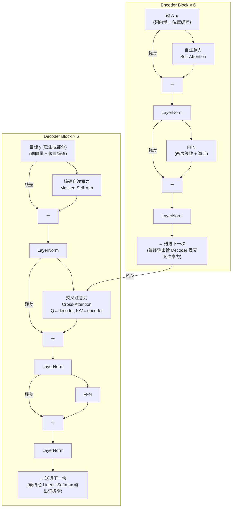

# 第 13 章 Transformer 架构详解

上一章我们把注意力公式 $\mathrm{softmax}(QK^\top/\sqrt{d_k})V$ 拆了个底朝天——它解决了「一句话里任意两个词如何一步直达」。但 Ch 12 结尾留下了一个尖锐的问题：**注意力本身堆不成一个网络**。它没有位置感知（所有词打乱顺序，注意力输出不变）、没有逐位置的非线性变换（注意力本质上是加权平均，是「线性」的混合）、更没有让它堆到几十上百层的稳定结构。

本章就把这三块缺口补齐。我们要看清：把注意力当作**一块积木**，和**前馈网络（FFN）**、**残差连接**、**归一化**拼到一起，再叠 $L$ 层，就成了那个 2017 年改变 NLP 的完整架构——**Transformer**。一旦看清它是积木式堆叠，你也就理解了为什么后续所有变体（GPT、BERT、T5、Qwen/Llama 系）几乎都在这块积木的**内部**做文章（把 FFN 换成 SwiGLU、把 LayerNorm 换成 RMSNorm、把绝对位置编码换成 RoPE），而积木的**外壳**——残差 + 归一化 + 子层——从 2017 到今天几乎没动过。

## 13.1 学习目标

读完本章，你应该能够：

- 说出 Transformer 的「**积木公式**」：$\text{Block}=\text{注意力}+\text{FFN}+\text{残差}+\text{归一化}$，并解释四者各司什么职；
- 默画出原始论文 *Attention Is All You Need* 的 Encoder Block 与 Decoder Block 数据流，指出二者的唯一区别（decoder 多了「因果掩码自注意力」和「交叉注意力」两块）；
- 写出 **Pre-Norm** $x'=x+\mathrm{Sublayer}(\mathrm{Norm}(x))$ 与 **Post-Norm** $x'=\mathrm{Norm}(x+\mathrm{Sublayer}(x))$ 两个公式，并**解释为什么 Pre-Norm 训练更稳**（残差高速公路不被 Norm 切断）；
- 解释残差连接 $x'=x+F(x)$ 为什么治梯度消失（回扣 Ch 10 的「+1」直通车），并与 ResNet 的历史脉络接上；
- 默写出**绝对正弦位置编码** $PE_{(pos,2i)}=\sin(pos/10000^{2i/d})$，说清它为什么能编码「相对位置」；
- 说清**交叉注意力**：Q 来自 decoder、K/V 来自 encoder，并解释它对应 Ch 11 RNN seq2seq 里哪种机制；
- 论证为什么 **decoder-only**（GPT 路线）最终取代 encoder-only / encoder-decoder 成为现代 LLM 的主流范式。

## 13.2 直觉与动机

### 一个 Transformer 块 = 四块积木

把注意力单独拎出来看，它做的是「序列内位置的相互混合」——但它本质上是**加权平均**，是线性的、信息压缩的。光靠注意力叠多层，模型表达力会塌陷（参考 Ch 09「为什么必须有非线性」）。所以每一层除了注意力，还得配一块**前馈网络 FFN**——它在**每个位置独立**地做一次非线性变换（同一个 MLP 作用在每个时间步上，位置之间不交互）。注意力负责「词与词交换信息」，FFN 负责「每个词独立地思考与变换」。

光这两块还不够。直接把它们叠 $L$ 层，立刻撞上 Ch 10 讲的两大病：

1. **梯度消失/爆炸**：每层雅可比连乘，深层收不到学习信号；
2. **分布漂移**：每层输出经过线性+非线性后，尺度和分布会逐层漂移，让下游层一直在「追着移动的目标」学。

解药就是另外两块积木——**残差连接**（绕过子层开辟一条「$+1$」梯度高速公路）和**归一化**（把每个位置的向量拉回稳定的尺度）。四者合起来，就是 Transformer 的一个**块（Block）**：

$$
\text{Transformer Block} \;=\; \underbrace{\text{注意力（Ch 12）}}_{\text{词间混合}} \;+\; \underbrace{\text{FFN（Ch 09/23）}}_{\text{位置内变换}} \;+\; \underbrace{\text{残差连接}}_{\text{梯度高速公路}} \;+\; \underbrace{\text{归一化}}_{\text{稳定尺度}}
$$

这是整个 Transformer 的最小复现单元。$L$ 个块串起来，再配上输入嵌入和输出头，就是一个完整的 Transformer。后面所有「现代 LLM 架构」，本质上都在折腾**这四块积木的具体实现**，而「四块拼一块」的骨架从未变过。

### 原始论文的 Encoder/Decoder 块

下面这张 Mermaid 画出 2017 年原始论文里一个 Encoder Block 和一个 Decoder Block 的内部数据流。注意两者结构几乎一样，**唯一区别**是 Decoder 多了两样东西：(1) 自注意力带**因果掩码**（防止偷看未来，Ch 12 已讲）；(2) 多了一块**交叉注意力（Cross-Attention）**——它的 Q 来自 decoder 自己，K/V 来自 encoder 的输出。



数一下：Encoder 一个块里有 **2 个残差 + 2 个 Norm + 1 个自注意力 + 1 个 FFN**；Decoder 一个块里有 **3 个残差 + 3 个 Norm + 1 个掩码自注意力 + 1 个交叉注意力 + 1 个 FFN**。原始论文 Encoder 叠 6 层、Decoder 叠 6 层——这就是那个把 NLP 从 RNN 时代掀翻的 $N{=}6$ 的来源。

> **一句话记住 Encoder/Decoder 的差别**：Encoder 是「**全句双向**」理解（每个词能看上下文两边，适合理解类任务）；Decoder 是「**从左到右**」生成（每个词只能看过去，适合生成类任务）。二者的桥梁就是**交叉注意力**——它让 decoder 在生成每个词时，能「回看」encoder 编码出的源句表示。

## 13.3 数学定义

### 残差连接：把子层写成「加法」

任何一层 Transformer，其核心子层（注意力或 FFN）都不直接写成 $x'=\mathrm{Sublayer}(x)$，而是包一层**残差**：

$$
x' \;=\; x \;+\; \mathrm{Sublayer}(x)
$$

意思是「输出 = 输入 + 子层学到的**增量**」。这样模型要学的不是「从零造一个新表示」，而是「在原表示上修一个残差（delta）」——学好恒等映射（让 $\mathrm{Sublayer}\approx 0$）远比学好任意映射容易。这正是 ResNet（何恺明 2015）的同一思想，Transformer 直接继承了下来。

### Pre-Norm vs Post-Norm ⭐

把归一化 $\mathrm{Norm}$ 放在哪里，决定了是 **Post-Norm**（原始论文版本）还是 **Pre-Norm**（现代 LLM 普遍采用）。两种写法的差别只是一个 $\mathrm{Norm}$ 的位置，但训练动力学天差地别：

$$
\boxed{\;\text{Post-Norm（原始论文）:}\quad x' \;=\; \mathrm{Norm}\!\big(x + \mathrm{Sublayer}(x)\big)\;}
$$

$$
\boxed{\;\text{Pre-Norm（现代主流）:}\quad x' \;=\; x + \mathrm{Sublayer}\!\big(\mathrm{Norm}(x)\big)\;}
$$

差别在哪？看**残差路径**（那条 $x+\cdots$ 的加法分支）是否被 $\mathrm{Norm}$ 包住。

- **Post-Norm**：残差路径**被 Norm 切断**。从最深层一路往浅层传的梯度，每经过一块都要穿过一次 $\mathrm{Norm}$（它不是恒等，会重新缩放），梯度高速公路被频繁打断。
- **Pre-Norm**：残差路径**完全干净**。从输出到任意浅层都有一条 $x_0 \to x_1 \to \cdots \to x_L$ 的纯加法链，导数恒为 1，梯度无损直通。

13.4 节会推导这导致 Pre-Norm 的有效深度更可控、训练更稳。**所有现代大语言模型（GPT/Llama/Qwen/zllm）几乎清一色用 Pre-Norm**——zllm 也走这条路线（Ch 25）。

### 前馈网络 FFN

FFN 是**逐位置**（per-token）的两层 MLP，所有时间步共享同一组权重、彼此独立计算（这正是它能并行的根源）：

$$
\mathrm{FFN}(x) \;=\; \mathrm{Linear}_2\!\big(\mathrm{ReLU}(\mathrm{Linear}_1(x))\big)
$$

原始论文用 ReLU，中间维度 $d_{ff}=4d$（$d$ 是模型维度）。这意味着 FFN 把每个 $d$ 维向量先**升维**到 $4d$、过非线性、再**降维**回 $d$——升维是为了让模型在更高维空间里做非线性变换（Ch 02 的「核技巧」同源思想），降维是为了保持残差路径维度一致。现代 LLM 把 ReLU 换成了 **SwiGLU**（Ch 23），但「升维 → 非线性 → 降维」的骨架没变。

> **为什么 FFN 逐位置独立？** 注意力已经让所有位置交换过信息了，FFN 不必再「跨位置」混合，它的职责是**在已经融合好上下文的表示上做非线性变换**——把「听到的」加工成「想到的」。所以 FFN 的计算完全可分位置并行，是 Transformer 里最容易算快的部分。

### 归一化 LayerNorm

Transformer 用的是 **LayerNorm**（按「样本 × 维度」里的**最后一维**做归一化），不是 BatchNorm。对一个向量 $x\in\mathbb{R}^d$：

$$
\mathrm{LayerNorm}(x) \;=\; \gamma\cdot\frac{x-\mu}{\sqrt{\sigma^2+\epsilon}} \;+\; \beta,\qquad \mu=\frac{1}{d}\sum_i x_i,\quad \sigma^2=\frac{1}{d}\sum_i(x_i-\mu)^2
$$

其中 $\gamma,\beta\in\mathbb{R}^d$ 是可学习的缩放和偏移，$\epsilon$ 是防止除零的小常数。**为什么不用 BatchNorm？** 因为序列长度可变、batch 里不同样本长度不一，BatchNorm 跨样本统计会失稳；LayerNorm 在**单个样本、单层激活**内部统计，与 batch 无关，更适合序列模型。现代 LLM 把 LayerNorm 进一步简化为 **RMSNorm**（去掉减均值和 $\beta$，只保留缩放，Ch 20），但思想同源：**把每个位置的向量拉回稳定尺度，让下游层不必追着漂移的分布学**。

### 绝对正弦位置编码

注意力本身是**置换不变**的——把输入序列打乱顺序，注意力输出（在对应位置上）完全不变。要让模型知道「词在哪个位置」，必须额外注入位置信息。原始论文用一个**手工设计**的、不学习的位置编码 $PE$，加到词嵌入上：

$$
PE_{(pos,2i)} \;=\; \sin\!\left(\frac{pos}{10000^{2i/d}}\right),\qquad PE_{(pos,2i+1)} \;=\; \cos\!\left(\frac{pos}{10000^{2i/d}}\right)
$$

其中 $pos$ 是位置（$0,1,2,\dots$）、$i$ 是维度索引（$2i$ 取偶数维用 $\sin$、$2i+1$ 取奇数维用 $\cos$）。每个维度对应一个不同频率的正弦波——低维（小 $i$）频率高、变化快，高维（大 $i$）频率低、变化慢。最终输入 = 词嵌入 + 位置编码：$x = E_{\text{token}} + PE$。

13.4 节会推导：这种编码的精妙之处在于，**任意固定相对偏移 $k$ 的两个位置，其 $PE$ 之间是一个线性变换（旋转）**——所以模型不仅能学到「绝对位置」，更能从 $\sin/\cos$ 的相位差里直接读出「相对位置」。

### 交叉注意力（Cross-Attention）

在 Encoder-Decoder 架构里，decoder 每一块都有一个**交叉注意力**子层，它和 Ch 12 的自注意力公式完全一样，唯一区别是 Q/K/V 的来源：

$$
Q \;=\; y\,W_Q \;\text{(来自 decoder 当前表示)},\qquad K = h_{\text{enc}}\,W_K,\quad V = h_{\text{enc}}\,W_V \;\text{(来自 encoder 输出)}
$$

意思是：decoder 在生成第 $t$ 个词时，用自己当前的表示当 query，去「询问」encoder 编码出的**整句源文**「我该最关注源文的哪些词」，然后按权重把源文表示加权求和，作为生成下一个词的依据。这正是 Ch 11 RNN seq2seq 里「decoder 隐状态 attend over encoder 隐状态」的直接继承——只不过把 RNN 的逐步传递换成了注意力的一次并行。

## 13.4 推导与几何

### 为什么 Pre-Norm 训练更稳 ⭐

把一个 $L$ 层 Pre-Norm 网络的输出展开。设每层只有一个子层 $F_l$（先忽略 FFN/注意力的区别），则：

$$
\text{Pre-Norm:}\quad x_L \;=\; x_0 \;+\; \sum_{l=1}^{L} F_l\!\big(\mathrm{Norm}(x_{l-1})\big)
$$

注意那个 $x_0 + \sum_l(\cdots)$ 的形式——**所有层的贡献都直接加到 $x_0$ 上**，没有任何 Norm 插在求和路径里。反向求梯度时：

$$
\frac{\partial x_L}{\partial x_0} \;=\; I \;+\; \sum_{l=1}^{L}\frac{\partial F_l}{\partial x_0} \;\approx\; I \quad(\text{当子层学习初期}F_l\text{较小时})
$$

那个**恒等的 $I$**就是梯度高速公路——无论 $F_l$ 多复杂、雅可比多小，总有一条 $\frac{\partial L}{\partial x_0}\propto I$ 的路径让梯度无损流回 $x_0$。这与 Ch 10 推导的残差「$+1$」治梯度消失是同一回事。

再看 Post-Norm。它的展开是 $x_l=\mathrm{Norm}(x_{l-1}+F_l(x_{l-1}))$，残差路径被 Norm 包住：

$$
\text{Post-Norm:}\quad x_L \;=\; \mathrm{Norm}\!\circ\!\big(\mathrm{Norm}\circ(\cdots)\big)
$$

从 $x_L$ 到 $x_0$ 的梯度路径上**每层都穿过一个 Norm**——而 Norm 不是恒等映射，它的雅可比 $\frac{\partial\,\mathrm{Norm}(x)}{\partial x}=\frac{\gamma}{\sigma}\big(I-\frac{1}{d}(1+\hat{x}\hat{x}^\top)\big)$ 在数值上常常把信号**进一步缩小**。$L$ 层连乘下来，深层梯度被反复压缩，训练初期极难收敛。原始论文用了精心的 **warmup 学习率调度**才把 Post-Norm 训起来，这就是「NoAM」学习率预热策略的由来。Pre-Norm 把这个负担直接拿掉了——它对超参更鲁棒、不需要复杂的 warmup、可以训得更深。**这就是现代 LLM 全部转向 Pre-Norm 的根本原因**。

> **一句话对比**：**Post-Norm 把残差路径切断，Pre-Norm 保留残差高速公路**。前者理论上表达力略强（每个子层的输出都经过规范化），后者训练更稳、能堆更深——工程上稳比强重要，所以 Pre-Norm 赢。

### 残差连接：呼应 Ch 10 的「+1」

Ch 10 已经把残差连接的反向传播推过一遍：对 $x'=x+F(x)$ 求导，

$$
\frac{\partial \mathcal{L}}{\partial x} \;=\; \frac{\partial \mathcal{L}}{\partial x'}\cdot\!\Big(\,I + \frac{\partial F}{\partial x}\Big) \;=\; \underbrace{\frac{\partial \mathcal{L}}{\partial x'}}_{\text{直通路径（恒为 1）}} \;+\; \underbrace{\frac{\partial \mathcal{L}}{\partial x'}\cdot\frac{\partial F}{\partial x}}_{\text{经子层路径}}
$$

那条**直通路径恒为 1**（即 Ch 10 反复强调的「$+1$」），无论 $\partial F/\partial x$ 多小都不被压缩。Transformer 堆 6 层（原始）、12 层（GPT-2 small）、96 层（GPT-2 大）、甚至上百层（现代 LLM），靠的就是这条高速公路。zllm 默认 $L=8$ 层（Ch 25 的 `ZLLMBlock` 串 8 个），残差连接保证最深层到 embedding 的梯度一路畅通。

历史上残差连接源自 **ResNet**（何恺明 2015）——当时也是为了训极深的卷积网络（152 层）而发明的同一个 trick。Transformer 把它从视觉搬到语言，是迁移得最成功的一招。

### 位置编码的几何：相对位置怎么冒出来的

为什么绝对正弦位置编码能编码「相对位置」？关键性质：对于任意固定偏移 $k$，$PE_{pos+k}$ 可以表示成 $PE_{pos}$ 的一个**线性变换**（旋转矩阵）。

考察一对相邻维度 $(2i, 2i+1)$，频率记为 $\omega_i=1/10000^{2i/d}$。它们构成一个二维向量：

$$
\begin{pmatrix} PE_{(pos,2i)} \\ PE_{(pos,2i+1)} \end{pmatrix} \;=\; \begin{pmatrix} \sin(\omega_i\,pos) \\ \cos(\omega_i\,pos) \end{pmatrix}
$$

把位置从 $pos$ 推到 $pos+k$，按三角和角公式：

$$
\begin{pmatrix} \sin(\omega_i(pos{+}k)) \\ \cos(\omega_i(pos{+}k)) \end{pmatrix} \;=\; \underbrace{\begin{pmatrix} \cos(\omega_i k) & \sin(\omega_i k) \\ -\sin(\omega_i k) & \cos(\omega_i k) \end{pmatrix}}_{\text{旋转 }R(\omega_i k)} \cdot \begin{pmatrix} \sin(\omega_i pos) \\ \cos(\omega_i pos) \end{pmatrix}
$$

也就是说，**「向后移 $k$ 步」等价于在每个二维子平面里旋转角度 $\omega_i k$**。这个旋转矩阵 $R(\omega_i k)$ 只依赖于相对偏移 $k$，与绝对位置 $pos$ 无关。所以模型完全有能力从 $PE$ 的几何结构里**直接读出相对位置**——这正是注意力分数 $QK^\top$ 里天然包含的东西（query 在位置 $pos$、key 在位置 $pos+k$，二者点积里的相位差就是 $\omega_i k$）。

> **几何直觉**：绝对正弦位置编码把「位置」编码成 $\mathbb{R}^d$ 里一组不同频率的**旋转角度**。低维高频（变化快）编码近邻细粒度，高维低频（变化慢）编码长程粗粒度。一长一短，远近通吃——这就是为什么一个 $d$ 维编码能覆盖从 1 到上万个位置的整个序列。

一个简化的二维示意（只看一对维度，频率 $\omega$）：

```
位置 pos = 0   :  PE = (sin(0), cos(0))     = ( 0.00,  1.00)   ← 起点在 12 点钟
位置 pos = 1   :  PE = (sin(ω), cos(ω))     = ( 0.63,  0.78)   ← 逆时针转 ω 弧度
位置 pos = 2   :  PE = (sin(2ω),cos(2ω))    = ( 0.95, -0.31)   ← 再转 ω
位置 pos = 3   :  PE = (sin(3ω),cos(3ω))    = ( 0.14, -0.99)   ← 再转 ω
       ⋮
   每往后走一步，就在二维平面里「旋转固定角度 ω」。
   相邻两步的相对位置 = 旋转角 ω，与绝对起点无关。
       (ω = 0.69 rad ≈ 39° 示意)
```

这个「位置 = 旋转」的几何，正是 Ch 21 **RoPE** 的直接灵感来源——RoPE 干脆把这个旋转**乘到 Q 和 K 上**（而不是加到嵌入上），让相对位置信息直接进入注意力点积，且天然支持外推到训练时没见过的长度。

### 为什么 decoder-only 成为主流

原始 Transformer 是 Encoder + Decoder 双塔，专为机器翻译设计（源语言 encoder 编码、目标语言 decoder 解码）。但随后几年，社区分裂出三条路线：

| 路线 | 代表 | 结构 | 训练目标 | 适合任务 |
|------|------|------|----------|----------|
| **Encoder-only** | BERT | 双向自注意力 | 掩码语言建模 MLM | 理解类（分类、抽取） |
| **Encoder-Decoder** | T5、BART | 完整原版 | Span 损坏 + 重建 | 翻译、摘要 |
| **Decoder-only** | GPT、Llama、Qwen | 仅 decoder（去掉交叉注意力） | 因果语言建模 CLM | 生成 + 万能 |

为什么 **decoder-only 最终胜出**？

1. **统一与简单**。decoder-only 只有一种块（掩码自注意力 + FFN + 残差 + Norm），没有 encoder、没有交叉注意力，整个模型就是一摞相同的块——实现、扩展、推理都最简单。「简单」在规模化训练里是巨大优势（少一处结构差异就少一类 bug、少一类显存对齐问题）。
2. **生成即通用**。现代 LLM 的核心交互形式是「给一段 prompt，续写出回答」——这天然就是因果生成。Decoder-only 用同一个 CLM 目标（预测下一个 token，Ch 26）既训出语言理解、又训出语言生成，**一个目标打天下**。Encoder-only 的 MLM 训练目标无法直接做生成，需要额外的「适配头」。
3. **Scaling Law 偏爱它**。经验上（Kaplan 2020、Chinchilla 2022），decoder-only 在算力 / 数据放大时，loss 下降最平滑、最可预测。这与它结构最简单、梯度流最直（Pre-Norm + 残差）直接相关。
4. **In-Context Learning 涌现于它**。GPT-3 发现：decoder-only 大模型能在推理时通过 prompt 上下文「现场学会」新任务，无需微调。这种能力在 encoder-only 上没有同等清晰地涌现。

代价是：decoder-only 在**纯理解类**任务（如细粒度分类、抽取）上理论上略弱于同等参数的 encoder-only（因为因果掩码让每个词看不到右侧上下文）。但实践上，规模一大，这点差距被淹没——所以今天你看到的主流大模型（GPT-4、Claude、Gemini、Llama、Qwen，以及本书的 zllm）**全部是 decoder-only**。

> **一句话总结三条路线**：Encoder-only（BERT）适合「读」，Encoder-Decoder（T5）适合「翻译」，**Decoder-only（GPT）适合「万能」**——而 LLM 的终极目标是万能，所以 decoder-only 赢。

## 13.5 与本项目联系

本章讲的是**原始 2017 版 Transformer**——绝对位置编码、LayerNorm、Post-Norm、ReLU FFN、Encoder-Decoder。zllm 作为现代 decoder-only LLM，**保留了积木的骨架**（注意力 + FFN + 残差 + 归一化），但把每一块积木的**内部实现**都换成了 2020 年后的改良版。下面四条钩子把它们一一对应起来。

### 钩子一：decoder-only + Pre-Norm（Ch 25）⭐⭐

zllm 抛掉 Encoder、抛掉交叉注意力，整个模型就是 $L$ 个**完全相同**的块串起来——这是「decoder-only」的含义。每个块（Ch 25 的 `ZLLMBlock`）严格采用 **Pre-Norm**：注意力子层写成 $x'=x+\mathrm{Attn}(\mathrm{Norm}(x))$，FFN 子层写成 $x''=x'+\mathrm{FFN}(\mathrm{Norm}(x'))$——残差路径全程不被 Norm 切断。本章 13.4 推导的「Pre-Norm 训练更稳」就是 zllm 选它的原因。zllm 默认 $L=8$ 层（在 Ch 25 里由 `ZLLMBackbone` 把 8 个 `ZLLMBlock` 串起来），靠 Pre-Norm 的梯度高速公路保证 8 层全程梯度不消失。

### 钩子二：RoPE 替代绝对位置编码（Ch 21）⭐⭐

本章 13.3 讲的绝对正弦位置编码是「**加到嵌入上**」的——$x=E_{\text{token}}+PE$。它的局限：固定长度训练、外推到更长序列会失真。zllm 用 **旋转位置编码 RoPE**（Ch 21）替代：不再加 $PE$，而是把 13.4 推导出的「位置 = 旋转」那个旋转矩阵 $R(\omega_i k)$ **直接乘到 Q 和 K 上**，让相对位置信息进入 $QK^\top$ 的点积。RoPE 的好处是：① 不占嵌入维度（不加，只乘）；② 天然支持长度外推（配合 YaRN，Ch 21）；③ 与注意力耦合更紧。本章的 $PE$ 公式是 RoPE 的「祖先」——理解了它，Ch 21 的 RoPE 推导就只剩「换个位置插旋转」这一步。

### 钩子三：RMSNorm 替代 LayerNorm（Ch 20）⭐

本章 13.3 的 LayerNorm 同时做两件事：减均值 $\mu$ + 除标准差 $\sigma$，再加可学习偏移 $\beta$ 和缩放 $\gamma$。经验上，**减均值那一步对效果贡献很小**，但每层都要算一次 $\mu$ 意味着可观的算力开销。zllm 用 **RMSNorm**（Ch 20）——只保留「除 RMS（均方根）」这一半，去掉减均值和 $\beta$：

$$
\mathrm{RMSNorm}(x) \;=\; \gamma\cdot\frac{x}{\sqrt{\tfrac{1}{d}\sum_i x_i^2 + \epsilon}}
$$

省一半算力、效果几乎无损，是现代 LLM 的标配（Llama、Qwen、Mistral 都用它）。本章的 LayerNorm 公式是 RMSNorm 的「满配版」，Ch 20 会看到「砍掉一半」后它为什么仍然有效。

### 钩子四：SwiGLU 替代 ReLU FFN（Ch 23）⭐

本章 13.3 的 FFN 是 $\mathrm{Linear}_2(\mathrm{ReLU}(\mathrm{Linear}_1(x)))$。现代 LLM 把它升级成 **SwiGLU**（Ch 23）——一个带「门控」的 FFN：

$$
\mathrm{SwiGLU}(x) \;=\; \big(\mathrm{SiLU}(x\,W_1)\big)\odot(x\,W_{\text{gate}})\cdot W_2
$$

简单说就是「两条并行路：一条算内容、一条算门控，两者逐元素相乘」——Ch 09 已经预告过这是「MLP + 门控」思想。SwiGLU 在同等参数下表现优于 ReLU FFN（这也是 Llama/Qwen 的标配）。本章的 FFN 公式是 SwiGLU 的前身，Ch 23 会展开门控的具体设计、为什么 SiLU 是合适的门控激活。

> **一句话总结四条钩子**：zllm 把原始 Transformer 的**骨架（注意力+FFN+残差+归一化）**原样保留，但把**位置编码换成 RoPE（Ch 21）、归一化换成 RMSNorm（Ch 20）、FFN 换成 SwiGLU（Ch 23）、整体做成 decoder-only + Pre-Norm（Ch 25）**——四块积木的内部各做一次现代化升级，骨架从未动过。这就是为什么读懂本章的「积木公式」，你已经读懂了 zllm 80% 的架构。

## 13.6 本章小结

把这一章浓缩成几条可以随身携带的结论：

1. **积木公式**：$\text{Transformer Block}=\text{注意力}+\text{FFN}+\text{残差}+\text{归一化}$。四者各司其职——注意力做词间混合、FFN 做位置内变换、残差开辟梯度高速公路、归一化稳定尺度。$L$ 块串起来就是完整 Transformer。
2. **Pre-Norm vs Post-Norm**：$x'=x+\mathrm{Sublayer}(\mathrm{Norm}(x))$（Pre）vs $x'=\mathrm{Norm}(x+\mathrm{Sublayer}(x))$（Post）。**Pre-Norm 保留残差高速公路、训练更稳**，现代 LLM 全部用它。
3. **残差连接的「+1」**：$\partial(x+F(x))/\partial x=I+\partial F/\partial x$，那条恒等 $I$ 让深层梯度无损直通，呼应 Ch 10、源自 ResNet。
4. **位置编码**：$PE_{(pos,2i)}=\sin(pos/10000^{2i/d})$。「位置 = 一组不同频率的旋转角」，让模型从相位差直接读出相对位置——这是 RoPE（Ch 21）的灵感来源。
5. **交叉注意力**：Q 来自 decoder、K/V 来自 encoder，是 Encoder-Decoder 架构的桥梁，对应 Ch 11 RNN seq2seq 的注意力机制。
6. **decoder-only 胜出**：结构最简单、目标最统一（CLM 万能）、scaling 最平滑、in-context learning 在它身上涌现——所以现代 LLM（含 zllm）全是 decoder-only。

> **前方预告。** 至此，Part II 的「结构与理论」全部讲完：你有了神经元（Ch 09）、有了反传（Ch 10）、看清了 RNN 的瓶颈（Ch 11）、掌握了注意力（Ch 12）、又把注意力拼成了完整 Transformer（本章）。但一个会算下一个 token 概率的模型，离「会说话」还差最后一步——**怎么从一堆概率里挑出实际的词**？是永远挑最大概率（贪婪）、还是允许偶尔冒险（采样）、又或者用温度和 top-p 调节「创造力」？下一章（Ch 14《解码策略理论》）专门回答这个问题：把本章的 Transformer 输出 logits，喂进贪婪 / 束搜索 / 温度采样 / top-k / top-p 等解码策略，看清「同样的模型，不同解码能产出截然不同的回答」。带着本章的 Transformer 骨架，我们进入 Part II 的收尾章——解码理论。

### 思考题

> 建议先想清楚每一步的形状和方向，再算数值。

1. **公式题**：把一个 Pre-Norm 的 Transformer 块完整写出来（含自注意力 + FFN 两个子层、两个残差、两个 Norm）。设输入 $x\in\mathbb{R}^{n\times d}$，写出经过自注意力子层后的形状、再经过 FFN 子层后的形状。如果改成 Post-Norm，公式会怎么变？形状会变吗？
2. **梯度题**：本章推导了 Pre-Norm 的展开 $x_L=x_0+\sum_l F_l(\mathrm{Norm}(x_{l-1}))$。据此解释：为什么 Pre-Norm 模型对**学习率 warmup** 的依赖比 Post-Norm 小？提示：warmup 的作用是在训练初期把学习率从小逐渐调大，避免早期梯度爆炸；想想 Post-Norm 训练初期为什么需要这个保护、Pre-Norm 为什么不需要。
3. **位置编码题**：设 $d=4$（两对维度）、$\omega_1=1.0$、$\omega_2=0.1$。算出 $pos=0,1,2$ 三个位置的 $PE$ 向量（共 4 维）。验证「$pos=1$ 的 $PE$ 是 $pos=0$ 的 $PE$ 旋转某个角度」「$pos=2$ 的 $PE$ 是 $pos=1$ 的 $PE$ 旋转同一个角度」。这两个角度分别是多少？（提示：用 13.4 的旋转矩阵 $R(\omega_i k)$，$k=1$。）

---

读完本章，你已经握住了整个 Transformer 的骨架——「**注意力 + FFN + 残差 + 归一化**」四块积木拼成一个块、$L$ 块叠成一座塔。你不仅默写了 Pre-Norm 与 Post-Norm 的公式、推导了为什么 Pre-Norm 训练更稳、看清了位置编码「旋转」的几何，还论证了为什么 decoder-only 成为现代 LLM 的共识。更重要的是，本章的四条钩子已经把 zllm 的每块积木（RoPE / RMSNorm / SwiGLU / Pre-Norm decoder-only Block）逐一钉死——下一章（Ch 14《解码策略理论》）会暂时离开「结构」，转向「如何从 Transformer 输出里解码出真正的文字」，完成 Part II 的最后一块拼图。
