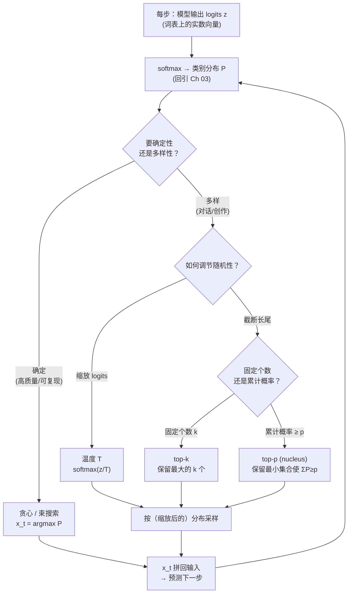

# 第 14 章 解码策略理论

上一章我们把 Transformer 拼成了完整的一座塔——注意力 + FFN + 残差 + 归一化四块积木叠 $L$ 层，输出头吐出一个在词表上的 **logits 向量**。但 Ch 13 结尾留了一个看似 trivial、实则决定「模型性格」的问题：**拿到这组 logits 之后，下一步到底挑哪个词写下来？** 是永远挑概率最大的那个（这样每一步都最「稳」，但整句可能陷入重复与平庸），还是允许偶尔挑概率稍低的词（这样有「创造力」，但也可能跑偏）？

这正是本章要回答的问题。回引 Ch 03：模型的每一步输出，本质上就是一个 **类别分布**——把 logits 经 $\mathrm{softmax}$ 归一成词表上的概率向量 $\boldsymbol\pi=(\pi_1,\ldots,\pi_K)$ （ $K$ 是词表大小，zllm 默认 $K=6400$ ）。Ch 03 在那里打住、只负责「描述」这个分布；本章专门研究「**操作**」这个分布：如何缩放它（温度）、如何截断它（top-k / top-p）、如何在多条候选路径之间取舍（束搜索）、以及如何惩罚已经说过的词（重复惩罚）。回引 Ch 05：这一章的整个分析，最终的「度量尺」就是**熵** $H(\boldsymbol\pi)$ ——熵高代表分布平坦、选择多样；熵低代表分布尖锐、结果确定。读懂本章，你就理解了「**同一个模型、不同解码策略，能产出截然不同的回答**」这件事的全部机理。

## 14.1 学习目标

读完本章，你应该能够：

- 说清「**模型每步输出一个在词表上的类别分布**」这件事（回引 Ch 03 的 softmax），并指出「解码」就是把每步分布**落实成一个具体 token**的操作；
- 写出 **贪心解码（greedy）** 的公式 $x_t=\arg\max_k \pi_k$ ，并解释它为什么「确定但易陷入局部最优、易重复」；
- 写出 **温度采样** 的公式 $\pi_k^{(T)}=\mathrm{softmax}(z_k/T)$ ，论证 $T\to0$ 退化为贪心、 $T\to\infty$ 趋近均匀分布、 $T=1$ 还原模型原貌（回引 Ch 03 预告过的温度雏形、Ch 05 蒸馏里的温度缩放）；
- 用 Ch 05 的熵 $H(\boldsymbol\pi)$ 度量「温度如何改变分布尖锐度」，画出「 $T$ 越小、熵越低、越确定」的单调关系；
- 写出 **top-k** 与 **top-p（nucleus）** 的定义，并论证二者最大的差别：top-k 的候选个数**固定**、top-p 的候选个数**自适应**（概率集中时少取、分散时多取）；
- 简述 **束搜索（beam search）** 的思想——同时保留 $k$ 条候选序列、每步扩展、最后取累计概率最大的一条；
- 简述 **重复惩罚（repetition penalty）** 的机制——对已出现 token 的 logits 打折，抑制循环；
- 论证「**熵高 = 多样、熵低 = 确定**」这一贯穿全章的核心判据，并据此为不同任务（翻译/摘要 vs 对话/创作）选择合适的解码策略。

## 14.2 直觉与动机

### 从分布到文本：贪心 vs 采样的权衡

Transformer 训练好之后，它的「知识」就固化在权重里了——给定上文 $x_{<t}$ ，它输出一个固定的 logits 向量 $\mathbf{z}_t$ ，进而一个固定的分布 $`\boldsymbol\pi_t=\mathrm{softmax}(\mathbf{z}_t)`$ 。注意：**模型本身是确定性的**（同样的输入永远给出同样的分布），不确定性只存在于「从这个分布里挑哪个词」这一步。这一步的挑法，就叫**解码策略（decoding strategy）**。

最朴素的挑法是**贪心（greedy）**：永远挑概率最大的那个词， $x_t=\arg\max_k \pi_{t,k}$ 。每一步看起来都「最合理」，但贪心有一个致命弱点——它只看眼前这一步的局部最优，**看不见全局**。一个经典反例：假设在某个位置，词 A 概率 0.4、词 B 概率 0.3、词 C 概率 0.3。贪心选 A。但如果选 B 之后能接上一段非常通顺的话、选 A 之后却走进了死胡同，贪心就错过了。更糟的是，贪心极易**自我循环**——一旦某步挑了个让分布变得「更偏好同一个词」的状态，模型就会原地打转，输出像「我我我我我我」这样的退化文本。

解法是**采样（sampling）**：不总挑最大，而是**按概率随机抽**——概率大的词被抽中机会大，但概率小的词也有机会。这就引入了「多样性」。但纯采样（直接按原分布抽）往往**太散**——长尾里有大量噪声词，抽到就把句子带偏。所以实际工程里，采样前总是先对分布做两件事：① **缩放**（温度，调节整体尖锐度）；② **截断**（top-k / top-p，砍掉长尾噪声）。两者合起来，就是「既多样、又不乱」的采样解码。

下面这张 Mermaid 把「解码策略的决策树」画出来——从同一个 logits 出发，按「要确定性还是多样性」分流到贪心/束搜索或温度采样/top-k/top-p：



这张图是本章的「总指挥」。后面三节都在填它的细节：14.3 给出每条路径的严格数学定义，14.4 推导它们各自改变分布形状的几何机理，14.5 把它们和 zllm 的实际解码实现钉死。

> **一句话记住两类策略的本质**：贪心 / 束搜索是 **「选最大」**（确定性、追求质量、易重复）；温度 / top-k / top-p 采样是 **「按（变形后的）概率抽」**（随机性、追求多样、需调参防跑偏）。前者对应 Ch 05 的「**熵低**」世界，后者对应「**熵高**」世界。

## 14.3 数学定义

设词表大小为 $K$ ，第 $t$ 步给定上文 $x_{<t}$ ，模型输出 logits $`\mathbf{z}_t=(z_{t,1},\ldots,z_{t,K})\in\mathbb{R}^K`$ ，经 softmax 得类别分布（回引 Ch 03）：

$$
\pi_{t,k}  =  \mathrm{softmax}(\mathbf{z}_t)_k  =  \frac{\exp(z_{t,k})}{\sum_{j=1}^{K}\exp(z_{t,j})},\qquad k=1,\ldots,K
$$

整个解码过程就是：从 $t=1$ 开始，每步根据 $\boldsymbol\pi_t$ 决定 $x_t$ ，把 $x_t$ 拼回输入，再前向算下一步——直到生成结束符（EOS）或达到长度上限。下面六种「决定 $x_t$ 」的方式，就是六种解码策略。

### 贪心解码 greedy

每步取概率最大的那个 token：

$$
\boxed{ x_t  =  \arg\max_{k\in\{1,\ldots,K\}} \pi_{t,k}  =  \arg\max_k z_{t,k} }
$$

（ $\arg\max$ 对 $\pi$ 和对 $z$ 等价，因为 softmax 单调。）贪心**完全确定**——同一模型、同一上文，永远产出同一句话，便于复现。代价是只顾局部最优、易陷入重复循环。

### 温度采样 temperature sampling ⭐

把 logits 先除以一个**温度** $T>0$ ，再 softmax，得到一个「变形分布」，然后按它采样：

$$
\boxed{ \pi_{t,k}^{(T)}  =  \frac{\exp(z_{t,k}/T)}{\sum_{j=1}^{K}\exp(z_{t,j}/T)} = \mathrm{softmax}(\mathbf{z}_t/T)_k,\qquad x_t\sim\boldsymbol\pi_t^{(T)} }
$$

$T$ 是分布形状的「旋钮」：

- $T=1$ ： $\boldsymbol\pi^{(T)}=\boldsymbol\pi$ ，还原模型原貌；
- $T\to0^+$ ： $\exp(z_k/T)$ 把 logits 间的差距**指数放大**，最大者独占概率质量， $\boldsymbol\pi^{(T)}\to\mathbf{e}_{\arg\max}$ （one-hot），采样退化为贪心；
- $T\to\infty$ ：所有 $z_k/T\to0$ ， $\exp(z_k/T)\to1$ ， $\boldsymbol\pi^{(T)}\to$ 均匀分布 $1/K$ ，采样变成「完全随机抽词」。

（这个温度雏形，Ch 03 在钩子里已经预告过；Ch 05 讲知识蒸馏时也用了同一个 $\mathrm{softmax}(z/T)$ 来「软化」教师分布——同一个数学操作，在解码里调节多样性、在蒸馏里暴露暗类信息，机理完全一致。）

### top-k 采样

只保留概率最大的 $k$ 个 token，把其余 $K-k$ 个的概率**置零**，再在剩下的 $k$ 个上重新归一化采样：

$$
\mathcal{V}_k^{(t)}=\{\text{概率最大的 }k\text{ 个 token}\},\qquad \tilde\pi_{t,i}=\begin{cases}\pi_{t,i}\big/ \sum_{j\in\mathcal{V}_k^{(t)}}\pi_{t,j} & i\in\mathcal{V}_k^{(t)}\cr 0 & \text{否则}\end{cases},\quad x_t\sim\tilde{\boldsymbol\pi}_t
$$

直觉：长尾里大多是噪声词（罕见字、错别字、无关符号），砍掉它们能让采样聚焦在「合理候选」上。 $k$ 是固定的——无论当前分布是尖锐还是平坦，候选数永远是 $k$ 个。

### top-p 采样（nucleus sampling）⭐

不固定个数，而是固定**累计概率**：取**使累计概率首次达到 $p$ 的最小 token 集合**（即「核 nucleus」），在这个集合上重归一采样：

$$
\boxed{ \mathcal{V}_p^{(t)}=\min \Big\{\mathcal{S}\subseteq\mathcal{V}:\sum_{i\in\mathcal{S}}\pi_{t,i}\ge p\Big\},\qquad x_t\sim\boldsymbol\pi_t\big|_{\mathcal{V}_p^{(t)}}\text{（重归一）} }
$$

（实现上是把 token 按概率降序排，累加直到 $\ge p$ 为止，取这段。） $p$ 通常取 $0.9\sim0.95$ 。关键性质：**候选个数随分布形状自适应**——分布尖锐时（少数几个词就凑满 $p$ ），核很小；分布平坦时（要很多词才凑满 $p$ ），核很大。这正是 top-p 相对 top-k 的核心优势，14.4 节详细推导。

### 束搜索 beam search（简述）

贪心只跟踪一条路径，束搜索同时跟踪 $k$ 条（ $k$ 叫**束宽 beam width**）。每步：把当前 $k$ 条候选各扩展出 $K$ 个续词，得到 $kK$ 条新路径，保留其中**累计概率** $\prod_t\pi_{t,x_t}$ 最大的 $k$ 条；全部生成完后，取累计概率最高的那条作为最终输出。

$$
\text{score}(\text{seq})=\sum_{t}\log\pi_{t,x_t}\quad(\text{取对数防下溢、把连乘变连加})
$$

束搜索是贪心的「 $k$ 步前瞻」推广—— $k=1$ 退化为贪心。它在机器翻译、摘要等「有标准答案、追求最高质量」的任务上长期是主流；但在开放对话/创作上表现呆板（总挑「最安全」的话，缺乏多样性），所以现代聊天模型很少用它。

### 重复惩罚 repetition penalty（简述）

针对贪心/采样都易出现的「循环复读」病，对**已经生成过的 token** 的 logits 打折：

$$
z'_{t,i}=\begin{cases}z_{t,i}/\lambda & x_i\text{ 已在 }x_{<t}\text{ 中出现过}\cr z_{t,i} & \text{否则}\end{cases},\qquad \lambda>1
$$

（ $\lambda$ 通常取 $1.1\sim1.3$ 。）注意是**除以** $\lambda$ （对正 logits 缩小、对负 logits 反而放大绝对值），所以它对「高分已用词」的压制比对「低分已用词」更强——这正是我们想要的。它在任何解码策略外层都能套一层，是一个通用的「防复读」补丁。

> **六种策略的速记表**：greedy=argmax；temperature=softmax(z/T)；top-k=留最大 $k$ 个；top-p=留累计 $\ge p$ 的最小集；beam=留 $k$ 条累计概率最高的路径；repetition penalty=已用词 logits/$\lambda$ 。记住这六句，本章的公式就全在了。

## 14.4 推导与几何

### 温度如何改变分布尖锐度（回引 Ch 03/05 的熵） ⭐⭐

温度是本章最值得推导的一步，因为它把「旋钮 $T$ 」、分布形状、Ch 05 的熵 $H$ 三者精确地缝在一起。考察同一组 logits $\mathbf{z}$ ，问： $\boldsymbol\pi^{(T)}=\mathrm{softmax}(\mathbf{z}/T)$ 的熵 $H(\boldsymbol\pi^{(T)})$ 随 $T$ 怎么变？

把熵（回引 Ch 05 香农熵定义 $H=-\sum_k\pi_k\log\pi_k$ ）写开：

$$
H\big(\boldsymbol\pi^{(T)}\big)  =  -\sum_{k=1}^{K}\pi_{t,k}^{(T)}\log\pi_{t,k}^{(T)}  =  -\sum_{k}\frac{e^{z_k/T}}{Z}\Big(\frac{z_k}{T}-\log Z\Big),\qquad Z=\sum_j e^{z_j/T}
$$

两个极端情形一目了然：

- **$T\to0^+$**： $e^{z_k/T}$ 中最大项 $e^{z_{\max}/T}$ 主导（指数级碾压其余）， $\boldsymbol\pi^{(T)}\to\mathbf{e}_{k^*}$ （one-hot， $k^*=\arg\max z$ ）。此时 $H\to- 1\cdot\log1=0$ ，**熵取下界**，分布最尖锐、最确定——这就是「 $T=0$ 等价贪心」的信息论表达。
- **$T\to\infty$**：所有 $z_k/T\to0$ 、 $e^{z_k/T}\to1$ 、 $\pi_{t,k}^{(T)}\to1/K$ （均匀）。此时 $H\to-\sum_k\frac1K\log\frac1K=\log K$ ，**熵取上界**（Ch 05 证明过均匀分布熵最大），分布最平坦、最不确定。

并且可以严格证明 $H(\boldsymbol\pi^{(T)})$ 在 $T\in(0,\infty)$ 上是 $T$ 的**严格单调递增**函数（直观： $T$ 越大、logits 被压缩得越平、分布越接近均匀、熵越高）。这就把温度、熵、多样性三者钉成了一条不可分的链：

$$
T\downarrow \Longrightarrow \text{分布越尖} \Longrightarrow H\downarrow \Longrightarrow \text{越确定/越重复} ;\qquad T\uparrow \Longrightarrow \text{分布越平} \Longrightarrow H\uparrow \Longrightarrow \text{越多样/越冒险}
$$

用一个 ASCII 图把「同一个 logits、不同 $T$ 」下分布形状的变化画出来（词表取 top-5，其余记 `…`，原始 logits $\mathbf{z}=[3.0,2.0,1.0,0.5,0.0,\ldots]$ ）：

```
   温度 T 如何改变 softmax 分布形状（同一组 logits z = [3.0, 2.0, 1.0, 0.5, 0.0, ...]）

   T = 0.3  (冷·尖锐≈贪心)       T = 1.0  (模型原貌)         T = 2.0  (热·平坦)
   熵 H ≈ 0.39 nat (低·确定)     熵 H ≈ 1.04 nat             熵 H ≈ 1.45 nat (高·多样)
   ───────────────────────       ──────────────────────      ──────────────────────
   词1 ████████████████ 0.86     █████████ 0.64             █████ 0.42
   词2 ███ 0.10                   ███ 0.21                  ████ 0.26
   词3 █ 0.03                     █ 0.08                    ██ 0.15
   词4 ▎ 0.01                     ▏ 0.04                    █ 0.10
   词5 ▏ 0.003                    ▏ 0.02                    █ 0.07
   …   ≈0（长尾被压死）           … ~0                      … ~0.05 (残余质量被摊开)

        ↑ 概率集中在 1 个词          ↑ 适度集中                ↑ 概率被摊到多个词
        ↑ 采样几乎必出词1            ↑ 偶尔出词2/3             ↑ 词2/3/4 都有不小机会
```

这张图就是 Ch 03/05 概率与熵理论的「可视化终章」：**温度旋钮的本质，就是在「最确定（one-hot， $H=0$ ）」与「最随机（均匀， $H=\log K$ ）」之间，连续滑动分布的熵。**

> **呼应蒸馏**：Ch 05 讲知识蒸馏时，把教师 logits 除以 $T>1$ 再 softmax 得「软标签」——那一步正是本节的 $T\uparrow$ ：分布变平、暗类（logits 略低的类）的相对关系被放大。同一个 $\mathrm{softmax}(z/T)$ ，在解码里「调多样性」、在蒸馏里「暴露类间相似性」，机理同源。这也是为什么 Ch 39 的蒸馏损失要乘 $T^2$ 做梯度补偿——温度一改、softmax 对 logits 的梯度跟着按 $1/T$ 缩放。

### top-k vs top-p：自适应的差别 ⭐

top-k 和 top-p 都做「截断长尾」，差别只在「截多少」。这个差别看似小，实则在**分布形状千变万化**的真实生成里影响巨大。考察两种典型情形：

**情形 A（分布尖锐）**：模型很自信，前 2 个 token 就占了 95% 概率质量。

```
   尖锐分布：top-2 已占 95% 质量
   词1 ██████████████████ 0.80
   词2 ███ 0.15
   词3 ▏ 0.02          ← top-k=50 会把词3…词50这些噪声全纳进来！
   词4 ▏ 0.01          ← top-p=0.95 只取 {词1,词2}，干净。
   …
   词50 ▏ 0.001
```

**情形 B（分布平坦）**：模型很犹豫，前 2 个 token 只占 30%，质量分散在几十个词上。

```
   平坦分布：要凑到 95% 质量需要 ~40 个词
   词1 ███ 0.18          ← top-k=50 正好够覆盖，OK。
   词2 ██ 0.12           ← top-p=0.95 会取 ~40 个词，同样合理。
   词3 ██ 0.10
   …
   词40 ▏ 0.01
   词41 ▏ 0.009         ← 但 top-k=50 还会多纳 词41..词50 这些边角料
   …
```

看明白了吗？**top-k 的候选个数 $k$ 是写死的**——不管分布是尖是平，永远纳 $k$ 个。于是：分布尖时（情形 A），它**多纳了一堆概率近乎为零的噪声词**，污染采样；分布平时（情形 B）， $k$ 又可能**不够大**，砍掉了本来该有的合理候选。

**top-p 的候选个数是自适应的**——分布尖时它自动少取（只取 2 个就凑满 $p$ ）、分布平时它自动多取（取 40 个才凑满 $p$ ），永远恰好覆盖「主体概率质量」。用 Ch 05 的熵语言说：top-p 隐式地**根据当前分布的熵**调整候选集大小——熵低（尖）就少取、熵高（平）就多取。这正是 nucleus sampling（Holtzman et al. 2019）相对 top-k 的核心优势，也是它在现代对话模型里几乎取代 top-k 的原因。

实践里，温度与 top-p 通常**联合使用**：先用温度把分布调到想要的尖锐度，再用 top-p 砍掉残余长尾。zllm 的默认配置就是这套组合（见 14.5 钩子）。

### 熵高 = 多样、熵低 = 确定（贯穿全章的判据）

把前两小节合起来，本章所有策略都可以用「**它把分布的熵往哪边推**」来统一理解：

| 策略 | 对分布的作用 | 对熵的影响 | 适用场景 |
| --- | --- | --- | --- |
| greedy | 取 argmax（退化到 one-hot） | $H\to0$ （最小） | 翻译/摘要/代码（要确定答案） |
| beam search | 累计概率最大的路径 | 平均熵最低 | 翻译/摘要（有标准答案） |
| 低温度 $T<1$ | 缩放 logits 放大差距 | $H\downarrow$ | 事实问答、代码补全 |
| 高温度 $T>1$ | 缩放 logits 抹平差距 | $H\uparrow$ | 头脑风暴、创意写作 |
| top-k / top-p | 截断长尾后重归一 | $H$ 适中（取决于 $k$/$p$ 与 $T$ ） | 对话、开放生成 |
| repetition penalty | 压制已用词 | 间接 $H\uparrow$ （强制探索新词） | 任何易复读场景 |

这张表是本章的「决策速查」。**记住一句话**：选解码策略，本质上就是选「你想要多高的熵」——要确定性就把熵压低（贪心/低温/束搜索），要多样性就把熵抬高（高温/top-p 采样）。Ch 05 给我们「熵」这把尺，本章教我们「怎么用旋钮拨动这把尺」。

> **一句话总结本节**：温度 $T$ 单调控制分布熵（ $T\downarrow\Rightarrow H\downarrow$ ）；top-k 候选数固定、top-p 候选数随熵自适应；所有解码策略的差别，都可以归结为「把分布的熵往高推还是往低推」。

## 14.5 与本项目联系

本章讲的是**纯理论**——给定一个分布，怎么挑词。zllm 作为可运行的 LLM，把这些策略全部落地成了一组解码函数（Ch 41）。下面三条钩子把它们钉死，并预告采样在 RL 训练里的另一处关键用途。

### 钩子一：Ch 41 解码算法实现（默认 temperature=0.85, top_p=0.95, top_k=50）⭐⭐

zllm 把本章的六种策略实现成一组解码函数（Ch 41《解码算法实现》）。它的默认采样配置是：

- **`temperature=0.85`**：略低于 1.0，把分布稍微调尖一点——既保留多样性（不退化成贪心），又抑制长尾噪声（不至于太散）。这是「对话/开放生成」的甜点温度。
- **`top_p=0.95`**：nucleus 采样，砍掉累计概率 95% 之外的残余长尾。配合 0.85 的温度，恰好覆盖「主体概率质量 + 适度随机」。
- **`top_k=50`**：作为 top-p 之外的一道**兜底**——即便分布极端平坦、top-p 想取上百个词，top_k=50 也把候选数硬性卡在 50 以内，防止采样成本爆炸。

这套「温度 + top-p（+ top-k 兜底）」的组合，正是当今主流对话模型（Llama、Qwen、Mistral 系）的标配。zllm 的 `temperature=0.0` 分支专门走贪心（argmax）——用于需要可复现的测评/代码生成场景。本章把「为什么是 0.85/0.95/50 这组数」回答到了底：温度管尖锐度、top-p 管截断质量、top_k 管截断上限，三者正交互补。Ch 41 会看到这些参数如何在一组解码循环里串成完整的生成流水线，并与 KV Cache（Ch 42）配合做到高效推理。

### 钩子二：采样是 RL rollout 的引擎（Ch 37 PPO / Ch 38 GRPO）⭐⭐

本章的采样解码，在 RL 训练里还有一处**比推理更关键**的用途——**rollout（采样生成）**。无论是 PPO（Ch 37）还是 GRPO（Ch 38），强化学习的核心循环都是：「给一个 prompt，让策略模型**自己生成一个或多个 response**，再根据 reward 调整策略」。而「生成 response」这一步，用的正是本章的温度采样（通常关掉 top-p，纯温度采样以保留完整多样性）。

尤其 GRPO（Ch 38）的精髓在于 **group sampling（组采样）**：对**同一个 prompt**，用采样解码生成 **$G$ 个不同的 response**（比如 $G=8$ ），然后用这组 response 之间的相对优势（谁比谁好）来更新策略——这绕开了 PPO 需要单独训一个 critic 的负担。**「能对一个 prompt 生成多个不同 response」这件事，物理上完全依赖本章的采样解码**——如果用贪心，同一个 prompt 永远只产出一个固定 response，GRPO 的「组」无从谈起。换句话说：**本章的温度采样，是 GRPO 这类 group-based RL 算法的存在前提**。温度 $T$ 在这里不再只是「调多样性」的旋钮，而是「**控制探索力度、决定 RL 能学到多丰富的信号**」的训练超参——这是温度在「推理」与「训练」两个舞台上扮演的双重角色。

### 钩子三：Ch 42 KV Cache 让解码又快又省

本章的解码循环（每步前向算一个分布、挑一个词、拼回去）有一个工程瓶颈：**每生成一个新词，都要把整段上文重新前向一遍**——上文越长、越往后越慢。Ch 42《KV Cache 加速推理》会展示，因为注意力的 K、V 只依赖**已固定的上文**（每步只新增一行），可以把它们缓存起来、每步只算新 token 那一行——这让解码的每步成本从 $O(t)$ 降到 $O(1)$ ，整段生成从 $O(n^2)$ 降到 $O(n)$ 。本章讲的「温度/top-p/束搜索」是对**每步输出的分布**做操作，与 KV Cache（对**每步的中间状态**做缓存）正交——二者可以无缝叠加。Ch 42 会把本章的解码策略架在 KV Cache 之上，得到一个既多样又快的生成器。

> **一句话总结三条钩子**：zllm 把本章六种策略落地成 Ch 41 的解码函数（默认 temperature=0.85/top_p=0.95/top_k=50）；本章的温度采样是 Ch 37/38 RL rollout 的引擎（GRPO 的组采样直接依赖它）；Ch 42 的 KV Cache 让这套解码又快又省——理论、实现、加速三者闭环。

## 14.6 本章小结

把这一章浓缩成几条可以随身携带的结论：

1. **解码 = 把每步分布落实成 token**：模型每步输出一个词表上的类别分布 $\boldsymbol\pi=\mathrm{softmax}(\mathbf{z})$ （回引 Ch 03），解码策略决定「怎么从 $\boldsymbol\pi$ 挑词」。
2. **贪心**： $x_t=\arg\max_k\pi_k$ 。确定、可复现，但只顾局部最优、易重复循环。
3. **温度**： $\pi_k^{(T)}=\mathrm{softmax}(z_k/T)$ 。 $T\to0$ 退化为贪心、 $T\to\infty$ 趋近均匀、 $T=1$ 还原模型。**$T$ 单调控制熵**： $T\downarrow\Rightarrow H\downarrow$ （更确定）、 $T\uparrow\Rightarrow H\uparrow$ （更多样）。
4. **top-k**：固定保留概率最大的 $k$ 个；**top-p（nucleus）**：保留使累计概率 $\ge p$ 的最小集合，**候选数随分布熵自适应**（尖则少取、平则多取）——这是 top-p 优于 top-k 的核心。
5. **束搜索**：同时跟踪 $k$ 条累计概率最大的路径， $k=1$ 退化为贪心；适合翻译/摘要，不适合开放对话。
6. **重复惩罚**：已用词 logits 除以 $\lambda>1$ ，抑制循环复读，可套在任何策略外层。
7. **熵是总判据**：所有策略的差别都可归结为「把分布熵往高推（多样）还是往低推（确定）」。要答案选低熵（贪心/低温/束搜索），要创造选高熵（高温/top-p 采样）。

> **前方预告。** 至此，Part II「深度学习与 Transformer 理论」已近尾声：你有了神经元（Ch 09）、反传（Ch 10）、看清了 RNN 瓶颈（Ch 11）、掌握了注意力（Ch 12）、拼成了 Transformer（Ch 13）、又学会了如何从它的输出里解码出文字（本章）。但还有一个宏观问题没回答：**从 GPT-1 到 GPT-4、从 Llama 到 Qwen，这些年现代语言模型到底沿着哪几条主线演进？MoE、长上下文、多模态、推理增强这些热词各自对应架构里的哪一块改动？** 下一章（Ch 15《现代语言模型全景》）将站在本章的肩膀上做一次「全景俯瞰」——把 Part II 收拢成一张「现代 LLM 演进地图」，并为 Part III 起的「亲手实现 zllm」铺好最后的理论视野。带着本章掌握的解码策略，我们进入 Part II 的真正收尾章。

### 思考题

> 建议先想清楚「这一步改变的是 logits、还是概率、还是采样过程」，再动笔。

1. **温度推导题**：给定 logits $\mathbf{z}=(2.0, 1.0, 0.5, 0,\ldots,0)$ （其余维度为 0，词表 $K=6400$ ）。手算 $T=0.5$ 、 $T=1.0$ 、 $T=2.0$ 三种温度下，前 4 个 token 的 softmax 概率。验证： $T$ 从 0.5 升到 2.0 时，词 1 的概率在下降、分布的香农熵 $H$ （回引 Ch 05 公式）在上升。哪个 $T$ 下熵最接近 $\log 6400$ （即接近均匀分布的熵上界）？据此解释为什么「温度过高」会让模型输出变成「随机抽词、不知所云」。（提示： $T\to\infty$ 时 $\pi_k\to1/K$ ， $H\to\log K$ 。）
2. **top-k vs top-p 对比题**：假设某步模型输出的概率分布有两种可能——(A) 尖锐型： $(0.7, 0.2, 0.05, 0.02, 0.01, 0.01, 0.005, \ldots)$ ；(B) 平坦型： $(0.15, 0.13, 0.12, 0.11, 0.10, 0.09, 0.08, 0.07, \ldots)$ 。设 top-k=5、top-p=0.9。分别算出两种分布下 top-k 和 top-p 各自保留的候选集合。回答：在 (A) 下 top-k 和 top-p 哪个更合理？在 (B) 下呢？用「熵高/熵低」的语言解释 top-p 为什么「自适应」、top-k 为什么「一刀切」。
3. **概念题**：本章指出贪心易陷入「自我循环复读」（如「我我我我」）。请回答：(a) 从熵的角度，贪心解码的输出序列熵**几乎为 0**，为什么这反而会导致「复读」这种病态？提示：想想「熵极低」意味着模型每步都极度自信于同一个 token，而上文一旦出现重复、分布会更偏好重复。(b) 重复惩罚（logits/$\lambda$ ）和 top-p 采样，哪个更能根治复读？为什么现代对话模型**两者都开**而不是只开一个？(c) 为什么 GRPO（Ch 38）做 rollout 时**必须用采样**而不能用贪心？用「同一个 prompt 需要多个不同 response」解释。

---

读完本章，你已经掌握了从 Transformer 输出里**解码出真正文字**的全部策略——贪心、温度、top-k、top-p、束搜索、重复惩罚，并用 Ch 05 的熵把它们统一在「熵高=多样、熵低=确定」这条主线下。更重要的是，本章的三条钩子已经把 zllm 的解码实现（Ch 41，默认 temperature=0.85/top_p=0.95/top_k=50）、RL rollout 的采样引擎（Ch 37/38，GRPO 的组采样直接依赖它）、KV Cache 加速（Ch 42）逐一钉死。下一章（Ch 15《现代语言模型全景》）将暂时放下「单点深挖」，做一次 Part II 的全景收尾——把 GPT/Llama/Qwen 这些年现代 LLM 的演进主线串成一张地图，为 Part III「亲手实现 zllm」铺好最后的理论视野。
