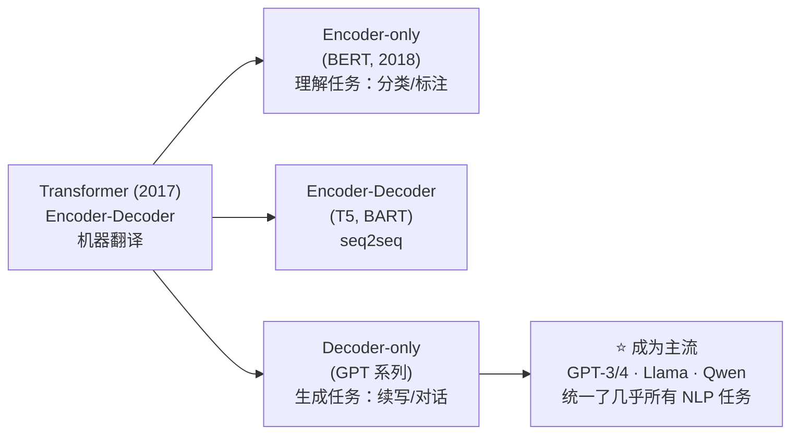
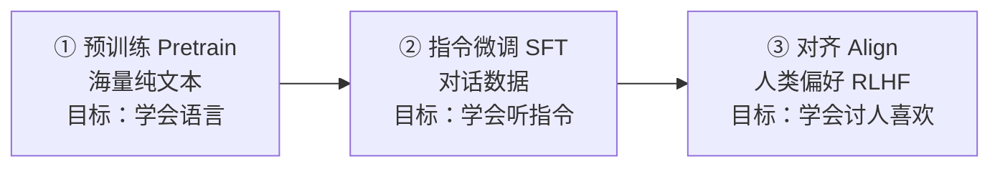

# 第 15 章 现代语言模型全景

恭喜你走到了 Part II 的最后一章。从 Ch 09 的神经元，到 Ch 10 的反向传播，到 Ch 11 的 RNN，再到 Ch 12 的注意力、Ch 13 的 Transformer、Ch 14 的解码策略——你已经把一整套理论积木攥在了手里。

本章是这些积木的「全景图」。我们不引入新的数学，而是退后一步，看清这些零件是如何在真实的大语言模型里组合起来的：GPT 家族是怎么一步步演化到今天的？为什么 **decoder-only + 自回归** 成了绝对主流？「预训练 → 微调 → 对齐」这套三阶段管线从何而来？规模（scaling）又为什么能压出能力？读完这一章，Part I–II 的全部理论就会凝成一个清晰的画面——而下一章（Ch 16《项目初始化与开发环境》）我们就从这张画面前进到 Part III 实战篇，亲手把 zllm 搭起来。

## 15.1 学习目标

读完本章，你应该能够：

- 讲清 GPT 从 GPT-1 到 GPT-4 / Llama / Qwen 的演进脉络，以及 **decoder-only** 为何胜出；
- 默写出预训练目标 NTP 的损失 $`\mathcal{L}_{NTP}=-\sum_t\log P(x_t\mid x_{<t})`$ ，并说清它和 Ch 05 交叉熵的关系；
- 画出「pretrain → SFT → align（RLHF）」三阶段管线，并解释每阶段的目标；
- 说出 Scaling Law 的幂律形式，以及 Chinchilla 提出的「数据量 vs 参数量」配比直觉；
- 把这些大图景和 zllm 钉死：zllm 是这套范式的一个**可跑通的缩微版**（对齐 Qwen3/minimind-3，~64M 参数）。

## 15.2 直觉与动机

### 从「一个 Transformer」到「一个生态」

2017 年 Transformer 刚提出时，它还只是个机器翻译模型（Encoder-Decoder）。短短几年，它分裂出三条路线：



为什么 **decoder-only**（GPT 路线）最终统一了几乎所有任务？因为自回归生成「下一个 token」这个目标**极其通用**：只要你把任何任务都表述成「给一段文本，续写出答案」，一个会续写的模型就能做翻译、问答、摘要、写代码、对话……统一的接口 + 统一的目标 + 统一的架构，让 scaling（堆数据和算力）变得简单粗暴而有效。zllm 选择的正是这条路线。

### 三阶段范式：从「会说话」到「会听话」

一个能用的 LLM 不是一步训出来的，而是经过三个阶段，每个阶段都在前一个的基础上「教模型新本事」：



- **预训练（pretrain）**：喂海量原始文本（网页、书籍），让模型学会「语言的统计规律」——语法、常识、世界知识。产出的是一个「会续写但不会听话」的模型。zllm 的 Ch 31–32。
- **指令微调（SFT, Supervised Fine-Tuning）**：用「问题 → 回答」的对话数据，教模型「当用户提问时，该回答而不是乱续写」。产出的是一个「能对话但可能答非所好」的模型。zllm 的 Ch 33。
- **对齐（align / RLHF）**：用人类的偏好信号（哪个回答更好），把模型往「安全、有用、诚实」的方向微调。zllm 的 Ch 36–38（DPO/PPO/GRPO）。

这三阶段几乎成了现代 LLM 的标准配方。zllm 把它原样搬过来，只是规模缩小到能在单卡上跑完。

## 15.3 数学定义

### 15.3.1 NTP：唯一的预训练目标

decoder-only 模型的预训练目标只有一个——**下一个 token 预测（Next-Token Prediction, NTP）**：给定前 $t$ 个 token，预测第 $t+1$ 个。形式上，对一个长度 $T$ 的序列 $x_{1:T}$ ，最大化它的对数似然，等价于最小化：

$$
\boxed{ \mathcal{L}_{NTP}  =  -\sum_{t=1}^{T-1} \log P_\theta(x_{t+1}\mid x_{1:t}) }
$$

这里 $P_\theta(x_{t+1}\mid x_{1:t})=\mathrm{softmax}(z_{t+1})$ 是模型在词表上输出的类别分布（Ch 03）。这正是 Ch 05 推导过的**交叉熵损失**——「真实下一个 token 服从 one-hot 类别分布」这一假设下，MLE 推出来的必然结果（Ch 04 的「桥二」）。所以 NTP 不是随意选的目标，它是「自回归 + 交叉熵」的自然产物。

> **一个关键洞见**：NTP 看起来只是「猜下一个词」，但为了猜得准，模型被迫学会语法、事实、推理、甚至一点世界模型。**简单的目标 + 海量数据 = 涌现的复杂能力。** 这是整个 LLM 范式的精髓。

### 15.3.2 自回归生成

预训练好后，模型按下面的循环逐 token 生成（Ch 14 讲过的解码策略在这里用）：

$$
x_{t+1}\sim P_\theta(\cdot\mid x_{1:t}),\qquad \text{然后把 } x_{t+1}\text{ 拼回输入，继续预测 } x_{t+2}
$$

每一步都把已生成的全部历史作为条件。这就是「自回归（autoregressive）」——因果掩码（Ch 12）保证了训练时模型只能用过去预测未来，和生成时完全一致。

### 15.3.3 对齐目标（简述）

对齐阶段不是直接优化 NTP，而是优化一个「奖励 - 偏离」的权衡：让模型多拿人类偏好的奖励，但又不能跑得离 SFT 模型太远（用 KL 散度约束，Ch 05）。这条路线有三种实现，zllm 全都实现了：

- **DPO（Ch 36）**：直接用偏好对（chosen/rejected）训练，绕过显式奖励模型；
- **PPO（Ch 37）**：经典的 Actor-Critic 强化学习；
- **GRPO（Ch 38）**：无 Critic，组内相对优势。

它们的数学细节留到 Part VI，这里只需记住：**对齐 = 在 SFT 基础上，用偏好信号进一步调教。**

## 15.4 推导与几何

### 15.4.1 Scaling Law：为什么「大力出奇迹」

2020 年前后，人们发现了一个惊人的规律：**LLM 的测试 loss 随参数量 $N$ 、数据量 $D$ 、算力 $C$ 按幂律下降**，且非常平滑、可预测。OpenAI 的 Scaling Law 形式（简化）为：

$$
\mathcal{L}(N)  \approx  \left(\frac{N_c}{N}\right)^{\alpha_N},\qquad \alpha_N \approx 0.076
$$

其中 $N_c$ 是常数。把 loss 对参数量画在双对数坐标里，它几乎是一条直线：

```
   log(loss)
      │
   4  │●                                    ← 小模型：loss 高
      │ ●
   3  │  ●
      │   ●
   2  │     ●  ●  ●                         ← 大模型：loss 沿幂律下降
      │           ──────────  预测的幂律直线
   1  │
      └──────────────────────────────────► log(参数量 N)
```

这条幂律线的深刻含义是：**只要持续堆数据、堆参数、堆算力，loss 就会持续、可预测地下降**。这不是「运气好」，而是一个经验定律。它给了人们「大力出奇迹」的信心——也是 2020 年后模型规模爆炸式增长的理论依据。

### 15.4.2 Chinchilla：数据与参数要配比

但 Scaling Law 还藏着一个陷阱。DeepMind 2022 年的 Chinchilla 论文指出：**很多大模型其实是「参数多、数据少」的「欠训」状态**。给定固定算力预算 $C$ ，最优策略是让数据量 $D$ 和参数量 $N$ **近似等比例增长**（约 $D:N \approx 20:1$ ，即每个参数喂约 20 个 token）。

$$
N_{opt}\propto C^{0.5},\qquad D_{opt}\propto C^{0.5}
$$

这解释了为什么 Llama 系列相对「小而精」——它用更多的数据训一个不那么大的模型，反而比「大而欠训」的模型更强。zllm 作为教学项目不追求最优配比，但你要知道这个道理：**真实训练里，数据量和质量的回报往往比单纯堆参数更高。**

### 15.4.3 涌现能力（emergent abilities）

随着规模增长，模型在某些任务上不是「平滑变好」，而是在某个阈值后**突然出现**新能力（如少样本推理、链式思考）。这被称为「涌现」。涌现的存在说明：规模本身就是一种「质变」来源。注意，zllm 的 ~64M 参数远未达到涌现阈值——它的价值不在于「能力强」，而在于「**让你看懂、跑通完整流程**」。

## 15.5 与本项目联系

本章是 Part II 的收官，也是通往实战的桥梁。现在把这张全景图和 zllm 一一对应。

### 钩子一：zllm = 这套范式的缩微版

zllm 严格遵循「decoder-only + NTP + 三阶段」范式，只是把规模缩小到单卡可跑：

| 维度 | 工业级 LLM | zllm（缩微版） |
|------|-----------|----------------|
| 架构 | decoder-only Transformer | ✅ 同（对齐 Qwen3/minimind-3） |
| 预训练目标 | NTP（交叉熵） | ✅ Ch 31 |
| 规模 | 数十亿~万亿参数 | ~64M 参数（hidden=768, 8 层） |
| 三阶段 | pretrain→SFT→align | ✅ Ch 31→33→{34/36/37/38} |
| 关键组件 | GQA/RoPE/SwiGLU/MoE | ✅ Ch 20–26 |

也就是说，**你在 zllm 里学到的每一个概念，都能 1:1 平移到理解真实工业 LLM**——这正是 zllm 作为教学项目的核心价值。

### 钩子二：完整管线的每一环都在书里

下面这张图把全书的实战章节和三阶段管线一一对应。注意每一步都对应一个具体的 zllm 里程碑（M1–M12）：

```
Tokenizer (M2, Ch16-19)
      │
      ▼
① 预训练 Pretrain  (M7, Ch31-32)   ← NTP，lr=5e-4
      │
      ▼
② 指令微调 SFT      (M8, Ch33)      ← label masking，lr=1e-5
      │
      ├──► LoRA 微调    (M9, Ch34)   ← 低秩适配，可选
      │
      ▼
③ 对齐 Align
      ├──► DPO          (M10, Ch36)
      ├──► PPO          (M10, Ch37)
      └──► GRPO         (M10, Ch38)
      │
      ├──► 知识蒸馏     (M11, Ch39)   ← MoE→Dense 压缩
      └──► Agent RL     (M11, Ch40)   ← 工具调用
      │
      ▼
推理与部署 Serving    (M12, Ch41-43)  ← 解码 + KV Cache + API
```

读完 Part I–II，你已经掌握了这张图里**每一步背后的理论**。接下来的 Part III–VII，就是把这张图里的每一个方框，用代码一行行实现出来。

### 钩子三：进入实战

> 理论篇到此结束。从 Ch 16《项目初始化与开发环境》开始，我们进入 **Part III 实战篇**。第一件事不是写模型，而是把 zllm 仓库 clone 下来、装好依赖、把 `pytest` 跑起来——亲手感受那 428 个测试如何把一个 LLM 训练系统「钉」在正确的位置上。带上 Part I–II 攒下的全套理论，我们去代码里验证每一个概念。

## 15.6 本章小结

把 Part II 的收官章浓缩成几条：

1. **decoder-only 胜出**：自回归生成 + NTP 提供了统一、通用的接口，让 scaling 简单有效。
2. **NTP**： $`\mathcal{L}_{NTP}=-\sum_t\log P(x_{t+1}\mid x_{<t})`$ ，本质是类别分布的交叉熵（Ch 04–05）。
3. **三阶段**：pretrain（学语言）→ SFT（学指令）→ align（学偏好）。zllm 原样复刻。
4. **Scaling Law**：loss 随 $N/D/C$ 幂律下降；Chinchilla 说要等比喂参数和数据。
5. **zllm 定位**：这套范式的缩微版，价值在「看懂 + 跑通」，不在「指标强」。

> **Part II 完结。** 你已经从「会写 Python 的开发者」走到了「能讲清注意力、Transformer、NTP、Scaling Law 的理论武装者」。下一章（Ch 16《项目初始化与开发环境》）翻开 Part III——理论攒够了，该动手了。

### 思考题

> 这些题没有唯一答案，旨在帮你把全景图刻进脑子。

1. **范式题**：用自己的话解释，为什么「猜下一个词」这么简单的目标，能逼模型学会语法、常识甚至推理？提示：想想模型为了降低 loss「被迫」要建模哪些东西。
2. **配比题**：若你有一个固定算力预算，要训一个 LLM，根据 Chinchilla 的结论，你会优先堆参数还是堆数据？为什么 Llama 选择「相对小模型 + 多数据」？
3. **对照题**：列出本书 Part III–VII 的实战章节，把每章对应到「Tokenizer / 预训练 / SFT / 对齐 / 推理」的哪个阶段。哪一个阶段你最有兴趣先动手？

---

读完本章，你已经拥有了从数学到工程、从零件到全景的完整理论地图。Part I–II（Ch 00–15）的全部理论，都将在 Part III–VII 的实战里得到验证——你会发现，那些抽象的公式（点积、交叉熵、链式法则、注意力），在 zllm 的代码里都化作了具体的 `torch` 运算和可跑通的测试。下一章（Ch 16《项目初始化与开发环境》），我们正式动手，把 zllm 的开发环境搭起来。
