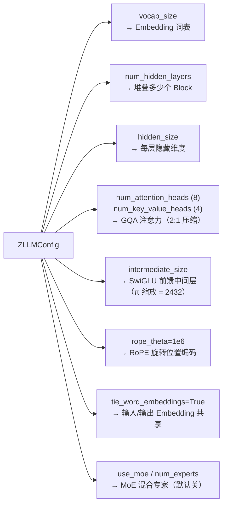

# 第 16 章 项目初始化与开发环境

欢迎来到 Part III 实战篇。从这一章起，我们不再只谈公式，而是把 Part I–II 攒下的每一块理论，对应到 zllm 项目里一行行可运行的代码。

本章是实战篇的第 1 章，也是整本书的「地基」。它的目标很朴素但很关键：**把 zllm 跑起来**，并彻底读懂那个定义整本书一切超参数的文件——`ZLLMConfig`。这个配置类只有 73 行，但它编码了「zllm 模型长什么样」的全部信息：词表多大、多深、多少头、用什么激活、对齐哪个工业模型。读懂它，你才算真正握住了这张地图的图例。

## 16.1 学习目标

读完本章并跟着操作，你应该能够：

- 在本地装好 zllm 的开发环境（Python ≥ 3.14、PyTorch ≥ 2.7），并跑通全部测试；
- 逐字段解释 `ZLLMConfig` 的每一个超参数，说清它来自 Part I–II 的哪一章；
- 看懂 GQA（分组查询注意力）的「2:1 头数压缩」是怎么写进配置的；
- 解释「π 缩放」为什么把 `intermediate_size` 定成 2432 而不是别的数；
- 理解三个共享 fixture（`device` / `small_config` / `default_config`）如何让全书所有测试可复现。

## 16.2 原理回顾：配置就是「把架构参数化」

在 Ch 13《Transformer 架构详解》里，我们推导过一个完整的 Transformer block 长什么样：多头注意力 + 残差 + LayerNorm + 前馈网络。但那张图是「抽象的」——它没告诉你一个具体的模型有多少层、每个头多大、词表多大。把这些「具体数字」抽出来集中管理，就是配置类的职责。

回忆 Ch 15《现代语言模型全景》：zllm 是工业级 LLM 的缩微版，**对齐 Qwen3 / minimind-3** 的架构选择（GQA、RoPE、SwiGLU、MoE、Weight Tying）。所以 `ZLLMConfig` 不是随便填的数字，而是把这些工业实践「冻结」成一个 Python 类。下面的映射图说清了配置里每个参数喂给了架构里的哪个组件：



这张图把本 Part 后续每一章（Ch 20–26 模型架构）都「挂」在了配置上。现在你只要记住一句话：**配置类 = 模型的「图纸」**，所有模型代码都从这份图纸按图施工。

> 一个工程细节：`ZLLMConfig` 继承自 HuggingFace 的 `PretrainedConfig`（`config.py:12`）。这不是偶然——它让 zllm 模型能无缝接入 Transformers 生态（`save_pretrained` / `from_pretrained` / tokenizer 兼容），也为 Part VII《推理与部署》里的 OpenAI 兼容 API 铺路。

## 16.3 代码实现：逐字段拆解 `ZLLMConfig`

完整实现见 `zllm/config.py`（共 73 行）。我们逐段拆解。

### 16.3.1 类声明与默认参数

> 完整实现见 `zllm/config.py:12`

```python
class ZLLMConfig(PretrainedConfig):
    model_type = "zllm"

    def __init__(
        self,
        vocab_size=6400,
        hidden_size=768,
        num_hidden_layers=8,
        num_attention_heads=8,
        num_key_value_heads=4,
        hidden_act="silu",
        max_position_embeddings=32768,
        intermediate_size=None,
        rms_norm_eps=1e-6,
        rope_theta=1000000.0,
        tie_word_embeddings=True,
        flash_attn=True,
        # MoE
        use_moe=False,
        num_experts=4,
        num_experts_per_tok=1,
        ...
    ):
```

这是 `config.py:12-39` 的核心。下表把每个参数和 Part I–II 的理论一一对应：

| 参数 | 默认值 | 含义 | 对应理论章 |
|------|--------|------|-----------|
| `vocab_size` | 6400 | 词表大小（Ch 18–19 训练） | Ch 03 概率分布的类别数 |
| `hidden_size` | 768 | 每层隐藏维度 | Ch 01 向量维度 |
| `num_hidden_layers` | 8 | Transformer block 数 | Ch 13 堆叠深度 |
| `num_attention_heads` | 8 | Query 头数 | Ch 12 多头注意力 |
| `num_key_value_heads` | 4 | KV 头数（**GQA**） | Ch 13 注意力优化 |
| `intermediate_size` | 2432（派生） | SwiGLU 中间层 | Ch 13 FFN |
| `rope_theta` | 1e6 | RoPE 基频 | Ch 13 位置编码 |
| `tie_word_embeddings` | True | 输入/输出 Embedding 共享 | Ch 15 参数效率 |

### 16.3.2 GQA：为什么是 8 个 Q 头、4 个 KV 头

`num_attention_heads=8` 配 `num_key_value_heads=4`（`config.py:20-21`），这是**分组查询注意力（Grouped-Query Attention, GQA）**：8 个 Query 头共享 4 组 KV，即每 2 个 Q 头共用 1 份 Key/Value。相比标准 MHA（8 Q + 8 KV），KV 缓存直接砍半，推理更快、显存更省，而质量几乎不掉。这正是 Qwen3 / LLaMA 的标准做法（Ch 22 会手写实现）。

`head_dim` 由一个 property 给出（`config.py:71-73`）：

```python
@property
def head_dim(self):
    return self.hidden_size // self.num_attention_heads
```

默认 `768 // 8 = 96`，即每个注意力头在 96 维空间里做点积（Ch 12 的 $\sqrt{d_k}$ 缩放就用这个值）。

### 16.3.3 π 缩放：intermediate_size = 2432 的来历

最值得讲的是前馈网络中间层 `intermediate_size`。它不是手填的，而是用「π 缩放」公式派生出来的（`config.py:47-52`）：

> 完整实现见 `zllm/config.py:48`

```python
# π 缩放：ceil(hidden_size * π / 64) * 64，对齐 64 倍数提升 Tensor Core 利用率
self.intermediate_size = (
    intermediate_size
    if intermediate_size is not None
    else math.ceil(hidden_size * math.pi / 64) * 64
)
```

这个公式干了两件事，叠在一起：

1. **目标容量 ≈ hidden_size × π**。标准 Transformer 把 FFN 中间层设成 $4\times d$，但 SwiGLU 的三分叉结构需要更精细的比例。zllm 对齐 minimind-3，用 $\pi \approx 3.14$ 作为倍率：$d \times \pi$。代入 $d=768$：

$$
768 \times \pi \;\approx\; 2412.74
$$

2. **向上取整到 64 的倍数**。NVIDIA Tensor Core 以 16/64 为粒度做矩阵乘，把中间层凑成 64 的倍数能避免算力浪费。`ceil(x / 64) * 64` 就是「大于等于 x 的最小 64 倍数」：

$$
\lceil 2412.74 / 64 \rceil \times 64 \;=\; \lceil 37.70 \rceil \times 64 \;=\; 38 \times 64 \;=\; \boxed{2432}
$$

所以默认 `intermediate_size = 2432`（$2432 / 768 \approx 3.167$，正好略大于 $\pi$，因为向上取整）。这是「理论值」让位于「硬件效率」的典型例子——容量近似 $d\pi$，但必须落在 64 的倍数上。

> **要点**：为什么用一个「古怪」的 π 而不是整数？因为 FFN 容量需要精细匹配 SwiGLU 的三分叉缩放，再把结果 round 到 64 的倍数才是真正的硬件约束。zllm 直接复刻了 Qwen3 / minimind-3 的这套配方。这个派生值会被 16.4 节的测试 `test_pi_scaled_intermediate` 用同一个表达式钉死。

### 16.3.4 MoE、YaRN 与其余开关

最后几个参数（`config.py:29-37`）是「按需开启」的进阶能力，本 Part 暂不深入，但先记个名：

- `use_moe=False` / `num_experts=4` / `num_experts_per_tok=1`：**混合专家（Mixture of Experts）**，默认关。Ch 24 会手写。
- `inference_rope_scaling=None`：**YaRN** 长上下文外推的 RoPE 缩放，推理时用。Ch 21 会讲。
- `flash_attn=True`：是否启用 Flash Attention（Ch 22）。
- `tie_word_embeddings=True`：让输出层的权重矩阵与输入 Embedding 共享，省一大块参数（Ch 26）。

## 16.4 对应单元测试：M1 的「地基检查」

M1 里程碑只有两个测试文件、共 8 个测试，但它们是全书的根。先看 `tests/conftest.py` 里三个**所有后续测试都会用到的共享 fixture**。

### 16.4.1 共享 fixtures

> 完整实现见 `tests/conftest.py:7`

```python
@pytest.fixture
def device():
    """默认 GPU（CUDA 不可用时回退 CPU）。"""
    return torch.device("cuda" if torch.cuda.is_available() else "cpu")

@pytest.fixture
def small_config():
    """用于快速测试的小模型配置（dim=64, 2 layers）。"""
    from zllm.config import ZLLMConfig
    return ZLLMConfig(
        vocab_size=100, hidden_size=64, num_hidden_layers=2,
        num_attention_heads=4, num_key_value_heads=2,
        max_position_embeddings=128,
    )

@pytest.fixture
def default_config():
    """生产默认配置（dim=768, 8 layers, vocab=6400）。"""
    from zllm.config import ZLLMConfig
    return ZLLMConfig()
```

- `device`（`conftest.py:7-10`）：自动选 GPU，没卡回退 CPU。这让全书测试在笔记本和服务器上都能跑。
- `small_config`（`conftest.py:13-25`）：一个**玩具版**配置（dim=64、2 层），跑得飞快，用于绝大多数模型组件测试。
- `default_config`（`conftest.py:28-33`）：**生产默认配置**（就是 16.3 节那些默认值），用于验证真实尺寸下的行为。

这两个配置的分工贯穿全书：`small_config` 管「快」，`default_config` 管「真」。

### 16.4.2 可导入性测试

> 对应测试 `tests/m01_foundations/test_002_import.py:4`

```python
def test_zllm_importable():
    import zllm
    assert zllm.__version__ == "0.0.1"
```

这条测试（`test_002_import.py:4-7`）只做一件事：确认 `import zllm` 不报错、版本号对。它是「环境装好了吗」的最小判据——如果它红，后面一切免谈。

### 16.4.3 配置默认值断言

> 对应测试 `tests/m01_foundations/test_003_fixtures.py:22`

真正有含量的是 `test_003_fixtures.py`，它把 16.3 节讲的关键超参数逐条钉死：

```python
def test_gqa_config(default_config):
    assert default_config.num_attention_heads == 8
    assert default_config.num_key_value_heads == 4       # GQA 2:1

def test_pi_scaled_intermediate(default_config):
    import math
    expected = math.ceil(768 * math.pi / 64) * 64
    assert default_config.intermediate_size == expected   # π 缩放

def test_head_dim(default_config):
    assert default_config.head_dim == 96                   # 768 // 8
```

- `test_gqa_config`（`:22-24`）：GQA 的 8:4 = 2:1 压缩写进断言。
- `test_pi_scaled_intermediate`（`:27-31`）：直接复刻 `config.py:48-52` 的 π 缩放公式，确保「改了配置实现，这个派生值跟着对」。
- `test_head_dim`（`:34-35`）：派生属性 `head_dim == 96`。

这些断言的价值在于**防止回归**：如果将来有人手滑把 `num_key_value_heads` 改成 3，测试立刻变红——因为 GQA 不再是干净的 2:1。

## 16.5 动手验证：把 M1 跑绿

现在轮到你了。打开终端，在仓库根目录执行：

```bash
# 1. 安装（开发模式，含 pytest 等测试依赖）
pip install -e ".[dev]"

# 2. 跑 M1 的全部测试
pytest tests/m01_foundations/ -v
```

预期输出（8 个测试全绿）：

```
tests/m01_foundations/test_002_import.py::test_zllm_importable PASSED
tests/m01_foundations/test_002_import.py::test_config_importable PASSED
tests/m01_foundations/test_003_fixtures.py::test_device_fixture PASSED
tests/m01_foundations/test_003_fixtures.py::test_small_config_fixture PASSED
tests/m01_foundations/test_003_fixtures.py::test_default_config_fixture PASSED
tests/m01_foundations/test_003_fixtures.py::test_gqa_config PASSED
tests/m01_foundations/test_003_fixtures.py::test_pi_scaled_intermediate PASSED
tests/m01_foundations/test_003_fixtures.py::test_head_dim PASSED
===== 8 passed =====
```

> 这 8 个测试都属于 M1 的「地基」。想确认整本书的代码都活着，可直接跑 `pytest`（全 428 个测试）。

最后，亲手验证 16.3.3 节的 π 缩放到底算出多少：

```bash
python -c "import math; print(math.ceil(768 * math.pi / 64) * 64)"
```

你会在屏幕上看到 `2432`——这就是 `intermediate_size` 的真值。把这条命令的输出和 16.3.3 节的推导对上：$768 \times \pi \approx 2412.74$，$/64 \approx 37.70$，`ceil` $\to 38$，$\times 64 = 2432$。文档里写的任何数字都不如这条命令 + 那条断言 `test_pi_scaled_intermediate` 可靠——**TDD 项目里，断言是唯一的真相**。

## 16.6 本章小结 + 下章预告

本章你做了三件事：

1. **装好了环境**：`pip install -e ".[dev]"`，M1 的 8 个测试全绿，证明 zllm 在你的机器上活着。
2. **读懂了图纸**：`ZLLMConfig` 的每一个参数都对应 Part I–II 的一个理论概念——GQA（8Q/4KV）、π 缩放（2432）、RoPE（1e6）、Weight Tying。它是整本书后续所有代码的「单一事实来源」。
3. **建立了测试直觉**：`small_config` 管「快」、`default_config` 管「真」；断言不是装饰，而是防止回归的防线。

> **一句话带走**：配置类是模型的图纸，测试是图纸的质检员。Part III 之后的所有章节，都会从 `ZLLMConfig` 出发，再被 `tests/` 下的测试钉牢。

**下章预告**：地基铺好了，该造第一块砖——**分词器**。Ch 17《分词理论：BPE / WordPiece / SentencePiece》先讲清「文本是怎么变成 token id 序列的」这套理论，然后 Ch 18–19 才动手实现。注意，分词是 NTP 目标（Ch 15）的**前置步骤**——模型不认识字符，只认识整数 id；把文本变成 id，就是分词器的活。
