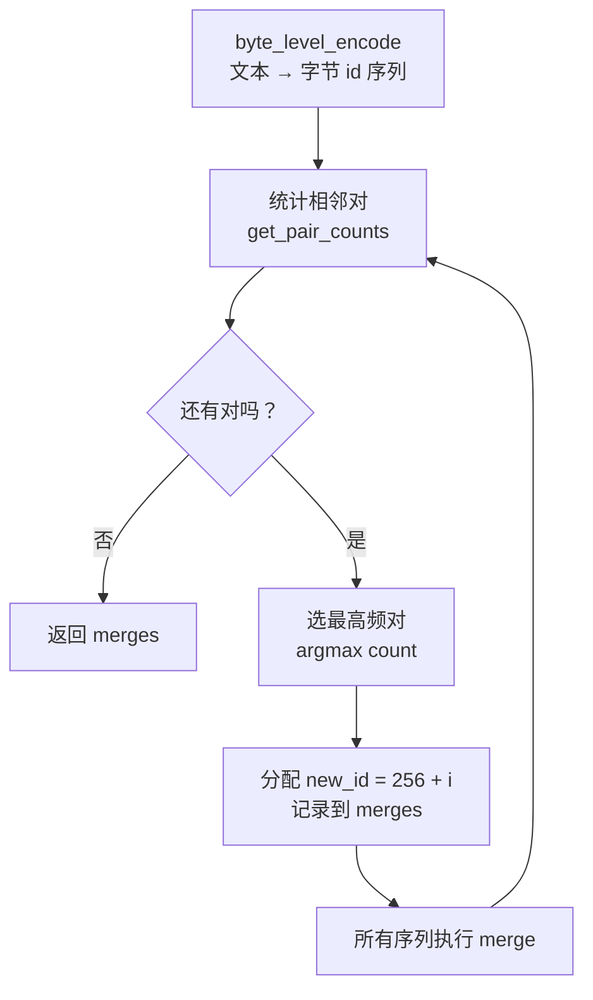

# 第 18 章 教学版 BPE 实现

上一章我们推导了 BPE 的判据：每一步合并最高频的相邻对 $(a^*,b^*)=\arg\max\,\text{count}(a,b)$。这一章，我们把这个公式变成 `zllm/tokenizer/bpe.py` 里 99 行纯 Python 代码——从零实现一个能压缩中文的小 BPE。

这是 zllm 的「教学版」实现：不依赖任何第三方库，每个函数都短到能一眼看穿，目的是让你**彻底理解算法本身**。它跑不快（真实语料要用 Ch 19 的生产版），但它把 BPE 的每一个零件都摊在了桌面上。

## 18.1 学习目标

读完本章，你应该能够：

- 默写出 BPE 的 6 个核心函数及其职责（编码、统计、合并、训练、编码、解码）；
- 解释为什么用**字节级编码**能保证无 OOV；
- 看懂 `merge` 函数「从左到右、已合并不重复参与」的扫描逻辑；
- 手动跑一遍 `train_bpe(["abab"], vocab_size=258)`，预测合并规则；
- 解释 `encode` 为什么「按 new_id 升序套用 merge」等价于贪心编码。

## 18.2 原理回顾：BPE 的训练主循环

回忆 Ch 17 的 BPE 算法：初始词表是 256 个字节值；每一步统计所有相邻对、找出最高频的那个、合并成新 token（id 从 256 开始递增）；重复直到词表达到目标大小。`train_bpe` 把这个循环直接落成代码：



整章的代码就是这张图的逐框实现。注意一个贯穿全局的设计：**所有文本先变成字节 id（0–255），合并产生的新 id 从 256 开始**——这样基本词表和合并词表永远不会撞 id。

## 18.3 代码实现：6 个函数逐个拆解

完整实现见 `zllm/tokenizer/bpe.py`（99 行）。我们从底层到上层依次拆。

### 18.3.1 byte_level_encode：文本 → 字节序列

> 完整实现见 `zllm/tokenizer/bpe.py:8`

```python
def byte_level_encode(text):
    """将文本转换为 UTF-8 字节级 ID 序列（0-255）。"""
    return list(text.encode("utf-8"))
```

就一行（`bpe.py:8-14`），但它是整个算法「无 OOV」的根基。任何文本——中文、emoji、乱码——经 UTF-8 编码后都变成 0–255 的字节序列。基本词表就是这 256 个值，所以**任何字符都能被表示**，永远不会出现 `<unk>`。

> 对应测试 `tests/m02_tokenizer/test_026_bpe_core.py:19` 验证：中文字符「你」编码成 3 个字节（`len == 3`），且每个值都在 `[0, 256)` 内。

### 18.3.2 get_pair_counts：统计相邻对

> 完整实现见 `zllm/tokenizer/bpe.py:17`

```python
def get_pair_counts(sequences):
    """统计所有序列中相邻 token 对的出现次数。"""
    counts = {}
    for seq in sequences:
        for i in range(len(seq) - 1):
            pair = (seq[i], seq[i + 1])
            counts[pair] = counts.get(pair, 0) + 1
    return counts
```

遍历每条序列的每个相邻位置（`bpe.py:17-27`），用字典累加。这就是 Ch 17 公式里的 $\text{count}(a,b)$。长度 ≤ 1 的序列不产生对（`range(len-1)` 为空）。

> 对应测试 `test_026_bpe_core.py:53` 验证：`[1,2,1,2,1,2]` 的最高频对是 `(1,2)`——正是 `argmax count` 要找的目标。

### 18.3.3 merge：合并一个对（核心难点）

> 完整实现见 `zllm/tokenizer/bpe.py:30`

```python
def merge(seq, pair, new_id):
    """将序列中所有相邻的 pair 合并为 new_id。
    从左到右扫描，已合并的位置不重复参与。"""
    result = []
    i = 0
    while i < len(seq):
        if i < len(seq) - 1 and seq[i] == pair[0] and seq[i + 1] == pair[1]:
            result.append(new_id)
            i += 2          # 跳过被合并的两个位置
        else:
            result.append(seq[i])
            i += 1
    return result
```

这段（`bpe.py:30-44`）有个**必须搞对的细节**：从左到右扫描，一旦匹配就 `i += 2` 跳过两个位置，所以**已合并的位置不会和后面的位置再组成新对**。考虑 `[1,2,1,2]` 合并 `(1,2)→99`：扫描到位置 0 匹配，输出 99，`i` 跳到 2；位置 2 又匹配，输出 99，`i` 跳到 4 结束——结果 `[99, 99]`，**不是** `[99]`。

```
序列:   [ 1, 2, 1, 2 ]      合并 (1,2)→99
位置:     0  1  2  3
         └─匹配→99, i=2
               └─匹配→99, i=4   → 结果 [99, 99]
```

还有一个边界：重叠对 `[1,1,1]` 合并 `(1,1)→99`。位置 0 匹配（1,1）→ 99，`i` 跳到 2；位置 2 是单个 1，不匹配 → 输出 1。结果 `[99, 1]`——**不会**把三个 1 合成一个。

> 对应测试 `test_026_bpe_core.py:65`（相邻不重复合并）和 `:69`（重叠对），专门钉这两个边界。

### 18.3.4 train_bpe：训练循环

> 完整实现见 `zllm/tokenizer/bpe.py:78`

```python
def train_bpe(texts, vocab_size):
    sequences = [byte_level_encode(text) for text in texts]
    num_merges = vocab_size - 256          # 需要合并的次数
    merges = {}
    for i in range(num_merges):
        counts = get_pair_counts(sequences)
        if not counts:
            break                          # 没有可合并的对了
        pair = max(counts, key=counts.get) # 最高频对 = argmax count
        new_id = 256 + i
        merges[pair] = new_id
        sequences = [merge(seq, pair, new_id) for seq in sequences]
    return merges
```

这段（`bpe.py:78-99`）就是 Ch 17 的 BPE 判据的直接翻译：`max(counts, key=counts.get)` 就是 $(a^*,b^*)=\arg\max\,\text{count}$。两个关键点：

1. **合并次数 = `vocab_size - 256`**：256 个字节是基本词表，剩下的靠合并产生，所以目标词表 6400 → 合并 6144 次。
2. **`new_id = 256 + i`**：第 $i$ 次合并产生的新 token 拿 id $256+i$，严格递增。这个顺序后面 `encode` 会用到。

> 对应测试 `test_026_bpe_core.py:81` 验证：`train_bpe(["abab","ab"], vocab_size=257)` 只合并 1 次，最高频对是 `(97,98)`（即 `'a','b'`），拿到 id 256。

### 18.3.5 encode：用 merges 编码新文本

> 完整实现见 `zllm/tokenizer/bpe.py:47`

```python
def encode(text, merges):
    """按合并规则的学习顺序（new_id 升序）逐条应用。"""
    ids = byte_level_encode(text)
    for pair, new_id in sorted(merges.items(), key=lambda x: x[1]):
        ids = merge(ids, pair, new_id)
    return ids
```

`encode`（`bpe.py:47-56`）把训练好的 `merges` **按 new_id 升序**逐条套用到新文本上。为什么按学习顺序？因为 BPE 的合并是**有序的**——先学的规则对应更高频、更基础的对，必须先应用。按 id 升序套用，等价于「在训练好的合并优先级下贪心编码」。

> 对应测试 `tests/m02_tokenizer/test_041_encode_decode.py:17` 验证：`train_bpe(["ab"], vocab_size=257)` 学到 `(97,98)→256`，于是 `encode("ab", merges) == [256]`——两个字节被压成一个 token。

### 18.3.6 decode：递归展开还原文本

> 完整实现见 `zllm/tokenizer/bpe.py:59`

```python
def decode(ids, merges):
    rev = {v: k for k, v in merges.items()}   # id → (a, b)
    def expand(token):
        if token in rev:
            a, b = rev[token]
            return expand(a) + expand(b)      # 递归展开
        return [token]
    all_bytes = []
    for token in ids:
        all_bytes.extend(expand(token))
    return bytes(all_bytes).decode("utf-8")
```

`decode`（`bpe.py:59-75`）是 `encode` 的逆运算。每个合并 token 都是一个 `(a, b)` 对，但 `a`、`b` 本身也可能是合并 token（嵌套合并），所以用**递归 `expand`** 一路展开到最底层的字节，再按 UTF-8 解码回文本。这是「多轮合并产生树状结构」的体现——一个高级 token 可能是好几层合并的结果。

> 对应测试 `test_041_encode_decode.py:49` 的 `TestRoundtrip` 验证中英文混合往返一致：`decode(encode(text, merges), merges) == text`。

## 18.4 对应单元测试：钉死每个边界

M2-a 的测试分两个文件，覆盖全部 6 个函数。

### 18.4.1 test_026_bpe_core.py：算法单元测试

> 对应测试 `tests/m02_tokenizer/test_026_bpe_core.py`

四个测试类，逐个钉死 BPE 的行为：

- **TestByteLevelEncode**（`:14-33`）：ASCII 编码（`'ab'→[97,98]`）、中文 3 字节（`:19-24`）、空串（`:26-27`）、字节往返（`:29-33`）。
- **TestGetPairCounts**（`:36-55`）：单序列计数、多序列累加、短序列无对、最高频对（`:53-55`）。
- **TestMerge**（`:58-71`）：全量合并、无匹配、相邻不重复合并（`:65-67`，`[1,2,1,2]→[99,99]`）、重叠对（`:69-71`，`[1,1,1]→[99,1]`）。这组是全章最容易写错的边界。
- **TestTrainBPE**（`:74-95`）：返回 dict、首次合并是最高频对（`:81-86`）、new_id 连续递增（`:88-91`）、`vocab_size==256` 时零合并（`:93-95`）。

### 18.4.2 test_041_encode_decode.py：编解码往返

> 对应测试 `tests/m02_tokenizer/test_041_encode_decode.py`

- **TestEncode**（`:9-29`）：合并后序列变短、单合并 `encode("ab")==[256]`（`:17-20`）、空 merges 退化为字节编码、中文压缩。
- **TestDecode**（`:32-45`）：单合并还原、混合 token、纯字节。
- **TestRoundtrip**（`:48-61`）：ASCII、中文（`:54-57`）、中英混合（`:59-61`）的 `decode(encode(x))==x`——这是「分词器可逆」的最重要保证。

## 18.5 动手验证：跑绿 M2-a

```bash
pytest tests/m02_tokenizer/test_026_bpe_core.py tests/m02_tokenizer/test_041_encode_decode.py -v
```

预期：两个文件全部测试 PASSED。你也可以亲手训练一个 BPE，观察合并规则：

```bash
python -c "
from zllm.tokenizer.bpe import train_bpe, encode, decode
merges = train_bpe(['abab', 'ab'], vocab_size=257)
print('merges:', merges)                 # {(97, 98): 256}
print('encode(ab):', encode('ab', merges))  # [256]
print('decode([256]):', decode([256], merges))  # ab
"
```

输出会是 `merges: {(97, 98): 256}`、`encode(ab): [256]`、`decode([256]): ab`——你亲眼看到两个字节 `'a','b'` 被压成一个 token 256，又能无损还原。

## 18.6 本章小结 + 下章预告

本章你把 Ch 17 的 BPE 公式变成了 6 个纯 Python 函数：

1. **byte_level_encode**：文本 → 字节 id（无 OOV 的根基）；
2. **get_pair_counts**：统计相邻对（$\text{count}$）；
3. **merge**：从左到右合并，已合并不重复参与（最易错的边界）；
4. **train_bpe**：`max(counts,...)` 循环，`new_id=256+i`；
5. **encode**：按 id 升序套用 merges；
6. **decode**：递归展开回字节。

这套实现清晰，但有个硬伤：**纯 Python，跑不动真实语料**。统计相邻对要扫遍全部序列，每合并一次就重扫一遍，语料一大就慢得不可接受。

> **一句话带走**：教学版 BPE 让你看懂算法的每一行；但生产环境需要 C++ 的速度。这正是下一章的主题。

**下章预告**：Ch 19《生产版 Tokenizer + 特殊 Token + Chat Template》——我们换上 HuggingFace `tokenizers` 库（C++ 实现），训练一个能吃下真实中文语料的 BPE，再加上对话必需的特殊 token（`<|im_start|>`、`📞` 等）和把 messages 渲染成模型输入的 chat template。那是 M2 的收官，也是 zllm 真正能「说话」的开始。
