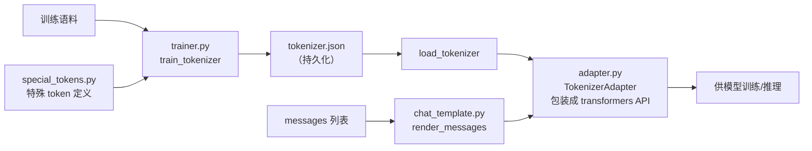

# 第 19 章 生产版 Tokenizer + 特殊 Token + Chat Template

上一章的教学版 `bpe.py` 清晰，但纯 Python 跑不动真实语料。本章换上**生产级实现**：用 HuggingFace `tokenizers` 库（C++ 内核）训练一个能吃下中文语料的 BPE，再配上对话模型必需的两件事——**特殊 token**（对话边界、工具调用、思考链）和 **chat template**（把 OpenAI 风格的 messages 渲染成模型输入）。

这是 M2 的收官，也是 Part III 的收官。完成后，zllm 就有了「把任意对话变成 token id」的完整能力——为 Part IV 的模型、Part V 的训练、Part VI 的对齐（尤其 Ch 40 的 Agent RL 工具调用）铺好路。

## 19.1 学习目标

读完本章，你应该能够：

- 用 `train_tokenizer` 训练一个生产级 BPE，说清它和教学版的对应关系；
- 解释 `ByteLevel` pre-tokenizer + `ByteLevelDecoder` 如何保证「语言无关 + 无 OOV + 可逆」；
- 列出 zllm 的特殊 token 分类（对话边界 / 多模态预留 / 工具调用 / 思考链 / buffer），并说清它们为何要占词表前部的 id；
- 默写出 chat template 的格式 `<|im_start|>role\ncontent<|im_end|>\n`，以及 `add_generation_prompt`、`open_thinking`、`tools` 三个开关的作用；
- 理解 `TokenizerAdapter` 如何把 raw `tokenizers.Tokenizer` 包装成 transformers 风格的 API。

## 19.2 原理回顾与四大组件总览

### 19.2.1 从教学版到生产版

Ch 18 的 BPE 判据（合并最高频对）和 Ch 19 完全一致——区别只在**实现**：生产版用 `tokenizers` 库的 C++ 内核，统计和合并在底层高效完成，能在几秒内训完 MB 级语料。此外，生产版多了教学版没有的三件事：**预切分（pre-tokenizer）**、**特殊 token 注入**、**保存/加载（tokenizer.json）**。

### 19.2.2 四大组件

zllm 的 tokenizer 模块拆成 4 个文件，各司其职：



- **trainer.py**：训练 + 加载（`train_tokenizer` / `load_tokenizer`）。
- **special_tokens.py**：定义所有特殊 token（对话边界、工具调用、思考链等）。
- **chat_template.py**：把 messages 渲染成模型输入文本（`render_messages` + Jinja2 模板）。
- **adapter.py**：把 raw `tokenizers.Tokenizer` 包装成 transformers 风格 API（`TokenizerAdapter`）。

下面逐个拆。

## 19.3 代码实现：四个文件

### 19.3.1 trainer.py：训练与加载

> 完整实现见 `zllm/tokenizer/trainer.py:18`

```python
def train_tokenizer(texts, vocab_size=6400, save_dir=None):
    tokenizer = Tokenizer(BPE())
    # ByteLevel pre-tokenizer：先转字节序列再分词，保证无 OOV
    tokenizer.pre_tokenizer = ByteLevel(add_prefix_space=False)
    # 配套 decoder：将 ByteLevel 字符映射还原为原始字节文本
    tokenizer.decoder = ByteLevelDecoder()
    trainer = BpeTrainer(
        vocab_size=vocab_size,
        special_tokens=ALL_SPECIAL_TOKENS,
        initial_alphabet=ByteLevel.alphabet(),
    )
    tokenizer.train_from_iterator(texts, trainer=trainer)
    if save_dir is not None:
        os.makedirs(save_dir, exist_ok=True)
        tokenizer.save(os.path.join(save_dir, "tokenizer.json"))
    return tokenizer
```

这段（`trainer.py:18-43`）有三个关键点：

1. **`Tokenizer(BPE())`**（`:29`）：用 BPE 模型，判据和 Ch 18 一致，但走 C++ 内核。
2. **`ByteLevel` pre-tokenizer + `ByteLevelDecoder`**（`:31`、`:33`）：这就是 Ch 17 讲的 SentencePiece「语言无关」思想——不预切空格，先把文本映射成 256 个「字节字符」，再 BPE。`ByteLevel.alphabet()`（`:37`）给出这 256 个初始字符。配套的 decoder 保证可逆还原。
3. **`special_tokens=ALL_SPECIAL_TOKENS`**（`:36`）：训练时把特殊 token **排在词表最前面**，它们各占一个低 id（见 19.4 节测试 `test_special_token_ids_at_start`）。

加载则相反（`trainer.py:46-57`）：`load_tokenizer` 接受目录或文件路径，`Tokenizer.from_file` 重建对象。

> 对应测试 `tests/m02_tokenizer/test_035_production_tokenizer.py:45` 验证：`<|im_start|>` 编码后是**单个 token**（`len(ids)==1`），说明它被正确吸收进词表。

### 19.3.2 special_tokens.py：特殊 token 设计

> 完整实现见 `zllm/tokenizer/special_tokens.py:12`

```python
SPECIAL_TOKENS = [
    "<|im_start|>",   # 对话边界（起）
    "<|im_end|>",     # 对话边界（终）
    "<|pad|>",        # padding
    "<|vision_start|>", "<|vision_end|>", "<|image_pad|>", "<|audio_pad|>",  # 多模态预留
    "📞",             # 工具调用触发
    "<toolcall_start>", "<toolcall_end>",
    "<executionsandbox_start>", "<executionsandbox_end>",
    "<executionresult_start>", "<executionresult_end>",
    "<reasoningchain_start>", "<reasoningchain_end>",   # 思考链
]
BUFFER_TOKENS = [f"<|buffer{i}|>" for i in range(1, 9)]   # 8 个预留位
ALL_SPECIAL_TOKENS = SPECIAL_TOKENS + BUFFER_TOKENS
```

zllm 的特殊 token（`special_tokens.py:12-34`）分五类，对齐 Qwen3 / minimind-3：

- **对话边界**：`<|im_start|>` / `<|im_end|>` 标记每轮对话的起止——这是 chat template 的基石。
- **多模态预留**：`<|vision_*|>` 等（当前不实现，但保留 id 槽位以兼容未来）。
- **工具调用**：`📞` 和 `<toolcall_*>`、`<execution*_*>` 供 Ch 40 的 Agent RL 标记工具调用与执行结果。
- **思考链**：`<reasoningchain_start/end>` 包裹推理过程（对应 Qwen3 的思考模式）。
- **buffer**（`:37`）：8 个 `<|buffer1..8|>` 预留位，为未来扩展保留 id。

> 对应测试 `tests/m02_tokenizer/test_030_special_tokens.py:24` 验证无重复，`:39` 验证工具调用 `📞` 在列表里。

### 19.3.3 chat_template.py：对话渲染

> 完整实现见 `zllm/tokenizer/chat_template.py:25`

```python
def render_messages(messages, tools=None, open_thinking=False,
                    add_generation_prompt=False):
    parts = []
    # ... 处理 system 块（含工具声明 tools）...
    for msg in messages[start_idx:]:
        role, content = msg["role"], msg["content"]
        if open_thinking and role == "assistant":
            content = f"{REASONINGCHAIN_START}{content}{REASONINGCHAIN_END}"
        parts.append(f"{IM_START}{role}\n{content}{IM_END}\n")
    if add_generation_prompt:
        parts.append(f"{IM_START}assistant\n")
    return "".join(parts)
```

`render_messages`（`chat_template.py:25-72`）把 OpenAI 风格的 `messages` 列表渲染成模型输入文本，格式是 `<|im_start|>role\ncontent<|im_end|>\n`。三个开关：

1. **`tools`**（`:46-55`）：把工具定义注入 system 块（「你可以使用以下工具：...」），供 Agent RL 用。
2. **`open_thinking`**（`:64-65`）：用思考链标签包裹 assistant 内容，对应推理模式。
3. **`add_generation_prompt`**（`:69-70`）：在末尾追加 `<|im_start|>assistant\n`，告诉模型「现在轮到你了」——这是**推理时**的关键，模型从这里开始续写回答。

另外还有一个 Jinja2 版本 `CHAT_TEMPLATE`（`:76-94`），**逻辑相近但不支持 `tools` 注入**（只渲染 messages + `open_thinking` + `add_generation_prompt`）；Agent RL（Ch 40）必须用 `render_messages` 才能把工具描述注入 system 块。它供 `PreTrainedTokenizerFast.chat_template` 用，兼容 Transformers 生态。

> 对应测试 `tests/m02_tokenizer/test_044_chat_template.py:53` 验证 `add_generation_prompt=True` 时文本以 `<|im_start|>assistant\n` 结尾，`:65` 验证 `open_thinking` 包裹 assistant，`:87` 验证 tools 注入 system。

### 19.3.4 adapter.py：transformers 风格的包装

> 完整实现见 `zllm/tokenizer/adapter.py:10`

```python
class TokenizerAdapter:
    def __init__(self, tokenizer):
        self._tok = tokenizer
        self.bos_token = "<|im_start|>"
        self.eos_token = "<|im_end|>"
        self.pad_token = "<|pad|>"
        self.bos_token_id = tokenizer.token_to_id(self.bos_token)
        self.eos_token_id = tokenizer.token_to_id(self.eos_token)
        self.pad_token_id = tokenizer.token_to_id(self.pad_token)
    # ... encode / decode / __call__ / apply_chat_template ...
```

`TokenizerAdapter`（`adapter.py:10-65`）把 raw `tokenizers.Tokenizer` 包装成具有 transformers 风格 API 的对象，提供 `.bos_token_id` / `.eos_token_id` / `.pad_token_id`（`:13-18`）、`__call__`（`:44-52`，按需加 bos/eos）、`apply_chat_template`（`:54-65`，内部调 `render_messages` 再编码）。这样训练循环和推理代码就能用统一的接口，不用关心底层是哪个库。`wrap`（`:74-78`）是个幂等包装函数，已是 Adapter 就原样返回。

> 这个 Adapter 会在 Ch 27（数据流水线）被正式启用——它是「tokenizer 与训练代码」的黏合层。

## 19.4 对应单元测试：四大组件全覆盖

M2-b 的测试分四个文件：

### 19.4.1 test_030_special_tokens.py：特殊 token 完整性

> 对应测试 `tests/m02_tokenizer/test_030_special_tokens.py`

- `:24` 无重复、`:39` 工具调用 `📞`、`:52` buffer 数量 8、`:64` 常量值正确。保证特殊 token 列表自洽。

### 19.4.2 test_035_production_tokenizer.py：训练/编解码/保存加载

> 对应测试 `tests/m02_tokenizer/test_035_production_tokenizer.py`

- `:45-54` 特殊 token 是单 token（说明被词表吸收）；`:56-59` 特殊 token id 在词表前部（`vocab["<|im_start|>"] < 50`）；`:72-80` 中文/混合往返一致；`:99-103` **压缩测试**——编码后 token 数少于字符数（对应 Ch 17 的压缩比）。

### 19.4.3 test_044_chat_template.py：对话渲染

> 对应测试 `tests/m02_tokenizer/test_044_chat_template.py`

- `:53-56` generation prompt、`:65-71` open_thinking、`:87-93` tools 注入、`:102-108` Jinja2 模板存在。

### 19.4.4 test_050_integration.py：全管线集成

> 对应测试 `tests/m02_tokenizer/test_050_integration.py`

- `:25-34` **端到端**：`train → save → load → render chat → encode → decode` 全链路一致，是 M2 的「集成验收」。

## 19.5 动手验证：跑绿整个 M2

```bash
pytest tests/m02_tokenizer/ -v
```

预期：6 个测试文件全部 PASSED。你也可以亲手训练一个中文 tokenizer，观察压缩效果：

```bash
python -c "
from zllm.tokenizer.trainer import train_tokenizer
corpus = ['从零训练中文大语言模型。'] * 20 + ['BPE 合并高频字节对。'] * 20
tok = train_tokenizer(corpus, vocab_size=400)
text = '从零训练中文大语言模型'
ids = tok.encode(text).ids
print(f'字符数={len(text)}, token 数={len(ids)}, 压缩比={len(ids)/len(text):.2f}')
print('im_start id =', tok.token_to_id('<|im_start|>'))
"
```

你会看到 token 数明显少于字符数（压缩比 < 1），且 `<|im_start|>` 拿到一个很小的 id（前部），印证 19.3.1 讲的「特殊 token 占词表前部」。

## 19.6 本章小结 + Part III 收官

本章你完成了 zllm 的「语言接口」：

1. **trainer.py**：C++ 内核训练生产级 BPE，`ByteLevel` 保证语言无关 + 无 OOV + 可逆；
2. **special_tokens.py**：对话边界 / 工具调用 / 思考链 / buffer 四类特殊 token；
3. **chat_template.py**：`render_messages` 把 messages 渲染成 `<|im_start|>role\n...<|im_end|>\n`，三个开关 `tools`/`open_thinking`/`add_generation_prompt`；
4. **adapter.py**：包装成 transformers 风格 API，黏合训练与推理。

> **一句话带走**：分词器把对话变成 id，特殊 token 给对话结构，chat template 给对话格式——三者合一，zllm 就能「听懂」人类语言。

### Part III 收官

至此 Part III（Ch 16–19）全部完成：

- **Ch 16**：环境就绪，`ZLLMConfig` 读懂——模型图纸在手。
- **Ch 17**：分词理论，BPE 判据清晰。
- **Ch 18**：教学版 BPE，6 个函数逐行看懂。
- **Ch 19**：生产版 tokenizer + 特殊 token + chat template——语言接口打通。

**基石已铺好**：左边是配置（图纸），右边是 tokenizer（语言接口）。从下一章起，我们进入 **Part IV 模型架构**，开始把图纸上的每一个组件——RMSNorm、RoPE、GQA 注意力、SwiGLU、MoE、Block 组装、CausalLM 头——一行行搭起来。Ch 20《RMSNorm 归一化》是第一块砖。
