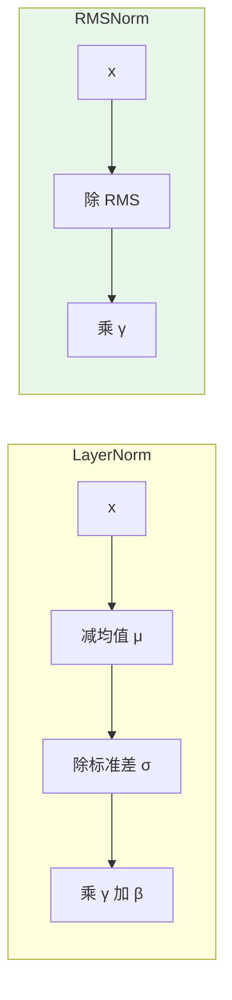

# 第 20 章 RMSNorm 归一化

进入 Part IV 模型架构。我们要从最小的零件开始，一行行搭起整个 Transformer。第一块砖是**归一化（normalization）**——具体说，是 **RMSNorm**。

为什么归一化是第一块砖？因为深度网络（zllm 有 8 层）里，每一层的线性变换会让激活值的尺度（magnitude）越乘越大或越小，导致梯度爆炸或消失（Ch 10 讲过）。归一化在每一层把激活「拉回」到一个稳定的尺度，是深网络能训练的前提。zllm 全程用 **RMSNorm** 而非传统的 LayerNorm——它更简单、更快，是 LLaMA / Qwen3 系的标配。

## 20.1 学习目标

读完本章，你应该能够：

- 写出 LayerNorm 和 RMSNorm 的公式，说清两者的差别；
- 解释 RMSNorm 为什么能省掉「减均值」这一步，以及省下多少计算；
- 看懂 `zllm/model/norms.py` 的 21 行实现，包括 `norm()` 和 `forward()` 的分工；
- 解释为什么内部要用 float32 计算、再 `.type_as(x)` 转回原精度；
- 默写出 RMSNorm 的「恒等初始化」（weight 全 1）为何能让它一开始就接近恒等映射。

## 20.2 原理回顾：从 LayerNorm 到 RMSNorm

### 20.2.1 为什么需要归一化

回忆 Ch 10《反向传播与训练动力学》：深网络里梯度会逐层放大或缩小，激活值的方差也会漂移。如果不加约束，几层之后激活值就可能爆到 inf 或缩到 0，训练直接崩。**归一化层**的职责就是在每次变换后把激活「拉回」稳定尺度，让深网络可训。

Ch 13 讲过，Transformer 每个 block 里有两处归一化（Pre-Norm 架构，见 Ch 25）。传统做法是 **LayerNorm**，但 zllm 用的是它的精简版 **RMSNorm**。

### 20.2.2 两个公式的对比

**LayerNorm** 对每个 token 的隐藏向量 $x\in\mathbb{R}^d$ 先减均值、除标准差，再仿射：

$$
\text{LayerNorm}(x) \;=\; \frac{x - \mu}{\sqrt{\sigma^2 + \epsilon}} \odot \gamma + \beta, \qquad \mu=\frac{1}{d}\sum_i x_i,\;\; \sigma^2=\frac{1}{d}\sum_i (x_i-\mu)^2
$$

**RMSNorm** 砍掉了「减均值」和偏置 $\beta$，只用**均方根（Root Mean Square）**做缩放：

$$
\boxed{\;\text{RMSNorm}(x) \;=\; \frac{x}{\text{RMS}(x) + \epsilon}\odot\gamma, \qquad \text{RMS}(x)=\sqrt{\frac{1}{d}\sum_i x_i^2}\;}
$$



RMSNorm 省了什么？**省掉均值 $\mu$ 的计算和减法**。注意 $\text{RMS}(x)^2=\mu^2+\sigma^2$（均值平方+方差），所以 RMS 本质上同时编码了「偏移」和「离散度」，只是不再单独把均值扣掉。实践证明，对 Transformer 而言扣不扣均值对效果几乎无影响，但少算一次均值同步（跨维度求和）能带来可观的加速——尤其在 GPU 上，一次额外的全维度规约是有成本的。

> **数值细节**：RMSNorm 的实现里通常写成 $x\cdot\text{rsqrt}(\text{mean}(x^2)+\epsilon)$，用 `rsqrt`（平方根倒数）而不是先开方再除——因为 GPU 上 `rsqrt` 是一条指令，比 `sqrt` + 除法快。

## 20.3 代码实现：21 行的 RMSNorm

完整实现见 `zllm/model/norms.py`（21 行），短到能一眼看全。

### 20.3.1 类结构与初始化

> 完整实现见 `zllm/model/norms.py:11`

```python
class RMSNorm(nn.Module):
    def __init__(self, dim: int, eps: float = 1e-5):
        super().__init__()
        self.eps = eps
        self.weight = nn.Parameter(torch.ones(dim))
```

`__init__`（`norms.py:12-15`）只有两件事：存 `eps`（防除零的小常数），建一个可学习的缩放参数 `weight`（形状 `(dim,)`）。**关键是 `weight` 初始化为全 1**——这叫「恒等初始化」：训练刚开始时 $\gamma=\mathbf{1}$，RMSNorm 接近于「只做归一化、不额外缩放」，让网络的初始行为稳定可预测。

> 对应测试 `tests/m03_model_components/test_052_rmsnorm.py:17` 验证 `weight` 初始就是 `ones(dim)`，`:21` 验证 `eps` 默认 `1e-5`。

### 20.3.2 norm() 与 forward() 的分工

> 完整实现见 `zllm/model/norms.py:17`

```python
def norm(self, x: torch.Tensor) -> torch.Tensor:
    return x * torch.rsqrt(x.pow(2).mean(-1, keepdim=True) + self.eps)

def forward(self, x: torch.Tensor) -> torch.Tensor:
    return (self.weight * self.norm(x.float())).type_as(x)
```

两个方法分工明确（`norms.py:17-21`）：

- **`norm(x)`**（`:17-18`）：只做归一化（**不乘 weight**）。对应公式里的 $\frac{x}{\text{RMS}(x)+\epsilon}=x\cdot\text{rsqrt}(\text{mean}(x^2)+\epsilon)$。`mean(-1, keepdim=True)` 在最后一维（隐藏维度）上求均方，保持维度以便广播。
- **`forward(x)`**（`:20-21`）：归一化后乘 `weight`，并负责**精度管理**。

### 20.3.3 为什么内部用 float32

`forward` 里有个容易忽略但极重要的细节：`self.norm(x.float())`——**先把输入升到 float32 再算归一化**，算完 `.type_as(x)` 转回原始精度（可能是 bf16/fp16）。

为什么？因为 `mean(x^2)` 涉及把 $d$ 个（zllm 是 768 个）平方项加起来，低精度（bf16 只有 7 位尾数）很容易在累加时丢精度，导致 `rsqrt` 结果不准、甚至数值不稳。强制在 float32 下算这一步，是**用一点显存换训练稳定性**的标准做法。

> 对应测试 `test_052_rmsnorm.py:65`（`test_float32_internal_compute`）验证：输入 fp16，输出仍是 fp16（`.type_as(x)` 转回去了），但内部计算走了 float32，避免溢出。`:57`（`test_bfloat16_preserved`）验证 bf16 输入输出类型一致。

> 对应测试 `test_052_rmsnorm.py:80`（`test_norm_method`）专门验证 `norm()` 方法**只归一化不乘 weight**——它单独测 `norm(x.float())` 与手算的 $x/(\text{RMS}+\epsilon)$ 一致，把两个职责拆开钉死。

## 20.4 对应单元测试：钉死每个性质

> 对应测试 `tests/m03_model_components/test_052_rmsnorm.py`

M3-a 的测试分两组，覆盖初始化与 forward 行为：

- **TestRMSNormInit**（`:12-27`）：weight 形状 `:13`、weight 全 1 `:17`、eps 默认 `1e-5` `:21`、eps 可自定义 `1e-6` `:25`。
- **TestRMSNormForward**（`:30-87`）：
  - `test_output_shape`（`:31`）：输出形状 == 输入形状。
  - `test_identity_when_weight_ones`（`:37`）：weight=1 时，输出 == 手算归一化结果。
  - `test_scaling_with_weight`（`:44`）：weight 填 2.0、输入全 1 时，输出全 2.0（验证 weight 的缩放作用）。
  - `test_zero_input`（`:51`）：全零输入输出仍 finite（eps 防除零生效）。
  - `test_float32_internal_compute`（`:65`）：低精度内部走 float32。
  - `test_gradients_flow`（`:72`）：梯度能回流。
  - `test_norm_method`（`:80`）：`norm()` 不乘 weight。

其中 `test_scaling_with_weight`（`:44-49`）最直观：把 `weight` 手动填成 2.0，输入全 1 的向量经归一化后 $\frac{1}{\text{RMS}}\approx 1$（因为 RMS(全1)=1），再乘 weight=2 得到全 2——一行测试同时验证了「归一化」和「weight 缩放」两件事。

## 20.5 动手验证

```bash
pytest tests/m03_model_components/test_052_rmsnorm.py -v
```

预期：全部 PASSED。你也可以亲手感受 RMSNorm 与 LayerNorm 的差别：

```bash
python -c "
import torch
from zllm.model.norms import RMSNorm
norm = RMSNorm(8)
x = torch.tensor([[3.0, 0.0, 0.0, 0.0, 0.0, 0.0, 0.0, 0.0]])
print('输入:', x)
print('RMSNorm 输出:', norm(x))
print('weight:', norm.weight)   # 全 1
"
```

你会看到那个 `[3,0,0,...]` 向量被「拉平」——大值缩小，整体均方根变成 1，再乘全 1 的 weight。

## 20.6 本章小结 + 下章预告

本章要点：

1. **归一化**是深网络可训练的前提，把每层激活拉回稳定尺度。
2. **RMSNorm** = $\frac{x}{\text{RMS}(x)+\epsilon}\odot\gamma$，比 LayerNorm 省「减均值」和偏置，更快、效果相当。
3. **实现**：`norm()` 只归一化、`forward()` 再乘 weight 并管理精度；**内部 float32 计算防溢出**。
4. **恒等初始化**（weight=1）让训练初期接近恒等映射，稳定起步。

> **一句话带走**：RMSNorm 是 LLaMA/Qwen3 系的标配——更少的计算、同样的稳定，21 行就能写完。

**下章预告**：归一化搞定了，下一个零件是**位置编码**。Ch 21《RoPE 旋转位置编码 + YaRN》——讲清「用旋转矩阵把相对位置编进 Q/K」的精妙数学，以及 YaRN 如何让模型外推到更长的上下文。RoPE 比 LayerNorm/RMSNorm 复杂得多，它是 zllm 里数学最漂亮的组件之一。
