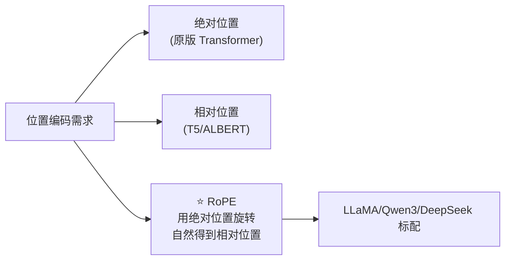

# 第 21 章 RoPE 旋转位置编码 + YaRN

上一章的 RMSNorm 解决了「激活尺度漂移」。但 Transformer 的注意力还有一个先天缺陷：**它本身不知道 token 的顺序**。Ch 12 讲过，注意力的核心是 $QK^T$，这个点积对 token 的位置完全无感——「猫追狗」和「狗追猫」如果不加位置信息，算出来的注意力一模一样。所以必须把位置信息「注入」Q 和 K。

zllm 用的是 **RoPE（Rotary Position Embedding，旋转位置编码）**——这是当下几乎所有主流 LLM（LLaMA、Qwen3、DeepSeek）的选择。它的数学极其优雅：**用旋转矩阵编码绝对位置，却天然让注意力只依赖相对位置**。本章会把这套数学从头推一遍，然后讲 zllm 的实现，最后说清 **YaRN** 如何让模型外推到比训练时更长的上下文。

## 21.1 学习目标

读完本章，你应该能够：

- 说清为什么注意力需要位置编码，以及绝对/相对位置编码的差别；
- 默写出 RoPE 的核心结论：$\langle R_m q, R_n k\rangle$ 只依赖相对位置 $m-n$；
- 解释「把 head_dim 两两配对当 2D 向量旋转」的几何图像；
- 看懂 `precompute_freqs_cis` / `rotate_half` / `apply_rotary_pos_emb` 三个函数；
- 解释 YaRN 的 ramp 机制如何让 RoPE 外推到更长上下文。

## 21.2 原理回顾：位置编码为什么必需

回忆 Ch 12 的注意力：$\text{score}_{ij}=q_i\cdot k_j/\sqrt{d_k}$。如果把输入序列打乱顺序，每个 $q_i$、$k_j$ 不变（因为它们是 $x W$ 线性变换，逐 token 独立），那所有 $\text{score}_{ij}$ 也不变——**注意力是位置无关的**。这对语言是致命的：「我爱你」和「你爱我」必须不同。

解决方案分两派：

- **绝对位置编码**（原版 Transformer）：给每个位置 $m$ 加一个位置向量 $p_m$，$q_m=(x_m+p_m)W$。简单，但模型要「记住」每个绝对位置，外推到训练时没见过的长度就崩。
- **相对位置编码**：让注意力分数直接是相对距离 $m-n$ 的函数。更符合「语言里真正重要的是词之间的相对位置」，但实现往往很贵。



RoPE 的精妙之处：它给的是**绝对**位置编码（每个位置 $m$ 都有一个明确的旋转），但数学上**自然保证**注意力只依赖相对位置 $m-n$。鱼与熊掌兼得。

## 21.3 推导：旋转如何编码相对位置

### 21.3.1 从 2D 开始

先把问题简化到 2 维。设位置 $m$ 的 query 是 2D 向量 $q=[q_0,q_1]^T$。RoPE 的做法：**把它旋转一个与 $m$ 成正比的角度 $m\theta$**：

$$
R_{m\theta}\,q \;=\; \begin{pmatrix}\cos m\theta & -\sin m\theta \\ \sin m\theta & \cos m\theta\end{pmatrix}\begin{pmatrix}q_0\\q_1\end{pmatrix}
$$

同样，位置 $n$ 的 key 旋转 $n\theta$。现在算两者的点积（注意力分数）：

$$
\langle R_{m\theta}q,\; R_{n\theta}k\rangle \;=\; q^T R_{m\theta}^T R_{n\theta}\,k
$$

旋转矩阵是**正交**的：$R_{m\theta}^T = R_{-m\theta}$，且 $R_{-m\theta}R_{n\theta}=R_{(n-m)\theta}$。所以：

$$
\boxed{\;\langle R_{m\theta}q,\; R_{n\theta}k\rangle \;=\; q^T R_{(n-m)\theta}\,k\;}
$$

**点积只依赖相对位置 $n-m$！** 这就是 RoPE 的全部魔法。我们注入的是绝对位置（每个 token 旋转 $m\theta$），但注意力天然只看相对距离。

### 21.3.2 推广到 head_dim 维

`head_dim`（zllm 默认 96）显然不是 2。RoPE 的做法：**把 head_dim 维两两配对，每一对当成一个 2D 向量独立旋转**。第 $i$ 对（$i=0,1,\dots,d/2-1$）的旋转频率不同：

$$
\theta_i \;=\; \frac{1}{\text{base}^{\,2i/d}}, \qquad d=\text{head\_dim},\;\text{base}=\text{rope\_theta}
$$

`base` 很大（zllm 默认 `rope_theta=1e6`），所以 $\theta_i$ 随 $i$ 增大迅速衰减：靠前的维度对旋转快（高频，捕捉局部位置），靠后的维度对旋转慢（低频，捕捉长程位置）。这种「多尺度」设计让模型同时感知近距离和远距离的相对位置。

直观理解频率衰减：

```
维度对 i:    0        1        2      ...    d/2-1
频率 θ_i:   高  ───────────────────────────►  低
旋转速度:   快  ───────────────────────────►  慢
捕捉尺度:   局部词序 ──────────────────────►  长程依赖
```

### 21.3.3 实现技巧：rotate_half

直接做 2×2 分块矩阵乘很慢。工程上有个等价写法：把 $q\in\mathbb{R}^d$ 拆成两半 $q=[q_a\,;\,q_b]$（各 $d/2$），定义 `rotate_half`：

$$
\text{rotate\_half}(q) \;=\; [-q_b\,;\,q_a]
$$

然后用「乘 cos + rotate_half 乘 sin」一步算出旋转结果：

$$
R\,q \;=\; q\odot\cos \;+\; \text{rotate\_half}(q)\odot\sin
$$

其中 $\cos=[c_0,\dots,c_{d/2-1},\;c_0,\dots,c_{d/2-1}]$（前后半段相同，因为 cos/sin 各复制一份）。这个公式和分块旋转在数学上完全等价，但全是逐元素运算，GPU 友好。zllm 用的就是这个写法。

## 21.4 代码实现：三个函数

完整实现见 `zllm/model/rope.py`（69 行）。

### 21.4.1 precompute_freqs_cis：预计算 cos/sin 表

> 完整实现见 `zllm/model/rope.py:17`

```python
def precompute_freqs_cis(dim, end=32768, rope_base=1e6, rope_scaling=None):
    freqs = 1.0 / (
        rope_base ** (torch.arange(0, dim, 2)[: (dim // 2)].float() / dim)
    )
    # ... YaRN 缩放分支（见 21.5）...
    t = torch.arange(end, device=freqs.device)
    freqs = torch.outer(t, freqs).float()                # (end, d/2)
    freqs_cos = torch.cat([torch.cos(freqs), torch.cos(freqs)], dim=-1)  # 复制一份
    freqs_sin = torch.cat([torch.sin(freqs), torch.sin(freqs)], dim=-1)
    return freqs_cos, freqs_sin
```

这段（`rope.py:17-56`）一次预计算好所有位置的 cos/sin：

1. **频率**（`:23-28`）：$\theta_i=1/\text{base}^{2i/d}$，对应 21.3.2 的公式。
2. **外积**（`:52-53`）：`outer(t, freqs)` 算出每个位置 $m$、每个频率 $i$ 的相位 $m\theta_i$，得到 `(end, d/2)` 的表。
3. **cos/sin 各复制一份**（`:54-55`）：`cat([cos, cos])` 拼成 `dim` 维，匹配 `rotate_half` 的「前后半段」布局。

> 对应测试 `tests/m03_model_components/test_057_rope.py:14` 验证 cos/sin 形状 `(end, dim)`；`:19-25` 验证位置 0 时 cos=1、sin=0（$R_0$ 是单位矩阵）；`:33` 验证更大的 `rope_base` 周期更长；`:40` 验证「后半段等于前半段」（cat 复制）。

### 21.4.2 rotate_half：旋转一半维度

> 完整实现见 `zllm/model/rope.py:59`

```python
def rotate_half(x: torch.Tensor) -> torch.Tensor:
    return torch.cat(
        (-x[..., x.shape[-1] // 2 :], x[..., : x.shape[-1] // 2]),
        dim=-1,
    )
```

就是 21.3.3 的 $[-q_b;\,q_a]$（`rope.py:59-63`）。对 $[1,2,3,4]$ 输出 $[-3,-4,1,2]$。

> 对应测试 `test_057_rope.py:52` 用 `[1,2,3,4]→[-3,-4,1,2]` 精确验证。

### 21.4.3 apply_rotary_pos_emb：对 Q/K 施加旋转

> 完整实现见 `zllm/model/rope.py:66`

```python
def apply_rotary_pos_emb(q, k, cos, sin, unsqueeze_dim=1):
    q_embed = (q * cos.unsqueeze(unsqueeze_dim)) + (rotate_half(q) * sin.unsqueeze(unsqueeze_dim))
    k_embed = (k * cos.unsqueeze(unsqueeze_dim)) + (rotate_half(k) * sin.unsqueeze(unsqueeze_dim))
    return q_embed.to(q.dtype), k_embed.to(k.dtype)
```

这段（`rope.py:66-69`）就是 21.3.3 的 $q\odot\cos+\text{rotate\_half}(q)\odot\sin$，对 Q 和 K 各做一次。`unsqueeze_dim` 用来把 `(seq, dim)` 的 cos/sin 广播到 `(batch, heads, seq, dim)` 的 Q/K 上。

> 对应测试 `test_057_rope.py:76`（`test_position_0_is_identity`）验证位置 0 时 $q_{out}=q$（因为 cos=1,sin=0）；`:87` 验证不同位置给不同输出。

## 21.5 YaRN：让 RoPE 外推到更长上下文

RoPE 有个软肋：如果训练时只见过 `max_position_embeddings=32768` 以内的位置，推理时给个 100000 长的序列，那些没见过的相位 $m\theta_i$ 会让模型懵掉。**YaRN** 的思路：**对低频维度（旋转慢、负责长程）的频率做缩放**，人为拉长它们的周期，让外推区间落入「训练时见过的相位范围」。

> 完整实现见 `zllm/model/rope.py:30`

```python
if rope_scaling is not None:
    # ... 计算 ramp 的 low/high 边界 ...
    ramp = torch.clamp(
        (torch.arange(dim // 2).float() - low) / max(high - low, 0.001),
        0, 1,
    )
    freqs = freqs * (1 - ramp + ramp / factor)
```

核心是 `ramp`（`rope.py:45-50`）：它在维度索引 $i$ 上从 0 平滑过渡到 1。

- **ramp=0（高频维度，$i$ 小）**：`freqs * (1-0+0) = freqs`，**不缩放**。高频本来周期短，外推时早已把所有相位都见过，不需要帮。
- **ramp=1（低频维度，$i$ 大）**：`freqs * (1-1+1/factor) = freqs/factor`，**频率除以 factor**（默认 16），周期变长 16 倍，就能覆盖更远的距离。

而且这套缩放**只在 `end > original_max_position_embeddings` 时生效**（`rope.py:36` 的判断）——没超长就不动，保证短上下文行为不变。

> 对应测试 `tests/m03_model_components/test_063_yarn.py:27` 验证 YaRN 确实改变了频率；`:33`（`test_yarn_no_effect_below_orig_max`）验证低于原始最大长度时 YaRN **完全不生效**（结果和基线一致）；`:53-56` 验证位置 0 的 cos 仍是 1（$R_0$ 还是单位矩阵，YaRN 不破坏基本性质）。

## 21.6 动手验证

```bash
pytest tests/m03_model_components/test_057_rope.py tests/m03_model_components/test_063_yarn.py -v
```

预期：全部 PASSED。亲手验证「相对位置」特性——同一个 $q$ 在不同位置旋转出不同结果：

```bash
python -c "
import torch
from zllm.model.rope import precompute_freqs_cis, apply_rotary_pos_emb
q = k = torch.randn(1, 1, 2, 8)               # 1 batch, 1 token, 2 heads, dim=8
cos, sin = precompute_freqs_cis(dim=8, end=10)
q0,_ = apply_rotary_pos_emb(q, k, cos[0:1], sin[0:1])   # 位置 0
q5,_ = apply_rotary_pos_emb(q, k, cos[5:6], sin[5:6])   # 位置 5
print('位置0 == 原始:', torch.allclose(q0.float(), q.float(), atol=1e-5))
print('位置5 != 位置0:', not torch.allclose(q0.float(), q5.float()))
"
```

你会看到「位置 0 等于原始」（$R_0=I$），「位置 5 与位置 0 不同」（旋转生效）。

## 21.7 本章小结 + 下章预告

本章要点：

1. **注意力本身位置无关**，必须注入位置信息；绝对编码外推差，相对编码实现贵。
2. **RoPE** 用旋转矩阵 $R_{m\theta}$ 编码绝对位置，却因旋转正交性让 $\langle R_m q,R_n k\rangle$ 只依赖相对位置 $n-m$——两全其美。
3. **多频率**：head_dim 两两配对，第 $i$ 对频率 $\theta_i=1/\text{base}^{2i/d}$，高频捕局部、低频捕长程。
4. **实现**用 `rotate_half` 把分块旋转变成逐元素运算；cos/sin 各 cat 复制一份。
5. **YaRN** 用 ramp 对低频维度缩放频率，让 RoPE 外推到更长上下文，且仅超长时生效。

> **一句话带走**：RoPE 是「绝对的位置编码、相对的注意力」——用旋转的正交性，把绝对位置注入优雅地转化为相对位置感知。

**下章预告**：有了归一化（Ch 20）和位置编码（Ch 21），下一章就把它们组装进注意力本身。Ch 22《GQA 注意力 + QK-Norm + KV Cache》——讲清分组查询注意力如何省 KV cache、QK-Norm 如何稳定训练、以及推理时 KV Cache 如何避免重复计算。这是整个模型里最核心、也最长的一个组件。
