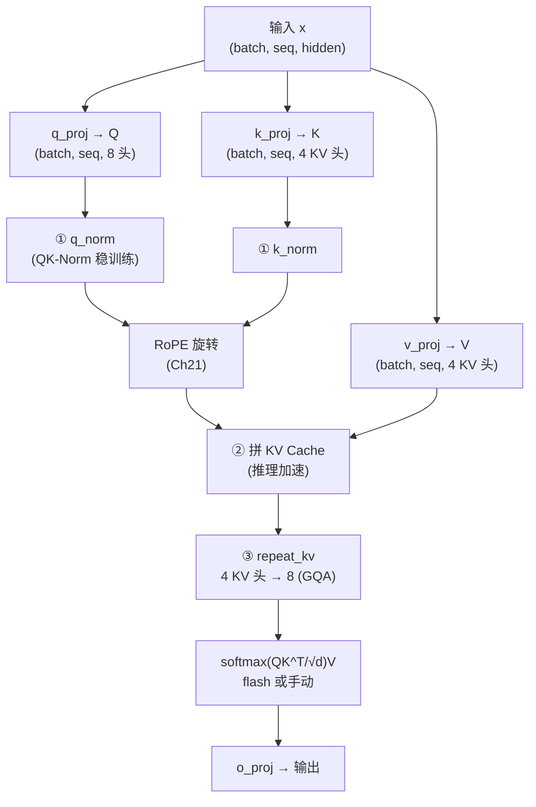

# 第 22 章 GQA 注意力 + QK-Norm + KV Cache

前两章造好了两个零件：RMSNorm（Ch 20）和 RoPE（Ch 21）。本章把它们装进整个模型最核心的组件——**注意力（Attention）**。这是 zllm 里最长、也最重要的一个模块（125 行），它一次解决了三个工程问题：

1. **GQA（分组查询注意力）**：让多个 Query 头共享 KV，砍掉一半 KV 缓存，推理更快。
2. **QK-Norm**：在点积前对 Q、K 各做一次 RMSNorm，稳定训练。
3. **KV Cache**：推理时缓存历史的 K、V，避免每生成一个 token 就重算一遍。

这一章我们会把 Ch 12 的注意力公式 $\text{softmax}(QK^T/\sqrt{d_k})V$ 一行行落成代码，并看清上面三件事分别改了哪一行。

## 22.1 学习目标

读完本章，你应该能够：

- 默写出 GQA 的「2:1 压缩」：8 个 Q 头共享 4 个 KV 头，`n_rep=2`；
- 解释 `repeat_kv` 如何把 KV 头复制成 Q 头数量再算注意力；
- 说清 QK-Norm 为什么能稳定训练（控制点积的尺度）；
- 讲清 KV Cache 的拼接逻辑：`past_key_value` 怎么和新算的 K/V 拼起来；
- 看懂 flash（SDPA）和手动两条计算路径的切换条件。

## 22.2 原理回顾：注意力 + 三个增强

### 22.2.1 基础注意力（回引 Ch 12）

Ch 12 推导过多头注意力的核心：

$$
\text{Attention}(Q,K,V) \;=\; \text{softmax}\!\left(\frac{QK^T}{\sqrt{d_k}}\right)V
$$

每个「头」独立算一组 $Q_i,K_i,V_i$，最后拼起来过一次输出投影。$\sqrt{d_k}$ 缩放控制点积方差（Ch 12 的关键推导）。这套基础在本章完全保留，zllm 在它之上加了三件事。

### 22.2.2 三件事一图看清



三个①②③就是本章的三件事。下面逐个讲。

## 22.3 代码实现

完整实现见 `zllm/model/attention.py`（125 行）。

### 22.3.1 repeat_kv：GQA 的 KV 复制

> 完整实现见 `zllm/model/attention.py:22`

```python
def repeat_kv(x: torch.Tensor, n_rep: int) -> torch.Tensor:
    bs, slen, num_key_value_heads, head_dim = x.shape
    if n_rep == 1:
        return x
    return (
        x[:, :, :, None, :]
        .expand(bs, slen, num_key_value_heads, n_rep, head_dim)
        .reshape(bs, slen, num_key_value_heads * n_rep, head_dim)
    )
```

GQA 的核心（`attention.py:22-30`）：KV 头只有 `num_key_value_heads=4` 个，但 Q 有 `num_attention_heads=8` 个，算点积时头数必须对齐。`repeat_kv` 把每个 KV 头复制 `n_rep=2` 份，变成 8 个，和 Q 一一配对。注意用的是 `expand`（视图操作，不占显存）而非 `repeat`（真复制）——省内存。

> 对应测试 `tests/m03_model_components/test_067_attention.py:21` 验证 `n_rep=2` 时 4 个头变 8 个；`:26` 验证复制后值正确（每个 KV 头被复制 n_rep 次）。

### 22.3.2 Attention 的初始化：四投影 + QK-Norm

> 完整实现见 `zllm/model/attention.py:33`

```python
class Attention(nn.Module):
    def __init__(self, config):
        super().__init__()
        self.n_local_heads = config.num_attention_heads          # 8 个 Q 头
        self.n_local_kv_heads = self.num_key_value_heads          # 4 个 KV 头
        self.n_rep = self.n_local_heads // self.n_local_kv_heads  # 2:1 → n_rep=2
        self.head_dim = config.head_dim
        self.q_proj = nn.Linear(config.hidden_size, config.num_attention_heads * self.head_dim, bias=False)
        self.k_proj = nn.Linear(config.hidden_size, self.num_key_value_heads * self.head_dim, bias=False)
        self.v_proj = nn.Linear(config.hidden_size, self.num_key_value_heads * self.head_dim, bias=False)
        self.o_proj = nn.Linear(config.num_attention_heads * self.head_dim, config.hidden_size, bias=False)
        self.q_norm = RMSNorm(self.head_dim, eps=config.rms_norm_eps)   # ① QK-Norm
        self.k_norm = RMSNorm(self.head_dim, eps=config.rms_norm_eps)
```

`__init__`（`attention.py:33-69`）两个要点：

- **GQA 体现在投影维度**：`q_proj` 输出 `8×head_dim`，而 `k_proj`/`v_proj` 只输出 `4×head_dim`——KV 的参数量和缓存直接砍半（`:47-55`）。
- **QK-Norm**（`:60-61`）：在 `head_dim` 上各建一个 RMSNorm（Ch 20 的实现），分别作用于 Q 和 K。

**QK-Norm 为什么稳定训练**：注意力分数是 $QK^T$，如果 Q、K 的尺度随训练漂移变大，点积就爆炸，softmax 变成 one-hot（梯度消失）。在点积**之前**对 Q、K 各归一化一次，把它们的尺度钉死，点积方差就稳定了——这是近年版 LLaMA/Qwen3 的标配技巧。

### 22.3.3 forward：完整数据流

> 完整实现见 `zllm/model/attention.py:71`

```python
def forward(self, x, position_embeddings, past_key_value=None, use_cache=False, attention_mask=None):
    bsz, seq_len, _ = x.shape
    xq, xk, xv = self.q_proj(x), self.k_proj(x), self.v_proj(x)
    # reshape 到 (batch, seq, heads, head_dim)
    xq = xq.view(bsz, seq_len, self.n_local_heads, self.head_dim)
    xk = xk.view(bsz, seq_len, self.n_local_kv_heads, self.head_dim)
    xv = xv.view(bsz, seq_len, self.n_local_kv_heads, self.head_dim)
    xq, xk = self.q_norm(xq), self.k_norm(xk)          # ① QK-Norm
    cos, sin = position_embeddings
    xq, xk = apply_rotary_pos_emb(xq, xk, cos, sin)    # RoPE（Ch21）
    if past_key_value is not None:                      # ② KV Cache 拼接
        xk = torch.cat([past_key_value[0], xk], dim=1)
        xv = torch.cat([past_key_value[1], xv], dim=1)
    past_kv = (xk, xv) if use_cache else None
    xq = xq.transpose(1, 2)
    xk = repeat_kv(xk, self.n_rep).transpose(1, 2)     # ③ GQA 复制
    xv = repeat_kv(xv, self.n_rep).transpose(1, 2)
    # ... 算注意力（见 22.3.4）...
    output = output.transpose(1, 2).reshape(bsz, seq_len, -1)
    return self.resid_dropout(self.o_proj(output)), past_kv
```

forward（`attention.py:71-125`）的流程就是 22.2.2 那张图：投影 → reshape → **QK-Norm**（`:81`）→ RoPE（`:84`）→ **KV Cache 拼接**（`:86-89`）→ `repeat_kv` GQA 复制（`:92-93`）→ 算注意力 → o_proj。

**KV Cache 的精髓**在 `:86-89`：推理时，新生成的 token 只算它自己的 K、V（`xk`、`xv` 是长度 1 的新切片），然后和历史的 `past_key_value` **拼起来**。这样不用每步都重算前面所有 token 的 K、V——这就是 KV Cache 让自回归推理从 $O(n^2)$ 降到 $O(n)$ 的关键（Ch 42 会专门讲）。

> 对应测试 `test_067_attention.py:90`（`test_kv_cache_concatenation`）验证：先喂 4 个 token 拿到 cache，再喂 2 个 token 带 cache，结果的 K 形状是 `(1, 6, ...)`——4+2 拼接成功。

### 22.3.4 两条计算路径：flash 与手动

> 完整实现见 `zllm/model/attention.py:95`

注意力分数本身有两条路径（`:95-121`）：

```python
if (self.flash and (seq_len > 1) and ...):    # 走 Flash Attention
    output = F.scaled_dot_product_attention(xq, xk, xv, dropout_p=..., is_causal=True)
else:                                          # 手动实现
    scores = (xq @ xk.transpose(-2, -1)) / math.sqrt(self.head_dim)
    if self.is_causal:                         # 因果掩码
        scores[:, :, :, -seq_len:] += (
            torch.full((seq_len, seq_len), float("-inf"), device=scores.device).triu(1)
        )
    output = self.attn_dropout(F.softmax(scores.float(), dim=-1).type_as(xq)) @ xv
```

- **Flash 路径**（`:95-109`）：用 PyTorch 的 `scaled_dot_product_attention`（SDPA），底层调 Flash Attention，显存省、速度快。条件满足时优先走它。
- **手动路径**（`:110-121`）：显式算 $QK^T/\sqrt{d_k}$，再用 `.triu(1)` 的 $-\infty$ 矩阵做**因果掩码**（下三角可看，上三角屏蔽，保证只能看过去——Ch 13 讲过）。这条路径在推理单 token（`seq_len==1`）或带 cache 时启用。

> 对应测试 `test_067_attention.py:120`（`test_flash_vs_manual_close`）验证两条路径结果近似相等（`atol=1e-3`），保证切换路径不影响数值正确性。

## 22.4 对应单元测试

> 对应测试 `tests/m03_model_components/test_067_attention.py`

- **TestRepeatKV**（`:15-32`）：`n_rep=1` 原样返回、`n_rep=2` 头数翻倍、复制值正确。
- **TestAttentionInit**（`:35-60`）：四个投影的形状（Q 是 `8×head_dim`，KV 是 `4×head_dim`，验证 GQA）、无 bias、`n_rep` 计算正确、QK-Norm 存在且形状是 `head_dim`。
- **TestAttentionForward**（`:63-141`）：输出形状、默认不返回 cache、`use_cache=True` 返回 K/V、**KV cache 拼接 4→6**（`:90`）、因果掩码路径、flash 路径、flash vs manual 近似、梯度回流。

## 22.5 动手验证

```bash
pytest tests/m03_model_components/test_067_attention.py -v
```

预期：全部 PASSED。亲手验证 GQA 的 KV cache 省显存：

```bash
python -c "
import torch
from zllm.config import ZLLMConfig
from zllm.model.attention import Attention
cfg = ZLLMConfig(vocab_size=100, hidden_size=64, num_hidden_layers=2,
                 num_attention_heads=4, num_key_value_heads=2, max_position_embeddings=128)
attn = Attention(cfg)
print('n_rep (GQA 压缩比):', attn.n_rep)       # 2
print('Q 头数:', attn.n_local_heads, 'KV 头数:', attn.n_local_kv_heads)
x = torch.randn(1, 4, 64); cos = torch.randn(4, cfg.head_dim); sin = torch.randn(4, cfg.head_dim)
out, past = attn(x, (cos, sin), use_cache=True)
print('输出形状:', out.shape, 'K cache 形状:', past[0].shape)  # past[0] 是 (1,4,2,head_dim) —— 只有 2 个 KV 头
"
```

你会看到 `n_rep=2`、KV cache 的头数是 2（不是 Q 的 4）——GQA 确实把 KV 砍半了。

## 22.6 本章小结 + 下章预告

本章你装好了模型最核心的注意力，它一次解决三件事：

1. **GQA**：8 Q 头共享 4 KV 头，`repeat_kv` 复制对齐，KV 参数和缓存砍半。
2. **QK-Norm**：点积前对 Q、K 各做 RMSNorm，钉死尺度，稳定训练。
3. **KV Cache**：`past_key_value` 拼接历史 K/V，推理时每步只算新 token，避免重算。

加上 RoPE（Ch 21）和因果掩码，这就是一个完整的「现代版」多头注意力。

> **一句话带走**：现代注意力 = 基础注意力（Ch12）+ GQA（省 KV）+ QK-Norm（稳训练）+ KV Cache（快推理）+ RoPE（位置）。

**下章预告**：注意力搞定，下一个组件是**前馈网络**。Ch 23《SwiGLU 前馈网络》——讲清门控 FFN $\text{down}(\text{SiLU}(\text{gate}(x))\odot\text{up}(x))$ 为何比经典 ReLU FFN 更强，以及它的三个投影 `gate_proj`/`up_proj`/`down_proj` 如何配合 π 缩放的中间层（回引 Ch 16）。
