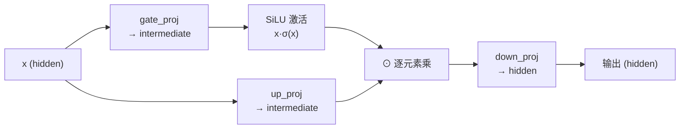

# 第 23 章 SwiGLU 前馈网络

注意力（Ch 22）负责 token 之间「互相看」，而**前馈网络（Feed-Forward Network, FFN）** 负责 token 内部「自己加工」。每个 token 经过注意力后，会独立地过一个 FFN，把它的隐藏表示做一次非线性变换。这是 Transformer block 的另一半。

zllm 用的是 **SwiGLU**——一种带「门控」的 FFN，比经典 ReLU FFN 效果更好，是 LLaMA / Qwen3 系的标配。它的实现只有 11 行，但藏着一个精巧的设计：**用两个投影 `gate_proj` 和 `up_proj` 产生门控信号**。本章讲清它的公式、为什么比 ReLU FFN 强，以及 Ch 16 提到的 π 缩放中间层如何在这里落地。

## 23.1 学习目标

读完本章，你应该能够：

- 默写出 SwiGLU 的公式 $\text{down}(\text{SiLU}(\text{gate}(x))\odot\text{up}(x))$；
- 解释 SiLU 激活函数 $x\sigma(x)$ 与 ReLU 的差别；
- 说清「门控」为什么比单纯非线性更强——它让网络能**动态选择**信息；
- 看懂 `ffn.py` 的三个投影 `gate_proj`/`up_proj`/`down_proj` 各自的职责；
- 把 Ch 16 的 π 缩放（intermediate_size=2432）和本章的中间层维度对应起来。

## 23.2 原理回顾：FFN 与门控

### 23.2.1 经典 FFN（回引 Ch 13）

Ch 13 讲过，经典 Transformer 的 FFN 是「升维 → 非线性 → 降维」两层：

$$
\text{FFN}_{\text{classic}}(x) \;=\; W_2\,\sigma(W_1 x + b_1) + b_2
$$

把 hidden_size（768）升到中间层（经典是 $4\times768$），过 ReLU，再降回 768。作用是给每个 token 一个「独立思考」的非线性变换空间。

### 23.2.2 门控的引入：GLU

「门控线性单元（Gated Linear Unit, GLU）」的思想：**别只用一个非线性，让网络自己学一个「开关」决定哪些信息通过**。形式上，引入两个并行投影，一个当「内容」，一个当「门」：

$$
\text{GLU}(x) \;=\; (\text{内容投影}\,x)\;\odot\;\sigma(\text{门投影}\,x)
$$

其中 $\odot$ 是逐元素乘，$\sigma$ 是某个激活（sigmoid、ReLU、SiLU 等）。门控项 $\sigma(\text{门})$ 输出 0~1（或经激活后的值），逐位置地「放大/抑制」内容——这比单一非线性灵活得多。



**SwiGLU** 就是「门用 SiLU 激活」的 GLU 变体（Swi = Swish/SiLU）。

## 23.3 代码实现：11 行的 FeedForward

完整实现见 `zllm/model/ffn.py` 的 `FeedForward` 类（`:17-27`）。

### 23.3.1 三个投影

> 完整实现见 `zllm/model/ffn.py:17`

```python
class FeedForward(nn.Module):
    def __init__(self, config, intermediate_size=None):
        super().__init__()
        intermediate_size = intermediate_size or config.intermediate_size
        self.gate_proj = nn.Linear(config.hidden_size, intermediate_size, bias=False)
        self.down_proj = nn.Linear(intermediate_size, config.hidden_size, bias=False)
        self.up_proj = nn.Linear(config.hidden_size, intermediate_size, bias=False)
        self.act_fn = ACT2FN[config.hidden_act]   # "silu" → SiLU
```

`__init__`（`ffn.py:18-24`）建三个**无 bias** 的线性层：

- **`gate_proj`**（`:21`）：hidden → intermediate，输出当「门」（经 SiLU 激活）。
- **`up_proj`**（`:23`）：hidden → intermediate，输出当「内容」（不激活）。
- **`down_proj`**（`:22`）：intermediate → hidden，把乘完的结果降回原维度。

注意 `intermediate_size` 默认取 `config.intermediate_size`——这正是 Ch 16 讲的 **π 缩放**算出来的 2432（`ceil(768×π/64)×64`）。SwiGLU 的三分叉结构需要更精细的中间层容量，所以用 π 而非经典的 4×。

> 对应测试 `tests/m04_model_assembly/test_082_ffn.py:15` 验证三个投影的形状：gate/up 是 `(intermediate, hidden)`，down 是 `(hidden, intermediate)`；`:33`（`test_pi_scaled_intermediate`）回引 Ch 16，验证 `intermediate_size` 就是 π 缩放值，且 gate_proj 的输出维度匹配。

### 23.3.2 forward：一行公式

> 完整实现见 `zllm/model/ffn.py:26`

```python
def forward(self, x):
    return self.down_proj(self.act_fn(self.gate_proj(x)) * self.up_proj(x))
```

就一行（`ffn.py:26-27`），对应公式：

$$
\boxed{\;\text{SwiGLU}(x) \;=\; W_{\text{down}}\Big(\text{SiLU}\big(W_{\text{gate}}\,x\big)\;\odot\;\big(W_{\text{up}}\,x\big)\Big)\;}
$$

读法：先算门 `gate_proj(x)` 过 SiLU，再算内容 `up_proj(x)`，两者逐元素乘，最后 `down_proj` 降维。

### 23.3.3 SiLU：平滑的 ReLU

激活函数 `act_fn` 来自 `ACT2FN[config.hidden_act]`，`hidden_act="silu"`（Ch 16 的 config）。**SiLU（Sigmoid Linear Unit，又叫 Swish）** 的公式是：

$$
\text{SiLU}(x) \;=\; x\,\sigma(x) \;=\; \frac{x}{1+e^{-x}}
$$

对比 ReLU（$=\max(0,x)$）：ReLU 在 0 处硬截断（梯度不连续），负值全死；SiLU 对小的负值**保留一部分**（$\text{SiLU}(-1)\approx-0.27$），处处光滑。实践表明 SiLU 在深网络里比 ReLU 更稳、效果略好，所以现代 LLM 基本都用它。

## 23.4 对应单元测试

> 对应测试 `tests/m04_model_assembly/test_082_ffn.py`

- **TestFeedForwardInit**（`:14-39`）：三个投影形状、无 bias、`act_fn` 可调用、π 缩放 intermediate（`:33`）。
- **TestFeedForwardForward**（`:42-81`）：
  - `test_output_shape`（`:43`）：输出形状 == 输入形状。
  - **`test_swiglu_formula`**（`:49-58`）：**手动拆解验证**——分别算 `silu(gate_proj(x))`、`up_proj(x)`、相乘、`down_proj`，和直接 `ffn(x)` 比对，完全一致。这是钉死 SwiGLU 公式的关键测试。
  - `test_gradients_flow`（`:60`）：三个投影梯度都能回流。
  - `test_bfloat16`（`:70`）：bf16 兼容。
  - `test_custom_intermediate_size`（`:76`）：可自定义中间层。

`test_swiglu_formula`（`:49-58`）最值得看：它把那一行 `forward` 拆成四步手算，确保「门控 + 内容 + 降维」的组合严格对应公式，防止实现悄悄偏离 SwiGLU。

## 23.5 动手验证

```bash
pytest tests/m04_model_assembly/test_082_ffn.py -v
```

预期：全部 PASSED。亲手验证门控的效果——SwiGLU 和经典 ReLU FFN 输出不同：

```bash
python -c "
import torch, torch.nn.functional as F
from zllm.model.ffn import FeedForward
from zllm.config import ZLLMConfig
ffn = FeedForward(ZLLMConfig(hidden_size=16, intermediate_size=32))
x = torch.randn(1, 1, 16)
print('SwiGLU 输出:', ffn(x)[0,0,:3])
# 手算: down(silu(gate(x)) * up(x))
gate = F.silu(ffn.gate_proj(x)); up = ffn.up_proj(x)
print('手算验证:', ffn.down_proj(gate * up)[0,0,:3])
print('两者一致:', torch.allclose(ffn(x), ffn.down_proj(gate*up), atol=1e-5))
"
```

## 23.6 本章小结 + 下章预告

本章要点：

1. **FFN** 负责 token 内部的非线性加工，是 Transformer block 的另一半。
2. **SwiGLU** = $\text{down}(\text{SiLU}(\text{gate}(x))\odot\text{up}(x))$，用门控让网络动态选择信息，比经典 ReLU FFN 更强。
3. **三个投影**：`gate_proj`（门，过 SiLU）、`up_proj`（内容）、`down_proj`（降维），无 bias。
4. **π 缩放**：intermediate_size 用 `ceil(hidden×π/64)×64`（回引 Ch 16，默认 2432），匹配 SwiGLU 三分叉。
5. **SiLU** $=x\sigma(x)$ 比 ReLU 光滑，深网络更稳。

> **一句话带走**：SwiGLU = 门控 FFN，用两个投影造一个动态开关，是现代 LLM FFN 的标配。

**下章预告**：SwiGLU 是「密集 FFN」——每个 token 都过整个网络。但如果中间层很大，计算就贵。Ch 24《MoE 混合专家》——讲清如何用「路由器 + 多个专家」让每个 token 只激活一小部分参数，参数量上去了、计算量却没涨，并配套一个负载均衡的辅助损失防止专家分配不均。
