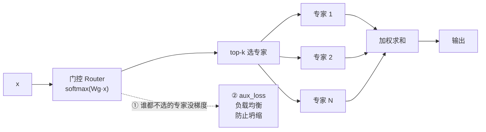

# 第 24 章 MoE 混合专家

Ch 23 的 SwiGLU 是「密集 FFN」：每个 token 都过同一套参数。想提升模型容量，就得把中间层做大，但计算量也线性上涨。**混合专家（Mixture of Experts, MoE）** 打破这个困局——它准备**多套 FFN（专家）**，每个 token 只**路由到其中 top-k 个**。结果是：参数总量上去了（容量大），但每个 token 的实际计算量没怎么涨（只激活一小部分）。

这就是 DeepSeek、Mixtral、Qwen3-MoE 能做到「参数巨大但推理不慢」的秘密。zllm 实现了一个教学版 MoE（`MOEFeedForward`），本章讲清三件事：**路由器怎么选专家**、**怎么保证每个 token 都有梯度**、**怎么用辅助损失防止专家分配不均**。

## 24.1 学习目标

读完本章，你应该能够：

- 解释「稀疏激活」：参数多但每 token 计算量可控；
- 默写出路由流程：门控 $\to$ softmax $\to$ top-k $\to$ 归一化权重 $\to$ 加权求和；
- 说清 `index_add_` 如何高效地把每个 token 送给它选中的专家；
- 解释「空专家梯度保持」那条 `y[0,0] += 0 * sum(params)` 在干什么、为什么必需；
- 推导负载均衡辅助损失 $L_{aux}$，说清它如何惩罚「所有 token 都挤去一个专家」。

## 24.2 原理回顾：稀疏激活

### 24.2.1 密集 vs 稀疏

密集 FFN（Ch 23）：1 套参数，每个 token 全用。容量 = 参数量，想扩容只能加参数、加计算。

MoE：$N$ 套参数（$N$ 个专家），每个 token 只用 top-$k$ 个（zllm 默认 $k=1$）。容量 $\approx N\times$单专家参数，但每 token 计算量 $\approx k\times$单专家计算。

```
密集 FFN:     [token] → [1 个大 FFN] → 输出      容量=1, 计算=1
MoE (k=1):   [token] → 路由 → [N 个专家中选1个] → 输出   容量=N, 计算≈1
```

容量翻 $N$ 倍，计算几乎不变——这就是 MoE 的杠杆。

### 24.2.2 两个核心难题



MoE 有两个绕不开的工程难题：

1. **梯度问题**：如果一个专家在某批数据里**没被任何 token 选中**，它完全不参与前向，自然没梯度，永远学不动（「死专家」）。
2. **负载不均**：路由器可能塌陷成「所有 token 都去专家 0」，其他专家闲置——容量优势全废。

zllm 各用一个技巧解决：①空专家梯度保持，②辅助损失。

## 24.3 代码实现：MOEFeedForward

完整实现见 `zllm/model/ffn.py` 的 `MOEFeedForward`（`:30-67`）。

### 24.3.1 门控与专家

> 完整实现见 `zllm/model/ffn.py:30`

```python
class MOEFeedForward(nn.Module):
    def __init__(self, config):
        super().__init__()
        self.config = config
        self.gate = nn.Linear(config.hidden_size, config.num_experts, bias=False)
        self.experts = nn.ModuleList(
            [FeedForward(config, intermediate_size=config.moe_intermediate_size)
             for _ in range(config.num_experts)]
        )
```

`__init__`（`ffn.py:31-38`）：`gate` 是个 `hidden → num_experts` 的线性层（路由器），`experts` 是 `num_experts` 个 `FeedForward`（Ch 23 的 SwiGLU）。每个专家用 `moe_intermediate_size`（默认等于 dense 的 intermediate_size）。

### 24.3.2 路由：softmax → top-k → 归一化

> 完整实现见 `zllm/model/ffn.py:40`

```python
def forward(self, x):
    batch_size, seq_len, hidden_dim = x.shape
    x_flat = x.view(-1, hidden_dim)                          # (所有token, hidden)
    scores = F.softmax(self.gate(x_flat), dim=-1)            # 每个 token 对 N 个专家的偏好
    topk_weight, topk_idx = torch.topk(
        scores, k=self.config.num_experts_per_tok, dim=-1, sorted=False)   # 选 top-k
    if self.config.norm_topk_prob:
        topk_weight = topk_weight / (topk_weight.sum(dim=-1, keepdim=True) + 1e-20)  # 归一化
    y = torch.zeros_like(x_flat)
    for i, expert in enumerate(self.experts):
        mask = topk_idx == i                                  # 哪些 token 选了专家 i
        if mask.any():
            token_idx = mask.any(dim=-1).nonzero().flatten()
            weight = topk_weight[mask].view(-1, 1)
            y.index_add_(0, token_idx, (expert(x_flat[token_idx]) * weight).to(y.dtype))
        elif self.training:                                   # 空专家梯度保持
            y[0, 0] += 0 * sum(p.sum() for p in expert.parameters())
    # ... aux_loss（见 24.3.3）...
    return y.view(batch_size, seq_len, hidden_dim)
```

路由流程（`ffn.py:40-57`）：

1. **门控打分**（`:43`）：$g=\text{softmax}(W_g x)$，给每个 token 算出对 $N$ 个专家的偏好分布。
2. **top-k 选择**（`:44-46`）：$\text{topk}(g,k)$ 选出得分最高的 $k$ 个专家及其权重。
3. **归一化**（`:47-48`）：`norm_topk_prob=True` 时，把选中的 $k$ 个权重重新归一化（和为 1），保证它们的相对比例合理。
4. **分派计算**（`:50-55`）：对每个专家，找出选了它的 token，过专家网络，按权重 `index_add_` 累加回 `y`。`index_add_` 是高效的原位累加，避免循环拼接。

**空专家梯度保持**（`:56-57`）是解决「死专家」的妙招：如果一个专家在这批数据里**没被任何 token 选中**（`mask.any()` 为假），就执行 `y[0,0] += 0 * sum(p.sum() for p in expert.parameters())`。这个表达式结果仍是 0（不影响输出），但 `expert.parameters()` 出现在计算图里，于是它**拿到了零梯度——但梯度路径存在**，DDP/autograd 不会报错，优化器仍会更新它（靠 weight decay/动量慢慢学）。没有这行，分布式训练里未选中的专家会因梯度缺失而崩溃。

### 24.3.3 辅助损失：负载均衡

> 完整实现见 `zllm/model/ffn.py:58`

```python
if self.training and self.config.router_aux_loss_coef > 0:
    load = F.one_hot(topk_idx, self.config.num_experts).float().mean(0)   # 实际负载 f_i
    self.aux_loss = (
        (load * scores.mean(0)).sum()              # Σ f_i · P_i
        * self.config.num_experts
        * self.config.router_aux_loss_coef
    )
else:
    self.aux_loss = scores.new_zeros(1).squeeze()
```

辅助损失（`ffn.py:58-66`）的公式是：

$$
L_{\text{aux}} \;=\; \alpha \cdot N \cdot \sum_{i=1}^{N} f_i \cdot P_i
$$

其中 $f_i$ 是专家 $i$ **实际分到的 token 比例**（`load`，one-hot 后平均），$P_i$ 是门控对专家 $i$ 的**平均概率**（`scores.mean(0)`），$\alpha$ 是 `router_aux_loss_coef`（默认 `5e-4`，Ch 16 的 config）。

直觉：如果所有 token 都挤去专家 0，那 $f_0$、$P_0$ 都接近 1，$L_{\text{aux}}$ 变大——**惩罚这种坍缩**。理想状态下 token 均匀分布，$f_i\approx P_i\approx 1/N$，$L_{\text{aux}}$ 最小。训练时把 $L_{\text{aux}}$ 加到主 loss 上（Ch 26 会看到 backbone 汇总所有层的 aux_loss），就能逼路由器把负载摊开。

> 对应测试 `tests/m04_model_assembly/test_093_moe.py:69` 验证训练时 `aux_loss` 非零且有梯度；`:77` 验证 eval 时为 0；`:102` 验证 aux_loss 能反向传播给 gate。

## 24.4 对应单元测试

> 对应测试 `tests/m04_model_assembly/test_093_moe.py`

- `moe_config` fixture（`:13-25`）：`use_moe=True`、`num_experts=4`、`num_experts_per_tok=1`、`router_aux_loss_coef=0.01`。
- **TestMOEInit**（`:28-41`）：gate 形状 `(num_experts, hidden)`、专家数量对、每个专家是 `FeedForward`。
- **TestMOEForward**（`:44-108`）：
  - 输出形状、`test_sparse_selection`（`:51`，top-1 每个 token 只用 1 专家）、`test_top2_routing`（`:58`，top-2）、**`test_aux_loss_in_training`**（`:69`，训练非零有梯度）、`test_no_aux_loss_in_eval`（`:77`，eval 为 0）、`test_norm_topk_prob`（`:83`，归一化）、梯度回流、**`test_aux_loss_backward`**（`:102`，aux_loss 反传给 gate）。

## 24.5 动手验证

```bash
pytest tests/m04_model_assembly/test_093_moe.py -v
```

预期：全部 PASSED。亲手看路由分配：

```bash
python -c "
import torch
from zllm.config import ZLLMConfig
from zllm.model.ffn import MOEFeedForward
cfg = ZLLMConfig(hidden_size=64, num_hidden_layers=2, num_attention_heads=4,
                 num_key_value_heads=2, use_moe=True, num_experts=4,
                 num_experts_per_tok=1, max_position_embeddings=128)
moe = MOEFeedForward(cfg).train()
out = moe(torch.randn(2, 8, 64))
print('输出形状:', out.shape)
print('aux_loss（负载均衡项）:', moe.aux_loss.item())
print('专家数:', len(moe.experts), '每token选:', cfg.num_experts_per_tok)
"
```

## 24.6 本章小结 + 下章预告

本章要点：

1. **MoE** 用多套专家 FFN，每 token 只路由 top-k 个，参数多但计算量可控（稀疏激活）。
2. **路由** = softmax 门控 → top-k → 归一化权重 → `index_add_` 分派。
3. **空专家梯度保持**（`0 * sum(params)`）让未选中专家也有梯度路径，避免分布式训练崩溃。
4. **辅助损失** $L_{\text{aux}}=\alpha N\sum f_i P_i$ 惩罚负载坍缩，逼路由器均匀分配。

> **一句话带走**：MoE = 多专家 + 路由器 + 负载均衡损失，用稀疏激活换来参数容量的廉价扩张。

**下章预告**：零件齐了——RMSNorm、RoPE、注意力、FFN/MoE。Ch 25《Block + Backbone 组装》——把它们按 **Pre-Norm 双残差**结构组装成一个 Transformer block，再把 $N$ 个 block 堆成完整的 backbone（`ZLLMModel`）。残差连接（Ch 10）在这里让 8 层深网络可训。
