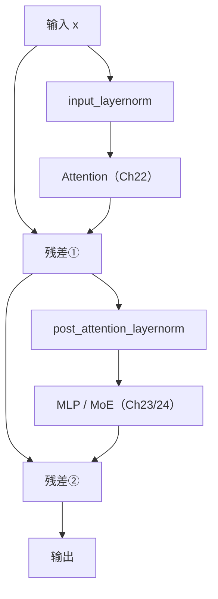

# 第 25 章 Block + Backbone 组装

零件都齐了：RMSNorm（Ch 20）、RoPE（Ch 21）、GQA 注意力（Ch 22）、SwiGLU/MoE（Ch 23/24）。本章把它们**组装**起来——先用「Pre-Norm 双残差」结构拼成一个 Transformer **block**，再把 $N$ 个 block 堆成完整的 **backbone**（`ZLLMModel`）。

组装的关键是两件事：**残差连接**（让深网络可训练，Ch 10 讲过它解决梯度消失）和 **Pre-Norm 架构**（归一化放在子层之前，比传统的 Post-Norm 更稳）。这两者让 8 层甚至更深的网络能稳定训练。

## 25.1 学习目标

读完本章，你应该能够：

- 默写出 Pre-Norm block 的数据流：`x + attn(norm(x))`，再 `+ mlp(norm(·))`；
- 解释 Pre-Norm 比 Post-Norm 训练更稳的原因；
- 说清残差连接为何让深网络可训（回引 Ch 10）；
- 看懂 `ZLLMBlock` 如何按 config 切换 dense FFN / MoE；
- 理解 `ZLLMModel` 如何预计算 RoPE 表、按 `start_pos` 切片位置编码、汇总 MoE aux_loss。

## 25.2 原理回顾：Pre-Norm 与残差

### 25.2.1 残差连接（回引 Ch 10）

Ch 10《反向传播与训练动力学》讲过：深网络里梯度逐层衰减，底层几乎学不动。**残差连接** $y = x + F(x)$ 给梯度一条「直达快线」——即使 $F$ 的梯度很小，恒等映射那条路也能把信号传回去。Transformer 每个 block 内部有**两处**残差：一处绕过注意力，一处绕过 FFN。

### 25.2.2 Pre-Norm vs Post-Norm

原版 Transformer 用 **Post-Norm**：先算子层再加残差，最后归一化（`norm(x + sublayer(x))`）。问题是这样主信号要经过子层才归一化，深网络里很容易梯度爆炸。

现代 LLM（LLaMA/Qwen3/zllm）改用 **Pre-Norm**：**先归一化，再进子层，再加残差**：

$$
\boxed{\;x_{\text{out}} \;=\; x \;+\; \text{SubLayer}\big(\text{Norm}(x)\big)\;}
$$

归一化在子层之前，保证进入子层的输入永远尺度稳定；主数据流走残差直通，深网络训练更稳。一个 block 里这套要做两次（注意力一次、FFN 一次）。



这就是 `ZLLMBlock` 的全部结构。

## 25.3 代码实现：ZLLMBlock

完整实现见 `zllm/model/block.py`（31 行）。

### 25.3.1 初始化：注意力 + 双 Norm + MLP

> 完整实现见 `zllm/model/block.py:15`

```python
class ZLLMBlock(nn.Module):
    def __init__(self, layer_id: int, config):
        super().__init__()
        self.self_attn = Attention(config)
        self.input_layernorm = RMSNorm(config.hidden_size, eps=config.rms_norm_eps)
        self.post_attention_layernorm = RMSNorm(config.hidden_size, eps=config.rms_norm_eps)
        self.mlp = FeedForward(config) if not config.use_moe else MOEFeedForward(config)
```

`__init__`（`block.py:16-21`）：一个 block 装四样东西——注意力、两个 RMSNorm（注意力前后各一个）、MLP。注意 `:21` 那行三元表达式：`use_moe=True` 时装 `MOEFeedForward`（Ch 24），否则装 dense `FeedForward`（Ch 23）。这就是 config 一开关、block 自动切换专家/密集的机制。

> 对应测试 `tests/m04_model_assembly/test_097_block.py:19` 验证两个 norm 都在；`:24`（dense）和 `:29`（`use_moe=True` 时是 `MOEFeedForward`）验证这个切换。

### 25.3.2 forward：Pre-Norm 双残差

> 完整实现见 `zllm/model/block.py:23`

```python
def forward(self, hidden_states, position_embeddings, past_key_value=None,
            use_cache=False, attention_mask=None):
    residual = hidden_states
    hidden_states, present_key_value = self.self_attn(
        self.input_layernorm(hidden_states), position_embeddings,
        past_key_value, use_cache, attention_mask,
    )                              # 进注意力前先 norm（Pre-Norm）
    hidden_states += residual      # 残差①
    hidden_states = hidden_states + self.mlp(
        self.post_attention_layernorm(hidden_states)
    )                              # FFN 前 norm + 残差②
    return hidden_states, present_key_value
```

`forward`（`block.py:23-31`）就是 25.2.2 的公式：

1. **残差① + 注意力**（`:24-29`）：`input_layernorm` 归一化 → 注意力 → `+= residual`。
2. **残差② + FFN**（`:30`）：`post_attention_layernorm` 归一化 → MLP → `+ 残差`。

两处都严格遵循 `x + SubLayer(Norm(x))` 的 Pre-Norm 形式。

> 对应测试 `test_097_block.py:48`（`test_residual_connection`）验证输出与输入不同（经过了变换），间接确认残差和子层都在工作。

## 25.4 代码实现：ZLLMModel（backbone）

完整实现见 `zllm/model/backbone.py`（77 行）。它把 $N$ 个 block 堆起来，加上 embedding 和最终的 norm。

### 25.4.1 初始化：embed + layers + norm + RoPE 表

> 完整实现见 `zllm/model/backbone.py:17`

```python
class ZLLMModel(nn.Module):
    def __init__(self, config):
        super().__init__()
        self.embed_tokens = nn.Embedding(config.vocab_size, config.hidden_size)
        self.dropout = nn.Dropout(getattr(config, "dropout", 0.0))
        self.layers = nn.ModuleList(
            [ZLLMBlock(l, config) for l in range(self.num_hidden_layers)]
        )
        self.norm = RMSNorm(config.hidden_size, eps=config.rms_norm_eps)
        freqs_cos, freqs_sin = precompute_freqs_cis(
            dim=config.head_dim, end=config.max_position_embeddings,
            rope_base=config.rope_theta, rope_scaling=getattr(config, "rope_scaling", None),
        )
        self.register_buffer("freqs_cos", freqs_cos, persistent=False)
        self.register_buffer("freqs_sin", freqs_sin, persistent=False)
```

`__init__`（`backbone.py:18-36`）：`embed_tokens`（token id → 向量）、`layers`（$N$ 个 block）、`norm`（最终归一化）。关键是在 `:29-36` **预计算 RoPE 的 cos/sin 表并 register 成 buffer**——这样不用每次 forward 重算，也跟着设备迁移。`persistent=False` 表示不存进 state_dict（可从 config 重建）。

> 对应测试 `tests/m04_model_assembly/test_104_backbone.py:15` 验证 embed 形状、`:19` 验证层数、`:27` 验证 freqs buffer 形状 `(max_position_embeddings, head_dim)`。

### 25.4.2 forward：位置切片 + 堆叠 + aux_loss 汇总

> 完整实现见 `zllm/model/backbone.py:38`

forward（`backbone.py:38-77`）的核心三步：

1. **位置切片**（`:43-61`）：根据 `past_key_values` 推断 `start_pos`，从预计算的 freqs 表里**切出当前位置段的 cos/sin**——这是 KV cache 推理时只算新 token 位置编码的关键。
2. **逐层堆叠**（`:62-71`）：`hidden_states` 依次过每个 block，收集每层的 `present`（KV cache）。
3. **最终 norm + aux_loss 汇总**（`:72-76`）：过最后的 RMSNorm；把所有 MoE 层的 `aux_loss` 加起来返回（dense 层贡献 0）。

> 对应测试 `test_104_backbone.py:58`（`test_kv_cache_incremental`）验证增量推理：先喂 4 个 token，再带 cache 喂 2 个，结果 K 形状是 `(1, 6, ...)`——位置切片 + cache 拼接都正确；`:67`（`test_moe_aux_loss`）验证 MoE backbone 的 aux_loss 非零。

## 25.5 对应单元测试

**Block**（`tests/m04_model_assembly/test_097_block.py`）：`test_has_self_attn` `:15`、`test_has_norms` `:19`（双 norm）、`test_mlp_is_feedforward` `:24`、`test_mlp_is_moe_when_configured` `:29`（切换）、`test_residual_connection` `:48`、`test_use_cache` `:57`、`test_moe_block_forward` `:73`。

**Backbone**（`tests/m04_model_assembly/test_104_backbone.py`）：`test_embed_tokens` `:15`、`test_layer_count` `:19`、`test_final_norm` `:23`、`test_rope_buffers` `:27`、`test_output_shapes` `:36`、`test_kv_cache_incremental` `:58`、`test_moe_aux_loss` `:67`、`test_attention_mask` `:84`。

## 25.6 动手验证

```bash
pytest tests/m04_model_assembly/test_097_block.py tests/m04_model_assembly/test_104_backbone.py -v
```

预期：全部 PASSED。亲手跑一个 backbone，看层数和 RoPE 表：

```bash
python -c "
import torch
from zllm.config import ZLLMConfig
from zllm.model.backbone import ZLLMModel
cfg = ZLLMConfig(vocab_size=100, hidden_size=64, num_hidden_layers=2,
                 num_attention_heads=4, num_key_value_heads=2, max_position_embeddings=128)
model = ZLLMModel(cfg)
print('层数:', len(model.layers), 'RoPE cos 表:', model.freqs_cos.shape)
ids = torch.randint(0, 100, (1, 8))
hidden, presents, aux = model(ids, use_cache=True)
print('输出 hidden:', hidden.shape, 'KV cache 层数:', len(presents), 'aux_loss:', aux.item())
"
```

## 25.7 本章小结 + 下章预告

本章要点：

1. **Pre-Norm block** = `x + attn(norm(x))` + `mlp(norm(·))`，双残差，归一化在子层前。
2. **Pre-Norm 比 Post-Norm 稳**：主信号走残差直通，进子层前已归一化。
3. **残差连接**（Ch 10）让 8 层深网络梯度能回流。
4. **block** 按 `use_moe` 切换 dense/MoE；**backbone** 预计算 RoPE 表、位置切片、汇总 aux_loss。

> **一句话带走**：Pre-Norm 双残差是现代 Transformer block 的标准结构——零件就位，结构搭好，深网络可训。

**下章预告**：backbone 输出的是 hidden_states（隐藏向量），但语言模型要预测的是 token id。Ch 26《CausalLM 头 + Weight Tying + Loss》——加上 `lm_head` 把 hidden 转成词表上的 logits，用 **Weight Tying** 共享 embedding 参数省一大块，并把 NTP 的**交叉熵损失**（Ch 05/15）实现进 forward，让模型能直接算 loss 训练。这是 Part IV 的收官。
