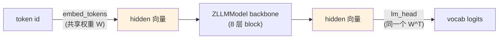

# 第 26 章 CausalLM 头 + Weight Tying + Loss

Part IV 的最后一章。前 6 章搭好的 `ZLLMModel`（backbone）输出的是**隐藏向量** `hidden_states`——形状 `(batch, seq, hidden)`。但语言模型要预测的是 **token id**，而且训练时还要能算 **loss**。本章给 backbone 加上最后三样东西：

1. **`lm_head`**：把 hidden 向量转成词表上的 logits（每个 token 在词表里的得分）。
2. **Weight Tying**：让 `lm_head` 和输入 embedding 共享权重，省一大块参数。
3. **NTP loss**：把 Ch 05/15 推导的交叉熵损失实现进 forward，模型能直接算 loss、反传训练。

完成后，`ZLLMForCausalLM` 就是一个**完整的、可训练、可推理**的语言模型。这一章也是 Part IV 的收官——之后 Part V 就要喂数据、跑训练了。

## 26.1 学习目标

读完本章，你应该能够：

- 解释 `lm_head` 如何把 hidden 向量映射成词表 logits；
- 说清 Weight Tying 共享的是哪两个矩阵、省了多少参数、为什么合理；
- 默写出 NTP loss 的实现：`cross_entropy(logits[:-1], labels[1:])`，以及为什么错位一位；
- 解释 `ignore_index=-100` 如何服务于 SFT 的 label masking（Ch 33 会用）；
- 看懂 `logits_to_keep` 推理优化，以及 MoE aux_loss 如何拼进总 loss。

## 26.2 原理回顾：从 hidden 到 loss

### 26.2.1 lm_head：hidden → logits

backbone 输出 `hidden_states`（每个 token 位置一个 `hidden` 维向量）。要预测「下一个 token 是词表里的哪一个」，需要一个 `hidden → vocab` 的线性层：

$$
\text{logits} \;=\; x\,W_{\text{lm\_head}}^T, \qquad \text{logits}\in\mathbb{R}^{\text{vocab}}
$$

每个位置得到一个 vocab 维的得分向量，再 softmax 就是 Ch 03 的类别分布——「下一个 token 的概率分布」。这个线性层就是 `lm_head`。

### 26.2.2 Weight Tying：共享 embedding（回引 Ch 15）

Ch 15 讲过 **Weight Tying**：输入端的 `embed_tokens`（token id → hidden 向量）和输出端的 `lm_head`（hidden → vocab logits）做的是**互逆**的语义映射，让它们共享权重既合理又省参数。

省多少？`embed_tokens` 的权重是 `vocab × hidden`（zllm 默认 `6400 × 768 ≈ 490`万参数）。不共享的话 `lm_head` 也是这么大一块——共享掉就**省 490 万参数**，对 ~64M 的小模型是不可忽视的比例。



embedding 是 $W$（id → 向量），lm_head 是 $W^T$（向量 → logits），同一个矩阵的两个方向。

### 26.2.3 NTP loss（回引 Ch 05/15）

Ch 15 给过下一个 token 预测的损失：

$$
\mathcal{L}_{\text{NTP}} \;=\; -\sum_t \log P(x_{t+1}\mid x_{\le t})
$$

这正是 Ch 05 推导的**交叉熵**：真实下一个 token 是 one-hot 类别分布，模型输出 softmax 概率，两者交叉熵就是 NTP loss。实现上有个细节——**错位一位**：位置 $t$ 的 hidden 预测的是 $t+1$，所以拿 `logits[..., :-1, :]`（去掉最后一个位置）和 `labels[..., 1:]`（去掉第一个位置）对齐算交叉熵。

## 26.3 代码实现：ZLLMForCausalLM

完整实现见 `zllm/model/causal_lm.py`（54 行）。

### 26.3.1 类结构与 Weight Tying

> 完整实现见 `zllm/model/causal_lm.py:20`

```python
class ZLLMForCausalLM(PreTrainedModel, GenerationMixin):
    config_class = ZLLMConfig
    _tied_weights_keys = {"lm_head.weight": "model.embed_tokens.weight"}

    def __init__(self, config=None):
        self.config = config or ZLLMConfig()
        super().__init__(self.config)
        self.model = ZLLMModel(self.config)
        self.lm_head = nn.Linear(self.config.hidden_size, self.config.vocab_size, bias=False)
        if self.config.tie_word_embeddings:
            self.model.embed_tokens.weight = self.lm_head.weight
        self.post_init()
```

`__init__`（`causal_lm.py:24-31`）三个要点：

- **继承 `PreTrainedModel, GenerationMixin`**（`:20`）：前者让模型接入 Transformers 生态（`save_pretrained` 等），后者直接给它「生成」能力（`.generate()`，Part VII 会用）。
- **`_tied_weights_keys`**（`:22`）：告诉 Transformers「`lm_head.weight` 和 `embed_tokens.weight` 是绑定的」，保存/加载时自动同步，不会存两份。
- **Weight Tying**（`:29-30`）：`tie_word_embeddings=True` 时，直接让 `embed_tokens.weight = lm_head.weight`——两个名字指向同一块参数。

> 对应测试 `tests/m04_model_assembly/test_109_causal_lm.py:19`（`test_weight_tying`）验证两者 `.data` 完全相等；`:23`（`test_weight_tying_disabled`）验证 `tie_word_embeddings=False` 时不相等。

### 26.3.2 forward：logits_to_keep + NTP loss

> 完整实现见 `zllm/model/causal_lm.py:33`

```python
def forward(self, input_ids, attention_mask=None, past_key_values=None,
            use_cache=False, logits_to_keep=0, labels=None, **kwargs):
    hidden_states, past_key_values, aux_loss = self.model(
        input_ids, attention_mask, past_key_values, use_cache, **kwargs)
    slice_indices = (
        slice(-logits_to_keep, None)
        if isinstance(logits_to_keep, int) and logits_to_keep > 0
        else slice(None)
    )
    logits = self.lm_head(hidden_states[:, slice_indices, :])
    loss = None
    if labels is not None:
        x = logits[..., :-1, :].contiguous()        # 错位：位置 t 的 logits
        y = labels[..., 1:].contiguous()            # 对齐：位置 t+1 的真实 token
        loss = F.cross_entropy(x.view(-1, x.size(-1)), y.view(-1), ignore_index=-100)
    return MoeCausalLMOutputWithPast(
        loss=loss, aux_loss=aux_loss, logits=logits,
        past_key_values=past_key_values, hidden_states=hidden_states)
```

forward（`causal_lm.py:33-54`）四件事：

1. **跑 backbone**（`:34-36`）：拿到 `hidden_states`、KV cache、MoE 的 `aux_loss`。
2. **`logits_to_keep` 优化**（`:37-42`）：推理时往往只关心最后几个位置的 logits（生成下一个 token 只需最后一行）。`logits_to_keep=1` 就只在 `hidden` 的最后一行算 logits，省掉无用的矩阵乘——大词表下这个优化很可观。
3. **NTP loss**（`:44-47`）：**错位一位**——`logits[:-1]` 对 `labels[1:]`，正是 26.2.3 的对齐方式。`ignore_index=-100` 让标签里值为 `-100` 的位置**不参与 loss**——这正是 SFT 里「只对 assistant 回复算 loss、prompt 部分屏蔽」的实现基础（Ch 33 会专门讲 label masking）。
4. **返回 `MoeCausalLMOutputWithPast`**（`:48-54`）：Transformers 标准输出结构，含 `loss`、`aux_loss`、`logits`、`past_key_values`、`hidden_states`。训练时 `loss + aux_loss` 一起反传，MoE 负载均衡就自动生效了。

> 对应测试 `test_109_causal_lm.py:48`（`test_loss_with_labels`）验证给 labels 时 loss 非零；`:56`（`test_ignore_index`）验证标签置 `-100` 后 loss 仍 finite（被正确忽略）；`:73`（`test_logits_to_keep`）验证 `logits_to_keep=2` 时 logits 形状变 `(1,2,vocab)`；`:85`（`test_aux_loss_nonzero_moe`）验证 MoE 模型的 aux_loss 非零。

## 26.4 对应单元测试

> 对应测试 `tests/m04_model_assembly/test_109_causal_lm.py`

- **TestCausalLMInit**（`:14-32`）：lm_head 形状 `(vocab, hidden)`、weight tying 相等、可禁用、config_class 对。
- **TestCausalLMForward**（`:35-99`）：logits 形状、无 labels 时 loss 为 None、有 labels 时 loss 非零、`ignore_index`、`loss.backward()` 梯度回流、`logits_to_keep`、dense 模型 aux_loss 为 0、MoE 模型 aux_loss 非零、`past_key_values` 长度等于层数。

其中 `test_loss_backward`（`:65-71`）最关键：它跑完 forward 后 `out.loss.backward()`，验证 `embed_tokens.weight.grad` 非空——整个模型端到端梯度通路畅通，这是「能训练」的最小判据。

## 26.5 动手验证

```bash
pytest tests/m04_model_assembly/test_109_causal_lm.py -v
```

预期：全部 PASSED。亲手跑一次完整的「输入 id → loss」：

```bash
python -c "
import torch
from zllm.config import ZLLMConfig
from zllm.model.causal_lm import ZLLMForCausalLM
cfg = ZLLMConfig(vocab_size=100, hidden_size=64, num_hidden_layers=2,
                 num_attention_heads=4, num_key_value_heads=2, max_position_embeddings=128)
model = ZLLMForCausalLM(cfg)
ids = torch.randint(0, 100, (1, 8))
out = model(ids, labels=ids)            # 用 ids 当 labels（自监督）
print('loss:', out.loss.item())
print('logits 形状:', out.logits.shape)  # (1, 8, 100)
print('weight tying:', torch.equal(model.lm_head.weight.data, model.model.embed_tokens.weight.data))
out.loss.backward()
print('embed 梯度存在:', model.model.embed_tokens.weight.grad is not None)
"
```

## 26.6 本章小结 + Part IV 收官

本章要点：

1. **lm_head**：`hidden → vocab` logits，softmax 后就是下一个 token 的概率分布。
2. **Weight Tying**：`lm_head` 和 `embed_tokens` 共享权重，省 `vocab×hidden` 参数（zllm 约 490 万），`_tied_weights_keys` 保证存取同步。
3. **NTP loss**：`cross_entropy(logits[:-1], labels[1:])`，错位一位对齐「位置 t 预测 t+1」，本质是 Ch 05 的交叉熵。
4. **`ignore_index=-100`**：屏蔽不参与 loss 的位置，是 SFT label masking（Ch 33）的基础。
5. **`logits_to_keep`**：推理只算需要的几行 logits，省计算。

### Part IV 收官

至此 Part IV（Ch 20–26）全部完成，一个完整的现代 LLM 架构已经搭好：

| 章节 | 组件 | 文件 |
|------|------|------|
| Ch 20 | RMSNorm 归一化 | `norms.py` |
| Ch 21 | RoPE 位置编码 + YaRN | `rope.py` |
| Ch 22 | GQA 注意力 + QK-Norm + KV Cache | `attention.py` |
| Ch 23 | SwiGLU 前馈 | `ffn.py` |
| Ch 24 | MoE 混合专家 | `ffn.py` |
| Ch 25 | Block + Backbone 组装 | `block.py`/`backbone.py` |
| Ch 26 | CausalLM 头 + Weight Tying + Loss | `causal_lm.py` |

每个组件都对齐 Qwen3 / minimind-3，且都被 `tests/m03`、`tests/m04` 的测试钉死。

> **一句话带走**：Part IV 结束，`ZLLMForCausalLM` 是一个可训练、可推理的完整语言模型——架构有了，接下来要喂数据、跑训练。

**下章预告**：进入 **Part V 数据与训练**。Ch 27《数据流水线总览与 TokenizerAdapter》——把 Ch 19 的 tokenizer 接入数据管道，讲清 `dataset/utils.py` 如何把原始文本/对话变成模型能吃的 `input_ids`。有了数据，才能开始 Ch 31 的预训练。
