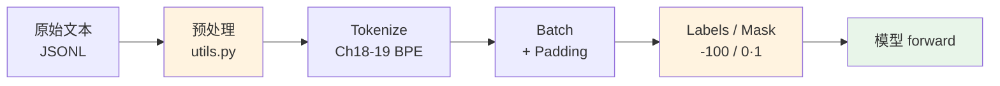
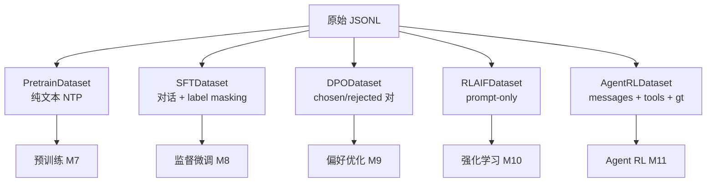

# 第 27 章 数据流水线总览与 TokenizerAdapter

Part IV 结束时，`ZLLMForCausalLM` 已经是一个**完整的模型架构**——给它 `input_ids` 和 `labels`，它能算 loss、能反传。但 `input_ids` 和 `labels` 从哪来？这就是 **Part V 数据与训练**要回答的问题。

本章是 Part V 的开篇，先给出**数据流水线的全景**：原始文本怎么一步步变成模型能吃的 tensor。然后聚焦流水线里的两个**预处理工具**——`pre_processing_chat`（概率性添加 system prompt）和 `post_processing_chat`（概率性移除空思考链标签）。它们虽小，却体现了「数据增强」的核心思想。

## 27.1 学习目标

读完本章，你应该能够：

- 默画出数据流水线的五个阶段：原始文本 → 预处理 → tokenize → batch → labels/mask；
- 说清五种 Dataset（Pretrain/SFT/DPO/RLAIF/Agent）各自产出什么、服务哪个训练阶段；
- 解释 `pre_processing_chat` 为什么用**概率**而非确定性地加 system prompt；
- 解释 `post_processing_chat` 移除空 think 标签的用意（让模型学会「该想才想」）；
- 看懂 `wrap()` adapter 如何把不同来源的 tokenizer 统一成同一接口。

## 27.2 原理回顾：数据是训练的燃料

### 27.2.1 从文本到 tensor

Ch 16 讲过「数据是训练的燃料」。模型不会直接读文本，它只认 `input_ids`（整数序列）。把人类可读的文本变成模型可训的 tensor，需要一条**流水线**：



橙色两块（预处理、labels/mask）是本章和 Ch 28 的重点。中间的 tokenize 是 Ch 17–19 的内容。最后的模型 forward 是 Part IV。

### 27.2.2 五种 Dataset 各司其职

不同的训练阶段需要**不同格式**的数据。zllm 提供了五种 Dataset：



本章先讲它们**共享的预处理工具**，具体的 Dataset 实现留到 Ch 28。

## 27.3 预处理工具：utils.py

完整实现见 `zllm/dataset/utils.py`（37 行）。两个函数 + 一个常量列表。

### 27.3.1 SYSTEM_PROMPTS：10 条中英 system prompt

> 完整实现见 `zllm/dataset/utils.py:10`

```python
SYSTEM_PROMPTS = [
    "你是一个知识丰富的AI，尽力为用户提供准确的信息。",
    "你是zllm，一个小巧但有用的语言模型。",
    "你是一个专业的AI助手，请提供有价值的回答。",
    ...
    "You are zllm, a small but useful language model.",
]
```

`SYSTEM_PROMPTS`（`:10-21`）：10 条预定义的 system prompt，5 中 5 英。这些是**概率增强**的素材——训练时随机抽一条插到对话开头，让模型见过多样的 system prompt，推理时无论遇到哪种 system 风格都不慌。

### 27.3.2 pre_processing_chat：概率性添加 system prompt

> 完整实现见 `zllm/dataset/utils.py:24`

```python
def pre_processing_chat(conversations, add_system_ratio=0.2):
    if any(conv.get("tools") for conv in conversations):   # 有工具调用，原样返回
        return conversations
    if conversations[0].get("role") != "system":           # 没有现成的 system
        if random.random() < add_system_ratio:              # 概率触发
            return [{"role": "system", "content": random.choice(SYSTEM_PROMPTS)}] + conversations
    return conversations
```

`pre_processing_chat`（`:24-30`）两个设计要点：

1. **概率而非确定**（`:28`）：`add_system_ratio=0.2` 意味着只有 20% 的样本会被加上 system prompt。为什么不全部加？因为推理时用户也可能**不带** system prompt 直接问问题。模型需要同时见过「有 system」和「无 system」两种情况，才不会在缺 system 时表现崩坏。这就是**数据增强**——故意制造多样性。

2. **有 tools 就跳过**（`:25-26`）：带工具调用的对话（Agent 场景）有自己的 system prompt 格式，不能被这里覆盖。已有 system 的（`:27`）也不重复加。

> 对应测试 `tests/m05_data_pipeline/test_113_utils.py:13`（ratio=0 不加）、`:19`（ratio=1 一定加）、`:25`（已有 system 不重复）、`:34`（有 tools 原样返回）。

### 27.3.3 post_processing_chat：概率性移除空 think 标签

> 完整实现见 `zllm/dataset/utils.py:33`

```python
def post_processing_chat(prompt_content, empty_think_ratio=0.2):
    empty_tag = "<reasoningchain_start>\n\n<reasoningchain_end>\n\n"
    if empty_tag in prompt_content and random.random() > empty_think_ratio:
        prompt_content = prompt_content.replace(empty_tag, "")
    return prompt_content
```

`post_processing_chat`（`:33-37`）：模型用 `<reasoningchain_start>...<reasoningchain_end>` 包裹思考过程（Ch 38 GRPO 会讲）。但有些简单问题**不需要思考**，思考链是空的。如果训练数据里**总是保留空 think 标签**，模型会养成「每次都吐一个空 think 标签」的坏习惯。

`empty_think_ratio=0.2` 的含义：80% 的情况下（`random > 0.2`）把空标签**删掉**，20% 保留。这样模型学到的是「该想才想，不该想就直答」——既会推理，又不会对每个问题都啰嗦一个空架子。

> 对应测试 `test_113_utils.py:49`（ratio=0 一定删）、`:55`（ratio=1 一定留）、`:60`（非空 think 不受影响）、`:65`（无标签不变）。

## 27.4 TokenizerAdapter：统一接口

五种 Dataset 都用 `from zllm.tokenizer.adapter import wrap` 包一层 tokenizer。`wrap()`（`zllm/tokenizer/adapter.py:74`）的作用是**适配器模式**——无论底层是 tokenizers 库的 `Tokenizer` 还是 HuggingFace 的 `PreTrainedTokenizer`，`wrap` 都给它补齐统一的接口（`.encode()`/`.apply_chat_template()`/`.bos_token_id` 等）。

这样 Dataset 代码里只需写 `self.tokenizer = wrap(tokenizer)`，不关心 tokenizer 具体来自哪里。这是 Ch 19「生产版 Tokenizer」的延伸——Ch 19 训出了 tokenizer，本章把它接入数据管道。

## 27.5 对应单元测试

> 对应测试 `tests/m05_data_pipeline/test_113_utils.py`

**TestPreProcessingChat**（`:12-45`）：ratio=0 不加 `:13`、ratio=1 一定加 `:19`、已有 system 不重复 `:25`、有 tools 保留 `:34`、无变化返回同对象 `:42`。

**TestPostProcessingChat**（`:48-67`）：空 think 删除 `:49`、ratio=1 保留 `:55`、非空 think 不变 `:60`、无标签不变 `:65`。

## 27.6 动手验证

```bash
pytest tests/m05_data_pipeline/test_113_utils.py -v
```

预期：全部 PASSED。亲手试一下概率增强：

```bash
python -c "
import random
random.seed(42)
from zllm.dataset.utils import pre_processing_chat, post_processing_chat
convs = [{'role': 'user', 'content': '你好'}]
print('ratio=0:', pre_processing_chat(convs, 0.0))
print('ratio=1:', pre_processing_chat(convs, 1.0))
text = '<reasoningchain_start>\n\n<reasoningchain_end>\n\n答案是42。'
print('空think删除:', post_processing_chat(text, 0.0))
"
```

## 27.7 本章小结 + 下章预告

本章要点：

1. **数据流水线** = 原始文本 → 预处理 → tokenize → batch → labels/mask → 模型。
2. **五种 Dataset** 各服务一个训练阶段（Pretrain/SFT/DPO/RLAIF/Agent）。
3. **概率增强**：`pre_processing_chat` 以 20% 概率加 system prompt，让模型见过「有/无 system」两种情况。
4. **空 think 移除**：`post_processing_chat` 以 80% 概率删空思考标签，让模型学会「该想才想」。
5. **`wrap()` adapter** 统一不同来源 tokenizer 的接口。

> **一句话带走**：数据流水线的预处理阶段做概率增强——多样性让模型更鲁棒。

**下章预告**：五种 Dataset 长什么样？Ch 28《五种 Dataset 实现》——逐个拆解 Pretrain/SFT/DPO/RLAIF/Agent 的 `__getitem__`，看它们各自怎么构造 `input_ids` 和 `labels`/`mask`。其中 SFT 的 **label masking**（只对 assistant 回复算 loss）是重点。
