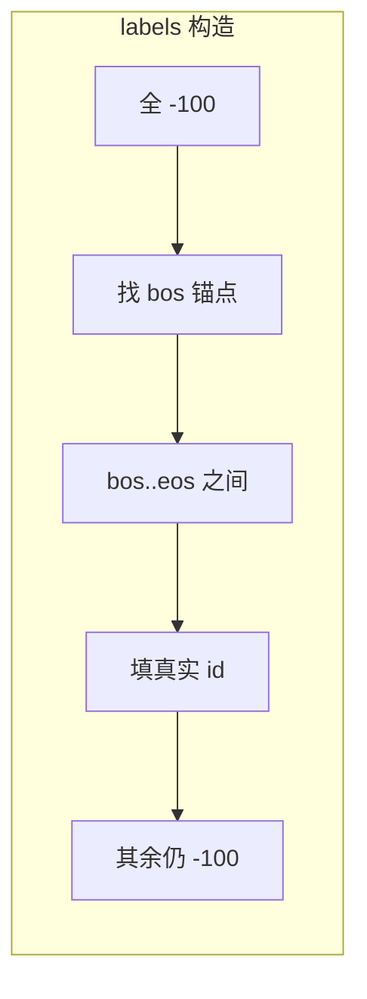

# 第 28 章 五种 Dataset 实现

Ch 27 讲了数据流水线的全景和预处理工具。本章逐个拆解五种 Dataset 的 `__getitem__`——它们是流水线上「文本 → tensor」的核心环节。五种 Dataset 长得像，但**构造 labels/mask 的方式完全不同**，这恰恰对应了五种训练目标的差异：

| Dataset | 训练阶段 | 对谁算 loss | labels/mask 形式 |
|---------|---------|------------|-----------------|
| Pretrain | 预训练 | 全部 token | `labels = input_ids`，pad→-100 |
| SFT | 监督微调 | 仅 assistant | prompt 区域 -100 |
| DPO | 偏好优化 | chosen+rejected | loss_mask 0/1 |
| RLAIF | 强化学习 | 无（推理时算） | 只返回 prompt |
| Agent | Agent RL | 工具调用 | 返回 messages+tools+gt |

理解这张表，就理解了本章的全部。

## 28.1 学习目标

读完本章，你应该能够：

- 默写出 PretrainDataset 的 `__getitem__`：BOS + tokens + EOS + pad，`labels = input_ids.clone()`，pad→-100；
- 看懂 SFT 的 `generate_labels` 如何用 bos/eos 锚点找到 assistant 区域、其余标记 -100；
- 解释 DPO 与 SFT 的 mask 差异（-100 vs 0/1）以及为什么 DPO 要错位一位返回 `x[:-1]`/`y[1:]`；
- 说清 RLAIF 为什么只返回 prompt（loss 在 RL 算法里算，不在 Dataset 里）；
- 理解 AgentRLDataset 为什么返回原始 messages 而非 tensor。

## 28.2 原理回顾：labels 与 loss 的关系

### 28.2.1 NTP 的 labels（回引 Ch 05/26）

Ch 26 讲过，CausalLM 的 NTP loss 是 `cross_entropy(logits[:-1], labels[1:])`。这里 `labels` 是什么？它就是「正确答案」——位置 $t$ 应该预测的下一个 token。

预训练时，文本本身就是答案：`labels = input_ids`（模型要预测文本里的下一个字）。但 **padding 位置不是有效 token**，不能算 loss。所以 pad 位置的 label 要设成 `-100`（Ch 26 的 `ignore_index=-100` 会跳过它们）。

### 28.2.2 SFT 的 label masking

SFT（监督微调）更进一步：**只对 assistant 的回复算 loss**，user 的提问和 system prompt 都不算。为什么？因为模型的任务是「学会回答」，不是「学会复述问题」。

```
<|im_start|>user\n你好<|im_end|>          ← 这些位置 labels = -100
<|im_start|>assistant\n你好！有什么可以帮你？<|im_end|>  ← 这些位置 labels = 真实 id
```

实现上，用「`<|im_start|>assistant\n`（bos_id）」和「`<|im_end|>\n`（eos_id）」作为**锚点**，定位 assistant 回复的起止，只给这个区间填真实 id。



### 28.2.3 DPO 与 RL 的特殊性

DPO（Ch 36）和 RL（Ch 37–38）算的不是 NTP loss，而是**偏好 / 奖励**相关的 loss。它们需要的不是 `labels`，而是 **loss_mask**（标记哪些位置参与计算）。

RLAIF 更极端：训练时模型要**自己生成回复**再算奖励，所以 Dataset 只返回 prompt（不带答案）。

## 28.3 PretrainDataset：最朴素的 NTP

完整实现见 `zllm/dataset/pretrain.py`（41 行）。

### 28.3.1 __getitem__：BOS + tokens + EOS + pad + labels

> 完整实现见 `zllm/dataset/pretrain.py:28`

```python
def __getitem__(self, index):
    sample = self.samples[index]
    tokens = self.tokenizer.encode(
        str(sample["text"]),
        add_special_tokens=False,          # 不让 tokenizer 自动加，我们手动控制
        max_length=self.max_length - 2,    # 留 2 个位置给 BOS/EOS
        truncation=True,
    ).ids
    tokens = [self.tokenizer.bos_token_id] + tokens + [self.tokenizer.eos_token_id]
    input_ids = tokens + [self.tokenizer.pad_token_id] * (self.max_length - len(tokens))
    input_ids = torch.tensor(input_ids, dtype=torch.long)
    labels = input_ids.clone()                                   # 先复制
    labels[input_ids == self.tokenizer.pad_token_id] = -100     # pad 位置 mask 掉
    return input_ids, labels
```

`__getitem__`（`:28-41`）四步：

1. **tokenize**（`:30-35`）：`add_special_tokens=False` 因为我们要**手动**加 BOS/EOS，确保格式统一。`max_length - 2` 留出 BOS/EOS 的位置。
2. **加首尾标记**（`:36`）：`[BOS] + tokens + [EOS]`。BOS 告诉模型「序列开始」，EOS 告诉模型「序列结束，该生成了」。
3. **padding**（`:37`）：补 pad 到 `max_length`，让一个 batch 里所有样本等长。
4. **labels**（`:39-40`）：`labels = input_ids.clone()`（全保留），然后 **pad 位置 → -100**。

这就是最朴素的 NTP 数据：除了 pad，每个位置都是有效训练信号。

> 对应测试 `tests/m05_data_pipeline/test_115_pretrain.py:51`（首 token 是 BOS）、`:55-59`（pad 位置 labels=-100）、`:61-65`（非 pad 位置 labels==input_ids）。

## 28.4 SFTDataset：label masking 的艺术

完整实现见 `zllm/dataset/sft.py`（81 行）。核心是 `generate_labels` 方法。

### 28.4.1 create_chat_prompt：渲染对话模板

> 完整实现见 `zllm/dataset/sft.py:41`

`create_chat_prompt`（`:41-53`）：用 tokenizer 的 `apply_chat_template` 把对话列表渲染成带 `<|im_start|>`/`<|im_end|>` 标记的文本。这里还处理了 tools（工具调用）的 JSON 解析（`:46-47`）。

### 28.4.2 generate_labels：用 bos/eos 锚点定位 assistant

> 完整实现见 `zllm/dataset/sft.py:55`

```python
def generate_labels(self, input_ids):
    labels = [-100] * len(input_ids)         # 全部先 mask 掉
    i = 0
    while i < len(input_ids):
        if input_ids[i : i + len(self.bos_id)] == self.bos_id:  # 找到 assistant 起始锚点
            start = i + len(self.bos_id)     # 锚点之后才是回复内容
            end = start
            while end < len(input_ids):
                if input_ids[end : end + len(self.eos_id)] == self.eos_id:
                    break                    # 找到 eos 结束
                end += 1
            for j in range(start, min(end + len(self.eos_id), self.max_length)):
                labels[j] = input_ids[j]     # 只给 assistant 区域填真实 id
            i = end + len(self.eos_id)
        else:
            i += 1
    return labels
```

`generate_labels`（`:55-71`）是个**子串搜索**：

- `self.bos_id`（`:35`）是 `"<|im_start|>assistant\n"` 的 token 序列——每次 assistant 发言的开头标记。
- `self.eos_id`（`:36`）是 `"<|im_end|>\n"`——发言结束标记。
- 算法：从头扫描 `input_ids`，找到 bos 锚点 → 定位到 eos → 这段区间填真实 id，其余全是 -100。

多轮对话里每轮 assistant 都有一对 bos/eos，这个循环会把**所有** assistant 回复都标出来。

> 对应测试 `test_121_sft.py:53`（labels 有非 -100 的有效区域）、`:58`（user/prompt 区域有 -100）、`:63`（pad 也被 -100）、`:70`（无 assistant 时全 -100）、`:75`（assistant 区域被正确标记）。

## 28.5 DPODataset：chosen/rejected + loss_mask

完整实现见 `zllm/dataset/dpo.py`（70 行）。

### 28.5.1 __getitem__：错位一位 + 6 个张量

> 完整实现见 `zllm/dataset/dpo.py:31`

`__getitem__`（`:31-52`）：对同一个 prompt 的 chosen（好答案）和 rejected（差答案）各做一次渲染+编码。关键区别在返回格式：

```python
return {
    "x_chosen":      torch.tensor(chosen_ids[:-1]),     # 去掉最后一个
    "y_chosen":      torch.tensor(chosen_ids[1:]),       # 去掉第一个（错位）
    "mask_chosen":   torch.tensor(chosen_mask[1:]),
    "x_rejected":    torch.tensor(rejected_ids[:-1]),
    "y_rejected":    torch.tensor(rejected_ids[1:]),
    "mask_rejected": torch.tensor(rejected_mask[1:]),
}
```

**错位一位**（`:46-51`）：`x = ids[:-1]`，`y = ids[1:]`。这样 `x[t]` 预测 `y[t]`，就是 NTP 的对齐方式——**在 Dataset 里就做好错位**，模型 forward 不用再切片（对比 Ch 26 CausalLM 在 forward 里做 `logits[:-1]` vs `labels[1:]`，DPO 把错位提前到数据层）。

### 28.5.2 generate_loss_mask：与 SFT 同构但用 0/1

> 完整实现见 `zllm/dataset/dpo.py:54`

`generate_loss_mask`（`:54-70`）：和 SFT 的 `generate_labels` **结构完全一样**——同样是找 bos/eos 锚点。区别是：SFT 填 `-100` 或真实 id，DPO 填 `0` 或 `1`（mask）。因为 DPO 的 loss 不是交叉熵，它只需要知道「哪些位置是 assistant 回复」，具体怎么算交给 DPO 训练器（Ch 36）。

> 对应测试 `test_126_dpo.py:49-56`（6 个 key）、`:58-62`（shape 是 `(63,)`——max_length=64 错位一位）、`:69`（mask 有 1）、`:74`（chosen≠rejected）。

## 28.6 RLAIFDataset 与 AgentRLDataset

### 28.6.1 RLAIFDataset：prompt-only

完整实现见 `zllm/dataset/rlaif.py`（42 行）。

> 完整实现见 `zllm/dataset/rlaif.py:29`

```python
def create_chat_prompt(self, conversations):
    conversations = pre_processing_chat(conversations)
    use_thinking = random.random() < self.thinking_ratio     # 50% 开推理模式
    return self.tokenizer.apply_chat_template(
        conversations[:-1],           # 去掉最后一条（标准答案），只留 prompt
        tokenize=False,
        open_thinking=use_thinking,
        add_generation_prompt=True,   # 加 "<|im_start|>assistant\n" 等模型生成
    )
```

`create_chat_prompt`（`:29-37`）两个要点：

1. **`conversations[:-1]`**（`:33`）：去掉最后一条（标准答案），只留 prompt。RL 训练时模型要**自己生成**回复，不需要标准答案。
2. **`thinking_ratio`**（`:31`）：50% 概率开启推理模式（`open_thinking=True`），让推理标签的 `<reasoningchain_start>` 出现在 prompt 里，模型接着往下生成就行。

`__getitem__`（`:39-42`）只返回 `{"prompt": ..., "answer": ""}`——**没有 labels**，因为 loss 在 RL 算法里算（Ch 37/38）。

> 对应测试 `test_130_rlaif_agent.py:44-52`（返回 prompt 字符串、含 `<|im_start|>assistant`）。

### 28.6.2 AgentRLDataset：messages + tools + gt

完整实现见 `zllm/dataset/agent.py`（40 行）。

> 完整实现见 `zllm/dataset/agent.py:27`

`parse_conversations`（`:27-35`）：解析对话，提取 tools（`:32-33`），然后 `messages[:-1]`（`:35`）**去掉最后一条 assistant**——因为 Agent RL 时模型要自己决定调哪个工具、怎么回复。

`__getitem__`（`:37-40`）返回原始的 `{"messages", "tools", "gt"}`——**不 tokenize**。因为 Agent RL 的流程更复杂（要和工具环境交互），tokenize 留到训练循环里按需做。

> 对应测试 `test_130_rlaif_agent.py:88`（有 messages）、`:93`（有 tools）、`:98`（有 gt）、`:103`（最后一条是 user，说明 assistant 被去掉了）。

## 28.7 对应单元测试

> 对应测试 `tests/m05_data_pipeline/`

| 测试文件 | 覆盖 | 关键断言 |
|---------|------|---------|
| `test_115_pretrain.py` | PretrainDataset | BOS `:51`、pad→-100 `:55`、非pad==input `:61` |
| `test_121_sft.py` | SFTDataset + generate_labels | labels valid `:53`、prompt masked `:58`、无asst全-100 `:70` |
| `test_126_dpo.py` | DPODataset | 6 keys `:49`、错位shape `:60`、chosen≠rejected `:74` |
| `test_130_rlaif_agent.py` | RLAIF + Agent | prompt+gen `:50`、drop last `:103` |

## 28.8 动手验证

```bash
pytest tests/m05_data_pipeline/ -v
```

预期：全部 PASSED。亲手构造一个 SFT 样本看 label masking：

```bash
python -c "
import json, tempfile, os
from zllm.tokenizer.trainer import train_tokenizer
from zllm.dataset.sft import SFTDataset
tok = train_tokenizer(['你好世界测试BPETransformer注意力'] * 30, vocab_size=400, save_dir='/tmp/tok28')
path = '/tmp/sft28.jsonl'
with open(path, 'w') as f:
    f.write(json.dumps({'conversations':[
        {'role':'user','content':'你好'},
        {'role':'assistant','content':'你好！'},
    ]}, ensure_ascii=False))
ds = SFTDataset(path, tok, max_length=64)
ids, labels = ds[0]
valid = (labels != -100).sum().item()
print(f'有效 label 数: {valid}/{len(labels)}  (只有 assistant 区域有效)')
"
```

## 28.9 本章小结 + 下章预告

本章要点：

1. **PretrainDataset**：`labels = input_ids`，pad→-100。最朴素的 NTP。
2. **SFTDataset**：`generate_labels` 用 bos/eos 锚点定位 assistant，只给回复区域填真实 id——这就是 **label masking**。
3. **DPODataset**：chosen/rejected 错位一位返回 `(x, y, mask)`，mask 用 0/1 而非 -100。
4. **RLAIFDataset**：只返回 prompt（`conversations[:-1]`），loss 在 RL 算法里算。
5. **AgentRLDataset**：返回原始 messages+tools+gt，tokenize 延迟到训练循环。

> **一句话带走**：五种 Dataset 的核心差异在 labels/mask 的构造——预训练全保留，SFT 只留回复，DPO 用 0/1 mask，RL 只要 prompt。

**下章预告**：数据准备好了，怎么训练？Ch 29《训练基础设施》——种子设置（可复现）、余弦退火学习率（大步快学→小步精调）、checkpoint 原子写入与断点续训。这是训练循环的「水电煤」基础设施。
