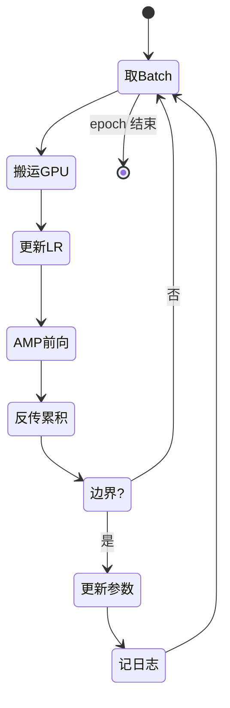

# 第 31 章 预训练：NTP 与训练循环

前面四章铺垫了一切：Ch 27–28 搞定数据，Ch 29 搞定基础设施（种子/lr/checkpoint），Ch 30 搞定训练原语（AMP/梯度累积）。本章把它们**全部串起来**，组装成完整的 `train_epoch`——一个 epoch 的训练循环。

这是 Part V 的高潮：`train_epoch` 跑起来，loss 开始下降，模型就在**真正学习**了。NTP（下一个 token 预测）从 Ch 05 的理论推导，到 Ch 26 的 loss 实现，到这里变成一条条下降的 loss 曲线。

## 31.1 学习目标

读完本章，你应该能够：

- 默写出训练循环的五个阶段：数据搬运 → lr 更新 → AMP 前向 → 反传+累积 → 日志；
- 看懂 `train_epoch` 如何每 step 用 `get_lr` 更新学习率（余弦退火动态调度）；
- 解释 `accumulation_steps` 不整除 batch 数时，末尾残余梯度的补齐逻辑；
- 理解 `PretrainConfig` 里每个超参数的含义和经验值；
- 从 loss 曲线判断训练是否健康（先快降、后缓降、趋于平台）。

## 31.2 原理回顾：训练循环的状态机

### 31.2.1 一个 step 里发生什么

Ch 30 的 `train_step` 封装了「单步训练」。但一个完整的训练循环还要在 `train_step` **外面**做三件事：

1. **数据搬运**：从 DataLoader 取 batch，`.to(device, non_blocking=True)` 搬到 GPU。
2. **学习率更新**：每 step 用 `get_lr(step)` 算当前 lr，写进 `optimizer.param_groups`。
3. **日志记录**：每 `log_interval` 步打印 loss 和 lr，监控训练。



### 31.2.2 多 epoch 的全局 step

余弦退火要看「全局 step」而非「当前 epoch 的 step」。比如 3 个 epoch、每 epoch 100 步，`get_lr` 的 `current_step` 是 `epoch * 100 + step`（0~299），`total_steps` 是 300。这样学习率在整个训练周期里平滑下降，不会每个 epoch 重置。

## 31.3 代码实现：train_epoch

完整实现见 `zllm/training/pretrain.py`（120 行）。

### 31.3.1 PretrainConfig：超参数集合

> 完整实现见 `zllm/training/pretrain.py:17`

```python
@dataclass
class PretrainConfig:
    epochs: int = 2
    batch_size: int = 64
    learning_rate: float = 5e-4
    accumulation_steps: int = 4
    grad_clip: float = 1.0
    log_interval: int = 100
    save_interval: int = 1000
    max_seq_len: int = 340
    dtype: str = "bfloat16"
    ...
```

`PretrainConfig`（`:17-36`）：用 `@dataclass` 一行定义带默认值的配置类。关键超参的经验值：

- `learning_rate=5e-4`：LLM 预训练的常用值（Ch 11 讲过太大会震荡、太小则学不动）。
- `accumulation_steps=4`：等效 batch = 64 × 4 = 256，模拟较大 batch。
- `grad_clip=1.0`：梯度范数上限 1.0（Ch 30 讲过防爆炸）。
- `max_seq_len=340`：预训练序列长度（短序列训练快，长序列在后阶段 SFT 用）。

### 31.3.2 train_epoch：循环主体

> 完整实现见 `zllm/training/pretrain.py:51`

```python
def train_epoch(model, loader, optimizer, scaler, cfg, epoch, device,
                start_step=0, total_steps=None):
    if total_steps is None:
        total_steps = len(loader)
    global_total = cfg.epochs * total_steps     # 全局总步数（给余弦退火用）

    model.train()
    losses = []
    use_amp = scaler.enabled and torch.cuda.is_available()

    for step, (input_ids, labels) in enumerate(loader, start=start_step + 1):
        input_ids = input_ids.to(device, non_blocking=True)   # ① 数据搬运
        labels = labels.to(device, non_blocking=True)

        lr = get_lr(epoch * total_steps + step, global_total, cfg.learning_rate)  # ② lr 更新
        for pg in optimizer.param_groups:
            pg["lr"] = lr

        with torch.amp.autocast("cuda", enabled=use_amp, dtype=torch.bfloat16):
            output = model(input_ids, labels=labels)
            loss = output.loss + output.aux_loss
            loss = loss / cfg.accumulation_steps

        scaler.scale(loss).backward()                        # ③ 反传累积

        is_boundary = step % cfg.accumulation_steps == 0
        if is_boundary:                                      # ④ 边界更新
            scaler.unscale_(optimizer)
            torch.nn.utils.clip_grad_norm_(model.parameters(), cfg.grad_clip)
            scaler.step(optimizer)
            scaler.update()
            optimizer.zero_grad(set_to_none=True)

        loss_val = loss.item() * cfg.accumulation_steps
        losses.append(loss_val)

        if step % cfg.log_interval == 0 or step == total_steps:   # ⑤ 日志
            Logger(f"Epoch:[{epoch+1}/{cfg.epochs}]({step}/{total_steps}), "
                   f"loss: {loss_val:.4f}, lr: {lr:.8f}")
```

`train_epoch`（`:51-120`）五阶段对应上面标注的 ① ~ ⑤：

**① 数据搬运**（`:79-80`）：`non_blocking=True` 让数据传输和计算重叠（GPU 异步拷贝），减少等待。

**② lr 更新**（`:82-84`）：每 step 用 `get_lr(epoch * total_steps + step, global_total, ...)` 算余弦退火的当前 lr。注意 `epoch * total_steps + step` 是**全局 step**——跨 epoch 连续计数，学习率在整个训练周期平滑下降。

**③ AMP 前向 + 反传**（`:86-91`）：和 Ch 30 的 `train_step` 完全一样——autocast bf16、`loss + aux_loss`、`/ accum`、`scaler.scale().backward()`。注意 `train_epoch` **没有调用 `train_step`**，而是把逻辑内联——因为训练循环需要更细的控制（如日志、残余补齐）。

**④ 边界更新**（`:93-99`）：`step % accumulation_steps == 0` 时执行 unscale → clip → step → update → zero_grad 四连。

**⑤ 日志**（`:104-108`）：每 `log_interval` 步打印 epoch/step/loss/lr。

### 31.3.3 末尾残余补齐

> 完整实现见 `zllm/training/pretrain.py:112`

```python
last_step = start_step + len(loader)
if last_step > start_step and last_step % cfg.accumulation_steps != 0:
    scaler.unscale_(optimizer)
    torch.nn.utils.clip_grad_norm_(model.parameters(), cfg.grad_clip)
    scaler.step(optimizer)
    scaler.update()
    optimizer.zero_grad(set_to_none=True)
```

这段（`:112-118`）处理一个边界情况：如果一个 epoch 的 batch 数**不是 `accumulation_steps` 的整数倍**，最后几个 batch 的梯度还没被 `step` 消费就结束了。比如 10 个 batch、accum=4：第 4、8 步各 step 一次，但第 9、10 步的梯度还累积着没更新。这段在 epoch 结束时**强制补一次 step**，避免梯度浪费。

## 31.4 NTP loss 的下降验证

训练循环跑起来后，最关心的是 **loss 是否在下降**。`tests/m07_pretrain/test_194_loss_ntp.py` 专门验证这一点：

> 对应测试 `tests/m07_pretrain/test_194_loss_ntp.py:42`

**TestLossDecrease**（`:42-57`）：用 32 条重复数据跑 3 个 epoch，断言 `avg_last < avg_first`——**loss 在下降**，证明训练循环有效。

> 对应测试 `test_194_loss_ntp.py:61`

**TestNextTokenPrediction.test_model_can_overfit**（`:61-73`）：用高学习率（5e-3）跑 8 个 epoch，断言 `all_losses[-1] < all_losses[0] * 0.7`——**能过拟合**（loss 降到原来的 70% 以下），证明模型有足够容量记住训练数据。

> 对应测试 `test_194_loss_ntp.py:75`

**test_model_predicts_next_token**（`:75-102`）：训练后让模型预测，断言 `correct / total > 0.1`——**下一 token 预测准确率 > 10%**。对 ~300 词的小词表，随机猜是 1/300 ≈ 0.3%，10% 说明模型确实学到了序列规律。

## 31.5 对应单元测试

> 对应测试 `tests/m07_pretrain/test_194_loss_ntp.py`（103 行）

| 测试类 | 方法 | 行号 | 验证 |
|--------|------|------|------|
| TestLossDecrease | test_loss_decreases_over_epochs | `:42` | loss 下降 |
| TestNextTokenPrediction | test_model_can_overfit | `:61` | 能过拟合 |
| TestNextTokenPrediction | test_model_predicts_next_token | `:75` | 预测 >10% |

## 31.6 动手验证

```bash
pytest tests/m07_pretrain/test_194_loss_ntp.py -v
```

预期：全部 PASSED（CPU 上约 30 秒）。这个测试真的会跑 3~8 个 epoch 的小模型，观察 loss 下降：

```bash
python -c "
import json, torch
from torch.utils.data import DataLoader
from zllm.config import ZLLMConfig
from zllm.model.causal_lm import ZLLMForCausalLM
from zllm.dataset.pretrain import PretrainDataset
from zllm.training.pretrain import PretrainConfig, train_epoch
from zllm.training.amp import GradScalerManager
from zllm.training.utils import setup_seed
from zllm.tokenizer.trainer import train_tokenizer
setup_seed(42)
tok = train_tokenizer(['你好世界预训练BPE语言模型'] * 30, vocab_size=300, save_dir='/tmp/tok31')
with open('/tmp/pt31.jsonl', 'w') as f:
    for _ in range(32): f.write(json.dumps({'text':'你好世界这是预训练数据'}, ensure_ascii=False)+'\n')
cfg = ZLLMConfig(vocab_size=tok.get_vocab_size(), hidden_size=64, num_hidden_layers=2,
                 num_attention_heads=4, num_key_value_heads=2, max_position_embeddings=32)
model = ZLLMForCausalLM(cfg)
ds = PretrainDataset('/tmp/pt31.jsonl', tok, max_length=32)
loader = DataLoader(ds, batch_size=8, shuffle=True)
opt = torch.optim.AdamW(model.parameters(), lr=5e-4)
scaler = GradScalerManager(enabled=False)
tcfg = PretrainConfig(epochs=3, accumulation_steps=1, log_interval=4)
for ep in range(3):
    losses = train_epoch(model, loader, opt, scaler, tcfg, ep, 'cpu')
    print(f'epoch {ep}: avg_loss={sum(losses)/len(losses):.4f}')
"
```

## 31.7 本章小结 + 下章预告

本章要点：

1. **训练循环五阶段**：数据搬运 → lr 更新 → AMP 前向 → 反传累积 → 日志。
2. **全局 step**：余弦退火用 `epoch * total_steps + step`，跨 epoch 连续计数。
3. **末尾补齐**：batch 数不整除 `accumulation_steps` 时，epoch 结束强制补一次 step。
4. **loss 下降验证**：test_194 验证「loss 下降 + 能过拟合 + 预测 >10%」三个关键判据。

> **一句话带走**：`train_epoch` 把数据、模型、优化器、lr 调度、AMP 全部串起来——loss 下降的那一刻，模型就在真正学习了。

**下章预告**：训练循环有了，但实际跑预训练时数据怎么准备、超参怎么选、loss 曲线怎么读？Ch 32《预训练实战》——端到端串起 Ch 27–31，给出可跑的完整脚本，讲清数据量/epoch/batch 的经验值和 loss 曲线的健康形态。这是 Part V 的收官。
