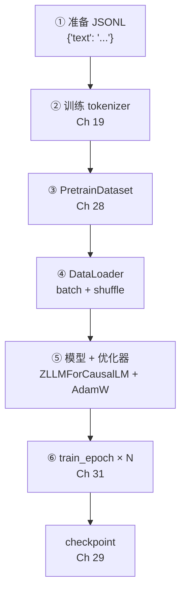
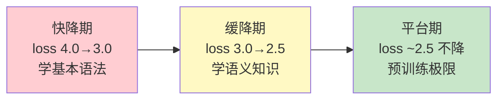

# 第 32 章 预训练实战：数据准备/训练/loss 监控

前五章（Ch 27–31）搭好了所有零件：数据流水线、五种 Dataset、训练基础设施、AMP/梯度累积、训练循环。本章是 Part V 的**收官**，把它们端到端串成一条完整的预训练流水线——从原始文本到训练好的模型权重。

本章的定位是**实操指南**：不引入新代码，而是用前 5 章的零件组装出可跑的脚本，讲清「数据量怎么估、epoch 怎么选、batch/accum 怎么折衷、loss 曲线怎么判断健康」。读完这章，你就能在自己的数据上跑预训练了。

## 32.1 学习目标

读完本章，你应该能够：

- 默写出端到端预训练的六步流程：数据格式化 → 训练 tokenizer → 建 Dataset → 建 DataLoader → 建模型+优化器 → 跑 train_epoch；
- 估算「多少数据量训练多少 epoch」的经验关系；
- 从 loss 曲线判断训练是否健康（快降期、缓降期、平台期）；
- 解释预训练 loss 进入平台期时为什么要转 SFT（而非继续加 epoch）；
- 在单卡显存有限时选择合理的 batch_size / accumulation_steps 折衷。

## 32.2 端到端预训练流程

### 32.2.1 六步流水线



每一步对应前 5 章的内容。下面给出一个**完整可跑**的 20 行脚本。

### 32.2.2 可跑脚本

```python
import json, torch
from torch.utils.data import DataLoader
from zllm.config import ZLLMConfig
from zllm.model.causal_lm import ZLLMForCausalLM
from zllm.dataset.pretrain import PretrainDataset          # Ch 28
from zllm.training.pretrain import PretrainConfig, train_epoch   # Ch 31
from zllm.training.amp import GradScalerManager            # Ch 30
from zllm.training.utils import setup_seed, init_model, lm_checkpoint  # Ch 29
from zllm.tokenizer.trainer import train_tokenizer         # Ch 19

setup_seed(42)                                             # ① 可复现

# ② 数据 + tokenizer（假设已有 corpus 和 pretrain.jsonl）
tok = train_tokenizer(corpus, vocab_size=6400, save_dir="out/tok")

# ③④ Dataset + DataLoader
ds = PretrainDataset("data/pretrain.jsonl", tok, max_length=340)
loader = DataLoader(ds, batch_size=32, shuffle=True, num_workers=4)

# ⑤ 模型 + 优化器
config = ZLLMConfig()                                      # 默认 768/8 层
model = init_model(config, from_weight="none", device="cuda")
optimizer = torch.optim.AdamW(model.parameters(), lr=5e-4)
scaler = GradScalerManager(enabled=torch.cuda.is_available())

# ⑥ 训练 + checkpoint
cfg = PretrainConfig(epochs=2, accumulation_steps=4)
for epoch in range(cfg.epochs):
    train_epoch(model, loader, optimizer, scaler, cfg, epoch, "cuda")
    lm_checkpoint(config, weight="pretrain", model=model, optimizer=optimizer,
                  epoch=epoch, step=len(loader))            # 每 epoch 存 checkpoint
```

这个脚本里每一行都来自前 5 章——Part V 的全部内容浓缩在这 20 行里。

## 32.3 数据量与训练规模的经验

### 32.3.1 数据量估算

LLM 预训练的数据量通常以 **token 数**计量。经验上：

| 模型规模 | 建议数据量（token） | 说明 |
|---------|-------------------|------|
| ~64M（zllm 默认） | 1B~5B | minimind 经验：1B token 可学到基本语言能力 |
| ~7B | 1T~2T | Chinchilla 定律：数据量 ≈ 20 × 参数量 |
| ~70B | 10T+ | 大模型需要更多数据避免过拟合 |

对教学项目 zllm（~64M 参数），1B token 是起点。1B token ÷ 340 token/sample ≈ 300 万条样本。如果 batch_size=64、accum=4（等效 256），跑完 1B token 需要 $10^9 / 256 \approx 390$ 万步——这就是 `total_steps`。

### 32.3.2 epoch 数

epoch（全量数据过几遍）的选择取决于「数据量 vs 模型容量」：

- **数据充足**（token 数 >> 参数量）：1~2 epoch 足够，过拟合风险低。
- **数据不足**（token 数 < 参数量）：3~5 epoch，但要监控验证集 loss 防过拟合。

zllm 默认 `epochs=2`（`pretrain.py:19`），适合数据量适中的场景。

## 32.4 loss 曲线的健康形态

### 32.4.1 三阶段

预训练 loss 通常经历三个阶段：



- **快降期**（前 10% step）：loss 从 ~4.0（随机初始化，$\log V \approx \log 6400 \approx 8.8$... 实际因 pad mask 从 ~4 开始）快速降到 ~3.0。模型在学最基本的语法和词共现。
- **缓降期**（10%~80%）：loss 从 3.0 缓慢降到 2.5 左右。模型在学更细的语义和知识。
- **平台期**（80% 后）：loss 基本不降了。这是**预训练的极限**——模型把训练数据里能学的都学了了。

### 32.4.2 什么时候该转 SFT

当预训练 loss 进入平台期（连续 1000 步降幅 < 0.01），**继续加 epoch 收益很小**。这时候该转 **SFT**（监督微调，Part VI）——用高质量对话数据教模型「怎么回答问题」，而不是继续学更多文本。

预训练教模型「**懂语言**」，SFT 教模型「**会对话**」。loss 平台意味着「懂语言」已经到顶，该进入下一阶段了。

> 对应测试 `tests/m07_pretrain/test_194_loss_ntp.py:42` 验证的正是这个规律：`test_loss_decreases_over_epochs` 断言 `avg_last < avg_first`——只要 loss 在降，就继续训；不降了就该转 SFT。

## 32.5 显存折衷：batch 与 accumulation

单卡（如 24GB 的 4090）训练 ~64M 模型时，显存主要被三样东西占：

1. **模型权重**：64M × 2 bytes（bf16）≈ 128 MB。
2. **优化器状态**：AdamW 存 momentum + variance，各一份 fp32 → 64M × 4 × 2 ≈ 512 MB。
3. **激活值**：batch_size × seq_len × hidden_size × 层数，随 batch 线性增长。

激活值是大头。batch_size=32、seq_len=340 时可能 OOM。解决方法：

| 策略 | 效果 | 代价 |
|------|------|------|
| 减小 batch_size（32→8） | 激活值减 1/4 | 梯度噪声增大 |
| 增大 accumulation_steps（4→16） | 等效 batch 不变（8×16=128） | 训练慢 4 倍（更多 forward） |
| 减小 max_seq_len（340→256） | 激活值减小 | 上下文变短 |
| 梯度 checkpointing | 激活值大减 | 训练慢 ~30%（重算前向） |

zllm 默认 batch=64、accum=4（等效 256），在 24GB 卡上 `max_seq_len=340` 可以跑。显存不够时优先调 batch/accum，其次 seq_len。

> 相关代码：`PretrainConfig` 的 `batch_size=64`、`accumulation_steps=4`、`max_seq_len=340`（`pretrain.py:19-26`）。`train_epoch` 的累积逻辑见 Ch 31（`pretrain.py:86-99`）。

## 32.6 动手验证

跑集成测试确认端到端可工作：

```bash
pytest tests/m07_pretrain/ -v
```

预期：全部 PASSED。这会跑 Ch 31 的 loss 下降测试（`test_194_loss_ntp.py:42`）+ 集成测试（`test_200_integration.py`，验证完整的「tokenizer → Dataset → 模型 → 训练」端到端链路）。如果想跑一个真实的迷你预训练（~1 分钟），参考 32.2.2 的脚本，把数据量调小（100 条文本、vocab=500、2 层模型）即可。

## 32.7 本章小结 + Part V 收官

本章要点：

1. **端到端六步**：数据 JSONL → tokenizer → Dataset → DataLoader → 模型+优化器 → train_epoch。
2. **数据量经验**：zllm ~64M 建议 1B+ token；Chinchilla 定律：数据 ≈ 20 × 参数量。
3. **loss 三阶段**：快降（学语法）→ 缓降（学语义）→ 平台（预训练极限）。
4. **平台转 SFT**：loss 不降了就该从「学语言」转向「学对话」。
5. **显存折衷**：batch↓ accum↑ 保持等效 batch；或减 seq_len；或梯度 checkpointing。

### Part V 收官

至此 Part V（Ch 27–32）全部完成。数据与训练的完整闭环已经搭好：

| 章节 | 主题 | 核心文件 |
|------|------|---------|
| Ch 27 | 数据流水线 + TokenizerAdapter | `dataset/utils.py` |
| Ch 28 | 五种 Dataset 实现 | `dataset/{pretrain,sft,dpo,rlaif,agent}.py` |
| Ch 29 | 训练基础设施 | `training/utils.py` |
| Ch 30 | AMP + 梯度累积 + GPU 优化 | `training/{amp,gpu}.py` |
| Ch 31 | 预训练训练循环 | `training/pretrain.py` |
| Ch 32 | 预训练实战 | 全部串联 |

> **一句话带走**：Part V 结束——从原始文本到训练好的模型，数据流水线和训练循环的每一环都已就绪。

**下章预告**：预训练出来的模型只会「续写文本」，还不会「对话」。Part VI《微调与对齐》开始——Ch 33《监督微调 SFT + Label Masking》用 Ch 28 的 SFTDataset（label masking 只对 assistant 回复算 loss），把续写模型变成能回答问题的对话模型。
