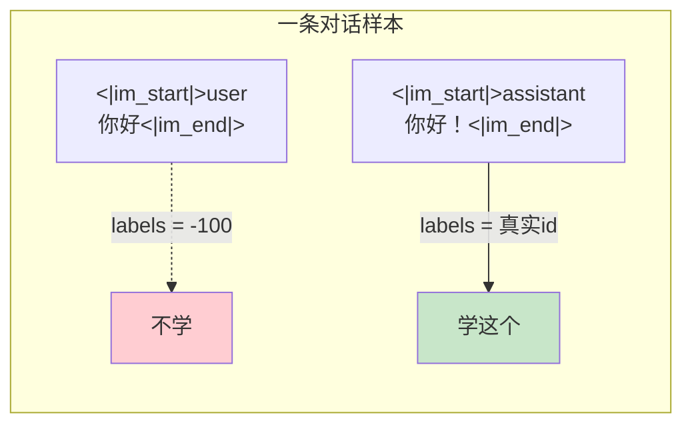

# 第 33 章 监督微调 SFT + Label Masking

Ch 32 结束时，预训练模型已经「懂语言」——它能续写文本，但还不会「对话」。你问它「你好」，它可能接着写「世界」（续写训练数据里常见的搭配），而不是回答「你好，有什么可以帮你？」

**监督微调（SFT）** 就是把续写模型变成对话模型的关键一步。它的做法很直接：用高质量的人机对话数据训练模型，让它学会「看到 user 提问 → 生成 assistant 回复」。核心技巧是 **label masking**——只对 assistant 的回复计算 loss，user 提问部分不参与。这样模型学的是「怎么回答」，而不是「怎么复述问题」。

## 33.1 学习目标

读完本章，你应该能够：

- 解释 SFT 与预训练的三个关键差异（学习率、label masking、加载预训练权重）；
- 说清 label masking 为什么只对 assistant 回复算 loss；
- 理解 SFT 学习率（1e-5）为什么是预训练（5e-4）的 1/50；
- 看懂 `SFTConfig` 与 `PretrainConfig` 的差异；
- 从 SFT loss 曲线判断训练是否健康。

## 33.2 原理回顾：从续写到对话

### 33.2.1 为什么要 SFT

预训练用海量纯文本做 NTP，模型学到了语言的统计规律。但纯文本里没有「问→答」的结构——模型不知道何时该停止续写、何时该切换角色。SFT 用**对话格式**的数据（user/assistant 交替），明确告诉模型「这段是提问，那段是回复，你只学回复」。

### 33.2.2 Label Masking（回引 Ch 28）

Ch 28 讲过 `SFTDataset.generate_labels` 的核心：用 bos/eos 锚点定位 assistant 回复区域，**只给回复区域填真实 token id，其余标记 -100**。



`ignore_index=-100`（Ch 26）让 user 区域的 loss 自动为 0。模型只在 assistant 回复上反传梯度——学到的是「怎么回答」，而非「怎么复述问题」。

### 33.2.3 SFT 的三个差异

SFT 与预训练共享同一套训练循环（Ch 31 的 `train_epoch`），但有三个关键差异：

| | 预训练 | SFT |
|--|-------|-----|
| **学习率** | 5e-4 | **1e-5**（1/50） |
| **labels** | 全 token（pad→-100） | **只 assistant 区域** |
| **起点** | 随机初始化 | **加载预训练权重** |

**学习率降低 50 倍**：预训练权重已经包含了大量语言知识，SFT 只是「微调」——如果学习率太大，会**灾难性遗忘**（catastrophic forgetting），把预训练学到的东西全忘了。1e-5 这个小学习率保证「轻柔调整」。

**加载预训练权重**：`from_weight='pretrain'`——SFT 不是从头训，而是站在预训练的肩膀上。

## 33.3 代码实现

完整实现见 `zllm/training/full_sft.py`（112 行）。

### 33.3.1 SFTConfig：超参数差异

> 完整实现见 `zllm/training/full_sft.py:22`

```python
@dataclass
class SFTConfig:
    epochs: int = 2
    batch_size: int = 16
    learning_rate: float = 1e-5       # 预训练的 1/50
    accumulation_steps: int = 1
    grad_clip: float = 1.0
    log_interval: int = 100
    max_seq_len: int = 768            # 对话比预训练长
    dtype: str = "bfloat16"
    save_weight: str = "full_sft"     # SFT 产物
    from_weight: str = "pretrain"     # 加载预训练权重
    ...
```

`SFTConfig`（`:22-40`）与 `PretrainConfig`（Ch 31）对比：

- `learning_rate=1e-5`（`:25`）：预训练 5e-4 的 1/50，防灾难遗忘。
- `max_seq_len=768`（`:30`）：对话数据比预训练的纯文本（340）更长，因为多轮对话要拼接。
- `from_weight="pretrain"`（`:37`）：加载预训练权重作为起点。
- `save_weight="full_sft"`（`:36`）：SFT 产出的权重命名为 `full_sft`，供后续 DPO/RL 使用。

### 33.3.2 train_epoch：与预训练同构

> 完整实现见 `zllm/training/full_sft.py:43`

`train_epoch`（`:43-112`）的循环结构与 Ch 31 的预训练 `train_epoch` **完全一样**——余弦退火 lr、AMP 前向、`loss + aux_loss`、梯度累积、clip、日志。差异只在**输入数据**：这里传的是 `SFTDataset`（label masking 已在 Ch 28 的 `__getitem__` 里做好），模型用的 `ZLLMForCausalLM` 的 forward（Ch 26）会自动用 `ignore_index=-100` 跳过被 mask 的位置。

这就是 SFT 的精妙之处：**训练循环不用改一行代码，label masking 在数据层就完成了**。

> 对应测试 `tests/m08_sft/test_208_sft_loss.py:68`（labels 只在 assistant 区域非 -100）、`:86`（pad 位置也 -100）、`:99`（SFT loss 下降）、`:116`（能过拟合）、`:132`（SFT 后 loss 低于随机初始化）。

## 33.4 对应单元测试

> 对应测试 `tests/m08_sft/test_208_sft_loss.py`（154 行）

**TestSFTLabelMasking**（`test_208_sft_loss.py:67`）：labels 只在 assistant 非 -100（`test_208_sft_loss.py:68`）、pad 也 -100（`test_208_sft_loss.py:86`）。这验证 Ch 28 的 `generate_labels` 在端到端训练中正确工作。

**TestSFTLossDecrease**（`test_208_sft_loss.py:98`）：
- `test_sft_loss_decreases`（`test_208_sft_loss.py:99`）：6 epoch 后 avg loss 下降。
- `test_sft_overfit`（`test_208_sft_loss.py:116`）：10 epoch 后 loss < 初始的 60%（过拟合能力）。

**TestSFTVsPretrain**（`test_208_sft_loss.py:131`）：
- `test_sft_loss_lower_than_random`（`test_208_sft_loss.py:132`）：SFT 训练后的 loss **低于**训练前（随机初始化）。这证明 SFT 确实让模型学到了东西。

## 33.5 动手验证

```bash
pytest tests/m08_sft/ -v
```

预期：全部 PASSED。亲手验证 label masking：

```bash
python -c "
import torch
from zllm.config import ZLLMConfig
from zllm.model.causal_lm import ZLLMForCausalLM
from zllm.training.full_sft import SFTConfig
cfg = SFTConfig()
print(f'SFT lr: {cfg.learning_rate}  (预训练的 {cfg.learning_rate/5e-4*100:.0f}%)')
print(f'from_weight: {cfg.from_weight}  save_weight: {cfg.save_weight}')
print(f'max_seq_len: {cfg.max_seq_len}  (预训练 340)')
"
```

## 33.6 本章小结 + 下章预告

本章要点：

1. **SFT = 预训练 + label masking + 低学习率**：训练循环不变，差异在数据（只对 assistant 算 loss）和超参（lr 降 50 倍）。
2. **Label masking**：只对 assistant 回复算 loss，模型学「回答」而非「复述问题」。在数据层（`generate_labels`）完成，训练循环零改动。
3. **低学习率防遗忘**：1e-5（预训练的 1/50），轻柔调整不破坏预训练知识。
4. **加载预训练权重**：`from_weight='pretrain'`，站在巨人的肩膀上。

> **一句话带走**：SFT 用 label masking 和 1/50 的学习率，把续写模型变成对话模型——学的是「怎么回答」，不是「怎么复述问题」。

**下章预告**：SFT 要更新全部参数，大模型太贵怎么办？Ch 34《LoRA 低秩适配》——只训练少量低秩参数（<10%），效果接近全参数微调，显存省一大半。这是参数效率的魔法。
