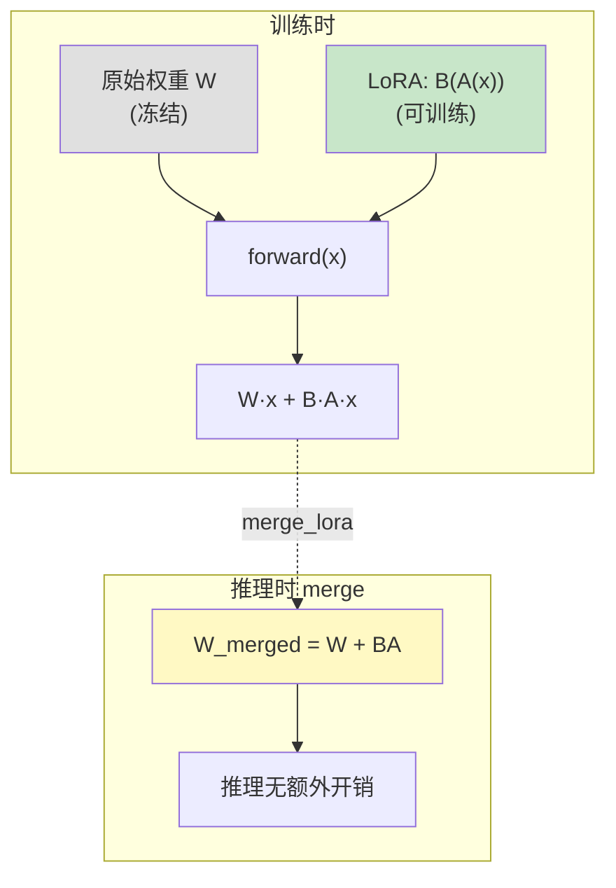

# 第 34 章 LoRA 低秩适配

Ch 33 的 SFT 更新**全部参数**。对 7B 模型，这意味着每次反传要存 7B 个梯度、优化器（AdamW）还要存两份动量——显存爆炸。有没有办法只更新**极少量参数**，效果却接近全参数微调？

**LoRA（Low-Rank Adaptation）** 就是答案。它的核心洞察：微调时权重的变化量 $\Delta W$ 是**低秩**的——不需要完整的 $d \times d$ 矩阵，用两个小矩阵的乘积 $B \times A$（$d \times r$ 和 $r \times d$，$r \ll d$）就能近似。这样可训练参数骤降到原来的 **1%~10%**，显存大幅节省，而效果几乎无损。

## 34.1 学习目标

读完本章，你应该能够：

- 解释 LoRA 的低秩分解 $\Delta W = BA$ 为何省参数（参数量从 $d^2$ 降到 $2dr$）；
- 说清 B 零初始化的妙处——训练初始时 $\Delta W = 0$，不改变模型行为；
- 理解 zllm 只把 LoRA 注入**方阵 Linear**（q_proj / o_proj）的原因；
- 看懂 monkey-patch forward 如何实现 `original(x) + lora(x)`；
- 解释 merge（$W + BA$）后推理与 LoRA 推理结果一致；
- 理解 LoRA 学习率（1e-4）为什么比 full SFT（1e-5）高 10 倍。

## 34.2 原理回顾：低秩分解

### 34.2.1 权重变化的低秩假设（回引 Ch 07/15）

Ch 07 讲过 SVD 分解 $W = U\Sigma V^T$，Ch 15 讲过参数效率。LoRA 的假设是：微调引起的权重变化 $\Delta W$ 具有**低秩结构**——即 $\Delta W$ 的「有效维度」远小于 $d$。

于是把 $\Delta W \in \mathbb{R}^{d \times d}$ 分解为两个瘦长矩阵的乘积：

$$
\Delta W \;=\; B \cdot A, \qquad B \in \mathbb{R}^{d \times r},\; A \in \mathbb{R}^{r \times d},\; r \ll d
$$

参数量：$d^2 \;\longrightarrow\; 2dr$。以 $d=768, r=16$ 为例：$768^2 = 589824$ → $2 \times 768 \times 16 = 24576$，**降到原来的 4.2%**。

### 34.2.2 B 零初始化：训练初始零扰动

LoRA 的一个关键设计：**A 高斯随机初始化、B 零初始化**。这样训练第一步时 $\Delta W = B \cdot A = 0 \cdot A = 0$——LoRA 注入后模型输出**完全不变**。训练从「零扰动」出发，逐步学到有用的 $\Delta W$。这避免了注入随机适配器带来的初始噪声。

### 34.2.3 注入策略与合并



训练时前向 $= Wx + BAx$（W 冻结，只训 A 和 B）。训练完可以 **merge**：把 $\Delta W = BA$ 直接加进 $W$ 得到 $W' = W + BA$，推理时不再需要 LoRA 分支——零额外开销。

## 34.3 代码实现

完整实现见 `zllm/model/lora.py`（130 行）。

### 34.3.1 LoRA 类：B(A(x))

> 完整实现见 `zllm/model/lora.py:21`

```python
class LoRA(nn.Module):
    def __init__(self, in_features, out_features, rank=16):
        super().__init__()
        self.rank = rank
        self.A = nn.Linear(in_features, rank, bias=False)   # d → r（降维）
        self.B = nn.Linear(rank, out_features, bias=False)   # r → d（升维）
        self.A.weight.data.normal_(mean=0.0, std=0.02)       # A 高斯初始化
        self.B.weight.data.zero_()                           # B 零初始化！

    def forward(self, x):
        return self.B(self.A(x))                             # B(A(x))
```

`LoRA`（`:21-39`）三层：

- **A 降维**（`:33`）：`d → r`，把 768 维压到 16 维。
- **B 升维**（`:34`）：`r → d`，再升回 768 维。
- **初始化**（`:35-36`）：A 高斯（`std=0.02`），B 全零。初始 $\Delta W = B \cdot A = 0$。

`forward`（`:38-39`）就是 `B(A(x))`——先降维再升维。

> 对应测试 `tests/m09_lora/test_222_lora_module.py:31`（A 高斯 `std > 0.01`）、`:36`（B 全零）、`:40`（B 零 → 输出全零，不改原模型）、`:53`（forward = B(A(x))）。

### 34.3.2 apply_lora：monkey-patch 注入

> 完整实现见 `zllm/model/lora.py:42`

```python
def apply_lora(model, rank=16):
    device = next(model.parameters()).device
    for name, module in model.named_modules():
        if isinstance(module, nn.Linear) and module.in_features == module.out_features:
            #          ↑ 只注入方阵（in == out），即 q_proj / o_proj
            lora = LoRA(module.in_features, module.out_features, rank=rank).to(device)
            setattr(module, "lora", lora)
            original_forward = module.forward

            def forward_with_lora(x, layer1=original_forward, layer2=lora):
                return layer1(x) + layer2(x)    # W·x + B·A·x

            module.forward = forward_with_lora    # monkey-patch
```

`apply_lora`（`:42-60`）两个设计：

1. **只注入方阵**（`:52`）：`module.in_features == module.out_features`。Transformer 里方阵 Linear 是注意力的 `q_proj`（hidden→hidden）和 `o_proj`（hidden→hidden）；非方阵的如 `gate_proj`（hidden→intermediate）不注入。这是因为注意力的投影矩阵是微调最有效的位置。
2. **monkey-patch**（`:57-60`）：不改原始 Linear 的代码，而是用闭包替换它的 `forward`。`forward_with_lora(x) = original(x) + lora(x)`。闭包参数 `layer1=original_forward, layer2=lora` 默认参数绑定避免循环变量陷阱。

> 对应测试 `test_222_lora_module.py:71`（方阵有 lora）、`:77`（非方阵没有）、`:83`（注入后 B=0 输出不变）、`:125`（lora 参数 < 总量的 10%）。

### 34.3.3 freeze / save / load / merge

> 完整实现见 `zllm/model/lora.py:69`

- **`freeze_non_lora`**（`:69-79`）：非 LoRA 参数 `requires_grad=False`，只保留 LoRA 参数可训练。这样 optimizer 只更新 A 和 B。
- **`save_lora`**（`:82-94`）：只存 A 和 B 的权重（几 MB），不存整个模型（几百 MB）。
- **`load_lora`**（`:97-112`）：加载 A/B 到已注入 LoRA 的模型。
- **`merge_lora`**（`:115-130`）：核心操作 $\to W' = W + BA$。

`merge_lora`（`:115-130`）的合并：

```python
delta = (module.lora.B.weight.data @ module.lora.A.weight.data)  # ΔW = B @ A
state_dict[f"{name}.weight"] += delta                              # W' = W + ΔW
```

合并后保存的是标准权重（没有 lora 键），推理时加载即可，无额外开销。

> 对应测试 `tests/m09_lora/test_231_save_load_merge_train.py:37`（save 只有 lora 键）、`:47`（load 恢复输出一致）、`:70`（merge 产物无 lora 键）、`:85`（merge 推理 = lora 推理）。

### 34.3.4 LoRAConfig：高学习率

> 完整实现见 `zllm/training/lora_sft.py:19`

`LoRAConfig`（`lora_sft.py:19-37`）关键差异：

- `learning_rate=1e-4`（`:22`）：full SFT 的 **10 倍**。因为 LoRA 参数少（<10%），需要更大学习率才能有效更新；而且只改 A/B 不动基础权重，不怕灾难遗忘。
- `rank=16`（`:23`）：低秩维度。
- `epochs=10`（`:20`）：比 full SFT（2 epoch）多，因为参数少学得慢。
- `from_weight="full_sft"`（`:35`）：LoRA 通常在已 SFT 的模型上做领域适配。

> 对应测试 `test_231_save_load_merge_train.py:110`（lr=1e-4、rank=16、epochs=10）、`:126`（LoRA train loss 下降）、`:165`（只有 lora 参数有梯度，基础权重 grad=None）。

## 34.4 对应单元测试

> 对应测试 `tests/m09_lora/`

| 测试文件 | 核心断言 |
|---------|---------|
| `test_222_lora_module.py` | A 高斯 `:31`、B 零 `:36`、init=0 `:40`、方阵注入 `:71`、参数<10% `:125` |
| `test_231_save_load_merge_train.py` | save only lora `:37`、merge 一致 `:85`、train 下降 `:126`、only lora grad `:165` |

## 34.5 动手验证

```bash
pytest tests/m09_lora/ -v
```

预期：全部 PASSED。亲手看 LoRA 参数量节省：

```bash
python -c "
import torch
from zllm.config import ZLLMConfig
from zllm.model.causal_lm import ZLLMForCausalLM
from zllm.model.lora import apply_lora, get_lora_params
cfg = ZLLMConfig(vocab_size=100, hidden_size=64, num_hidden_layers=2,
                 num_attention_heads=4, num_key_value_heads=2, max_position_embeddings=128)
model = ZLLMForCausalLM(cfg)
apply_lora(model, rank=8)
lora_n = sum(p.numel() for p in get_lora_params(model))
total_n = sum(p.numel() for p in model.parameters())
print(f'LoRA 参数: {lora_n} / 总参数: {total_n} = {lora_n/total_n*100:.1f}%')
"
```

## 34.6 本章小结 + 下章预告

本章要点：

1. **低秩分解** $\Delta W = BA$：参数从 $d^2$ 降到 $2dr$（$r \ll d$），zllm 约 4%。
2. **B 零初始化**：初始 $\Delta W = 0$，注入后不改模型行为，从零扰动出发。
3. **只注入方阵**：q_proj / o_proj 是微调最有效的位置。
4. **monkey-patch**：`forward(x) = original(x) + lora(x)`，不改原始代码。
5. **merge**：$W' = W + BA$，推理零额外开销；save 只存几 MB 的 A/B。
6. **高学习率**（1e-4）：参数少需要更大 lr，不怕遗忘（基础权重冻结）。

> **一句话带走**：LoRA 用低秩分解 $\Delta W=BA$ 把可训练参数降到 4%，B 零初始化保证零启动扰动，merge 后推理无额外开销。

**下章预告**：SFT 和 LoRA 都是在「模仿人类答案」。但如果答案有「好」和「坏」之分呢？Ch 35《RLHF 框架与对齐总论》——讲清 RLHF/DPO/GRPO 三种对齐方法的框架，为后面 3 章打理论基础。
