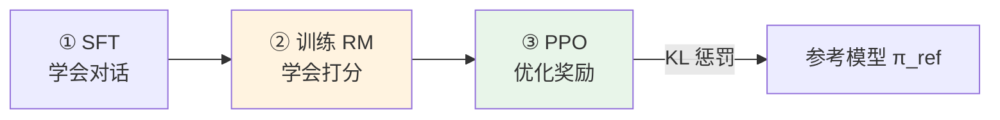
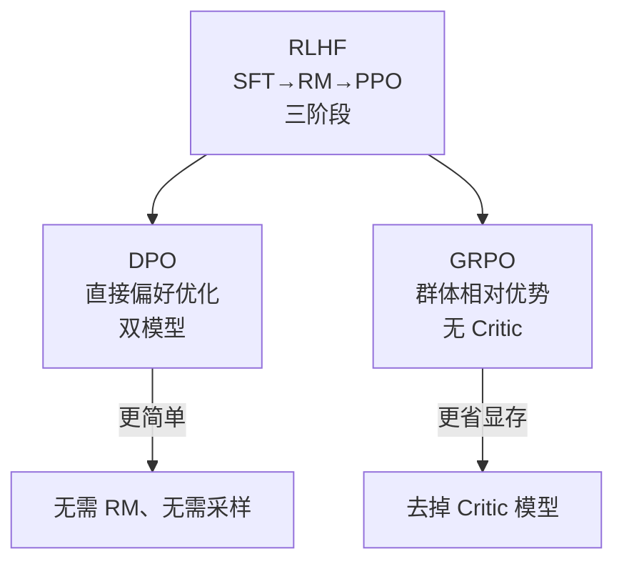

# 第 35 章 RLHF 框架与对齐总论

Ch 33–34 解决了「让模型学会对话」（SFT）和「省参数地微调」（LoRA）。但 SFT 只是在**模仿**人类标注的答案——它不知道哪个答案**更好**。

真实场景里，同一个问题可能有多种回答，有些好、有些差。**对齐（Alignment）** 的目标是让模型不仅会回答，还要回答得**有用（helpful）、无害（harmless）、诚实（honest）**。这就是 RLHF 及其变体（DPO、GRPO）要解决的问题。

本章是 Part VI 后半的**理论总纲**——讲清三种主流对齐方法的框架和关系，为 Ch 36（DPO）、Ch 37（PPO）、Ch 38（GRPO）打理论基础。本章无源码引用，纯理论。

## 35.1 学习目标

读完本章，你应该能够：

- 说清 RLHF 经典三阶段（SFT → 奖励模型 RM → PPO）的流程；
- 解释 DPO 如何绕过 RM 直接用偏好数据训练；
- 解释 GRPO 如何用群体相对优势去掉 Critic 模型；
- 默写出 RLHF 的优化目标 $\max\,\mathbb{E}[r(x,y)] - \beta\,\text{KL}(\pi_\theta \| \pi_{\text{ref}})$；
- 解释 KL 惩罚为什么防止策略偏离参考模型太远；
- 理解「对齐税」「奖励黑客」等核心概念。

## 35.2 为什么 SFT 不够

SFT 用的是「标准答案」——每条数据只有一个回答，模型学习**模仿**它。但现实中：

1. **答案没有唯一正确**：「讲个笑话」有成千上万种好答案，SFT 只能学一个。
2. **好坏是相对的**：与其告诉模型「这个答案好」，不如告诉它「A 比 B 好」——偏好信号比绝对标准更容易获取。
3. **安全性**：SFT 不会主动教模型拒绝有害请求，需要偏好数据「拒绝 > 配合」来对齐。

对齐方法的核心区别在于**怎么利用偏好信号**。

## 35.3 RLHF：经典三阶段

**RLHF（Reinforcement Learning from Human Feedback）** 是 InstructGPT/ChatGPT 的经典框架，分三步：

**① SFT**（Ch 33）：先让模型学会基本对话能力。

**② 训练奖励模型（RM）**：收集人类偏好数据（对同一 prompt 的两个回答标注哪个好），训练一个打分模型 $r_\phi(x, y)$——输入 prompt + response，输出一个标量分数。RM 本身也是个 LLM（把 lm_head 换成 value_head）。

**③ PPO 强化学习**：用 RM 的分数作为奖励，用 PPO 算法优化策略模型。但纯最大化奖励会导致模型「钻空子」（reward hacking）——找到 RM 的漏洞刷高分但回答变差。所以加 **KL 惩罚**：

$$
\max_{\pi_\theta}\;\mathbb{E}_{y\sim\pi_\theta}\bigl[r_\phi(x,y)\bigr] \;-\; \beta\,\text{KL}\bigl(\pi_{\text{ref}}(\cdot|x)\,\big\|\,\pi_\theta(\cdot|x)\bigr)
$$

$\pi_{\text{ref}}$ 是 SFT 后的模型（冻结）。KL 项惩罚 $\pi_\theta$ 偏离 $\pi_{\text{ref}}$ 太远——「你可以变好，但不能变成另一个人」。$\beta$ 控制约束强度。

> **KL 方向说明**：标准 RLHF 文献常写成前向 $\text{KL}(\pi_\theta\,\|\,\pi_{\text{ref}})$；zllm 的实现（Ch 38 GRPO，`grpo.py:36` 的 k3 估计 $e^{(\text{ref}-\text{policy})}-(\text{ref}-\text{policy})-1$）采用**反向** $\text{KL}(\pi_{\text{ref}}\,\|\,\pi_\theta)$。两者特性不同：反向 KL 是 **mode-seeking**（逼策略聚到 ref 的峰），前向是 **mean-matching**。本书公式与代码对齐，统一用反向。

## 35.4 DPO：绕过 RM 的简化

RLHF 要训 RM + 跑 PPO，流程复杂、训练不稳。**DPO（Direct Preference Optimization）** 的洞察：RLHF 的目标函数有**闭式解**——可以直接从偏好数据推导出策略，不需要显式的 RM。

从 RLHF 目标出发，最优策略满足：

$$
\pi^*(y|x) \;\propto\; \pi_{\text{ref}}(y|x)\,\exp\!\left(\frac{r(x,y)}{\beta}\right)
$$

反过来，奖励可以用策略表达：$r(x,y) = \beta\log\frac{\pi^*(y|x)}{\pi_{\text{ref}}(y|x)} + \text{const}$。代入 Bradley-Terry 偏好模型 $P(y_w \succ y_l) = \sigma(r(y_w) - r(y_l))$，得到 **DPO loss**：

$$
\boxed{\;\mathcal{L}_{\text{DPO}} \;=\; -\log\sigma\!\left(\beta\left[\log\frac{\pi_\theta(y_w|x)}{\pi_{\text{ref}}(y_w|x)} - \log\frac{\pi_\theta(y_l|x)}{\pi_{\text{ref}}(y_l|x)}\right]\right)\;}
$$

其中 $y_w$ 是 chosen（好答案）、$y_l$ 是 rejected（差答案）。DPO 的好处：**双模型架构**（policy 训练 + reference 冻结），不需要 RM，不需要 PPO 的复杂采样，直接用偏好数据算 loss 反传。Ch 36 详细实现。

## 35.5 GRPO：去掉 Critic

PPO（RLHF 第三阶段）需要 **Critic 模型**估计价值函数 $V(s)$ 来算 GAE 优势（Ch 37）。Critic 和 Actor 一样大——双模型显存翻倍。

**GRPO（Group Relative Policy Optimization）** 的做法：对同一个 prompt 生成 $N$ 个 response（zllm 默认 6 个），用**组内 reward 的标准化**作为优势：

$$
A_i \;=\; \frac{r_i - \text{mean}(r_1,\ldots,r_N)}{\text{std}(r_1,\ldots,r_N) + \epsilon}
$$

不需要 Critic 估计 $V(s)$——直接用同组的其他 response 作为基线（baseline）。哪个 response 比组内平均好，优势就正；比平均差，优势就负。这样省掉了 Critic 模型，显存减半。Ch 38 详细实现。

## 35.6 三种方法对比

| | RLHF (PPO) | DPO | GRPO |
|--|-----------|-----|------|
| **需要 RM** | 是 | 否（闭式解绕过） | 否（用 reward 函数） |
| **需要 Critic** | 是 | 否 | 否（群体基线） |
| **数据格式** | prompt → 采样 | chosen/rejected 对 | prompt → N 生成 |
| **训练稳定性** | 较差（PPO 敏感） | 好（直接 loss） | 中等 |
| **显存** | 3 模型（policy+ref+critic；RM 离线训练不驻留） | 2 模型（policy+ref） | 2 模型（policy+ref） |
| **代表应用** | ChatGPT | Zephyr | DeepSeek-R1 |

## 35.7 核心概念

**对齐税（Alignment Tax）**：对齐训练（RLHF/DPO）可能降低模型在其他任务上的能力——因为模型为了「安全」变得过于保守。比如对齐后模型可能拒绝回答一些无害但敏感的问题。

**奖励黑客（Reward Hacking）**：模型找到奖励函数的漏洞刷高分，但实际输出质量很差。比如 RM 偏好长回答，模型就无限注水。KL 惩罚和多维度奖励（Ch 40）是缓解手段。

**KL 惩罚的作用**：$\beta\,\text{KL}(\pi_\theta\|\pi_{\text{ref}})$ 确保 $\pi_\theta$ 不偏离 $\pi_{\text{ref}}$（SFT 模型）太远。$\beta$ 太大 → 对齐效果弱（模型不敢变）；$\beta$ 太小 → 模型可能崩坏（偏离太远）。zllm 的 DPO 用 $\beta=0.15$，GRPO 用 $\beta=0.1$。

## 35.8 本章小结 + 下章预告

本章要点：

1. **SFT 不够**：答案无唯一正确、好坏是相对的、需要安全性对齐。
2. **RLHF 三阶段**：SFT → 训练 RM → PPO 优化（带 KL 惩罚防偏离）。
3. **DPO 绕过 RM**：RLHF 目标有闭式解，直接从偏好数据算 loss，双模型架构。
4. **GRPO 去 Critic**：同 prompt 生成 N 个 response，组内标准化作为优势，省一半显存。
5. **KL 惩罚**：$\beta\,\text{KL}(\pi_\theta\|\pi_{\text{ref}})$ 防策略崩坏，平衡对齐效果与稳定性。

> **一句话带走**：对齐三兄弟——RLHF（RM+PPO，最强但最复杂）、DPO（绕过 RM，简洁稳定）、GRPO（去 Critic，省显存），都用 KL 惩罚防偏离。

**下章预告**：理论框架清楚了，从最简洁的 DPO 开始。Ch 36《DPO 直接偏好优化》——实现 `dpo_loss = -logsigmoid(β·(π(c)/π_ref(c) - π(r)/π_ref(r)))`，双模型架构，lr 低到 4e-8。
