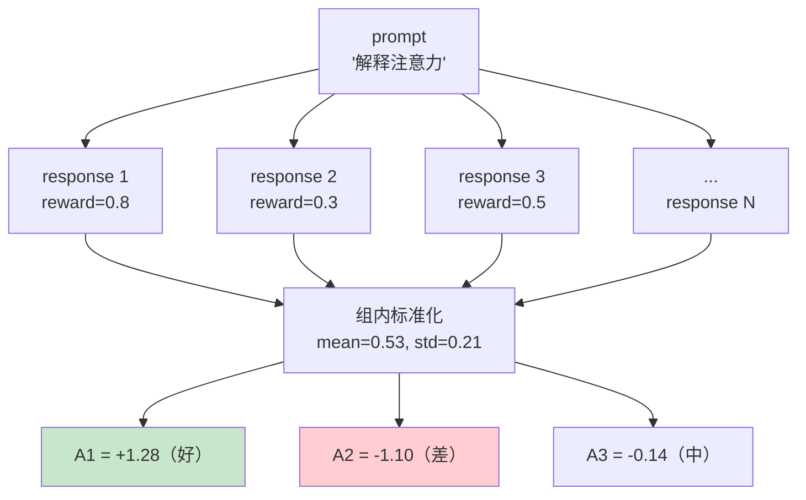

# 第 38 章 GRPO + CISPO

Ch 37 的 PPO 需要 Critic 模型估计价值函数——显存翻倍、训练复杂。DeepSeek 提出的 **GRPO（Group Relative Policy Optimization）** 给出了一个更简洁的方案：**去掉 Critic**，对同一个 prompt 生成 $N$ 个回答，用组内 reward 的标准化作为优势。

本章还实现 zllm 默认使用的 **CISPO** 变体——单边裁剪，只限制上界不限制下界，允许模型大胆降低低质量 token 的概率。这是 DeepSeek-R1 用来训练推理能力的关键算法。

## 38.1 学习目标

读完本章，你应该能够：

- 解释 GRPO 如何用群体相对优势替代 Critic 价值函数；
- 默写出组内标准化 $A_i = (r_i - \bar{r}) / (\sigma_r + \epsilon)$；
- 说清 GRPO 与 PPO 的核心差异（无 Critic、群体基线）；
- 理解 KL 惩罚的计算方式（token 级 KL）；
- 解释 CISPO 单边裁剪与 GRPO 双边 clip 的区别及其意义。

> **实现范围说明**：本章实现 GRPO/CISPO 的核心组件——`compute_group_advantages`、`per_token_kl`、`grpo_loss`、`cispo_loss` 与 `GRPOConfig`。**对同一 prompt 采样 $N$ 个回答、打分、更新的外层训练循环不在 zllm 当前代码内**，需读者自行组装或参考社区实现。本章聚焦损失原语与群体优势的数学。

## 38.2 原理回顾：群体相对优势

### 38.2.1 去掉 Critic 的关键（回引 Ch 35/37）

PPO 的 GAE 需要 $V(s)$（Critic 估计），因为「绝对优势」$A = Q - V$ 需要一个基线 $V$。GRPO 的洞察：如果对同一 prompt 生成 $N$ 个回答，可以用**组内其他回答的平均 reward** 作为基线，不需要 Critic。



### 38.2.2 组内标准化优势

对同一 prompt 的 $N$ 个 response，reward 分别为 $r_1, \ldots, r_N$：

$$
A_i \;=\; \frac{r_i - \text{mean}(r_1, \ldots, r_N)}{\text{std}(r_1, \ldots, r_N) + \epsilon}
$$

比组内平均好的 → 正优势（鼓励）；差的 → 负优势（抑制）。组内标准化天然 mean=0、std=1，不需要额外标准化。

### 38.2.3 KL 惩罚（回引 Ch 35）

GRPO 也用 KL 惩罚防偏离 reference：

$$
\mathcal{L} \;=\; -\bigl(\min(ratio \cdot A,\; \text{clip}(ratio) \cdot A) - \beta \cdot \text{KL}(\pi_{\text{ref}} \| \pi_\theta)\bigr)
$$

token 级 KL 用 $k_{3}$ 估计（无偏且处处非负）：$\text{KL}_t = e^{(\text{ref}_t - \text{policy}_t)} - (\text{ref}_t - \text{policy}_t) - 1$。

### 38.2.4 CISPO：单边裁剪

标准 GRPO 用双边 clip：$ratio \in [1{-}\epsilon, 1{+}\epsilon]$。**CISPO** 只裁上界：$ratio \le \epsilon_{\text{high}}$（zllm 默认 5.0），不裁下界。

为什么？训练推理模型（如 DeepSeek-R1）时，希望鼓励模型**大胆修剪**低质量内容（降低差 token 的概率）。双边 clip 会限制 ratio 下界（不能降太多），而 CISPO 允许 ratio → 0（大幅降低差 token），只防止 ratio 爆炸性增长。这是 CISPO 在推理训练中更有效的原因。

## 38.3 代码实现

完整实现见 `zllm/training/grpo.py`（133 行）。

### 38.3.1 per_token_kl：token 级 KL 散度

> 完整实现见 `zllm/training/grpo.py:24`

```python
def per_token_kl(ref_log_probs, policy_log_probs):
    kl = torch.exp(ref_log_probs - policy_log_probs) - (ref_log_probs - policy_log_probs) - 1
    return kl
```

`per_token_kl`（`:24-37`）：用 $k_3$ 估计器 $e^{(\text{ref}-\text{policy})} - (\text{ref}-\text{policy}) - 1$。这个形式**处处非负**（不像直接用 $\text{ref} - \text{policy}$ 可能为负），数值更稳定。当 ref = policy 时 KL=0。

> 对应测试 `tests/m10_alignment/test_258_grpo.py:16`（同分布 KL=0）、`:21`（非同分布 KL>0）、`:27`（shape 正确）。

### 38.3.2 compute_group_advantages：群体相对优势

> 完整实现见 `zllm/training/grpo.py:40`

```python
def compute_group_advantages(rewards, num_generations):
    grouped = rewards.view(-1, num_generations)                     # (B, N)
    mean = grouped.mean(dim=1).repeat_interleave(num_generations)   # 每组的均值
    std = grouped.std(dim=1, unbiased=False).repeat_interleave(num_generations)
    return (rewards - mean) / (std + 1e-4)
```

`compute_group_advantages`（`:40-56`）：把 $B \times N$ 的 reward reshape 成 `(组数, N)`，算组内 mean/std，再 `repeat_interleave` 展开回 $B \times N$，最后标准化。$\epsilon = 10^{-4}$ 防 std=0 除零。

> 对应测试 `test_258_grpo.py:35`（标准化后组内 mean=0）、`:43`（高 reward → 高优势）、`:50`（单组 shape 正确）。

### 38.3.3 grpo_loss：双边 clip（标准 GRPO）

> 完整实现见 `zllm/training/grpo.py:59`

```python
def grpo_loss(policy_logps, old_logps, advantages, mask, ref_logps, beta=0.1, epsilon=0.2):
    ratio = torch.exp(policy_logps - old_logps)
    clipped_ratio = torch.clamp(ratio, 1 - epsilon, 1 + epsilon)    # 双边 clip
    surr1 = ratio * advantages
    surr2 = clipped_ratio * advantages
    kl = per_token_kl(ref_logps, policy_logps)
    per_token_loss = -(torch.min(surr1, surr2) - beta * kl)          # min - β·KL
    return ((per_token_loss * mask).sum(dim=1) / mask.sum(dim=1).clamp(min=1)).mean()
```

`grpo_loss`（`:59-85`）：与 PPO policy loss 结构一致（ratio、clip、min），但额外减去 $\beta \cdot \text{KL}$（`:84`）。KL 用 token 级 `per_token_kl`（`:83`），也按 mask 求平均。

> 对应测试 `test_258_grpo.py:58`（正优势推动 ratio > 1）、`:68`（正确方向 loss 更低）、`:81`（ratio 超 clip 后 loss 不再降）。

### 38.3.4 cispo_loss：单边裁剪（CISPO）

> 完整实现见 `zllm/training/grpo.py:88`

```python
def cispo_loss(policy_logps, old_logps, advantages, mask, ref_logps, beta=0.1, epsilon_high=5.0):
    ratio = torch.exp(policy_logps - old_logps)
    clamped_ratio = torch.clamp(ratio, max=epsilon_high).detach()    # 只裁上界！
    kl = per_token_kl(ref_logps, policy_logps)
    per_token_loss = -(clamped_ratio * advantages * policy_logps - beta * kl)
    return ((per_token_loss * mask).sum(dim=1) / mask.sum(dim=1).clamp(min=1)).mean()
```

`cispo_loss`（`:88-106`）两个关键差异：

1. **单边裁剪**（`:103`）：`clamp(ratio, max=epsilon_high)` 只限制上界（默认 5.0），下界不裁——ratio 可以接近 0（大幅降低差 token 概率）。`.detach()` 让裁剪不参与梯度。
2. **乘以 policy_logps**（`:105`）：用 `clamped_ratio * advantages * policy_logps` 而非 `ratio * advantages`。这是 CISPO 的核心——直接对 log 概率做策略梯度，clamped_ratio 作为权重。

> 对应测试 `test_258_grpo.py:96`（单边 clip 有效，ratio=3 时 loss 不 NaN）。

### 38.3.5 GRPOConfig

> 完整实现见 `zllm/training/grpo.py:109`

`GRPOConfig`（`:109-133`）：`num_generations=6`（每 prompt 生成 6 个，`:118`）、`beta=0.1`（KL 系数，`:114`）、`epsilon=0.2`（双边 clip，`:115`）、`epsilon_high=5.0`（CISPO 单边上界，`:116`）、`loss_type="cispo"`（**默认用 CISPO**，`:117`）。

> 对应测试 `test_258_grpo.py:108`（num_generations=6、loss_type="cispo"、lr=3e-7）。

## 38.4 对应单元测试

> 对应测试 `tests/m10_alignment/test_258_grpo.py`（114 行）

| 测试类 | 行号 | 验证 |
|--------|------|------|
| TestPerTokenKL | `:15` | 同分布=0 `:16`、非同>0 `:21`、shape `:27` |
| TestGroupAdvantages | `:34` | 标准化 mean=0 `:35`、高reward高优势 `:43` |
| TestGRPOLoss | `:57` | 正优势推ratio>1 `:58`、方向正确 `:68`、clip `:81` |
| TestCISPOLoss | `:95` | 单边clip `:96` |
| TestGRPOConfig | `:107` | 默认值 `:108` |

## 38.5 动手验证

```bash
pytest tests/m10_alignment/test_258_grpo.py -v
```

预期：全部 PASSED。验证群体相对优势：

```bash
python -c "
import torch
from zllm.training.grpo import compute_group_advantages
# 同一 prompt 的 3 个 response，reward 分别 0.8, 0.3, 0.5
rewards = torch.tensor([0.8, 0.3, 0.5])
adv = compute_group_advantages(rewards, num_generations=3)
print('优势:', adv.tolist())
print('（0.8最高→正优势，0.3最低→负优势）')
"
```

## 38.6 本章小结 + 下章预告

本章要点：

1. **GRPO 去 Critic**：同 prompt 生成 N 个 response，组内标准化作为优势，省一半显存。
2. **群体标准化**：$A_i = (r_i - \bar{r}) / (\sigma + \epsilon)$，天然 mean=0。
3. **token 级 KL**：$e^{(\text{ref}-\text{policy})} - (\text{ref}-\text{policy}) - 1$，处处非负。
4. **GRPO 双边 clip**：$ratio \in [1{-}\epsilon, 1{+}\epsilon]$，min 取保守。
5. **CISPO 单边裁剪**：只裁上界（$\le \epsilon_{\text{high}}$），允许大幅降低差 token——推理训练更有效。

> **一句话带走**：GRPO 用群体相对优势去掉 Critic，CISPO 单边裁剪让模型大胆修剪低质 token——DeepSeek-R1 推理能力的训练秘方。

**下章预告**：对齐方法讲完了（DPO/PPO/GRPO）。但如果想把大模型的知识「压缩」到小模型呢？Ch 39《知识蒸馏》——用教师模型的软标签指导学生模型，温度 T 暴露类间「暗知识」。
