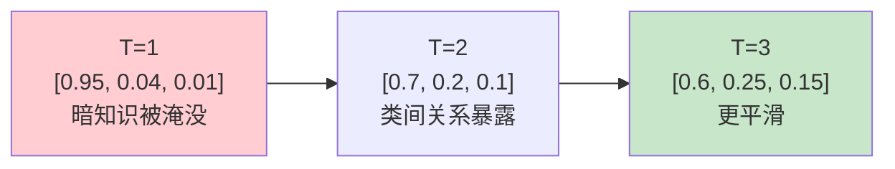

# 第 39 章 知识蒸馏

大模型能力强但慢、贵；小模型快、便宜但能力弱。**知识蒸馏（Knowledge Distillation）** 把大模型（教师）的知识「压缩」到小模型（学生），让学生接近教师的能力，同时保持小模型的速度。

核心原理：教师模型的 **softmax 输出**不只告诉你「正确答案是什么」，还包含**暗知识（dark knowledge）**——类与类之间的相似度关系。比如分类「猫」时，教师给「狗」的概率比「汽车」高——这个「猫像狗不像车」的信息在 one-hot 硬标签里完全丢失。用**温度** T > 1 把 softmax 软化，暴露更多类间关系，学生学得更细。

## 39.1 学习目标

读完本章，你应该能够：

- 解释暗知识的概念——软标签比硬标签多了什么信息；
- 说清温度 T 如何影响 softmax 分布（T 大 → 更平滑）；
- 默写出蒸馏 loss：$T^2 \cdot \text{KL}(\text{teacher}_{\text{soft}} \| \text{student}_{\text{soft}})$；
- 解释为什么乘 $T^2$（补偿梯度尺度衰减）；
- 理解 $\alpha$ 如何平衡硬标签（CE）和软标签（蒸馏）；
- 看懂 `train_epoch` 的 loss 组合 $\alpha \cdot \text{CE} + (1-\alpha) \cdot \text{distill}$。

## 39.2 原理回顾：温度与暗知识

### 39.2.1 软标签的暗知识（回引 Ch 06）

Ch 06 讲过 softmax 和温度。标准 softmax $\frac{e^{z_i}}{\sum e^{z_j}}$ 在 logits 差距大时输出接近 one-hot（最大值接近 1，其余接近 0）——暗知识被「淹没」了。

加温度 $T$：$\text{softmax}(z/T) = \frac{e^{z_i/T}}{\sum e^{z_j/T}}$。$T > 1$ 把 logits 除以 T，差距缩小，分布变平滑——次优选项的概率被「放大」暴露出来。



### 39.2.2 蒸馏 loss

学生的 loss 由两部分组成：

$$
\mathcal{L} \;=\; \alpha \cdot \underbrace{\text{CE}(y_{\text{hard}}, y_{\text{student}})}_{\text{硬标签：学正确答案}} \;+\; (1-\alpha) \cdot \underbrace{T^2 \cdot \text{KL}(\text{teacher}_{T} \| \text{student}_{T})}_{\text{软标签：学暗知识}}
$$

- **硬标签 CE**：标准的交叉熵（Ch 05），学生要预测正确 token。
- **软标签 KL**：学生要模仿教师的**软化分布**，学暗知识。
- **$T^2$ 补偿**：softmax 除以 T 后梯度缩小 $1/T^2$（链式法则），乘 $T^2$ 把梯度尺度补回来，保证两部分梯度量级匹配。
- **$\alpha$ 平衡**：zllm 默认 $\alpha=0.5$，硬/软标签各半。$\alpha=1$ → 纯 CE（无蒸馏）；$\alpha=0$ → 纯蒸馏。

## 39.3 代码实现

完整实现见 `zllm/training/distillation.py`（164 行）。

### 39.3.1 distillation_loss：T²·KL

> 完整实现见 `zllm/training/distillation.py:21`

```python
def distillation_loss(student_logits, teacher_logits, temperature=1.0, reduction="batchmean"):
    with torch.no_grad():
        teacher_probs = F.softmax(teacher_logits / temperature, dim=-1).detach()    # 教师软标签
    student_log_probs = F.log_softmax(student_logits / temperature, dim=-1)          # 学生软分布
    kl = F.kl_div(student_log_probs, teacher_probs, reduction=reduction)
    return (temperature ** 2) * kl                                                   # ×T² 补偿梯度
```

`distillation_loss`（`:21-38`）四步：

1. **教师软标签**（`:33-34`）：`softmax(teacher_logits / T)`，`no_grad` + `detach` 保证教师不参与梯度。
2. **学生软分布**（`:36`）：`log_softmax(student_logits / T)`。用 log_softmax 是因为 `F.kl_div` 的第一个参数要求 log 概率。
3. **KL 散度**（`:37`）：`F.kl_div(log_student, teacher_probs)` 计算 $\sum p_{\text{teacher}} \log\frac{p_{\text{teacher}}}{p_{\text{student}}}$。
4. **$T^2$ 补偿**（`:38`）：乘 $T^2$ 把梯度尺度补回来。

> 对应测试 `tests/m11_distill_agent/test_272_distillation.py:25`（相同 logits → loss≈0）、`:30`（不同 → loss>0）、`:36`（不同 T → 不同 loss）、`:43`（T 越大概率越平滑）、`:50`（梯度能流回 student）。

### 39.3.2 DistillConfig

> 完整实现见 `zllm/training/distillation.py:42`

`DistillConfig`（`:42-61`）：`alpha=0.5`（硬/软各半，`:46`）、`temperature=1.5`（软化温度，`:47`）、`learning_rate=5e-6`（`:45`）、`epochs=6`（`:43`，比 SFT 多，蒸馏学得慢）、`from_weight="full_sft"`（`:59`）、`save_weight="full_dist"`（`:58`）。

> 对应测试 `test_272_distillation.py:59`（alpha=0.5、T=1.5、lr=5e-6）、`:66`（alpha 可调）。

### 39.3.3 train_epoch：α·CE + (1-α)·distill

> 完整实现见 `zllm/training/distillation.py:64`

`train_epoch`（`:64-164`）每个 step 做：

```python
# ① 学生前向（训练）
student_logits = res.logits[..., :-1, :].contiguous()

# ② 教师前向（冻结）
if teacher is not None:
    with torch.no_grad():
        teacher_logits = teacher(input_ids).logits[..., :-1, :]
        teacher_logits = teacher_logits[..., :vocab_student]        # 词表对齐

# ③ 硬标签 CE（带 loss_mask）
ce_loss = F.cross_entropy(student_logits.view(-1, V), shift_labels.view(-1), 
                          ignore_index=-100, reduction="none")
ce_loss = (ce_loss * loss_mask_flat).sum() / loss_mask_flat.sum()

# ④ 软标签蒸馏
distill = distillation_loss(student_logits[mask], teacher_logits[mask], 
                            temperature=cfg.temperature)

# ⑤ 组合
loss = (cfg.alpha * ce_loss + (1 - cfg.alpha) * distill) / accumulation_steps
```

三个要点：

1. **教师冻结**（`:87-89`）：`teacher.eval()` + `requires_grad_(False)`，只提供软标签。
2. **词表对齐**（`:110-111`）：教师和学生的 vocab_size 可能不同，截取前 `vocab_student` 维对齐。
3. **mask 对齐**（`:126-127`）：蒸馏只对有效 token（`loss_mask==1`）算，跳过 pad。
4. **loss 组合**（`:133`）：$\alpha \cdot \text{CE} + (1-\alpha) \cdot \text{distill}$，两者按 mask 求平均。

> 对应测试 `test_272_distillation.py:101`（train_epoch 可运行）、`:110`（loss 下降）、`:124`（teacher=None + alpha=1 → 纯 CE，退化成普通训练）。

## 39.4 对应单元测试

> 对应测试 `tests/m11_distill_agent/test_272_distillation.py`（132 行）

| 测试类 | 行号 | 验证 |
|--------|------|------|
| TestDistillationLoss | `:24` | 相同=0 `:25`、不同>0 `:30`、T 影响 `:36`、T大平滑 `:43`、梯度流 `:50` |
| TestDistillConfig | `:58` | 默认 alpha=0.5/T=1.5 `:59`、alpha 可调 `:66` |
| TestDistillTrain | `:73` | train 可运行 `:101`、loss 下降 `:110`、无教师纯CE `:124` |

## 39.5 动手验证

```bash
pytest tests/m11_distill_agent/test_272_distillation.py -v
```

预期：全部 PASSED。验证温度对 softmax 的影响：

```bash
python -c "
import torch.nn.functional as F
import torch
logits = torch.tensor([[10.0, 0.0, 0.0]])
print('T=1:', F.softmax(logits/1.0, dim=-1)[0].tolist())
print('T=3:', F.softmax(logits/3.0, dim=-1)[0].tolist(), '(更平滑)')
"
```

## 39.6 本章小结 + 下章预告

本章要点：

1. **暗知识**：软标签包含类间相似度信息，硬标签（one-hot）完全丢失。
2. **温度 T**：$T > 1$ 软化 softmax，暴露次优选项的概率——暗知识浮出水面。
3. **蒸馏 loss**：$T^2 \cdot \text{KL}(\text{teacher}_T \| \text{student}_T)$，$T^2$ 补偿梯度衰减。
4. **α 平衡**：$\alpha \cdot \text{CE} + (1-\alpha) \cdot \text{distill}$，zllm 默认各半。
5. **词表对齐**：教师/学生 vocab 不同时截取对齐。

> **一句话带走**：知识蒸馏用温度软化的软标签传递暗知识——$T^2$ 补偿梯度、α 平衡硬/软标签，让学生接近教师的能力。

**下章预告**：Part VI 最后一章。如果模型不只是「回答」，还能「调用工具」呢？Ch 40《Agent RL 工具调用》——模型生成工具调用 JSON、执行工具、拿到结果再生成——多轮交互 + 多维度奖励。
