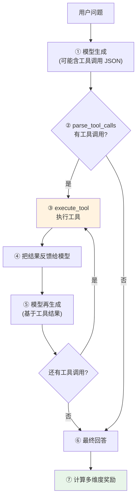

# 第 40 章 Agent RL 工具调用

前面 7 章的模型都是「单轮回答」——你问它答，结束。但真实世界的 Agent 要**多轮交互**：理解任务 → 决定调用哪个工具 → 执行 → 拿到结果 → 继续推理 → 给出最终答案。这是 Agent 与普通聊天机器人的本质区别。

本章实现 **Agent RL**——用强化学习训练模型学会工具调用。核心是**多维度奖励**设计：不只看最终答案对不对，还看工具调用是否正确、回答长度是否合理、有没有重复啰嗦。这是 Part VI 的收官章，也是从「语言模型」迈向「Agent」的桥梁。

## 40.1 学习目标

读完本章，你应该能够：

- 默画出 Agent 多轮工具调用的流程：生成 → 解析 → 执行 → 反馈 → 再生成；
- 解释多维度奖励的四个维度（长度、工具正确、GT 匹配、重复惩罚）；
- 看懂 `parse_tool_calls` 如何用正则从文本提取 JSON 工具调用；
- 理解 `execute_tool` 的模拟环境设计（6 个工具的 mock 数据）；
- 说清 `validate_gt_in_text` 用「大小写不敏感的精确子串包含」及其局限（不识别同义改写）。

> **实现范围说明**：本章实现 Agent RL 的核心组件——6 个模拟工具、`parse_tool_calls`、`execute_tool`、`calculate_agent_reward` 与 `AgentConfig`。**生成→解析→执行→反馈→再生成的多轮控制循环不在 zllm 当前代码内**，需读者自行组装或参考社区实现。本章聚焦工具环境与多维奖励的设计。

## 40.2 原理回顾：Agent 多轮交互

### 40.2.1 工具调用循环（回引 Ch 28）

Ch 28 讲过 `AgentRLDataset` 返回 `messages + tools + gt`——messages 去掉最后一条 assistant（模型自己生成），tools 是可用工具定义，gt 是标准答案。

Agent 的多轮循环：



`max_turns=3`（zllm 默认）限制最多 3 轮工具调用，防止无限循环。

### 40.2.2 工具调用的格式

模型生成的工具调用用 ```json``` 代码块包裹：

````
```json
{"name": "calculate_math", "arguments": {"expression": "2+3"}}
```
````

`parse_tool_calls` 用正则提取这些 JSON 块，解析出工具名和参数。

### 40.2.3 多维度奖励

Agent 的回答好不好，不只是一个维度。zllm 的 `calculate_agent_reward` 从四个维度评分：

| 维度 | 规则 | 分值 |
|------|------|------|
| 长度合理性 | 20~800 字符 | +0.5 / -0.5 |
| 工具调用正确 | 调用了有效工具 | +1.0 |
| GT 匹配 | 标准答案出现在回复中 | +1.0 |
| 重复惩罚 | n-gram 重复率 | -(0~0.5) |

多维度设计避免模型「钻空子」——比如只追求长度但不调工具，或者调了工具但答案错了。

## 40.3 代码实现

完整实现见 `zllm/training/agent_rl.py`（165 行）。

### 40.3.1 TOOLS 与 MOCK_RESULTS：模拟环境

> 完整实现见 `zllm/training/agent_rl.py:21`

`TOOLS`（`:21-28`）：6 个工具定义——`calculate_math`（数学计算）、`unit_converter`（单位换算）、`get_current_weather`（天气）、`get_current_time`（时间）、`get_exchange_rate`（汇率）、`translate_text`（翻译）。每个工具有 `name`、`description`、`parameters` schema。

`MOCK_RESULTS`（`:36-43`）：6 个 lambda 函数模拟工具执行。比如天气工具返回预存的 `WEATHER_DATA`（`:30`），数学工具用 `eval` 计算表达式（`:37`）。这是教学项目的简化——真实 Agent 会调 API。

### 40.3.2 execute_tool：执行工具调用

> 完整实现见 `zllm/training/agent_rl.py:46`

```python
def execute_tool(name, args):
    fn = MOCK_RESULTS.get(name)
    if not fn:
        return None                # 工具不存在
    try:
        return fn(args)
    except Exception:
        return None                # 执行失败
```

`execute_tool`（`:46-62`）：查表执行，失败返回 None。容错设计——工具调用失败不崩溃，Agent 可以继续。

> 对应测试 `tests/m11_distill_agent/test_280_agent_rl.py:45`（数学 `2+3=5`）、`:50`（天气有 temperature）、`:55`（时间有 datetime）、`:60`（汇率 7.21）、`:65`（翻译）、`:70`（未知工具返回 None）。

### 40.3.3 parse_tool_calls：从文本解析工具调用

> 完整实现见 `zllm/training/agent_rl.py:65`

```python
def parse_tool_calls(text):
    calls = []
    pattern = r"```json\s*(.*?)\s*```"      # 匹配 ```json ... ```
    for m in re.findall(pattern, text, re.DOTALL):
        try:
            parsed = json.loads(m.strip())
            if isinstance(parsed, dict) and "name" in parsed:   # 必须有 name 字段
                calls.append(parsed)
        except (json.JSONDecodeError, ValueError):
            pass                               # 无效 JSON 跳过
    return calls
```

`parse_tool_calls`（`:65-85`）：正则提取所有 ```json``` 块，逐个 `json.loads` 解析。只接受有 `name` 字段的 dict——过滤掉非工具调用的 JSON。容错：无效 JSON 静默跳过。

> 对应测试 `test_280_agent_rl.py:76`（单个调用）、`:83`（多个调用）、`:91`（无调用返回空）、`:96`（无效 JSON 忽略）、`:101`（非工具 JSON 忽略）。

### 40.3.4 validate_gt_in_text：模糊匹配标准答案

> 完整实现见 `zllm/training/agent_rl.py:88`

```python
def validate_gt_in_text(gt_text, response):
    return gt_text.lower().strip() in response.lower()
```

`validate_gt_in_text`（`:88-98`）：检查 gt 是否**作为子串**出现在 response 中——大小写不敏感的精确子串包含（`gt.strip().lower() in response.lower()`）。注意它只匹配**字面**子串，**不识别同义改写**：例如 gt 是「28°C」时，回答写成「气温28度」不会被命中。

> 对应测试 `test_280_agent_rl.py:107`（精确匹配）、`:111`（大小写不敏感）、`:114`（不匹配返回 False）、`:117`（部分匹配）。

### 40.3.5 calculate_agent_reward：四维度奖励

> 完整实现见 `zllm/training/agent_rl.py:101`

```python
def calculate_agent_reward(response, gt_answer=None, tool_calls=None, rep_penalty_cap=0.5):
    reward = 0.0
    # ① 长度合理性
    if 20 <= len(response.strip()) <= 800:
        reward += 0.5
    else:
        reward -= 0.5
    # ② 工具调用正确
    if tool_calls:
        for call in tool_calls:
            if call.get("name", "") in MOCK_RESULTS:
                reward += 1.0
                break
    # ③ GT 匹配
    if gt_answer and validate_gt_in_text(gt_answer, response):
        reward += 1.0
    # ④ n-gram 重复惩罚
    toks = re.findall(r"\w+|[^\w\s]", response.lower())
    grams = [tuple(toks[i:i+3]) for i in range(len(toks) - 2)]
    if grams:
        rep = (len(grams) - len(set(grams))) * rep_penalty_cap * 2 / len(grams)
        reward -= min(rep_penalty_cap, rep)
    return reward
```

`calculate_agent_reward`（`:101-142`）四个维度：

1. **长度**（`:120-123`）：20~800 字符 +0.5，太短/太长 -0.5。太短可能没解决问题，太长可能注水。
2. **工具正确**（`:125-130`）：调用了有效工具名 +1.0（只加一次，`break`）。
3. **GT 匹配**（`:132-133`）：答案在回复中 +1.0。
4. **重复惩罚**（`:135-140`）：3-gram 重复率。`(总gram - 去重gram) / 总gram` 是重复比例，乘以惩罚系数，上限 0.5。

> 对应测试 `test_280_agent_rl.py:122`（好回答 reward > 1.0）、`:128`（太短 reward < 0）、`:132`（无工具无GT 0~1）、`:137`（有 GT 比无 GT 高）。

### 40.3.6 AgentConfig

> 完整实现见 `zllm/training/agent_rl.py:145`

`AgentConfig`（`:145-165`）：`max_turns=3`（最多 3 轮工具调用，`:150`）、`max_gen_len=256`（每轮生成上限，`:151`）、`learning_rate=3e-7`（RL 级别低 lr，`:149`）、`from_weight="full_sft"`（`:163`）。

## 40.4 对应单元测试

> 对应测试 `tests/m11_distill_agent/test_280_agent_rl.py`（151 行）

| 测试类 | 行号 | 验证 |
|--------|------|------|
| TestTools | `:23` | 6 个工具 `:24`、名称完整 `:27`、字段齐全 `:36` |
| TestExecuteTool | `:44` | 数学 `:45`、天气 `:50`、时间 `:55`、汇率 `:60`、翻译 `:65`、未知 None `:70` |
| TestParseToolCalls | `:75` | 单个 `:76`、多个 `:83`、无 `:91`、无效忽略 `:96` |
| TestValidateGT | `:107` | 精确 `:108`、大小写 `:112`、不匹配 `:114` |
| TestAgentReward | `:121` | 好回答 `:122`、太短 `:128`、GT boost `:137` |
| TestAgentConfig | `:145` | max_turns=3 `:148` |

## 40.5 动手验证

```bash
pytest tests/m11_distill_agent/test_280_agent_rl.py -v
```

预期：全部 PASSED。手动执行一次工具调用：

```bash
python -c "
from zllm.training.agent_rl import execute_tool, parse_tool_calls, calculate_agent_reward
# 解析工具调用
text = '让我算一下\n\`\`\`json\n{\"name\": \"calculate_math\", \"arguments\": {\"expression\": \"2+3\"}}\n\`\`\`'
calls = parse_tool_calls(text)
print('解析:', calls)
# 执行
result = execute_tool(calls[0]['name'], calls[0]['arguments'])
print('结果:', result)
# 奖励
resp = '根据计算，2+3的结果是5。'
reward = calculate_agent_reward(resp, gt_answer='5', tool_calls=calls)
print('奖励:', reward)
"
```

## 40.6 本章小结 + Part VI 收官

本章要点：

1. **Agent 多轮循环**：生成 → parse → execute → feedback → 再生成，最多 `max_turns` 轮。
2. **工具调用格式**：```json``` 代码块 + name/arguments 字段，正则提取。
3. **模拟环境**：6 个工具的 mock 数据，教学简化（真实 Agent 调 API）。
4. **多维度奖励**：长度（±0.5）+ 工具正确（+1.0）+ GT 匹配（+1.0）+ 重复惩罚（-0.5），防钻空子。
5. **模糊匹配**：GT 用子串匹配（大小写不敏感），容忍表述差异。

### Part VI 收官

至此 Part VI（Ch 33–40）全部完成，微调与对齐的完整闭环搭好：

| 章节 | 主题 | 核心文件 |
|------|------|---------|
| Ch 33 | SFT + Label Masking | `training/full_sft.py` |
| Ch 34 | LoRA 低秩适配 | `model/lora.py` |
| Ch 35 | RLHF 框架总论 | (理论) |
| Ch 36 | DPO 直接偏好优化 | `training/dpo.py` |
| Ch 37 | PPO + GAE + Critic | `training/ppo.py` |
| Ch 38 | GRPO + CISPO | `training/grpo.py` |
| Ch 39 | 知识蒸馏 | `training/distillation.py` |
| Ch 40 | Agent RL 工具调用 | `training/agent_rl.py` |

从「续写模型」→「对话模型」（SFT）→「省参数微调」（LoRA）→「偏好对齐」（DPO/PPO/GRPO）→「知识压缩」（蒸馏）→「工具调用 Agent」（Agent RL），Part VI 走完了 LLM 训练的全谱系。

> **一句话带走**：Part VI 结束——Agent 用多轮工具调用 + 多维度奖励，把语言模型变成能使用工具的智能体。

**下章预告**：模型训好了，怎么部署？Part VII《推理与部署》——Ch 41《解码算法实现》（贪心/束搜索/采样/top-p）、Ch 42《KV Cache 加速推理》、Ch 43《OpenAI 兼容 API + CLI 部署》。
