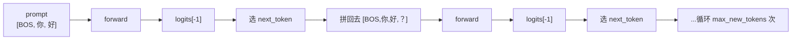

# 第 41 章 解码算法实现

模型训好了，怎么让它「说话」？Ch 26 的 `ZLLMForCausalLM` forward 给出 logits——每个位置在词表上的得分分布。**解码（Decoding）** 就是把 logits 变成 token 序列：每步选一个 token，拼回去再 forward，循环往复。

选哪个 token？最简单的是 **greedy**（取 argmax，永远选概率最高的）。但 greedy 太死板——每次都选最优，容易陷入重复循环。更好的方法是**采样**：按概率分布随机抽，让输出有多样性。zllm 实现了 5 种解码策略：greedy、temperature、top-k、top-p、repetition penalty。

## 41.1 学习目标

读完本章，你应该能够：

- 解释 greedy 解码为何确定性但也容易重复；
- 说清 temperature 如何控制随机性（T 大 → 更随机）；
- 默写出 top-k（固定数量候选）和 top-p（动态集合候选）的区别；
- 理解 repetition penalty 为什么正负 logits 不同处理（正除负乘）；
- 看懂 `generate` 的自回归循环结构。

## 41.2 原理回顾：从 logits 到 token

### 41.2.1 自回归生成

语言模型生成是**自回归**的——每次根据已有 token 预测下一个，再把新 token 拼回去继续预测：



每步只关心**最后一个位置**的 logits（`logits[:, -1, :]`），因为前面位置的预测已经用过了。

### 41.2.2 五种解码策略

| 策略 | 参数 | 效果 |
|------|------|------|
| **Greedy** | `temperature=0` | argmax，确定性，易重复 |
| **Temperature** | `temperature>0` | logits/T，T大更随机 |
| **Top-K** | `top_k>0` | 只从概率最高的 K 个里采样 |
| **Top-P** | `top_p>0` | 只从累计概率首次达到/超过 P 的最小集合里采样 |
| **Repetition** | `repetition_penalty>1` | 已出现 token 降概率 |

它们可以组合使用——比如 `temperature=0.85 + top_p=0.95` 是 zllm 的默认组合。

### 41.2.3 Temperature（回引 Ch 03 / Ch 05）

Ch 03 讲过 softmax、Ch 05 讲过温度缩放（蒸馏里用 $T^2$ 加权 KL）。解码时 `logits / T` 再 softmax：T < 1 → 分布更尖锐（倾向高概率）；T > 1 → 分布更平坦（更随机）。T=0 退化成 greedy（argmax）。

### 41.2.4 Top-K vs Top-P

**Top-K**：固定取概率最高的 K 个 token，其余设为 $-\infty$（softmax 后概率 0）。简单但死板——有时第 K+1 个 token 概率和第 K 个差不多，却被粗暴截断。

**Top-P（Nucleus）**：动态集合——取**累计概率达到 P 的最小 token 集合**。P=0.9 表示「取概率最高的若干 token，直到累计概率 ≥ 0.9」。概率分布尖锐时集合小（只取几个），平坦时集合大（取很多）——自适应。

$$
\text{nucleus} = \min\left\{S \subseteq V \;:\; \sum_{i \in S} p_i \geq P\right\}
$$

## 41.3 代码实现：generate

完整实现见 `zllm/serving/generate.py`（133 行）。

### 41.3.1 自回归循环骨架

> 完整实现见 `zllm/serving/generate.py:18`

```python
@torch.no_grad()
def generate(model, input_ids, max_new_tokens=128, temperature=1.0,
             top_k=0, top_p=0.0, repetition_penalty=1.0, eos_token_id=None):
    model.eval()
    generated = input_ids.clone()

    for _ in range(max_new_tokens):
        outputs = model(generated)
        logits = outputs.logits[:, -1, :]       # 只取最后一位
        # ... 采样逻辑 ...
        generated = torch.cat([generated, next_token], dim=-1)

        if eos_token_id is not None and (next_token == eos_token_id).all():
            break
    return generated
```

`generate`（`:18-76`）：`@torch.no_grad()` 关闭梯度（推理不需要），循环 `max_new_tokens` 次。每步 forward 整个 `generated`（无 cache，Ch 42 会优化），取 `logits[:, -1, :]`，采样后拼回去。遇到 eos 提前停止（`:73`）。

> 对应测试 `tests/m12_serving/test_291_generate.py:36`（greedy 确定性）、`:42`（输出比输入长）、`:47`（max_tokens 限制）、`:77`（eos 停止）、`:84`（batch 生成）。

### 41.3.2 Repetition Penalty：正除负乘

> 完整实现见 `zllm/serving/generate.py:45`

```python
if repetition_penalty != 1.0:
    for token_id in generated[0].unique():
        if logits[0, token_id] > 0:
            logits[0, token_id] /= repetition_penalty   # 正 logits：除（降低）
        else:
            logits[0, token_id] *= repetition_penalty   # 负 logits：乘（也降低）
```

`repetition_penalty`（`:45-50`）：对已出现过的 token 降低概率。**为什么正负不同处理？** 如果 logits 是正的，除以 `penalty > 1` 会变小（概率降）；如果 logits 是负的，乘以 `penalty > 1` 会**更负**（也更降）。如果统一用除法，负 logits 除以 >1 反而变大——方向错了。所以正除负乘保证**两种情况都在降低概率**。

### 41.3.3 Greedy：temperature=0

> 完整实现见 `zllm/serving/generate.py:52`

```python
if temperature == 0.0:
    next_token = logits.argmax(dim=-1, keepdim=True)    # 直接取最大值
```

`temperature=0`（`:52-53`）：退化成 greedy——argmax 取概率最高的 token。确定性、可复现。

### 41.3.4 Top-K 采样

> 完整实现见 `zllm/serving/generate.py:56`

```python
logits = logits / temperature
if top_k > 0:
    top_k = min(top_k, logits.size(-1))
    indices_to_remove = logits < torch.topk(logits, top_k)[0][:, -1:]   # 第 K 大的值
    logits[indices_to_remove] = float("-inf")                            # 其余设 -inf
```

`top-k`（`:56-59`）：找到第 K 大的 logit 值作为阈值，小于它的全设 $-\infty$（softmax 后概率 0）。只保留 top K 个候选。

> 对应测试 `test_291_generate.py:67`（top_k=5 可运行、输出更长）。

### 41.3.5 Top-P Nucleus 采样

> 完整实现见 `zllm/serving/generate.py:60`

```python
if top_p > 0.0:
    sorted_logits, sorted_indices = torch.sort(logits, descending=True)
    cumulative_probs = torch.cumsum(F.softmax(sorted_logits, dim=-1), dim=-1)
    # 累计概率超过 top_p 的位置标记移除（减去自身，因为要保留达到 p 的那个）
    sorted_indices_to_remove = cumulative_probs - F.softmax(sorted_logits, dim=-1) >= top_p
    sorted_indices_to_remove[:, 1:] = sorted_indices_to_remove[:, :-1].clone()  # 右移一位
    sorted_indices_to_remove[:, 0] = False                                       # 第一个一定保留
    indices_to_remove = sorted_indices_to_remove.scatter(1, sorted_indices, sorted_indices_to_remove)
    logits[indices_to_remove] = float("-inf")
```

`top-p`（`:60-67`）四步：

1. **排序**（`:61`）：logits 降序排列。
2. **累计概率**（`:62`）：从高到低累加 softmax 概率。
3. **标记移除**（`:63`）：累计概率减去自身 ≥ top_p 的位置要移除——但这些是「超过 p 之后」的。`:64` 右移一位保留「刚好达到 p」的那个。`:65` 第一个一定保留（概率最高的）。
4. **scatter 回原序**（`:66`）：把排序后的移除标记映射回原始 logit 位置。

> 对应测试 `test_291_generate.py:72`（top_p=0.9 可运行）。

### 41.3.6 最终采样

> 完整实现见 `zllm/serving/generate.py:68`

```python
probs = F.softmax(logits, dim=-1)
next_token = torch.multinomial(probs, num_samples=1)    # 按概率分布采样
```

`:68-69`：过滤完 logits 后 softmax 变概率，`torch.multinomial` 按概率随机抽一个。

## 41.4 对应单元测试

> 对应测试 `tests/m12_serving/test_291_generate.py`（117 行）

**TestGenerate**（`:35-89`）：
- `test_greedy_deterministic` `:36`：两次 greedy 结果完全相同（确定性）。
- `test_temperature_higher_more_random` `:57`：高温比低温输出更多样。
- `test_top_k_limits_candidates` `:67`：top_k=5 可运行。
- `test_top_p_nucleus` `:72`：top_p=0.9 可运行。
- `test_eos_stops` `:77`：遇到 eos 提前停止。

## 41.5 动手验证

```bash
pytest tests/m12_serving/test_291_generate.py::TestGenerate -v
```

预期：全部 PASSED。亲手试不同解码策略：

```bash
python -c "
import torch
from zllm.config import ZLLMConfig
from zllm.model.causal_lm import ZLLMForCausalLM
from zllm.serving.generate import generate
from zllm.training.utils import setup_seed
setup_seed(42)
cfg = ZLLMConfig(vocab_size=100, hidden_size=64, num_hidden_layers=2,
                 num_attention_heads=4, num_key_value_heads=2, max_position_embeddings=128)
model = ZLLMForCausalLM(cfg).eval()
ids = torch.randint(0, 100, (1, 8))
print('greedy:', generate(model, ids, max_new_tokens=5, temperature=0.0).shape)
print('采样:', generate(model, ids, max_new_tokens=5, temperature=0.85, top_p=0.9).shape)
"
```

## 41.6 本章小结 + 下章预告

本章要点：

1. **自回归生成**：forward → 取 logits[-1] → 选 token → 拼回去 → 循环。
2. **Greedy**（temp=0）：argmax，确定性但易重复。
3. **Temperature**：logits/T，T 大更随机。
4. **Top-K**：固定 K 个候选；**Top-P**：动态集合（累计概率首次达到 P），自适应。
5. **Repetition penalty**：正除负乘，统一降低已出现 token 概率。

> **一句话带走**：5 种解码策略从 greedy 到 top-p——greedy 稳但死、采样活但散，temperature+top_p 是多样性与质量的平衡。

**下章预告**：`generate` 每步要 forward 整个序列——第 N 步要重算前 N-1 个 token 的注意力，浪费。Ch 42《KV Cache 加速推理》——缓存 K/V 矩阵，每步只算新 token，O(n²)→O(n)。
