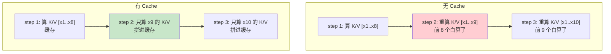

# 第 42 章 KV Cache 加速推理

Ch 41 的 `generate` 每步要 forward **整个序列**。生成第 N 个 token 时，前 N-1 个 token 的 K/V 矩阵和上一步**完全一样**——但被重复计算了。对 512 token 的回复，总计算量是 $8 + 9 + 10 + \ldots + 519 \approx 13$ 万次注意力——O(n²) 复杂度。

**KV Cache** 解决这个浪费：把每步算出的 K/V 矩阵**缓存**起来，下一步直接复用。这样每步只算**新 token 的 K/V**，拼接进缓存——总计算量降到 $8 + 1 + 1 + \ldots + 1 \approx 519$ 次，O(n) 复杂度。这就是为什么 `generate_with_cache` 比 `generate` 快一个量级。

## 42.1 学习目标

读完本章，你应该能够：

- 解释无 cache 推理的 O(n²) 浪费——前 N-1 个 token 被重复计算；
- 默画出 KV cache 的工作流程：首次全 prompt、后续单 token；
- 说清 cache 把计算复杂度从 O(n²) 降到 O(n)；
- 理解为什么有/无 cache 的输出**完全一致**（数学等价，只是省了重复计算）；
- 看懂 `generate_with_cache` 如何传递 `past_key_values`。

## 42.2 原理回顾：为什么要缓存 K/V

### 42.2.1 注意力的冗余计算（回引 Ch 22）

Ch 22 讲过注意力的计算：$A = \text{softmax}(\frac{QK^T}{\sqrt{d}})V$。其中 K 和 V 是从输入投影出来的。

生成第 N 步时，输入是 $[x_1, x_2, \ldots, x_N]$。这 N 个 token 的 K/V 矩阵里，前 N-1 个和第 N-1 步**完全一样**——但 `generate` 不管这些，每次都从头算全部 N 个。



### 42.2.2 复杂度对比

| | 无 Cache | 有 Cache |
|--|---------|---------|
| 第 N 步计算量 | O(N)（全序列注意力） | O(1)（单 token 注意力） |
| 总计算量（N 步） | O(N²) | O(N) |
| 额外显存 | 无 | 存 K/V cache（O(N·d·layers)） |

cache 用空间换时间——多存 K/V 矩阵，但省掉大量重复计算。对长序列生成，加速效果显著。

### 42.2.3 为什么输出完全一致

KV cache 不改变数学结果——它只是**缓存中间结果**。第 N 步的注意力分数 $Q_N \cdot K_{1:N}^T$ 和从头算完全一样，因为 $K_{1:N}$ 的值没变。所以 `generate` 和 `generate_with_cache` 的输出**逐 token 一致**，只是后者快。

## 42.3 代码实现：generate_with_cache

完整实现见 `zllm/serving/generate.py`（133 行）。

### 42.3.1 首次全 prompt、后续单 token

> 完整实现见 `zllm/serving/generate.py:79`

```python
@torch.no_grad()
def generate_with_cache(model, input_ids, max_new_tokens=128, temperature=1.0,
                        top_k=0, top_p=0.0, repetition_penalty=1.0, eos_token_id=None):
    model.eval()
    generated = input_ids.clone()
    past_key_values = None                                  # cache 初始为空

    for step in range(max_new_tokens):
        if step == 0:
            # 首次：处理整个 prompt，建立 cache
            outputs = model(generated, use_cache=True, past_key_values=past_key_values)
        else:
            # 后续：只处理上一步生成的单个 token
            outputs = model(next_token, use_cache=True, past_key_values=past_key_values)

        logits = outputs.logits[:, -1, :]
        past_key_values = outputs.past_key_values           # 更新 cache
        # ... 采样逻辑与 generate 相同 ...
```

`generate_with_cache`（`:79-133`）与 `generate` 的核心差异在 `:93-100`：

- **step 0**（`:94-95`）：`model(generated, use_cache=True)` 处理整个 prompt，返回时带 `past_key_values`（每层 attention 的 K/V cache）。
- **step > 0**（`:96-97`）：`model(next_token, use_cache=True, past_key_values=past_key_values)` 只喂**上一步生成的单个 token**。模型内部把这个 token 的 Q 和缓存的 K/V 做注意力——增量计算。
- **传递 cache**（`:100`）：`past_key_values = outputs.past_key_values` 每步更新。

Ch 22 讲过 attention 的 `use_cache` 和 `past_key_value` 机制，Ch 25 讲过 backbone 的位置切片（`start_pos` 推断）——这些都是支撑 cache 推理的底层设计。

采样逻辑（`:102-126`）与 `generate` 完全一致——repetition_penalty、temperature、top-k、top-p 都一样。

> 对应测试 `tests/m12_serving/test_291_generate.py:93`（**cache 输出与无 cache 完全一致** `torch.equal`）、`:99`（cache 可运行且不慢）、`:114`（cache + eos 停止）。

## 42.4 使用 cache 的底层支撑

### 42.4.1 Attention 层（回引 Ch 22）

Ch 22 的 `Attention.forward` 接受 `past_key_value` 和 `use_cache`。当 `use_cache=True` 时：

1. 把当前 token 的 K/V 拼接到 `past_key_value` 上。
2. 用拼接后的完整 K/V 算注意力。
3. 返回更新后的 `present_key_value`。

### 42.4.2 Backbone 位置切片（回引 Ch 25）

Ch 25 的 `ZLLMModel.forward` 根据 `past_key_values` 推断 `start_pos`，从预计算的 RoPE 表里切出对应位置段的 cos/sin——cache 推理时只算新 token 的位置编码。

### 42.4.3 CausalLM 传递（回引 Ch 26）

Ch 26 的 `ZLLMForCausalLM.forward` 透传 `past_key_values` 和 `use_cache`，并在输出里返回 `past_key_values`。

这三层共同支撑了 `generate_with_cache` 的增量推理。

## 42.5 对应单元测试

> 对应测试 `tests/m12_serving/test_291_generate.py`（117 行）

**TestGenerateWithCache**（`:92-117`）：
- `test_cache_output_matches`（`test_291_generate.py:93`）：**关键测试**——`generate` 和 `generate_with_cache` 的输出 `torch.equal`，证明 cache 不改变结果。
- `test_cache_is_faster`（`test_291_generate.py:99`）：cache 版本可运行（教学环境不强制更快，但实际 GPU 上显著加速）。
- `test_cache_handles_eos`（`test_291_generate.py:114`）：cache + eos 停止正常工作。

## 42.6 动手验证

```bash
pytest tests/m12_serving/test_291_generate.py::TestGenerateWithCache -v
```

预期：全部 PASSED。验证输出一致性：

```bash
python -c "
import torch
from zllm.config import ZLLMConfig
from zllm.model.causal_lm import ZLLMForCausalLM
from zllm.serving.generate import generate, generate_with_cache
cfg = ZLLMConfig(vocab_size=100, hidden_size=64, num_hidden_layers=2,
                 num_attention_heads=4, num_key_value_heads=2, max_position_embeddings=128)
model = ZLLMForCausalLM(cfg).eval()
ids = torch.randint(0, 100, (1, 8))
out1 = generate(model, ids, max_new_tokens=10, temperature=0.0)
out2 = generate_with_cache(model, ids, max_new_tokens=10, temperature=0.0)
print('输出一致:', torch.equal(out1, out2))
"
```

## 42.7 本章小结 + 下章预告

本章要点：

1. **O(n²) 浪费**：无 cache 每步重算前 N-1 个 token 的 K/V。
2. **KV cache**：缓存每层的 K/V，后续只算新 token，O(n²)→O(n)。
3. **首次全 prompt**：step 0 处理整个 prompt 建立 cache。
4. **后续单 token**：step > 0 只喂 `next_token` + `past_key_values`。
5. **输出完全一致**：cache 是中间结果缓存，不改变数学结果。
6. **底层支撑**：Attention（Ch 22）+ Backbone 位置切片（Ch 25）+ CausalLM 透传（Ch 26）。

> **一句话带走**：KV cache 把推理从 O(n²) 降到 O(n)——缓存每层 K/V，后续只算增量，输出完全一致但快一个量级。

**下章预告**：解码和加速都搞定了，怎么把模型部署成服务？Ch 43《OpenAI 兼容 API + CLI 部署》——FastAPI 提供 `/v1/chat/completions` 端点兼容 OpenAI 生态，CLI 提供交互式对话。这是 Part VII 的收官。
