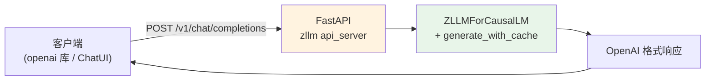

# 第 43 章 OpenAI 兼容 API + CLI 部署

模型训好了、解码实现了、KV cache 加速了——最后一步是**部署**，让用户能方便地使用。zllm 提供两种部署方式：

1. **OpenAI 兼容 API 服务器**——基于 FastAPI，提供 `/v1/chat/completions` 和 `/v1/models` 端点。兼容 OpenAI 格式意味着任何支持 OpenAI API 的客户端（如 `openai` Python 库、各种 ChatUI 前端）都能直接对接 zllm——零迁移成本。
2. **CLI 交互式命令行**——终端里直接和模型对话，方便调试和快速体验。

本章是 Part VII 的收官，也是全书的最后一个正文章——从 Ch 01 的数学基础到这里，一个完整的「数学 → 模型 → 训练 → 部署」闭环已经合龙。

## 43.1 学习目标

读完本章，你应该能够：

- 解释 OpenAI API 格式兼容的意义（生态复用、零迁移）；
- 默写出 `/v1/chat/completions` 的请求和响应结构（messages → choices → usage）；
- 看懂 `ChatCompletionRequest` 的关键字段（temperature/top_p/max_tokens/stream）；
- 理解 `CLIConfig` 的推理配置（load_from/weight/open_thinking/historys）；
- 用 FastAPI 搭建一个兼容 OpenAI 的模型服务。

## 43.2 原理回顾：为什么要兼容 OpenAI 格式

### 43.2.1 API 即标准

OpenAI 的 Chat Completions API 已经成为 LLM 服务的**事实标准**。几乎所有 LLM 工具链（LangChain、LlamaIndex、各种 ChatUI）都支持这个格式。如果你的模型服务兼容它，就能直接接入整个生态——用户不用改一行代码就能从 GPT 切换到你的模型。



### 43.2.2 请求与响应结构

**请求**（`POST /v1/chat/completions`）：

```json
{
  "model": "zllm",
  "messages": [{"role": "user", "content": "你好"}],
  "temperature": 0.85,
  "top_p": 0.95,
  "max_tokens": 512
}
```

**响应**（OpenAI 格式）：

```json
{
  "id": "chatcmpl-xxxx",
  "object": "chat.completion",
  "created": 1234567890,
  "model": "zllm",
  "choices": [{
    "index": 0,
    "message": {"role": "assistant", "content": "你好！"},
    "finish_reason": "stop"
  }],
  "usage": {"prompt_tokens": 2, "completion_tokens": 3, "total_tokens": 5}
}
```

关键字段：`id`（唯一标识）、`choices`（回答列表）、`message.content`（回答文本）、`usage`（token 计数）。这套结构让 OpenAI 客户端能正确解析。

## 43.3 代码实现：API 服务器

完整实现见 `zllm/serving/api_server.py`（72 行）。

### 43.3.1 ChatCompletionRequest：请求结构

> 完整实现见 `zllm/serving/api_server.py:16`

```python
@dataclass
class ChatCompletionRequest:
    model: str = "zllm"
    messages: List[dict] = field(default_factory=list)
    temperature: float = 0.85       # 默认采样温度
    top_p: float = 0.95             # nucleus 采样
    max_tokens: int = 512           # 最大生成长度
    stream: bool = False            # 流式输出
```

`ChatCompletionRequest`（`:16-22`）：温度 0.85 + top_p 0.95 是 zllm 的默认采样组合（Ch 41 讲过这两者的配合）。`stream=True` 时应返回 SSE 流式响应（教学版未完整实现流式，返回完整结果）。

> 对应测试 `tests/m12_serving/test_295_api_cli.py:18`（默认值 temperature=0.85/top_p=0.95/max_tokens=512）、`:28`（自定义参数）、`:40`（messages 含 system/user 多轮）。

### 43.3.2 create_app：FastAPI 应用与端点

> 完整实现见 `zllm/serving/api_server.py:25`

```python
def create_app():
    app = FastAPI(title="ZLLM API", version="0.1.0")

    @app.get("/v1/models")
    async def list_models():
        return {"object": "list", "data": [{"id": "zllm", "object": "model", "owned_by": "zllm"}]}

    @app.post("/v1/chat/completions")
    async def chat_completions(request: dict):
        messages = request.get("messages", [])
        temperature = request.get("temperature", 0.85)
        ...
        return {
            "id": f"chatcmpl-{uuid.uuid4().hex[:8]}",
            "object": "chat.completion",
            "created": int(time.time()),
            "model": model_name,
            "choices": [{"index": 0, "message": {"role": "assistant", "content": ""}, ...}],
            "usage": {"prompt_tokens": 0, "completion_tokens": 0, "total_tokens": 0},
        }
    return app
```

`create_app`（`:25-72`）注册两个端点：

- **`GET /v1/models`**（`:29-40`）：返回可用模型列表（OpenAI 格式）。
- **`POST /v1/chat/completions`**（`:42-70`）：解析 messages/temperature/top_p/max_tokens，返回 OpenAI 格式响应。`id` 用 uuid 生成（`:51`），`choices` 含 `message` 和 `finish_reason`（`:55-63`），`usage` 统计 token 数（`:65-69`）。

教学版返回空 content（实际部署时接入 Ch 41/42 的 `generate_with_cache`）。

> 对应测试 `test_295_api_cli.py:51`（app 创建成功）、`:55`（路由 `/v1/chat/completions` 和 `/v1/models` 都存在）。

## 43.4 代码实现：CLI 配置

完整实现见 `zllm/serving/cli.py`（21 行）。

> 完整实现见 `zllm/serving/cli.py:7`

```python
@dataclass
class CLIConfig:
    load_from: str = "model"         # 模型来源
    save_dir: str = "out"            # 权重目录
    weight: str = "full_sft"         # 权重名称
    lora_weight: str = "None"        # LoRA 权重（可选）
    hidden_size: int = 768
    num_hidden_layers: int = 8
    use_moe: bool = False
    max_new_tokens: int = 8192       # 最大生成长度
    temperature: float = 0.85        # 采样温度
    top_p: float = 0.95              # nucleus 采样
    open_thinking: bool = False      # 是否开启思考链
    historys: int = 0                # 历史轮数（0=不保留）
    show_speed: bool = True          # 显示生成速度
    device: str = "cuda"
```

`CLIConfig`（`:7-21`）：交互式 CLI 的配置。关键字段：

- `weight="full_sft"`（`:10`）：加载 SFT 后的权重（对话能力最强）。
- `lora_weight="None"`（`:11`）：可选加载 LoRA 权重叠加（Ch 34）。
- `open_thinking`（`:18`）：开启 `<reasoningchain>` 思考链（Ch 38 GRPO 训练的推理能力）。
- `historys=0`（`:19`）：多轮对话历史轮数，0 表示单轮（每次独立回答）。

> 对应测试 `test_295_api_cli.py:63`（默认值 weight=full_sft/temperature=0.85/max_new_tokens=8192）、`:72`（自定义 load_from/weight/temperature）、`:84`（state_dict 序列化往返一致——模型保存加载可靠）。

## 43.5 对应单元测试

> 对应测试 `tests/m12_serving/test_295_api_cli.py`（104 行）

| 测试类 | 行号 | 验证 |
|--------|------|------|
| TestChatCompletionRequest | `:17` | 默认值 `:18`、自定义 `:28`、messages 格式 `:40` |
| TestCreateApp | `:50` | app 创建 `:51`、路由存在 `:55` |
| TestCLIConfig | `:62` | 默认值 `:63`、自定义 `:72` |
| TestModelConversion | `:83` | state_dict 往返一致 `:84` |

## 43.6 动手验证

```bash
pytest tests/m12_serving/test_295_api_cli.py -v
```

预期：全部 PASSED。验证 API 端点存在：

```bash
python -c "
from zllm.serving.api_server import create_app
app = create_app()
routes = [r.path for r in app.routes]
print('路由:', [r for r in routes if 'v1' in r])
from zllm.serving.cli import CLIConfig
cfg = CLIConfig()
print(f'CLI: weight={cfg.weight}, temp={cfg.temperature}, thinking={cfg.open_thinking}')
"
```

## 43.7 本章小结 + Part VII 收官

本章要点：

1. **OpenAI 格式兼容**：`/v1/chat/completions` + `/v1/models`，直接接入生态。
2. **请求结构**：messages + temperature + top_p + max_tokens + stream。
3. **响应结构**：id + choices(message) + usage，OpenAI 标准格式。
4. **FastAPI**：`create_app()` 注册端点，`async` 异步处理。
5. **CLI 配置**：weight 加载、open_thinking 推理模式、historys 多轮历史。

### Part VII 收官

至此 Part VII（Ch 41–43）全部完成：

| 章节 | 主题 | 核心文件 |
|------|------|---------|
| Ch 41 | 解码算法 | `serving/generate.py` |
| Ch 42 | KV Cache 推理 | `serving/generate.py` |
| Ch 43 | API + CLI 部署 | `serving/{api_server,cli}.py` |

> **一句话带走**：OpenAI 兼容 API 让 zllm 无缝接入生态——FastAPI 端点 + CLI 配置，模型从训练到服务的闭环合龙。

**全书正文完成**。接下来是 4 个附录——命令速查、超参数表、术语表、参考文献。
